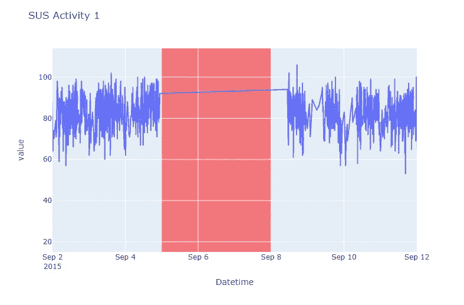

# ⚠️异常检测🚨在我们中间

> 原文：<https://medium.com/analytics-vidhya/%EF%B8%8F-anomaly-detection-among-us-5d3acb7a90b2?source=collection_archive---------29----------------------->


# 1.介绍

> 在一次重要的火星任务中，红色、蓝色、绿色、粉色、橙色、黄色、黑色、白色、紫色、棕色、青色和石灰被装载到宇宙飞船上。在探索火星的途中，宇宙飞船在导航和飞行部分经历了一系列内部部件故障。该是机组人员修复问题的时候了。但是其中有一个冒名顶替者，一个背叛者，一个变种人，为了确定谁是冒名顶替者，必须在数据中执行一系列任务，以揭示谁是数据集中的冒名顶替者。
> 
> *要了解这个项目真正关注的是，我们目睹了许多跟踪异常数据的实时案例，这些数据对 IT、医疗和其他各个领域的业务构成了严重威胁。即使网络安全团队正在努力找出交易中的异常行为，使用算法构建的系统也不足以有效捕捉所有异常行为。由于网络攻击，损失了数百万美元。它不仅影响业务收入，还影响与公司做生意的声誉和信任。*

# ***去哪里找冒名顶替者？***

> *为了找到我们飞船中的冒名顶替者，我们使用* [*Numenta 异常基准(NAB)*](https://www.kaggle.com/boltzmannbrain/nab) *，其中我们考虑 speed_6005，它具有针对飞船中特定传感器的 2500 行速度的数据集。*
> 
> ***CSV 名称****:speed _ 6005 . CSV*
> 
> *在上述数据集中，机组人员将使用时间序列可视化分析数据集，并执行分析以检测异常记录，从而抓获冒名顶替者。这些记录非常重要，有助于识别传感器中记录的可疑速度。*
> 
> *您也可以在我的 GitHub wall*[*GitHub 页面*](https://github.com/BenRoshan100/Anomaly-Detection-NAB) *获取此代码。*

# 宇宙飞船中的任务

*   获取和调整数据
*   数据可视化和紧急会议
*   构建模型以追踪异常
*   使用隔离林
*   利用脸书先知

# 2.欢迎图书馆


# 3.获取数据

```
*#Reading the data*
imposter=pd.read_csv('../input/nab/realTraffic/realTraffic/speed_6005.csv')

*#Viewing the data shape and head*
print(f'speed_6005.csv : **{**imposter.shape**}**')
imposter.head()
```


根据数据集信息，它具有以下特征:

*   **时间戳:**访问者点击网站的日期和时间
*   **值:**这是特定传感器记录的速度

📌**蓝色:**“请注意，速度(值)实际上没有任何单位，元数据也没有任何相关信息。”

```
imposter.info()
```


从这些信息中我们可以看出

*   我们在数据集中没有任何空记录。嘭！
*   时间戳列是一种对象数据类型。小嘭！

# 4.数据调整


## 更改时间戳的数据类型

📌看到时间戳是一个对象，Red 又生气了。“我们在和时间打交道，上帝该死，为了修好我们的船，每一秒都很宝贵，”他说。因为我们的时间戳变量是“object”数据类型，所以我们需要将其转换成 datetime 格式

```
*#Converting timestamp object to datetime*
imposter['timestamp'] = pd.to_datetime(imposter['timestamp'])

*#Check for the change*
imposter.info()
```


## 日期信息

📌莱姆:“船员！，我们可以从时间戳中提取大量数据，如年、月、日、小时、工作日。这将帮助我们从数据中揭示很多信息。我们必须寻找一切可能的方法在我们中间找到冒名顶替者”


## 重命名列

> *📌Black:“因为我没有太多的任务，所以让我们重新命名列，以帮助其他船员或任何非技术船员理解该功能。这里我修改了列的时间戳- > Datetime。既然时间戳感觉更像一个行话"*

```
*#Renaming the columns to simple words*
imposter.rename(columns = {'timestamp':'Datetime'}, inplace = True)
```

# 5.紧急会议！！！！


## 一般预先假设

> *📌蓝色:“让我们提出我们的工作状态，并通过查看可视化效果来检查它的假设”*

*   Pink:“我周末在 medbay 做加速工作”
*   Orange:“我在管理部门的假期里，比如 12 月和 1 月，一直在努力提高速度。”
*   黄色:“我在仓库工作到深夜，一直在提高速度”
*   Cyan:“我提出了一个战略，在 2015 年形成一个季节性的速度在盾牌”
*   瑞德:“在 9 月 4 日到 9 月 10 日期间，我非常努力地修理我们在反应堆的飞船。”

> *📌请参考我的* [*Kaggle 笔记本*](https://www.kaggle.com/benroshan/anomaly-detection-among-us) *获取所有代码，即*

## 时间序列数据概述

> *让我们将时间戳作为 x 轴，绘制值，确定它是否具有时间序列数据的特征，并对照我们的假设进行检查。*


**讨论:**

*   紫色:“我们没有 2011 年全年的数据，相反，我们只有 1 个月(9 月-17 日)的数据，它没有表现出季节性——我们可以拒绝我们的第四个假设，因为青色说它是真的，我觉得青色是 sus”
*   布朗:“让我们马上拒绝第二个假设，因为我们没有足够的数据来证明它，橙色是 SUS MAX”

**实际见解:**

*   17 天的速度只表现出平稳性，而不是季节性
*   与 9 月初的下跌相比，随后的下跌幅度是巨大的
*   即使我们有相同的模式，你也可以在 Sep4-Sep8 上看到相同的速度。会不会是异常现象？

## 日期时间的直方图和散点图

> *让我们绘制组合图表。如果你想在我们的数据中找到一些骗子，散点图和箱线图是最好的。*


**实际见识**

*   我们只有 8 月份的一个数据点，我们不能考虑左边的柱状图，如果你看到 9 月份的柱状图，我们可以看到平均速度在 81.9 左右
*   我们可以在 Sep end 上看到 3 个看起来像异常值的点，但这并不意味着它们是异常的
*   我们也可以注意到在九月中旬没有速度记录，这可能是关机吗？这甚至可能会招致我们飞船的网络攻击

## 一个月中的哪一天哪一个小时的点击费高？

> *让我们使用 altair 库来绘制一张漂亮的热图，它可以帮助我们确定一个月中的哪一天哪一小时速度更快*


**讨论:**

*   黑色:“我们可以清楚地看到，与早上相比，深夜的速度并不高——我们的第三个假设是错误的，既然黄色说这是真的，我觉得黄色是 sus”

**实际感悟**

*   发现所有的传感器都在 12 点后关闭是不是很酷？
*   我们还可以看到从 8 月 31 日下午 6 点到 9 月 17 日下午 6 点的记录，你可以看到在这几天的剩余时间里没有记录速度
*   我们还可以注意到，在这几个小时之间有 6 个传感器关闭。那些是异常吗？让我们找出答案

## 周末期间的行为

> 让我们来检验一下我们的最终假设，周末期间速度是否会上升。因为他们中的大多数人会免费上网，并倾向于点击更多的广告


**讨论:**
白:“最高记录在一个周末——周五。但是星期三和星期四的速度记录很低，星期天的速度也很低。我们可以接受我们的第一个假设，即在周末加速，更具体地说，这只是周末的开始，周末的结束在传感器中没有太多的速度。那个冒名顶替者是星期天到达我们的船上的吗？我觉得红色是 sus”


## Sus 图案通过视觉-红色 SUS？

> *蓝色:“让我们看看肉眼可见的异常模式。这里，突出显示的异常点可能不是算法抛出的异常，因为它完全基于可视化"*


**发现尸体:**
蓝色:“红色在 medbay 发现尸体。在 2008 年 9 月 5 日和 2009 年 9 月 10 日之间的时间序列图中，我们有两个可疑的模式。第一个是肉眼高度可见的，并且可以从字面上看出违反了图形遵循的模式，并且它很可能是异常的

## 冒名顶替者的破坏


让我们仔细看看异常模式



**可疑活动 1:**
在此期间没有记录速度，传感器卡住了，冒名顶替者一定是破坏了传感器才进入飞船而没有惊动任何人。冒名顶替者仍在我们中间，他可能在这段时间进入


**可疑活动 2:**
有一次，一个冒名顶替者藏了起来，其他人赶到那里修理传感器，那个人被冒名顶替者杀死了，后来布鲁报告了这件事


# 6.构建模型以追踪异常


## 隔离森林

> *“粉红:所以我们已经到达隔离森林去探测阿纳莫利了？”*
> 
> *“白:是的，你当然是对的，有人能告诉我这能做什么吗？”*
> 
> *“Cyan:当然，隔离森林是一种用于异常检测的无监督学习算法，它基于隔离异常的原理工作，而不是最常见的剖析正常点的技术。*
> 
> 布朗:我知道什么是异常，但是它是如何对异常进行分类的呢
> 
> *“绿色:在第一阶段，使用训练数据集构建 iTrees，如前几节所述。在第二阶段，测试集中的每个实例都通过前一阶段构建的 iTrees，并为该实例分配一个适当的“异常分数”。一旦测试集中的所有实例都被分配了异常分数，就可以将分数大于预定义阈值的任何点标记为“异常”，这取决于分析所应用到的域。*
> 
> 布朗:太酷了。感谢解释"
> 
> 绿色:好的，我会初始化污染为 1%的库。我们还可以根据域来确定污染率。因为我们只有一个冒名顶替者，所以我把门槛设得很低"
> 
> *“黑:小队，让我们通过探测异常抓住这个冒名顶替者！”*

"黑色:我们有分布在上部和下部区域的异常"

"怀特:所以这个冒名顶替者从一开始就在破坏我们的工作"

“蓝:我在保安室看着橙，他没有做任何任务。我觉得橙色是 sus”

“Orange:不，我当时在医务室，正在扫描。蓝色是错误地指责我”

"白色:让我们投票淘汰橙色，看看蓝色是否正确"

“黑:好吧。我们还有另一种方法来找出异常，让我们试试，把橙色踢出去”

## 脸书先知


布莱克:让我们唤醒先知，他会给我们一个答案:“谁是我们中的骗子?”""

"青:但是我们要怎么做呢？"

" Black:首先让我们根据先知的标准重命名列，因为它在其他情况下不起作用"


“蓝色:我可以确定，周末的时候速度很快，除了周三，其他时间都很慢。嗯。异常也许会在那一天降临”

莱姆:我们不应该匆忙下结论，如果你注意到时间的话，从清晨到傍晚速度很快，然后在午夜下降

“布莱克:你们两个都是对的，考虑到天数，在最初记录的日子里有一个陡峭的上升，有一个陡峭的下坡，再也没有上升。我们能把所有的点连接起来吗？”

紫色:在做出任何判断之前，让我们从预测中找出误差值，并通过对上下区间求差来计算不确定性，这样我们就有了位于区间上方的记录，这是一种不寻常的情况，我们可以称之为变色龙

“布莱克:你说得太对了，我们开始吧”

```
*#Calculating the error in prediction*
results['error'] = results['y'] - results['yhat']

*#Calculating the uncertainity- the region where the predicted values are less likely to fall*
results['uncertainity'] = results['yhat_upper'] - results['yhat_lower']

*#Displaying the data records which fall beyond the threshold*
results[results['error'].abs()>1.5*results['uncertainity']]
```


紫色:现在我们已经得到了误差和不确定度，橙色，如果误差超过不确定度的 1.5 倍，你能把这个错误归类为是吗？

"橘子:我在想为什么是 1.5？"

“紫色:这取决于我们正在开发的应用程序，在这里我们不关心不确定的值，而是不确定值之外的必须归类为异常的值”


"布莱克:是的，我们得到了 9 月 1 日和 9 月 17 日记录的异常点. "

布鲁:我想知道那个时候谁在工作。Orange 真的是 sus，我在任何地方都找不到他真正在做的任务”

"橙色:蓝色真的总是责怪我，因为他是 sus . "

"怀特:我在 9 月 17 日看到了蓝色通风口"

"黑色:我想是的，让我们投蓝色出来吧"

# 所有人都投了蓝票，他被赶了出来


# 布鲁不是冒名顶替者


# 冒名顶替者获胜——白色

# 你期待一个好的结局，是吗？欢迎来到我们中间，在这里有智慧的人生存着！

## 闪回

