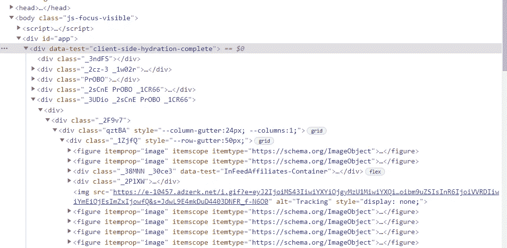

# 用 Python 实现✌️自动化。

> 原文：<https://medium.com/analytics-vidhya/%EF%B8%8F-do-some-automate-work-with-python-a4c5d50da79c?source=collection_archive---------9----------------------->


来自 unsplash

用[美汤](https://www.crummy.com/software/BeautifulSoup/bs4/doc/)和[请求](https://pypi.org/project/requests/)库从 U [nspla](https://unsplash.com/wallpapers) sh 下载图片。

首先我们需要安装请求库来获取内容表单[](https://unsplash.com/wallpapers)

*现在打开你的终端。*

*如果您的机器上安装了 pip，那么您可以在终端上输入以下文本来安装请求库。*

```
**pip install requests**
```

*还有漂亮的汤 4。*

```
*pip install beautifulsoup4*
```

*你还需要 html 解析器。我们将使用“lxml”*

```
*pip install lxml*
```

*如果你想创建一个虚拟环境，也可以通过 pipenv 或 venv 来实现。*

```
*//first make dir
mkdir get_photos//change dir to get_photos
cd get_photos//now open your text editor and make file 
//photo_downloader.py//if you have nvim then you can do 
nvim photo_downloader.py*
```

*现在让我们编码。*

```
*//first import 
import requests
from bs4 import BeautifulSoup
import lxml*
```

*请求库被导入，BeautifulSoup“类”是从 bs4 模块导入的。您可以通过以下方式在 python shell 中探索有关 bs4 的更多信息。*

```
*//define function which take url(unsplash)
def photo_downloader(url):
    request = requests.get(url,allow_redirects=True)
    data = BeautifulSoup(request.content,'lxml')* 
```

*这里我们定义了一个 photo_downloader 函数，我们在这个函数中工作。*

*首先用以 url 为参数的“requests.get”方法从网站获取内容。采用 html 和 html 解析器' BeautifulSoup 类。*

*访问[https://unsplash.com/wallpapers](https://unsplash.com/walpapers)并在您的浏览器中检查*

**

*在这里我们发现*

*标签分隔了每张图片，现在我们将把每张标签看作*

```
 *...
    all_images = data.find_all("figure",itemprop="image")* 
```

*data.find_all 将搜索每一个*

*图片，以区别于图片分隔符标签。*

```
*count = 0 //for change name of pictures
for i in all_images:
//find tag with photo downloadable href
    url = i.find('a',rel="nofollow") 
    if url != None:
        photo_url = url["href"]//take url to download
        phto_bytes =requests.get(photo_url,allow_redirects=True)
        with open(f'{count}wallpapers.jpg','wb') as photo:
            photo.write(photo_bytes.content)
            count +=1
print("Done") photo_downloader("https://unsplash.com/wallpapers")*
```

*all_images 返回 iterable 对象，因此迭代 all_images 以获取每一张图像。*

**

*标签元素 href 具有可下载的图像 url。我们可以像字典一样访问标签元素。现在我们有下载的 url，请求它的内容是 photo_bytes，它将返回状态代码。它的内容将被写入照片格式的文件，扩展名为*.jpg。在这里，您可以使用操作系统模块下载照片的其他文件夹*

```
 *...
             os.chdir(os.getcwd())
             ...*
```

*现在用它的参数值调用函数*

```
*photo_downloader('https://unsplash.com/wallpapers')*
```

*全部代码。*

```
*import requests
from bs4 import BeautifulSoup
import os
import lxmldef photo_downloader(url):
    request = requests.get(url,allow_redirects = True)
    data = BeautifulSoup(request.text,'lxml')
    all_image=data.find_all('figure',itemprop="image")
    count =0
    os.chdir('..\\pictures')
    for i in all_image:
        url=i.find('a',rel="nofollow")
        if url != None:
            i_url = url['href']
            photo_bytes = requests.get(i_url,allow_redirects=True)
            with open(f'{count}3d.jpg','wb') as photo:
                photo.write(photo_bytes.content)
                count +=1

    print("Done")

if __name__ == "__main__":
    photo_downloader("[https://unsplash.com/s/photos/3d](https://unsplash.com/s/photos/3d)")*
```

*这是为这个博客做的，试着自己试验一下，用一些其他的 url 实现它。✌️🗞️*