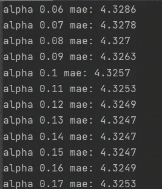

# 1-时间序列简介

> 原文：<https://medium.com/analytics-vidhya/1-introduction-to-time-series-5ae663c468f4?source=collection_archive---------3----------------------->


[M. B. M.](https://unsplash.com/@m_b_m?utm_source=medium&utm_medium=referral) 在 [Unsplash](https://unsplash.com?utm_source=medium&utm_medium=referral) 上拍摄的照片

如果我用最简单的方式解释时间序列；时间序列用于基于当前序列的预测，也用于假设检验。

***更新*** *:本文是我探索时间序列的系列文章的一部分。查看完整系列:* [*第 1 部分*](/analytics-vidhya/1-introduction-to-time-series-5ae663c468f4) *，* [*第 2 部分*](https://ertuncogulcan.medium.com/2-econometric-statistical-models-in-time-series-7b69ae3ab1d8) ，[第 3 部分](https://ertuncogulcan.medium.com/3-time-series-forecasting-using-lstm-e14b93f4ec7c)。

# 别跟我解释，出示代码

你可以在这里访问 GitHub repo。

## **时间序列中的基本概念:**


斯蒂芬·道森在 [Unsplash](https://unsplash.com?utm_source=medium&utm_medium=referral) 上拍摄的照片

> **平稳**:序列的统计属性不随时间变化。如果时间序列的均值、方差和协方差在一段时间内保持不变，则称该序列为平稳序列。
> 
> **趋势(一般趋势)**:是时间序列经过较长时间的下降和上升周期后出现的稳定状态。从长期来看，时间序列往往会稳步上升或下降。
> 
> **季节性**:指时间序列随季节的变化。时间序列中使用的数据的某些时段不同于其他时段。
> 
> **周期**:与季节变化无关的经济周期性变化。例如，经济的短期扩张或收缩，独立于总体趋势，描述了周期过程。
> 
> **不规则成分**:与其他元素一样不确定的变化，可以用误差一词来表示。

了解时间序列模型的本质需要知道的事情:

1.  *移动平均*:时间序列的未来值是其 k 个以前值的平均值。
2.  *加权平均*:类似于移动平均，其主要思想是给予最近的观察更多的权重。
3.  *平滑方法:*

> **单指数平滑(SES) :** 仅用于平稳序列，无趋势性或季节性。它通过指数修正进行预测，用未来与最近的过去更相关的假设来衡量过去的影响。通过指数加权过去的真实值和过去的预测值来进行估计。它适用于没有趋势性或季节性的单变量时间序列。


> **双指数平滑:**与水平和趋势数列使用，应该没有季节性。考虑到趋势效应，进行指数修正。
> DES =水平(SES) +趋势
> 基本方法与 SES 相同，但趋势也被考虑在内
> 它适用于趋势和季节性单变量时间序列。


> **三重指数平滑:**又名**霍尔特-温特斯**方法与水平、趋势和季节性串联使用。
> 水平(SES) +趋势+季节性
> 三重指数平滑是最先进的平滑方法
> 该方法动态估计水平、趋势和季节性的影响，可用于包含趋势和/或季节性的单变量序列。


在时间序列被分解成所有这些组成成分后，时间序列 y 可以通过*乘*方法在一定时间内表示为这些成分的*相加*。


## 0.有了这些信息，让我们考虑一个简单的数据集:

在这个项目中，我使用了全球陆地和海洋陆地温度(GlobalTemperatures.csv)数据集。

我们的主要数据集给出了各州的月平均气温。


为了获得关于数据集的更详细的信息，我使用 groupby 操作查看了各个国家的一般平均值。

```
y.rename(columns={"dt": "Date", "AverageTemperature": "Avg_Temp", "AverageTemperatureUncertainty": "confidence_interval_temp"}, inplace=True)y[['Country', "Avg_Temp"]].groupby(["Country"]).mean().sort_values("Avg_Temp")
```


后来我在数据集中获得了佛罗里达的数据。所以我就专注一个小点的重点，按顺序做操作。我想先看看佛罗里达的图表。

```
florida.head()
florida.tail(5)
florida["Date"] = pd.to_datetime(florida["Date"])
florida.set_index('Date', inplace = True)

plt.figure(figsize = (6,4))
sns.lineplot(x = 'Year', y = 'Avg_Temp', data = florida)
plt.show()
```


后来，我确定了直到 1994 年底的部分为教育数据。我会把后面的几个月作为测试数据。在这种情况下，我们的测试数据有 225 个月。

```
train = florida[:"1994-12-01"]
len(train)
test = florida["1995-01-01":]
len(test)
```

## 1.单指数平滑预测

可以固定系列使用。首先，我应用了迪基-富勒检验，因为我们知道，如果有趋势和季节性，它是不可用的。

```
def is_stationary(y):
    print('H0: Series Is Not Stationary')
    print("H1: Series Is Stationary")
    p_value = sm.tsa.stattools.adfuller(y)[1]
    if p_value < 0.05:
        print("Result is stationary",p_value)
    else:
        print("Series is not stationary", p_value)
is_stationary(florida)
```


```
ses_model = SimpleExpSmoothing(train).fit(smoothing_level = 0.5)
y_pred = ses_model.forecast(225)
train.plot(title="Single Exponential Smoothing")
test.plot()
y_pred.plot()
plt.show()
mean_absolute_error(test, y_pred)
```


图中显示的绿线是我们模型的估计值，而橙线是实际值。在这个阶段，我们无法预测趋势或季节性。

这些函数使用最大对数似然法寻找参数。

***1.1 优化我们的 SES 模型***

现在让我们创建网格，并使其阿尔法少，用 boothforce 方法优化它。

```
def optimize_ses(train,alphas, step=225):
    for alpha in alphas:
        ses_model = SimpleExpSmoothing(train).fit(smoothing_level=alpha)
        y_pred = ses_model.forecast(step)
        mae = mean_absolute_error(test, y_pred)
        print("alpha", round(alpha,2), "mae:", round(mae,4))
alphas = np.arange(0.01, 1,0.01)
optimize_ses(train, alphas)
```



```
### Final Ses Model ###
ses_model = SimpleExpSmoothing(train).fit(smoothing_level=0.14)
y_pred = ses_model.forecast(225)
train["1985":].plot(title='Single Exponential Smoothing')
test.plot()
y_pred.plot()
plt.show()
mean_absolute_error(test, y_pred)
```


我们不能接受这种模式，因为我们不能抓住趋势和季节性。尽管我们降低了 MAE 值，但我们的模型并不像我们希望的那样成功。所以我们进入下一阶段。

## 2.双指数平滑预测

```
# DES = Level + Trend
des_model = ExponentialSmoothing(train, trend="add").fit(smoothing_level=0.5,
                                                         smoothing_slope=0.5)
y_pred = des_model.forecast(225)
train["1985":].plot(title="Double Exponential Smoothing")
test.plot()
y_pred.plot()
plt.show()
```


我们抓住了趋势，但我们无法预测趋势会持续多久，而且趋势一直在持续。这就是为什么我们的 MAE 值变得相当高。从图中可以看出，绿线在所有 225 个步骤中持续下降。

***2.1 优化我们的 DES 模型***

```
alphas = np.arange(0.01, 1, 0.05)
betas = np.arange(0.01, 1, 0.05)

optimize_des(train, alphas, betas)

def optimize_des(train, alphas, betas, step=225):
    print("Optimizing parameters...")
    results = []
    for alpha in alphas:
        for beta in betas:
            des_model = ExponentialSmoothing(train, trend="add").fit(smoothing_level=alpha,
                                                                     smoothing_slope=beta)
            y_pred = des_model.forecast(step)
            mae = mean_absolute_error(test, y_pred)
            results.append([round(alpha, 2), round(beta, 2), round(mae, 6)])
    results = pd.DataFrame(results, columns=["alpha", "beta", "mae"]).sort_values("mae")
    print(results)

optimize_des(train, alphas, betas)
```


我们添加了 *alpha* (平滑级别)和 *beta* (平滑斜率)值，它们在优化中给出了最低的 MAE 值，作为我们模型的参数。

```
final_des_model = ExponentialSmoothing(train, trend="add").fit(smoothing_level=0.06,
                                                               smoothing_slope=0.01)
y_pred = final_des_model.forecast(225)
train["1985":].plot(title="Double Exponential Smoothing")
test.plot()
y_pred.plot()
plt.show()
```


即使我们降低了我们的 MAE 值很多，我们的模型仍然不像我们希望的那样成功。所以我们继续下一步，霍尔特-温特斯法。

## 3.用三重指数平滑法进行预测(霍尔特温特斯)

首先，我们通过将所有值指定为 0.5 作为基础模型来设置我们的模型。

```
tes_model = ExponentialSmoothing(train,
                                 trend='add',
                                 seasonal="add",
                                 seasonal_periods=12).fit(smoothing_level=0.5,
                                                          smoothing_slope=0.5,
                                                          smoothing_seasonal=0.5)
y_pred = tes_model.forecast(225)
train["1985":].plot(title = "Triple Exponential Smoothing")
test.plot()
y_pred.plot()
plt.show()
```


可以看出，我们的模型非常不成功，我们的 MAE 值比以往任何时候都高。现在我们将优化这个模型以获得更好的结果。

***3.1 优化出霍尔特-温特斯模型***

```
import itertools
alphas = betas = gammas = np.arange(0.01, 1, 0.05)
abg = list(itertools.product(alphas, betas, gammas))
abg[0][2]

def optimize_tes(train, abg, step=225):
    print("Optimizing parameters...")
    results = []
    for comb in abg:
        tes_model = ExponentialSmoothing(train, trend="add",
                                         seasonal="add",
                                         seasonal_periods=12).\
            fit(smoothing_level=comb[0],
                smoothing_slope=comb[1],
                smoothing_seasonal=comb[2])

        y_pred = tes_model.forecast(step)
        mae = mean_absolute_error(test, y_pred)

        print([round(comb[0], 2), round(comb[1], 2), round(comb[2], 2), round(mae, 2)])

        results.append([round(comb[0], 2), round(comb[1], 2), round(comb[2], 2), round(mae, 2)])
    results = pd.DataFrame(results, columns=["alpha", "beta", "gamma", "mae"]).sort_values("mae")
    print(results)

alphas = betas = gammas = np.arange(0.01, 1, 0.05)
abg = list(itertools.product(alphas, betas, gammas))

optimize_tes(train, abg)
```


作为优化的结果，我们在模型中输入最佳的 alpha、beta 和 gamma 值作为参数。

```
# Final TES Model
#################################
final_tes_model = ExponentialSmoothing(train, trend="add", seasonal="add", seasonal_periods=12).\
            fit(smoothing_level=0.06, smoothing_slope=0.06, smoothing_seasonal=0.06)
y_pred = final_tes_model.forecast(225)
train["1985":].plot(title="Triple Exponential Smoothing")
test.plot()
y_pred.plot()
plt.show()
```


可以看出，我们的 MAE 值已经达到了最低值。

# 结论

如果我们着眼于我们的最终模型，在诸如天气这样的可变但季节性的数据中建立 TES (HOLT Winters)模型是非常重要的。季节性与过去相关，趋势与过去相关，水平同样与过去相关，这表明季节和温度对我们来说以相似的模式进行。

> *下一步:*
> 
> 在这篇文章的几天后，我将讨论 AR 模型，MA (q)，ARMA，ARIMA，SARIMA 模型，它们与时间序列中的计量经济学和统计模型，第 2 部分的数据集相同。

## 参考

[1][https://www.veribilimiokulu.com](https://www.veribilimiokulu.com/bootcamp-programlari/veri-bilimci-yetistirme-programi/)

[2][https://www . ITL . NIST . gov/div 898/handbook/PMC/section 4/pm C4 . htm](https://www.itl.nist.gov/div898/handbook/pmc/section4/pmc4.htm)

[https://www.statisticssolutions.com/time-series-analysis/](https://www.statisticssolutions.com/time-series-analysis/)