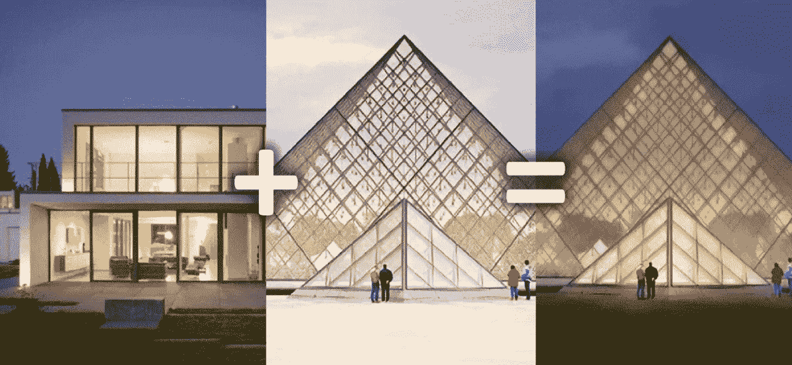
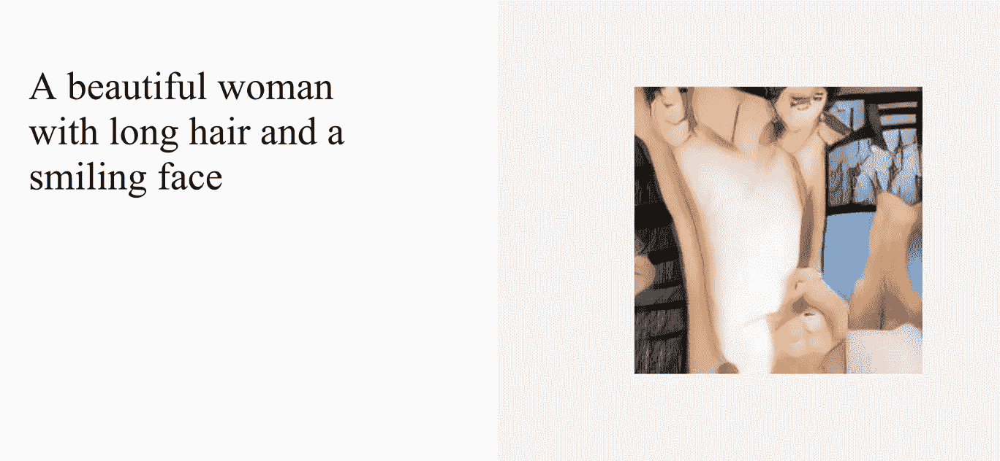
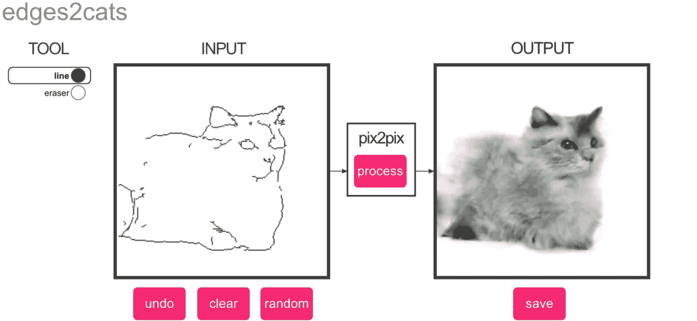
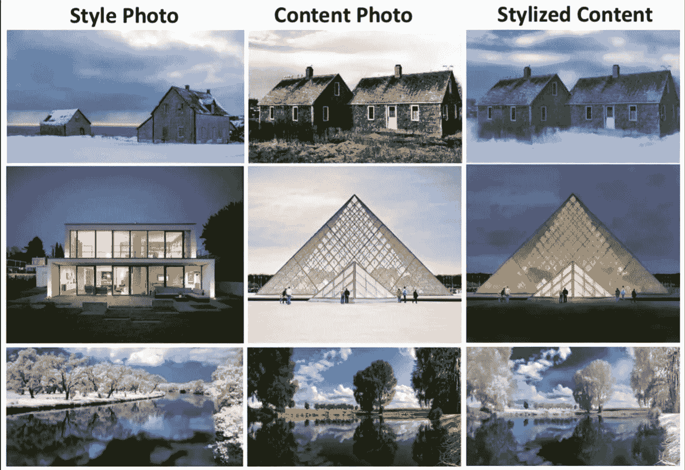

# 10 项人工智能实验将于今日上线

> 原文：<https://medium.com/analytics-vidhya/10-ai-experiments-to-try-online-today-6e913777a02b?source=collection_archive---------3----------------------->

互联网上公开的人工智能驱动的游戏和实验的集合。

对许多人来说，人工智能是一个神秘、惊奇和无限可能的话题。尽管最近大肆宣传，人工智能对公众来说仍然难以捉摸，并且经常被误解所笼罩。为了让普通人更容易接触到人工智能技术，世界各地的开发人员正在创建越来越多的在线人工智能实验，并向公众开放。

通过图片、音乐、图画等，这些演示展示了媒体通常没有涉及的机器学习技术的创造能力。我们 Lionbridge AI 已经收集了我们最喜欢的人工智能实验，您今天可以在线尝试。尽情享受吧！

# 1.[快，画！](https://quickdraw.withgoogle.com/) —人工智能拼图

没错——你现在可以创建可怕的图画，让谷歌猜猜它们是什么！去年，谷歌发布了一款使用机器学习构建的免费在线游戏。很简单，真的:画一个物体，谷歌将试图猜测它是什么。该模型只会随着它猜测的图纸越来越多而变得越来越好，所有数据都被公开共享以帮助推进机器学习研究。自己玩游戏[这里](https://quickdraw.withgoogle.com/)。

# 2. [AttnGAN](http://t2i.cvalenzuelab.com/) —图像生成机

[微软深度学习技术中心](https://www.microsoft.com/en-us/research/group/deep-learning-group/)的研究人员最近教授了一种算法，可以将文本标题转化为图像。

该模型的目标是可视化基于文本的标题，结果如您所料非常奇怪。当研究人员在特定数据集(例如猫图像数据集)上训练人工智能时，它能够产生令人信服的输出。然而，当在由不同图像组成的大型数据集上训练时，它变得有点不知所措，如下面的截图所示:

你可以在 AttnGAN 周围玩耍，这要归功于纽约大学的技术专家兼常驻研究员 Cristóbal Valenzuela 制作的演示。这是一个更大的项目 [Runway](https://runwayml.com/) 的一部分，它使人工智能能够被创造性地使用。

# 3.[与书籍对话](https://books.google.com/talktobooks/) —智能对话

谷歌研究开发了多种活动来教授人工智能人类对话的艺术。在[与书籍对话](https://books.google.com/talktobooks/)中，你可以输入任何陈述或问题，模型将扫描超过 10 万本书籍，根据你的输入找到各种各样的回答。

工程总监 Ray Kurzweil 表示，该模型在近 10 亿行对话中进行了训练，以确定合适的回应。

# 4.[谢莉·艾](http://www.shelley.ai/)——人与人工智能合作的恐怖故事

来自[的制造者梦魇机器](http://nightmare.mit.edu/)，[谢莉](https://twitter.com/shelley_ai?lang=en)是一个深度学习驱动的人工智能。谢莉使用来自 Reddit 的 [r/nosleep](http://reddit.com/r/nosleep) subreddit 的恐怖故事进行训练，在过去的一年里，她一直在与 Twitter 用户共同创作恐怖故事。

每个小时，谢莉都会写一系列推文，后面跟着标签#轮到你了。这种模式依靠 Twitter 用户自己写一句话来继续这个故事，然后用她自己的转折来结束它。结果会令人吃惊地令人不寒而栗。

在 Shelley 的主页上找到 Shelley 写的短篇小说和更多信息。

# 5.[人工智能二重奏](https://experiments.withgoogle.com/ai/ai-duet/view/)——用钢琴进行的人工智能实验

用一架回应你的钢琴来演奏二重奏。通过点击你的鼠标，使用你的电脑键，甚至插入一个 MIDI 键盘输入一些音符，模型就会对你的旋律做出反应。这只是机器学习如何以新的方式激发创造力的一个例子。

由 Yotam Mann 与 Magenta 和谷歌创意实验室团队的朋友一起，使用 [Tensorflow](https://www.tensorflow.org/) 、 [Tone.js](https://github.com/Tonejs/Tone.js) 和来自[Magenta 项目的开源工具构建了人工智能二重奏。](https://github.com/tensorflow/magenta)

# 6. [pix2pix](https://affinelayer.com/pixsrv/) —图像到图像的翻译

多亏了 [pix2pix](https://github.com/phillipi/pix2pix) 的这个[互动演示](https://affinelayer.com/pixsrv/)，你现在可以将简单的线条画变成美丽的艺术作品。绘制一个简单的线条画，然后观看 pix2pix AI 自动将你的作品变成猫、建筑物或鞋子。

它是如何工作的？pix2pix 使用条件生成对抗网络(cGAN)来学习从输入图像到输出图像的映射。该模型在成对的图像上进行训练，例如建筑物立面标签到建筑物立面，然后尝试从您给它的任何输入图像生成相应的输出图像。

# 7.[更奇怪的东西](http://evenstranger.pw/) —奇怪的海报生成器

一个有趣的生成器，使用人工智能图像识别将你上传的任何图像转换为陌生人事物海报。

点击这里免费试玩[。](http://evenstranger.pw/)

# 8.[无限鼓机](https://experiments.withgoogle.com/ai/drum-machine/view/) —音乐人工智能实验

由谷歌创意实验室建造的无限鼓机是一种利用日常声音创造节拍的新方法。

使用一种叫做 t-SNE 的技术，该模型能够在不使用描述或标签的情况下，将大型音频数据集组织成相似声音的小组。通过在声音图周围滑动标记，您可以探索不同的声音，并使用鼓音序器制作节拍。

# 9.[快速照片风格](https://github.com/NVIDIA/FastPhotoStyle) —照片风格转换

今年早些时候，英伟达发布了一种新的人工智能算法，名为 [FastPhotoStyle](https://github.com/NVIDIA/FastPhotoStyle) ，可以将任何照片的风格转移到不同的图像，产生令人印象深刻的照片级效果。

该模型将任务分为两个独立的步骤，风格化和平滑。在风格化过程中，参考照片的风格被复制到内容照片。接下来，平滑步骤有助于通过鼓励“空间一致的风格化”使输出看起来更有说服力以下是 FastPhotoStyle 的一些功能示例:

# 10. [Semantris](https://research.google.com/semantris/) —自然语言文字联想

Semantris 由谷歌创建，是一套由机器学习、自然语言理解(NLP)技术支持的在线单词联想游戏。

每当你输入一条线索，模型就会查看游戏中的单词，并选择它认为最相关的一个。该模型在互联网上被输入数十亿个对话文本样本后，学会了单词之间的联系。在这里亲自尝试一下，但要事先警告——这很容易上瘾。

正如这些人工智能实验向我们展示的那样，人工智能的用例数量惊人。事实上，没有两个项目是相同的。这就是为什么机器学习模型需要根据定制数据进行训练，以发挥其全部潜力。在 Lionbridge AI，我们专门为各种 NLP 用例创建和注释数据集。无论你是在构建一个商业聊天机器人，还是只是在机器学习中寻找乐趣，[今天就联系我们](https://lionbridge.ai/contact-sales/)，看看投资数据如何能让你的项目更上一层楼。

*特征图像通过* [*千万亿像素*](https://petapixel.com/2018/03/21/nvidias-ai-can-magically-transfer-one-photos-style-to-another/)