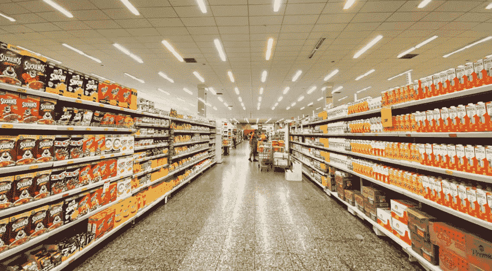
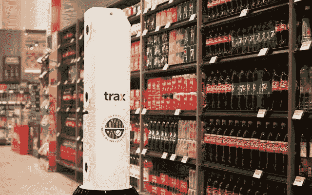
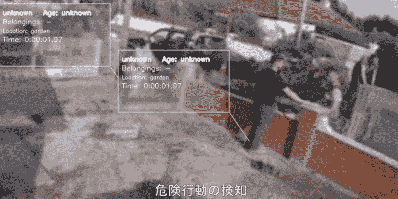

# 颠覆零售业的 10 家计算机视觉初创公司

> 原文：<https://medium.com/analytics-vidhya/10-computer-vision-startups-disrupting-the-retail-industry-d2bca788dc94?source=collection_archive---------14----------------------->

在线零售多年来一直稳步增长，没有停止的迹象。特别是在新冠肺炎疫情引发的行动限制下，[研究显示，2020 年全球在线销售额跃升至 26.7 万亿美元](https://news.un.org/en/story/2021/05/1091182)。随着电子商务的兴起，有一点非常清楚:实体零售商如果想保持竞争力，就需要创新。

像计算机视觉这样的人工智能技术在零售行业的使用正在迅速增加。人工智能增强的零售有望消除运营效率低下的问题，并为购物者提供无摩擦的店内体验。在本文中，我们列出了零售领域最具创新性的计算机视觉初创公司。

# 人工智能在零售业的未来

近年来，越来越多的零售企业开始悄然转型实体店。例如，沃尔玛开始[安装一系列传感器、摄像头和处理器](https://corporate.walmart.com/newsroom/2019/04/25/walmarts-new-intelligent-retail-lab-shows-a-glimpse-into-the-future-of-retail-irl)来监控库存水平，执行自动化产品质量检查，等等。

许多行业巨头纷纷效仿，采用类似的方法来提高店内效率、改善物流、防止盗窃等。研究表明，零售人工智能市场正在快速增长——根据 RIS 新闻最近的一份报告，到 2020 年底，只有 [3%的零售商](https://risnews.com/retail-tech-study-2021?from=gate)在利用计算机视觉技术，但另有 40%的零售商计划在明年部署新的解决方案。

计算机视觉解决方案为零售商提供了充足的机会来促进运营并增强客户的购物体验。计算机视觉最有前途的应用包括库存管理、损失预防、自动结账和行为分析。从无员工商店到店内监控，这里有几个颠覆零售业的计算机视觉初创公司。

# 零售业中的计算机视觉初创公司

## 存货管理

*   [**RADAR**](https://goradar.com/)**:**RADAR 是一款完全集成的硬件和软件解决方案，使用 RFID 和计算机视觉技术实现自动化库存管理。他们的使命是通过自动化库存盘点、改善店内补货和即时客户库存检查来简化库存管理。
*   [**Trax**](https://traxretail.com/resources/trax-computer-vision-platform/) **:** 总部位于新加坡的初创公司 Trax 提供了一种店内解决方案，使用计算机视觉模型和硬件的组合来实时跟踪他们的库存。该解决方案确保高效回购脱销商品，同时将过期商品从货架上撤下。该公司拥有 23 项技术专利，可以分析手机、店内摄像头和杂货店机器人的图像。

*Trax 使用计算机视觉技术来扫描商店的货架，并确定需要什么*

## 自动结账

*   [**Standard.ai**](https://standard.ai/)**:**以前被称为 Standard Cognition，Standard . ai 的自动化结账解决方案是为了适应零售商现有的商店和技术而设计的。他们自诩有一个易于安装的摄像头优先的解决方案，不使用十字转门或大门。Standard 不使用任何面部识别或生物识别技术，所有部署都是内部部署，以确保零售商和购物者的最佳性能和安全性。
*   [**Trigo**](https://trigo.tech/)**:**总部位于特拉维夫的 Trigo 使用专有算法和价格合理的现成传感器套件，允许零售商实时分析匿名购物者的行动和产品选择。该系统自动将选定的商品编辑成一个虚拟购物清单，使购物者无需通过传统的收银台就能离开。
*   [**Accel Robotics**](https://www.accelrobotics.com/)**:**Accel Robotics 凭借其获得专利的基于摄像头的人工智能系统，在现有和新的商店业态中提供免结账购物体验。他们最近推出了代客市场，这是一个完全自动化的便利店面，没有收银员或收银台。

## 预防损失的措施

*   [**stop lift**](https://www.stoplift.com/)**:**stop lift 植根于麻省理工学院的人工智能实验室，分析安全视频和 POS 数据，以区分结账时的合法和欺诈行为。通过将先进的计算机视觉算法应用于现有的摄像头，StopLift 的 ScanItAll 系统能够跟踪通过收银台的商品，将它们与 POS 相关联，并在可疑活动发生时进行标记。
*   [**Vaak**](https://vaak.co/vaakeye-store/) **:** 日本初创公司 Vaak 提供了一种基于云的计算机视觉系统，可以监控零售安全摄像头的镜头，以发现可疑行为。VaakEye 已经在日本的 50 多家商店部署，它可以分析身体上 100 多个点的运动，自动衡量可疑行为。一旦客户达到某个阈值，系统就会向相应的工作人员发送警报以及相关的视频剪辑。

*vaa keye 产品演示视频片段*

## 行为分析

*   [**Deep North**](http://deepnorth.com/)**:**Deep North 提供了一个分析平台，该平台基于来自 CCTV 和零售商已经使用的其他摄像机的视频数据，为零售商构建实时视频情报。Deep North 的专有技术可捕捉每日进出、客户占用率、排队时间、转化率等参数。
*   ****:**根据视觉传感器捕捉到的信息，当购物者在空间中移动时，Advertima 的平台为零售商提供了实体店中正在发生的事情的实时视图。该平台声称只处理最少的匿名数据，不会存储任何记录或个人信息供未来使用。**
*   **[**Cosmose**](https://cosmose.co/)**:**Cosmose 提供数据分析平台，分析实体店的客流量，帮助预测顾客行为。他们提供 3 种主要产品:Cosmose Analytics，跟踪实体店内顾客的活动；Cosmose AI，一个数据分析和预测平台，帮助零售商创建营销活动和推动销售；和 Cosmose Media，用于定位在线广告。**

**实时可见性对于经营实体零售至关重要。这就是为什么越来越多的零售商采用计算机视觉来提高运营效率，改善客户体验，并获得竞争优势。**

**早期采用者已经看到了巨大的成果——根据加拿大皇家银行资本市场分析师的估计，无收银员的亚马逊 Go 商店比普通便利店平均多带来大约 50%的收入。**

# **零售可视化数据管理**

**为零售构建[计算机视觉解决方案的公司正在不断构建和增长他们的 ML 训练数据集。如今，大多数公司不得不依靠内部工具或电子表格等手动解决方案来完成这项工作。](https://www.siasearch.io/retail)**

**SiaSearch 通过简化数据探索、可视化和选择的轻量级 API，帮助零售公司简化和加速这一过程。因此，公司可以降低注释成本并提高模型性能。**

**有兴趣了解更多信息吗？[联系 SiaSearch 团队](https://www.siasearch.io/request-a-demo)获取免费的概念证明。**

***本文原载:*[*https://www . siasearch . io/blog/computer-vision-startups-retail-industry*](https://www.siasearch.io/blog/computer-vision-startups-retail-industry)**