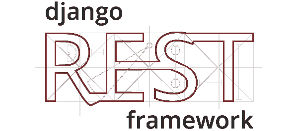

# Django REST 框架提高编码效率的 10 个必备技巧

> 原文：<https://medium.com/analytics-vidhya/10-must-have-tips-of-django-rest-framework-to-increase-your-coding-efficiency-87ebea0e0099?source=collection_archive---------3----------------------->

Django 是 Python Web 开发的一个很好的高级框架，它鼓励快速开发和干净、实用的设计。Instagram、Pinterest、Youtube、Spotify、Bitbucket 等很多网站都在使用这个框架。

这篇文章假设读者对 Django REST 框架有基本的了解。我们将讨论 10 个有用的…