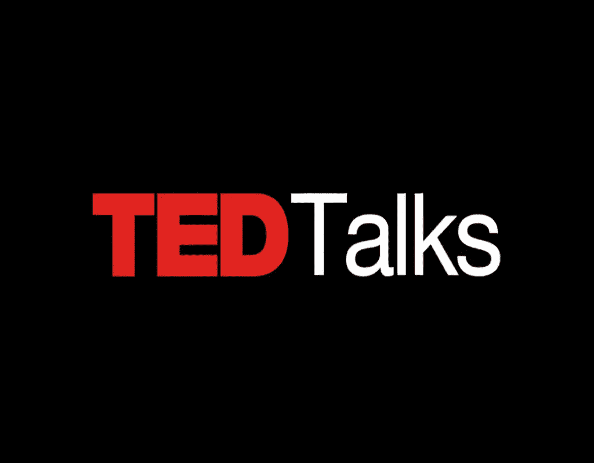

# 10 场 TED 演讲将激励每一位数据专家

> 原文：<https://medium.com/analytics-vidhya/10-ted-talks-that-will-inspire-every-data-professional-9b42037bcec1?source=collection_archive---------22----------------------->

流行文化中有一句流行的话，

> *水，水，到处都是，
> 也没有任何一滴可以喝。*

出自英国诗人[塞缪尔·泰勒·柯尔律治](https://en.wikipedia.org/wiki/The_Rime_of_the_Ancient_Mariner)[的《古舟子咏](https://en.wikipedia.org/wiki/Samuel_Taylor_Coleridge)。

约翰·艾伦·保罗斯引用的这句话还有一个现代版本。

> *数据，数据，无处不在，却没有一个思想去思考。*

这些数据可以用来解决世界人道主义问题吗？我们能用数据拯救生命吗？我们在数据方面有多创新？这篇文章从回答这些问题的 10 个 TED 演讲中得到启发。

[TED](https://www.ted.com/about/our-organization) 是一个非营利组织，以“值得传播的思想”为口号组织会议。1984 年，当 TED 开始作为一个会议时，这个词代表技术、娱乐和设计，但今天几乎任何领域都有 TED 演讲。这篇文章中的谈话会激励你，吸引你，让你思考，让你兴奋，甚至可能成为你下一个项目的灵感。让我们开始吧。

# 一个词的诞生——德布·罗伊

你会为你的研究收集多少数据？加拿大科学家兼麻省理工学院研究员 Deb Roy 想了解我们如何学习语言。因此，他在家里各处安装了摄像机，欢迎他的新生儿子回家。他展示了他的团队如何捕捉和解析超过 90，000 小时的视频，从他儿子第一次开始喃喃自语到他发出一个完整的单词——从嘎嘎到水。他还绘制了结构图，展示了环境和我们一起成长的人如何对语言学习产生影响。

# 你公司的数据可以帮助结束世界饥饿——马洛里·弗里曼

企业长期以来一直参与慈善活动，捐赠服务或产品，甚至提供财政援助。但随着数字时代的到来，公司面临着新的责任。马洛里·弗里曼(Mallory Freeman)是 UPS 数据科学和机器学习总监。在这个耸人听闻的演讲中，她坚持认为公司应该站出来，在解决世界主要问题中发挥自己的作用。她提出了三种公司如何从他们的角度做出贡献的主要方式，以及为什么他们应该这样做的一些强有力的理由。这是一个关于我们如何用数据拯救世界的令人信服的演讲。

# 为什么智能统计是打击犯罪的关键——安妮·米尔格拉姆

当安妮·米尔格拉姆成为新泽西州的司法部长时，她偶然发现了两个问题——谁在他们的刑事司法系统中，他们有关于他们的什么数据。她意识到法官和检察官一直在指控人们，并根据直觉和经验做出决定，结果并不太好。请听这段关于她如何创建一个由数据科学家、研究人员和统计学家组成的团队来构建数据驱动的评估和统计建模工具以降低新泽西州的犯罪率的演讲。

# 你见过的最好的数据——汉斯·罗斯林

世界是我们看到的样子吗？比昨天好还是差？观看这个演讲，[汉斯·罗斯林](https://en.wikipedia.org/wiki/Hans_Rosling)——一位瑞典医生，学者，[真相](https://www.goodreads.com/book/show/34890015-factfulness)的作者——解释了如果我们不看数据和它所说的，我们是如何低估世界的巨大变化的。尽管这个演讲是在近十年前发表的，但它仍然适用于今天的情况。他们说，*“在汉斯·罗斯林手里，数据唱着”*。在谈话结束时，你会确信这一点。

# 识别错误统计数据的 3 种方法——Mona chala bi

不管你是否知道，统计是你日常生活的一部分。从政府统计数据到天气预报、政治活动、股票市场——它们无处不在。大多数统计数据引发了怀疑和质疑。我们能有多大把握相信他们？我们能盲目地信任他们或完全忽视他们吗？数据记者兼作家 Mona Chalabi 提出了三种方法，帮助我们解释、质疑、理解和推断好的统计数据。

# 我们如何处理这些大数据？—苏珊·埃特林格

蜘蛛侠漫画里有一句著名的谚语，

> *“权力越大，责任越大”*

对每一个处理数据的专业人士来说都是如此。你可以操纵数据来表达任何意思。对于每一个伟大的发现或发明，总有它的反面。当我们释放数据的力量时，我们在挖掘数据的哪一部分？它给世界带来了什么？我们是否用它做了快速而糟糕的决定？我们能从过去学到什么吗？行业分析师、人工智能和大数据专家 Susan Etlinger 分享了自己的亲身经历，并给出了一个令人信服的演讲，即*深度批判性思维*是一条出路。

# 我是如何黑掉网上约会的——艾米·韦伯

你能用数据和分析找到你的灵魂伴侣吗？嗯，[艾米·韦伯](https://amywebb.io/)，未来主义者兼作家说“*是的*”，她还展示了她如何利用在线约会网站找到她的梦中情人。观看这个热闹的演讲，她处理数据，列出她所在城市的男性候选人名单，积累不同的数据点，每个数据点都是她未来丈夫的一个特征，从约会网站收集数据，并创建自己的公式来找到合适的伴侣。*这是一个童话般的谈话。*

# 为什么每个人都应该懂数据——乔丹·莫罗

每个数据问题都是从一个问题开始的。*“为什么？”“什么？”“怎么会？”“哪里？”“什么时候？”*。阿尔伯特·爱因斯坦说，

> “如果我有一个小时来解决一个问题，而我的生命取决于这个问题的解决方案，我会用前 55 分钟来确定要问的恰当问题。一旦我知道了恰当的问题，我就可以在不到 5 分钟的时间内解决这个问题”

正确的提问在大多数情况下能解决 70%的问题。更别说你的工作或项目了，你是否曾经在社交媒体或新闻中看到一些数字或统计数据，并质疑自己这些信息是否正确？在这个视频中，[plural sight 的数据主管 Jordan Morrow](https://www.linkedin.com/in/jordanmorrow/) 谈到了数据素养，并解释了为什么在这个[第四次工业革命](https://en.wikipedia.org/wiki/Fourth_Industrial_Revolution)中，数据素养应该是每个人都应该具备的技能。他提出了数据素养的四个关键特征，并展示了如何将它们付诸实践。

# 你的社交媒体“喜欢”曝光比你想象的要多——詹妮弗·戈尔贝克

据估计，全球一半的互联网用户使用脸书。我们都知道社交媒体网站收集和使用用户的信息。但眼前的问题是在多大程度上。你能预测一个内容似乎完全不相关的人吗？《美国国家科学院院刊》进行的一项研究显示，高智商的人倾向于喜欢炸薯条。如果你在想，*“等等。什么？”*接下来请继续收看由[詹妮弗·戈尔贝克](https://en.wikipedia.org/wiki/Jen_Golbeck)的演讲，她是马里兰大学的计算机科学家和教授，她揭开了“炸薯条”的谜题，并分享了一个有趣的用户如何控制自己数据的方法。

# 风暴构成的艺术——娜塔莉·米贝克

如果您的 excel 表格上的数字和数据有一个音符，并可以作为 3D 图形实时存在于物理世界中，会怎么样？听起来很有趣？艺术家娜塔莉·米贝克(Nathalie Mieback)提取天气数据，编织它们，并将其翻译成乐谱。她将数据转化为艺术、音乐和 3D 图像。

我希望这些讲座给了你新的见解和经验。本文中的讨论绝非详尽无遗。你可以在 TED 上找到更多这样的演讲。

感谢你一路阅读到这里。如果你有任何问题、反馈或批评，以及你最喜欢的话题，请在评论区告诉我。保持安全和健康。祝你今天开心！玩的开心！

在 [LinkedIn](https://www.linkedin.com/in/padhma-sahithya-muniraj/) 上与我联系

*原载于 2021 年 5 月 17 日 https://www.analyticsvidhya.com***。**