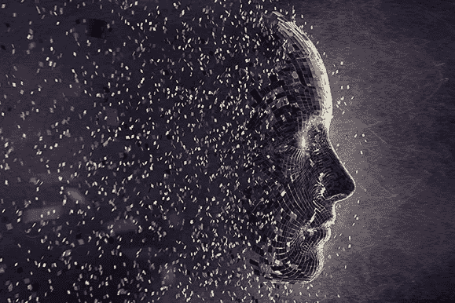

# 你永远想不到人工智能会征服的 14 个领域

> 原文：<https://medium.com/analytics-vidhya/14-areas-you-would-never-expect-ai-to-conquer-abc2be5f2bc4?source=collection_archive---------19----------------------->

我们经常听说人工智能在我们日常生活中的各种用途。无论是为组织提供经济利益，设计医疗保健模式还是预测未来趋势，技术已经占据了我们生活的几乎所有领域。人工智能的概念是在 20 世纪 50 年代提出的，在相当长的一段时间内不断发展，直到最近二十年才开始流行。我们对人工智能的看法现在已经从单纯的技术进步转变为在帮助人类方面占据中心位置。然而，在某些领域，人们可能永远不会期望它发挥关键作用。这里有一些意想不到的领域，它帮助带来了巨大的进步。

## 天文学

AI 用于对太空中的物体进行分类，并分析复杂的天文数据。深度学习技术被用来建立一个名为 Morpheus 的框架，对星系和恒星进行分类，并研究星系的演化。人工智能还被用于识别小行星和预测潜在的危险碰撞。

## 放射学

在印度，人口有 13 亿，而放射学家只有 15000 人。人工智能作为一种工具，极大地提高了医疗保健系统的可及性和覆盖范围。通过加快筛选图像、检测症状和疾病的过程，它有助于增加存活的机会。它已被用于识别和定位 X 射线，核磁共振成像和 CT 扫描异常。由于专家数量与患者数量之间的差距，这有助于使所有人更容易获得和负担得起医疗保健。

## 重症监护

在重症监护中，时间至关重要。一个病人来到急诊室，很快被带去做 ct 扫描。人工智能算法审查图像并检测某些威胁生命的情况，如肺萎陷，而不是让专家阅读这些图像，因为专家人数很少，这可能是一项耗时的任务。然后立即向相关医生发送警报或通知。

## 运动

它通过为运动员提供更个性化的训练计划和表现分析来提高运动员的表现。例如，找到获胜战术的剪辑或对球员的视觉分析有助于球员和教练制定反击策略，并有更身临其境的体验。球员的身高、体重、身体质量指数、警觉性和力量等数据被收集起来，用于组建更好的球队，做出更好的决策，并增加获胜的机会。

## 星象

根据月亮、行星和黄道十二宫的位置，可以预测一个人的未来。人们必须输入他们的出生时间、日期和地点，之后人工智能算法会计算出用户的出生图表，并绘制出用户出生时的完整天空图，以便做出进一步的预测。来自美国国家航空航天局的数据和著名占星家的方法被用来做出合理的预测。

随着主流技术的使用，算命和塔罗牌阅读的自动化也成为可能。

## 社会性行为

这方面的一个很好的例子是 IBM Watson Personality Insights 服务，它使用语言分析从电子邮件、短信、推特和其他社交媒体帖子中推断出个人的特质。

## 时尚产业

随着新潮流的兴起和衰落，时装业总是在变化。除了通过数据分析改善客户关系和营销策略，人工智能还可以帮助设计师分析过去的设计和预测未来的趋势。

## 食品工业

我们经常在 Zomato 和 Swiggy 等外卖应用上看到食物推荐。通过分析关于客户的情绪、年龄、过去的购买和偏好的数据，可以向客户做出预测和推荐。聊天机器人还可以根据用户的食材选择推荐菜单上的菜肴。这有助于节省浏览菜单的时间，并增强客户体验。智能冰箱可以确定冰箱内物品的状态，有助于避免食物浪费。通过图像处理检测食物腐败和气味传感器嗅乙烯，各种酒精，乙酸，短链脂肪酸和其他挥发性有机化合物的存在，并自动排序耗尽的成分，他们有助于提高生活质量。

## 音乐

Spotify 在 2020 年底给出了用户最喜欢的艺术家和歌曲的评论，这是最近的一种时尚。人工智能算法对选项进行排序，并根据听众过去听过的内容向他们提供建议。此外，AI 可以创作或协助音乐家创作音乐。强化学习用于学习音乐的特征和模式，并创造创新的、令人愉快的音乐。它还用于根据流派、偏好和收听历史对歌曲进行分类和推荐。

## 匹配人员

人工智能算法鼓励约会应用程序上更定制、准确、个性化的个人匹配。他们可以记住行为，并根据行为定制最有可能匹配的人的名单。他们分析以前的匹配，只显示最有可能的日期，以增加找到爱情的机会。某些应用程序根据问卷或基于位置的数据显示匹配。在某些情况下，一些重要的因素，如友好程度、亲密程度、快乐程度和外向程度，也会被用来做出好的匹配。

## 对抗流行病

在新冠肺炎疫情中，人工智能通过使用物联网应用程序来帮助保持社交距离，通过使用口罩识别软件来确保个人的安全，根据性别，年龄组和先存状况分析有关死亡的数据，跟踪疫情的传播，检测更容易感染该疾病的群体，识别重症患者，通过使用人工智能智能智能眼镜检测大规模人群中的发烧患者，以及接触追踪应用程序来检测密切接触者，并在有传染风险的情况下警告人们。

## 其他植物上的生命

人工智能可以预测其他星球上存在生命的可能性，并帮助探测外星生命。

## 解开谜团

海洋机器人从海底探索和收集数据，这些数据被进一步分析以发现隐藏的模式。人工智能算法加快了对深海生态系统的探索和研究，并可以帮助识别世界海洋之间的联系。

## 人工智能促进可持续发展

AI for Good 基金会在开发技术解决方案和人工智能政策框架方面提供援助，以满足人口的需求，展示零足迹人工智能模型，并推动联合国可持续发展目标，包括无贫困、零饥饿、优质教育、性别平等、可持续城市、气候行动等。