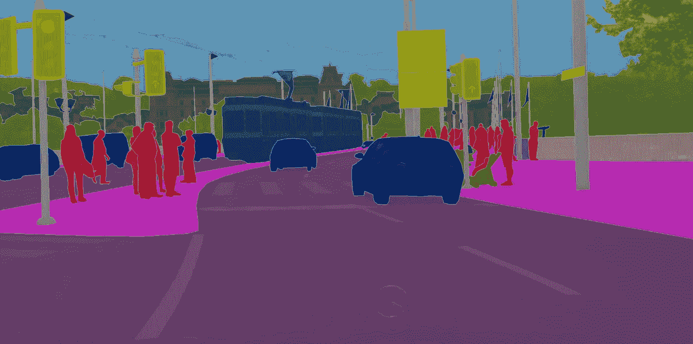

# 15 个最佳开源自动驾驶数据集

> 原文：<https://medium.com/analytics-vidhya/15-best-open-source-autonomous-driving-datasets-34324676c8d7?source=collection_archive---------2----------------------->

近年来，越来越多的公司和研究机构将其[自动驾驶数据集](https://www.siasearch.io/blog/best-open-source-autonomous-driving-datasets)向公众开放。然而，最好的数据集并不总是容易找到的，在互联网上搜寻它们需要时间。

为了提供帮助，我们 SiaSearch 整理了一份自动驾驶前 15 名开放数据集的列表。下面的资源总共包含数百万个数据样本，其中许多已经被注释。我们希望这个列表为你提供一个坚实的起点，让你更多地了解这个领域，或者开始你自己的自动驾驶项目。

# 自动驾驶项目的顶级开放数据集

# 1. [A2D2 数据集](https://www.a2d2.audi/a2d2/en.html)

奥迪自动驾驶数据集(A2D2)的特征超过 41，000 个，标记有 38 个特征。总共 2.3 TB 左右，A2D2 按标注类型拆分(即语义分割，3D 包围盒)。

# 2. [ApolloScape 数据集](http://apolloscape.auto/)

ApolloScape 是一个不断发展的研究项目，旨在促进自动驾驶各个方面的创新，从感知到导航和控制。通过他们的网站，用户可以探索各种模拟工具和超过 10 万个街景帧、8 万个激光雷达点云和 1000 公里的城市交通轨迹。

# 3. [Argoverse 数据集](https://www.argoverse.org/)

Argoverse 数据集包括 113 个场景的 3D 跟踪注释和超过 324，000 个用于运动预测的独特车辆轨迹。

# 4.[伯克利 DeepDrive 数据集](https://www.bdd100k.com/)

DeepDrive 数据集也称为 BDD 100K，它让用户可以访问 100，000 个带注释的视频和 10 个任务，以评估自动驾驶的图像识别算法。该数据集代表了超过 1000 小时的驾驶体验，超过 1 亿帧，以及关于地理、环境和天气多样性的信息。

# 5.[城市景观数据集](https://www.cityscapes-dataset.com/)

CityScapes 是一个大规模数据集，专注于对德国 50 个城市街道场景的语义理解。它为 30 个类提供了语义、实例和密集像素注释，这些类分为 8 个类别。整个数据集包括 5000 个带有精细注释的注释图像，以及另外 20000 个带有粗略注释的注释图像。

# 6. [Comma2k19 数据集](https://github.com/commaai/comma2k19)

该数据集包括加利福尼亚州 280 号高速公路上记录的 33 小时通勤时间。每个 1 分钟的场景都是在圣何塞和旧金山之间 20 公里的高速公路上拍摄的。数据是使用 comma EONs 收集的，它具有面向道路的摄像头、手机 GPS、温度计和 9 轴 IMU。

# 7.[谷歌地标数据集](https://ai.googleblog.com/2018/03/google-landmarks-new-dataset-and.html)

地标数据集由谷歌于 2018 年发布，分为两组图像，用于评估人工和自然地标的识别和检索。原始数据集包含超过 200 万幅图像，描绘了来自世界各地的 3 万个独特的地标。2019 年，谷歌发布了 Landmarks-v2，这是一个更大的数据集，包含 500 万张图像和 20 万个地标。

# 8. [KITTI Vision 基准套件](http://www.cvlibs.net/datasets/kitti-360/)

Geiger 等人在 2012 年首次发布了 [KITTI 数据集](https://www.siasearch.io/kitti-dataset/)，旨在通过一套新颖的现实世界计算机视觉基准来推进自动驾驶研究。作为有史以来第一批自动驾驶数据集之一，KITTI 拥有超过 4000 篇学术引用，并且还在不断增加。

# 9. [LeddarTech 像素集数据集](https://leddartech.com/solutions/leddar-pixset-dataset/)

Leddar PixSet 于 2021 年推出，是一个新的公共数据集，用于自动驾驶研发，包含来自完整 AV 传感器套件(相机、激光雷达、雷达、IMU)的数据，并包括来自 Leddar Pixell 的全波形数据，Leddar Pixell 是一种 3D 固态闪光激光雷达传感器。该数据集包含 97 个序列中的 29k 帧，带有超过 130 万个标注的 3D 框

# 10.[五级开放数据](https://self-driving.lyft.com/level5/data/)

由流行的拼车应用 Lyft 发布的 Level5 数据集是自动驾驶数据的另一个重要来源。它包括超过 55，000 个人类标记的 3D 注释帧、表面地图和底层高清空间语义地图，由 7 个摄像头和最多 3 个激光雷达传感器捕获，可用于将数据置于上下文中。

# 11. [nuScenes 数据集](https://www.nuscenes.org/)

由 Motional 开发的 [nuScenes 数据集](https://www.siasearch.io/nuscenes-dataset/)是最大的自动驾驶开源数据集之一。该数据集使用完整的传感器套件(32 束激光雷达、6 360°摄像机和雷达)在波士顿和新加坡记录，包含超过 144 万幅摄像机图像，捕捉各种交通状况、驾驶操作和意外行为。

来自 nuScenes 数据集的示例:从晴朗天气(第 1 栏)、夜间(第 2 栏)、雨天(第 3 栏)和施工区(第 4 栏)收集的图像。

# 12.[牛津雷达机器人车数据集](https://robotcar-dataset.robots.ox.ac.uk/)

牛津机器人汽车数据集包含超过 100 条经过英国牛津的一致路线的记录，这些记录是在一年多的时间里捕获的。该数据集捕捉了许多不同的环境条件，包括天气、交通和行人，以及建筑和道路工程等长期变化。

# 13. [PandaSet](https://pandaset.org/)

PandaSet 是第一个可用于学术和商业用途的开源 AV 数据集。它包含 48，000 幅相机图像，16，000 次激光雷达扫描，28 个注释类和 37 个语义分割标签，这些标签取自一个完整的传感器套件。

# 14. [Udacity 自动驾驶汽车数据集](https://public.roboflow.com/object-detection/self-driving-car)

在线教育平台 Udacity 开源了各种自动驾驶项目，包括训练来预测汽车转向角度的神经网络，摄像头支架和数十小时的真实驾驶数据。

# 15. [Waymo 开放数据集](https://waymo.com/open/)

Waymo 开放数据集是一个用于自动驾驶的开源多模式传感器数据集。这些数据是从 Waymo 自动驾驶汽车中提取的，涵盖了各种各样的驾驶场景和环境。它包含 1000 种不同的分段，其中每个分段捕获 20 秒的连续驾驶，对应于每个传感器 10 Hz 下的 200，000 帧。

# 想要更深入地探索自动驾驶数据集吗？

作为研究社区的骄傲支持者，SiaSearch 通过我们的开放数据计划提供了对热门自动驾驶数据集的增强访问，如 [nuScenes](https://www.nuscenes.org/) 和 [KITTI](http://www.siasearch.io/kitti-dataset/) 。事实上，这个列表中的许多数据集已经集成到我们的平台中。

[注册免费账户](https://public.sia-search.com/)轻松查询、管理和转换自动驾驶数据集。