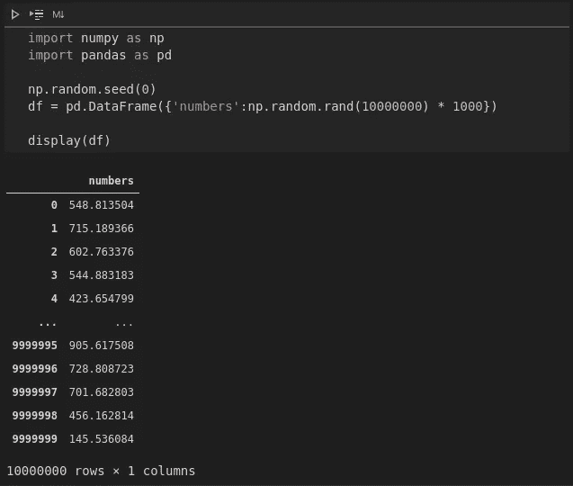
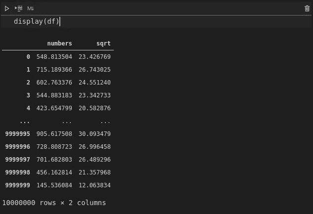
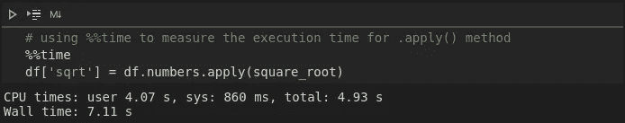
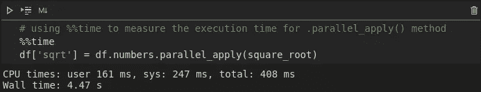
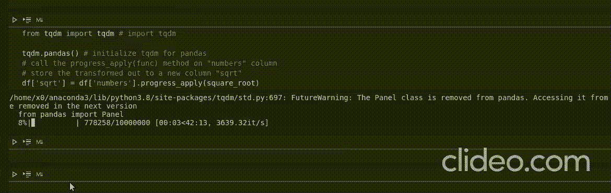

# 2 apply()方法您应该尝试的替代方法

> 原文：<https://medium.com/analytics-vidhya/2-apply-method-alternatives-you-should-try-909f3f06cec6?source=collection_archive---------3----------------------->

## 速度和显示你的熊猫系列操作的进展。


由 [Markus Spiske](https://unsplash.com/@markusspiske?utm_source=medium&utm_medium=referral) 在 [Unsplash](https://unsplash.com?utm_source=medium&utm_medium=referral) 上拍摄的照片

在这篇文章中，我将举例说明熊猫系列`.apply()`方法的两种替代方法。

## 先决条件

本文假设读者对 Python 编程和 Pandas 有基本的了解。

# 熊猫系列。apply()方法

如果您不知道 Pandas series `.apply()`方法是做什么的，这是一种遍历 Pandas series 中的数据行的有效方法。`.apply()`方法遍历熊猫系列，对熊猫系列中的每一项执行给定的函数。这个方法的行为类似于 python 默认的`map()`函数。

因为这篇文章不是关于熊猫系列`.apply()`的方法，我们将直接跳到替代方案。如果你想了解更多关于熊猫系列`.apply()`的方法，请查看下面的链接:

*   【熊猫医生】([https://pandas.pydata.org/docs/reference/api/pandas.Series.apply.html](https://pandas.pydata.org/docs/reference/api/pandas.Series.apply.html)
*   [数据营]([https://www.datacamp.com/community/tutorials/pandas-apply](https://www.datacamp.com/community/tutorials/pandas-apply))

# 可供选择的事物

本文中我们将看到的两种替代方法是`.parallel_apply()`方法和`.progress_apply()`方法。

*   `.parallel_apply()`如果你想加快一点速度的方法(用于多重处理)
*   `.progress_apply()`方法，如果你想显示熊猫系列操作的进度。

# pandarallel 的 parallel_apply()

使用 Pandas `.apply()`方法的主要目的是加快运算速度，避免使用循环来迭代数据，但是您可以通过使用`.parallel_apply()`方法将运算分布到计算机中的所有 CPU 上来使 Pandas 运算运行得更快。

Pandarallel 是一个简单有效的工具，可以在所有可用的 CPU 上并行执行 Pandas 操作。

**来自文件的注释**；


简单地说，只有在处理大型数据集时才需要 pandarallel。

## 装置

```
$ pip install pandarallel
```

## 使用。parallel_apply()

*   要使用`.parallel_apply()` 方法，只需使用`from pandarallel import pandarallel`导入**panda parallel**。
*   使用`pandarallel.initialize()`导入**panda parallel**后初始化。
*   用`.parallel_apply()`替换代码中的`.apply()`方法。

## 例子

在本例中，我们将使用随机生成的 10，000，000 个数据点的集合。目标是得到数据集中每个数字的平方根。



为我们的数据集生成随机数

```
from pandarallel import pandarallel # import pandarallel
pandarallel.initialize() # initialize pandarallel

# define the funtion you want to apply on the pandas series
def square_root(x):
  """ Return the square root of x """
  return x**0.5

# call the parallel_apply(func) method on "numbers" column
# store the transformed out to a new column "sqrt"
df['sqrt'] = df['numbers'].parallel_apply(square_root)
```

在我们生成的数据集上运行上述代码会产生以下输出。



运行程序后的输出

从下面的图片中，您会看到`.parallel_apply()`方法的执行时间比`.apply()`方法要短。



# tqdm 中的 progress_apply()

如果您想在执行 Pandas 系列操作时显示进度指示器，请使用`.progress_apply()`方法。 **progress_apply()** 方法是最初创建的 **tqdm** 包的一部分，它使您能够创建一个进度表，并估计迭代的“完成时间”。

## 装置

```
$ pip install tqdm
```

## 使用。progress_apply()

*   使用`from tqdm import tqdm` 简单地导入 **tqdm** 。
*   使用`tqdm.pandas()`为熊猫初始化 **tqdm** 。
*   用`.progress_apply()`替换代码中的`.apply()`方法。

## 例子

```
from tqdm import tqdm # import tqdm

tqdm.pandas() # initialize tqdm for pandas
# call the progress_apply(func) method on "numbers" column
# store the transformed out to a new column "sqrt"
df['sqrt'] = df['numbers'].progress_apply(square_root)p
```

在我们生成的数据集上运行上述代码会显示以下输出:



# 结论

在本文中，我们已经讨论了两种替代方法，根据您要解决的问题，您可以使用 Pandas 系列的`**.**apply**()**` 方法。`parallel_apply()`如果你想加速你的熊猫操作，以及`progress_apply()`如果你想显示你的熊猫操作的进度表。

建议只有在处理非常大的数据集时才使用`parallel_apply()`。

# 信用

*   【熊猫医生】([https://pandas.pydata.org/docs/reference/api/pandas.Series.apply.html](https://pandas.pydata.org/docs/reference/api/pandas.Series.apply.html)
*   [数据营]([https://www.datacamp.com/community/tutorials/pandas-apply](https://www.datacamp.com/community/tutorials/pandas-apply))
*   和平行的文件([https://github.com/nalepae/pandarallel](https://github.com/nalepae/pandarallel))
*   [S[tack overflow](https://stackoverflow.com/a/34365537)([https://stackoverflow.com/a/34365537](https://stackoverflow.com/a/34365537)
*   [https://towards data science . com/progress-bars-in-python-and-pandas-f 81954d 33 BAE](https://towardsdatascience.com/progress-bars-in-python-and-pandas-f81954d33bae)