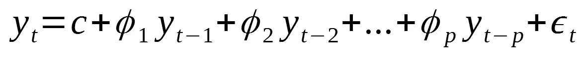
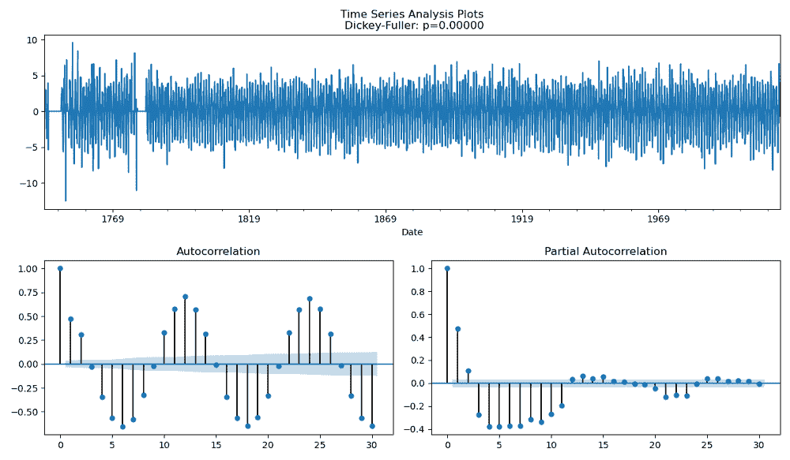

# 2-时间序列中的计量经济学和统计模型

> 原文：<https://medium.com/analytics-vidhya/2-econometric-statistical-models-in-time-series-7b69ae3ab1d8?source=collection_archive---------2----------------------->


科技日报在 [Unsplash](https://unsplash.com?utm_source=medium&utm_medium=referral) 上拍摄的

> **更新**:这篇文章是我探索时间序列的系列文章的一部分。查看完整系列:[第 1 部分](/analytics-vidhya/1-introduction-to-time-series-5ae663c468f4)，第 2 部分，[第 3 部分](https://ertuncogulcan.medium.com/3-time-series-forecasting-using-lstm-e14b93f4ec7c)。

## 介绍

我有佛罗里达自 1743 年以来的月平均气温，我在上一篇文章中讨论过。在这篇文章中，首先我将解释一些基本的模型和它们的定义，并向你展示在这个数据集上使用 ARIMA、萨里玛等模型进行时间序列的基本操作。

# 别跟我解释，出示代码

你可以在这里访问 GitHub repo。

## AR(p):自回归

通过线性组合先前时间步长的观测值进行估计。
适用于没有趋势性或季节性的单变量时间序列。
p:延时。如果 p = 1，意味着模型是用前面的时间步建立的。


## 马(问):移动平均

估计是用在先前时间步骤中获得的误差的线性组合来完成的。
适用于没有趋势性或季节性的单变量时间序列。
q:是延时数。


## ARMA(p，q) = AR(p) +MA(q)自回归移动平均

结合 AR 和 MA 方法。
使用历史值和过去误差的线性组合进行估计。
适用于没有趋势性或季节性的单变量时间序列。
p 和 q 是延时数。p 为 AR 模型 q 为 MA 模型。


## ARIMA(p，d，q):(自回归综合移动平均线)



ARIMA 模型用于查看时间序列数据并对未来进行预测。常用的用法是 Arima (p，d，q)。p 用于自回归(ar (p))部分，d 表示数据序列有多少次不同。(之前的数据减去每个数据得到的新序列)最后，q 用于移动平均(ma (q))部分。在这种情况下，Arima (1，0，0)和 ar (1)是相同的。
arima (0，0，1)和 ma (1)相同。

**如果要一步步总结:**

*   通过观察值和不同于先前时间步长的误差的线性组合进行估计。
*   它适用于单变量趋势数据，但不适用于季节性数据。
*   p:实际值延迟数(自回归程度)
    -如果 p = 2，则在 yt-1 和 yt-2 模型中。
*   d:不同操作的数量(差异程度，I)
*   q:误差延迟数(移动平均度)
*   被关注是什么意思？
    ——比如就是把今天和前一天的值相减。
*   发现过程有什么作用，为什么我们会被注意到？
    -稳定级数。
*   稳定系列是什么意思？
    -消除序列的统计属性随时间变化的情况。
*   可以理解，在这里取差的过程创造了在现在流行的系列中进行预测的机会。

## SARIMA (p，D，q) (P，D，Q)m:(季节性自回归综合移动平均)


这是一种特别用于时间序列分析的方法，用于解释和预测数据。除了 Arima 模型之外，在季节性数据中使用的参数可能比净化模型多 3 个。这些参数是自相关、差异等。季节性数据。是价值观。

**如果要一步步总结:**

*   ARIMA +是季节性
*   它可用于包含趋势和季节性的单变量序列。
*   p，d，q 是来自 ARIMA 的参数。趋势元素*。ARIMA 能够模拟这一趋势。
*   P:实际值延迟数(自回归程度)
    -如果 P = 2，则在 yt-1 和 yt-2 模型中。
*   d:不同交易的数量(差异程度)
*   q:误差延迟数(移动平均度)
*   如果 q = 2，则在 et-1 和 et-2 模型中。
*   p，D，Q 季节滞后数。季节元素。
*   m 单个季节周期的时间步长数。它表达了季节性的结构。

## 0.数据准备

首先，我们将我们的数据划分为 Arima 模型的训练/测试。与前一篇文章一样，在将 1995 年之前发现的数据确定为训练集时。

```
train = florida[:"1994-12-01"]
len(train)
test = florida["1995-01-01":]
len(test)
```

## 1.Arima 模型

作为第一步，我们建立一个基本的 Arima 模型，并查看我们的测试误差，而不应用任何调整操作。

```
arima_model = ARIMA(train, order = (1,0,1)).fit(disp=0)
arima_model.summary()

y_pred= arima_model.forecast(225)[0]
mean_absolute_error(test, y_pred)
# 4.39981
```

在视觉化方面，我想象 1985 年后的场景，以获得舒适清晰的视觉效果。

```
train["1985":].plot(legend=True, label = 'TRAIN')
test.plot(legend=True, label = 'TEST', figsize = (6,4))
pd.Series(y_pred, index=test.index).plot(legend=True, label = 'Prediction')
plt.title("Train, Test and Predicted Test")
plt.show()
```


如你所见，我们的猜测似乎不太好。所以我们来做一个调音过程。

有两种常用的技术来优化这些统计模型。首先，根据 ACF 和 PACF 图确定模型等级。第二，基于 AIC 统计量确定模型等级。

## 1.1 根据 ACF 和 PACF 图确定模型等级

```
def acf_pacf(y, lags=30):plt.figure(figsize=(12, 7))layout = (2, 2)ts_ax = plt.subplot2grid(layout, (0, 0), colspan=2)acf_ax = plt.subplot2grid(layout, (1, 0))pacf_ax = plt.subplot2grid(layout, (1, 1))y.plot(ax=ts_ax)# Durağanlık testi (HO: Series is not Stationary. H1: Series is Stationary.)p_value = sm.tsa.stattools.adfuller(y)[1]ts_ax.set_title(‘Time Series Analysis Plots\n Dickey-Fuller: p={0:.5f}’.format(p_value))smt.graphics.plot_acf(y, lags=lags, ax=acf_ax)smt.graphics.plot_pacf(y, lags=lags, ax=pacf_ax)plt.tight_layout()plt.show()acf_pacf(florida)
```


这里我们试图给图表中的 p 和 q 值一个更好的值。

在这里，它是为了查看 ACF 图和时间序列中先前时段的值之间的相关性。在这里，我们看到滞后值为 30 的事务。

所以我们在看 yt-1，yt-2，…延伸到 yt-30。

在图中浅蓝色区域剩余的点上，自相关并不显著，我们有许多有意义的自相关，但很少有无意义的自相关。

如果要简单总结一下:

-这意味着如果 **ACF 宽度****根据延迟减少**，并且 **PACF p** 是延迟 **AR (p)** 后的**截止**图案。

-如果 **ACF 宽度 q** 延迟后为**切断**，且 **PACF 宽度****根据延迟减少**，则表示是 **MA (q)** 图案。

-如果 **ACF** 和 **PACF 的宽度根据滞后减少**，则表示是 **ARMA** 型号。

```
df_diff = florida.diff()df_diff.dropna(inplace=True)acf_pacf(df_diff)
```



我们很容易在自相关中看到季节性。从这种视觉技术中，我们看不到有助于确定分数的分数。

**2 根据 AIC & BIC 统计**确定模型等级

现在，我们正试图通过在我们确定的范围内尝试所有组合来找到最佳参数，以找到能给我们带来最佳结果的值。

```
# Generation of combinations of p and q

p = d = q = range(0, 4)
pdq = list(itertools.product(p, d, q))

def arima_optimizer_aic(train, orders):
    best_aic, best_params = float("inf"), None

    for order in orders:
        try:
            arma_model_result = ARIMA(train, order).fit(disp=0)
            aic = arma_model_result.aic
            if aic < best_aic:
                best_aic, best_params = aic, order
            print('ARIMA%s AIC=%.2f' % (order, aic))
        except:
            continue
    print('Best ARIMA%s AIC=%.2f' % (best_params, best_aic))
    return best_params

best_params_aic = arima_optimizer_aic(train, pdq)
```


通过将我们发现的最佳值添加到我们的 ARIMA 模型中，我们创建了我们的调整模型。

```
arima_model = ARIMA(train, best_params_aic).fit(disp=0)
y_pred = arima_model.forecast(225)[0]
mean_absolute_error(test, y_pred)
# 1.4470
```


当我们可视化我们调优的模型时，我们可以说，与之前的模型相比，我们有一个非常成功的模型结果。

## 2.萨里玛模型

首先，我们已经执行了这一步，因为我们需要在数据集中创建一个验证。

```
from statsmodels.tsa.statespace.sarimax import SARIMAX

train = florida[:"1994-12-01"]
len(train)
test = florida["1995-01-01":]
len(test)
val = train["1991-01-01":]
len(val)
```

**2.1 基本型号**

我们将使用名为 SARIMAX 的函数来实现这一点。

```
model = SARIMAX(train, order=(1,0,1), seasonal_order=(0,0,0,12))
sarima_model = model.fit(disp=0)
```

**2.2 验证错误**

```
pred = sarima_model.get_prediction(start = pd.to_datetime('1991-01-01'),dynamic=False)
pred_ci = pred.conf_int()

y_pred = pred.predicted_mean
mean_absolute_error(val, y_pred)
# 1.9192
```

**2.3 验证预测可视化**


与基本模型相比，我们的验证错误看起来相当不错。

**2.4 测试错误**

```
y_pred_test = sarima_model.get_forecast(steps=225)
pred_ci = y_pred_test.conf_int()
y_pred = y_pred_test.predicted_mean
mean_absolute_error(test, y_pred)
# 17.0051
```

我们看到我们的真实误差现在相对较高。如果我们认为这是实际分数，那么我们在上一步中看到的低验证错误可能表示过度拟合。

**2.5 预测可视化**


我们可以看到图表有多糟糕。

**2.6 模式调谐**

```
p = d = q = range(0, 2)
pdq = list(itertools.product(p, d, q))
seasonal_pdq = [(x[0], x[1], x[2], 12) for x in list(itertools.product(p, d, q))]

def sarima_optimizer_aic(train, pdq, seasonal_pdq):
    best_aic, best_order, best_seasonal_order = float("inf"), float("inf"), None
    for param in pdq:
        for param_seasonal in seasonal_pdq:
            try:
                sarimax_model = SARIMAX(train, order=param, seasonal_order=param_seasonal)
                results = sarimax_model.fit(disp=0)
                aic = results.aic
                if aic < best_aic:
                    best_aic, best_order, best_seasonal_order = aic, param, param_seasonal
                print('SARIMA{}x{}12 - AIC:{}'.format(param, param_seasonal, aic))
            except:
                continue
    print('SARIMA{}x{}12 - AIC:{}'.format(best_order, best_seasonal_order, best_aic))
    return best_order, best_seasonal_order

best_order, best_seasonal_order = sarima_optimizer_aic(train, pdq, seasonal_pdq)
```

在这里，由于变量过多，我们试图保持较小的范围(2)。您可以增加范围。后来，我们写了 12，因为我们知道季节周期。


**2.7 最终模型及其测试误差**

```
model = SARIMAX(train, order=best_order, seasonal_order=best_seasonal_order)
sarima_final_model = model.fit(disp=0)
###############################
### Final Model Test Error ###
###############################

y_pred_test = sarima_final_model.get_forecast(steps=225)
pred_ci = y_pred_test.conf_int()
y_pred = y_pred_test.predicted_mean
mean_absolute_error(test, y_pred)
# 1.013578872841977
```

**2.8 最终模型的可视化**


**2.9 基于 MAE 的 SARIMA 优化器**

我们根据 AIC 优化了模型，但我们也可以根据梅这样做。为此，我想在这里多开一节来展示一下。

```
def fit_model_sarima(train, val, pdq, seasonal_pdq):
    sarima_model = SARIMAX(train, order=pdq, seasonal_order=seasonal_pdq).fit(disp=0)
    y_pred_val = sarima_model.get_forecast(steps=48)
    y_pred = y_pred_val.predicted_mean
    return mean_absolute_error(val, y_pred)

fit_model_sarima(train, val, (0, 1, 0), (0, 0, 0, 12))

p = d = q = range(0, 2)
pdq = list(itertools.product(p, d, q))
seasonal_pdq = [(x[0], x[1], x[2], 12) for x in list(itertools.product(p, d, q))]

def sarima_optimizer_mae(train, val, pdq, seasonal_pdq):
    best_mae, best_order, best_seasonal_order = float("inf"), float("inf"), None
    for param in pdq:
        for param_seasonal in seasonal_pdq:
            try:
                mae = fit_model_sarima(train, val, param, param_seasonal)
                if mae < best_mae:
                    best_mae, best_order, best_seasonal_order = mae, param, param_seasonal
                print('SARIMA{}x{}12 - MAE:{}'.format(param, param_seasonal, mae))
            except:
                continue
    print('SARIMA{}x{}12 - MAE:{}'.format(best_order, best_seasonal_order, best_mae))
    return best_order, best_seasonal_order

best_order, best_seasonal_order = sarima_optimizer_mae(train, val, pdq, seasonal_pdq)

model = SARIMAX(train, order=best_order, seasonal_order=best_seasonal_order)
sarima_final_model = model.fit(disp=0)

y_pred_test = sarima_final_model.get_forecast(steps=225)
pred_ci = y_pred_test.conf_int()
y_pred = y_pred_test.predicted_mean
mean_absolute_error(test, y_pred)
# 0.92
```


# 参考

[1][https://www.veribilimiokulu.com](https://www.veribilimiokulu.com/bootcamp-programlari/veri-bilimci-yetistirme-programi/)

[2][https://www . analyticsvidhya . com/blog/2020/10/how-to-create-an-ARIMA-model-for-time-series-forecasting-in-python/](https://www.analyticsvidhya.com/blog/2020/10/how-to-create-an-arima-model-for-time-series-forecasting-in-python/)

[3]https://www.statisticssolutions.com/time-series-analysis/