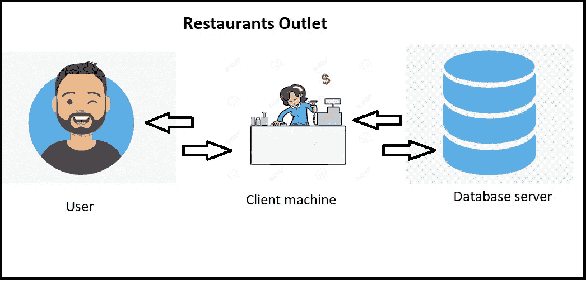
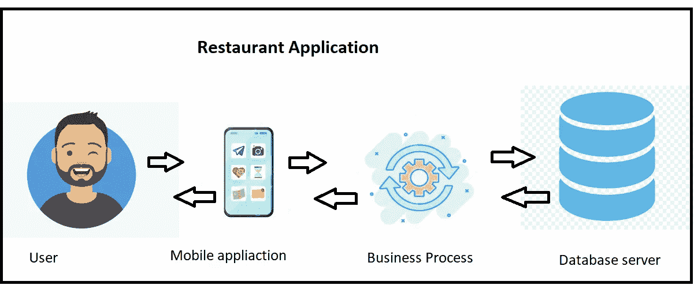

# 2 层和 3 层数据库架构

> 原文：<https://medium.com/analytics-vidhya/2-tier-and-3-tier-database-architecture-6005c6527ee4?source=collection_archive---------4----------------------->

数据库架构是数据库管理系统的设计。DBMS 有三种设计类型:一层、二层和三层。

> **1 层-** 用户可以直接使用数据库存储数据。它可以用于本地开发。

用户和应用程序并不总是可以直接使用 DBMS 来访问和存储数据。

所以我们将只关注两种类型的架构。

# 双层

想象你去一家餐馆。你去柜台点一份新鲜的披萨。柜台上的人帮你点菜，并给你收据。

你甚至没有注意到，你只是见证和 2 层架构的数据库管理系统。

在 2 层中只有两层

1.  客户端层(应用层)。
2.  数据库服务器。

客户端层保存应用程序并与数据库通信。在我们的例子中，它是计数器人。用户与数据库没有通信。

优势

1.  有限的用户。只有经过授权的人才能与数据库通信。
2.  维护费用低。

不足之处

1.  扩展性低。
2.  安全性低。机器直接与数据库交互。

# 三层

为了克服 2 层中的安全性和可扩展性，我们提出了一种新的解决方案 3 层架构，即 3 层架构。

我们已经将客户端层分解为两层

第一个是 GUI 或移动应用程序，第二个是业务流程。

GUI 层为最终用户与数据库服务器交互提供了一个图形用户界面。

对于最终用户来说，GUI 层是数据库系统，而最终用户对客户机层和数据库服务器一无所知。

优势

1.  可扩展性。
2.  提高安全性。

不足之处

1.  高维护。

# 最后的想法

当今世界非常需要可伸缩性和安全性，这就是为什么大多数人正在转移/使用三层架构。随着用户数量的增加，维护成本也会增加，但更多的用户肯定会增加更多的利润。