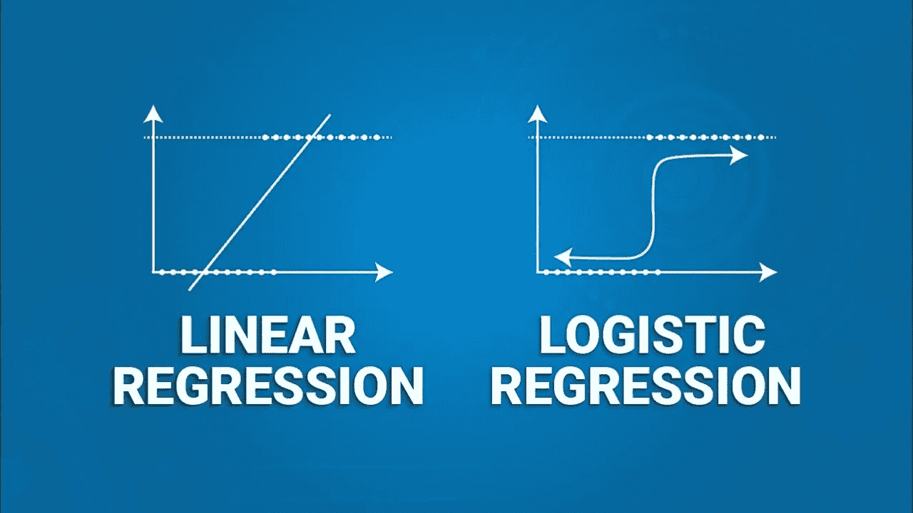

# 20 个关于线性回归和逻辑回归的面试问题

> 原文：<https://medium.com/analytics-vidhya/20-interview-questions-on-linear-regression-and-logistic-regression-ef4d341d2805?source=collection_archive---------0----------------------->

# 1.模型开发过程中的数据挑战是什么？

观察数据-缺失值和异常值

混合测量尺度——名义、顺序、间隔和比率

高维度-大量预测值

罕见目标事件-不平衡数据集

# 2.模型开发过程中的分析挑战是什么？

非线性-X 和 Y 之间的关系是非线性的。因此很难建模

模型选择-选择了最精确的模型，但它可能是过度拟合的

# 3.线性回归和逻辑回归有什么区别？

结果

o 线性回归—响应的条件均值介于–INF 和+inf 之间

o 逻辑回归——响应的条件均值介于 0 和 1 之间

关系

o 线性回归——自变量和因变量之间的线性关系

o 逻辑回归——自变量和因变量的对数优势之间的线性关系

错误

o 线性回归—正态随机误差

o 逻辑回归-没有随机正态误差，但有二项式误差(P * (1-P))

估计方法

o 线性回归——普通最小二乘法(OLS)

o 逻辑回归—最大似然估计法(MLe)

# 4.什么是逐步选择法？

向前—从零个变量开始。如果添加了一个变量，那么它会留在模型中，即使它以后变得无关紧要。

向后—从所有变量开始。如果一个变量被删除，那么它就不能包含在模型中。

逐步—包括向前和向后选择方法的各个方面。当不能在模型中添加或删除变量时，它终止。

# 5.线性回归的假设有哪些？

自变量和因变量的线性

误差应正态分布，平均值为零

误差具有相等的方差

错误是独立的

# 6.如何惩罚模型中的额外变量？

信息价值(AIC、BIC 和 SBS)——每个矩阵对附加变量有不同的惩罚，并试图最小化无法解释的方差。最小的信息值是优选的。

调整后的 R-Sq —当添加更多变量时，R-Sq 增加，Adj R-Sq 考虑了额外的变量。优选较大的可调 R-Sq

# 7.最大似然法是什么？

最有可能的估计参数

Logit (p) = b0 + b1 x1 + b2 x2 +… + bn xn

其中，Logit (p) = LN(p / (1-p))

如果 x1 改变了 1 个单位，那么赔率的变化是(e^b1)-1

# 8.优势比意味着什么？

优势比(OR)总是在 0 和无穷大之间

如果 OR = 1，则没有关联

OR > 1，分子中的组具有更高的事件

或者< 1，分母中的组具有更高的事件

# 9.如何决定逻辑回归输出的截止值？

精确度—截止值，使精确度达到最大。这里用的是混淆矩阵，真阴性(实际= 0，预测= 0)，假阴性(实际= 1，预测= 0)，假阳性(实际= 0，预测= 1)，真阳性(实际= 1，预测= 1)。

业务—利润最大化的截止日期

# 10.用于检查逻辑回归性能的关键矩阵是什么？

统计——它代表模型的一致性。它是有事件的观察值大于无事件的观察值的概率。

准确性—(真阳性+真阴性)/总病例数

错误率—(假阳性+假阴性)/总病例数

灵敏度—真阳性/总实际阳性

特异性—真阴性/总实际阴性

正预测值-真阳性/总预测阳性

负预测值-真负值/总预测负值

KS——它衡量累积好与累积坏之间的距离。最大距离是 KS。

AUCROC 衡量模型在所有临界值的表现。y 轴表示灵敏度，x 轴表示特异性

增益图—y 轴表示正预测率，x 轴表示分配给事件的案例百分比

# 11.你如何处理丢失的值？

缺失值插补的目标是保留所有原始数据并对新案例进行评分

数字变量-用平均值或中值估算并创建缺失值指示器

分类变量-用新标签估算

回归插补—不涉及目标变量，可在两个或更多变量高度相关时使用。然而，这可能导致过度拟合、增加计算时间和增加评分工作

聚类插补——它取决于其他变量。聚类平均值用于替换丢失的数据点

# 12.什么是多重共线性？

共线是两个变量之间的关系。多重共线性是两个以上变量之间的关系。

方差膨胀因子用于识别多重共线性的存在。当多个变量试图解释方差时，会导致标准误差膨胀，从而导致模型不稳定

# 13.如何去除变量冗余？

相关矩阵和方差膨胀因子

可以使用变量聚类，并且从每个聚类中选择一个变量，使得该变量与自己的聚类变量具有高相关性，而与其他聚类变量具有低相关性

# 14.什么是有影响力的观察？

有影响力的观察对模型的某些部分有很大的影响

离群值是不寻常的数据点

为了检查有影响的异常值，应该检查数据的错误，并使用适当的建模技术。

# 15.高维度的问题是什么？

当一个分类变量有大量的标签时，它会导致准完全分离

它会影响模型的收敛，并导致错误的决策

解答-基于卡方缩减折叠类别

# 16.逻辑回归中非线性关系的问题是什么？

使用散点图。y 轴上的 Logit (LN (p/(1-p)))和 x 轴上的 x 平均值(箱)

多项式模型的使用

灵活多元函数估计量的使用

# 17.什么是互动？

当两个或多个分类变量组合在一起时

如果我们有 3 个分类变量——A、B 和 C

相互作用是— A*B、B*C、C*A 和 A*B*C

# 18.什么是联合抽样和分别抽样？

当事件和非事件的数量相等时，进行联合抽样。不适合不平衡的数据

对不平衡数据进行单独采样。对于罕见事件，当 target = 1 时，保留所有观测值，而当 target = 0 时，仅保留少量观测值。

# 19.如何校正过采样？

截距需要使用偏移量进行校正

偏移= LN((p0 * P1) / (p1 * P0))

其中，p0 为人口中非事件的比例，p1 为人口中事件的比例

P0 是样本中非事件的比例，P1 是样本中事件的比例

过采样不会影响 AUROC、灵敏度和特异性

过采样会影响增益和升力图

# 20.你如何纠正不平衡的数据？

用砝码调整样品

0 — n * p(0)

1 — n * p(1)

如果 y = 1，那么权重= p(1) / P(1)

如果 y = 0，那么权重= p(0) / P(1)