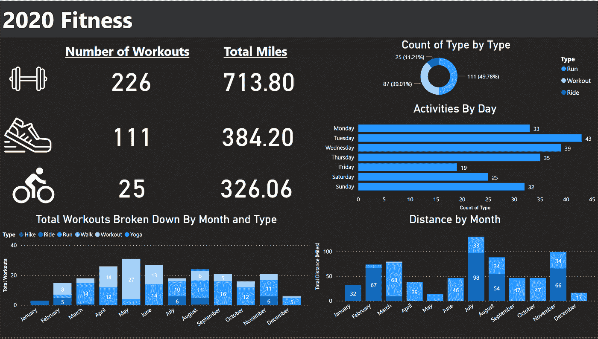

# 2020 年:数据年

> 原文：<https://medium.com/analytics-vidhya/2020-wrapped-a-year-in-dat-faad2ae8eab1?source=collection_archive---------15----------------------->

2020 年健身数据

2020.多么奇怪的一年。很少有词语可以描述过去一年的事件，但数据可以。受流行的 Spotify Wrapped 的启发，我去年创建了自己的版本。我们每天都在产生数据，而且往往是在我们不知情的情况下。技术公司利用我们的数据赚钱，不管是好是坏。我决定利用这种尚未开发的能力来分析我过去一年的数据。通过 Instagram、Spotify、Strava 和网飞等网站提取数据很简单。手动追踪(喝酒、旅行、阅读)也有帮助。我的工具是 Python，用于数据处理和机器学习，还有 Power BI，用于可视化。通过数据，我发现了 2020 年垃圾箱火灾的个人视角。

2020 旅行

**来源:**通过 Excel 手动收集数据

**总结:**我没有想到我会有这样的旅行计划，但是谁能预料到 COVID？幸运的是，在 Covid 关闭世界之前，我能挤出一个月去亚洲旅行。我探索了四个新的国家:越南、柬埔寨、泰国和阿拉伯联合酋长国。尽管有旅行限制，我还是回到了芝加哥的家，拜访了查尔斯顿、纳什维尔和基亚沃岛的朋友。

**见闻**:我一年中 68%的时间都在亚特兰大度过。在 COVID 之前，我预计这个数字不到 40%

2021 年的目标:游览 4 个新城市，出国一次

2020 年健身数据

**来源:**通过 python 进行 Web 抓取和数据操作

**总结:**在整个疯狂的 2020 年，健身让我保持理智。我想象有 70%的时间我只是离开公寓去锻炼。在隔离期间，我参加了精神错乱项目，晚上会去跑步。因为我今年没有进行任何训练，所以我的大部分跑步距离都比较短。

**感悟:**虽然我会认为疫情的最初几个月会让我无法锻炼，但这几个月是我锻炼最多的几个月。我认为发生这种情况的主要原因是坚持锻炼训练计划。

**2021 年的目标:**进行更长距离的跑步和骑行。找到一年的训练计划。如果一切恢复正常，为公路赛或铁人三项训练。

2020 年社交媒体

**来源:**用户可以从任何一个大型社交媒体平台下载自己的个人数据。Python 用于数据处理，textblob 包用于情感分析。

总结:社交媒体公司掌握的用户数据非常惊人。技术平台会记录每一次点击、搜索，并喜欢让用户迷上他们的平台。我认为这个练习很有用，因为它让我了解了我的社交媒体习惯。这些数据并不像我希望的那样有趣，因为我不喜欢经常在社交媒体上发帖。为了收集更好的数据，我打算开始喜欢这些平台上的更多帖子。

**感悟:**我在 Instagram 上喜欢一张图片的黄金时间是晚上 7 点到 9 点之间。我的推文的平均主观性是. 36/1，平均极性(正/负)是+.14。

【2021 年目标:减少在社交媒体上的时间(难以追踪)。将 Twitter 赞数增加 150%

2020 年 YouTube 数据

**来源:** YouTube 数据下载和 Python 操作

**总结:**互联网最好的东西之一就是 YouTube。YouTube(和所有谷歌产品)允许你下载你的数据。虽然你看不到你看了多长时间的视频，但你可以知道你点击视频的次数。2019 年，我浪费了太多时间在 YouTube 上看 3871 个视频。今年，我减少了 48%观看的视频。一些顶级频道仍然存在(SNL，Yes Theory，ONE Media)，但数据科学，冥想和健身视频有所增加。去年的数据开始了一个积极的趋势，有意识地改变我与 YouTube 的互动方式。2020 年的数据只会加强建立良好习惯的基础。

**见解:**我看过的视频中，有 11%包含了表示某部电影或电视节目的“预告片”一词。接下来的大类是“SNL”和“data ”,各占 3%左右。

**2021 年目标:**垃圾视频少，YouTube 教育视频多。

2020 阅读

**来源**:多年保存的人工谷歌表

**总结:**我一直都抽时间看书。即使引入了繁忙的工作时间表，这种情况也没有改变。除了两部重读的《人类寻找意义》和《了不起的盖茨比》( T21)之外，今年其他受欢迎的作品还包括《如何做笔记》( T22)、《解决市场问题的人》( T23)和《Anathem》。

科幻小说的评分最高，为 4.71。商业书籍的评分最低，为 3.36 分。这加强了我的理解，大多数关于这个主题的书都是垃圾！

2021 年的目标:平均得分为 4.0。读 12 本有声读物。

2020 年外出就餐

**来源:**通过 Mint 和 Python 数据操作的信用卡交易数据

**总结:**这是一个外出就餐的怪异年份。餐饮业是受 COVID 打击最严重的行业之一。我把外出就餐定义为我订购外卖、买咖啡或去餐馆/酿酒厂的任何时候。在无法出门的一年里，UberEats 是我的首选，这并不令人惊讶。与去年相比，我在外面吃饭的次数减少了。当然，我在外面吃饭平均每单都要贵一点。

**见解:**我去过的餐厅中，35%是新的。我想看到明年的增长。

【2021 年的目标:我去的餐馆中有 40%是新的。降低每餐的平均花费。

**来源:** Python 网页抓取，手动跟踪

2020 流媒体

**总结:**由于 COVID 和适当的庇护，我看电视的时间增加了。我倾向于不看电视，但 COVID 导致这种情况增加。我喜欢我看过的所有节目，迫不及待地想看到它们的新一季(《巫师》、《泰德·拉索》、《男孩》等)。)

见解:**网飞在我的名单上占据了主导地位，这让我很惊讶。在我个人 64%的市场份额中，网飞拥有最好的节目选择。2021 年可能是其他流媒体服务最终赶上的一年。**

**目标:**找 3 个新节目看。

2020 睡觉

**来源:**来自 AutoSleep、Apple Health 和 Sleep Cycle 的 CSV 下载。组合数据集的 Python 操作。

**总结:**几年前看了*我们为什么要睡觉*之后，我就把睡觉列为优先事项。今年，我决定开始跟踪睡眠，以帮助我表现得更好。在一周的前几天，我往往睡眠不足，这似乎会导致一些问题。通过跟踪我的睡眠，我更有意识地增加每天的睡眠时间。

**见解:【COVID 三月份第一次来袭时平均睡眠最低(前两个月的数据都是垃圾)。我不太清楚这两款应用的“睡眠质量”是如何确定的，但我觉得这很奇怪。**

**目标:**睡眠质量提高 5%。

2020 年的饮料

**来源:**聊天机器人短信追踪绑定在谷歌表单上

我今年参与的一个项目是构建一个聊天机器人，它可以帮助我通过 SMS 更容易地跟踪指标。我决定每次我喝饮料(水、咖啡、酒精等)时。)我会记录一杯饮料。这有时有点困难(尤其是酒精),但我认为这对理解一些习惯是有效的。

**感悟:**下午 2 点后我意识到我的咖啡消耗量比预期的要高。因此，我现在午饭后只喝一杯咖啡。

目标:增加 25%的用水量

**来源:** Spotify 数据，Spotify Web API + Python 数据操作

**总结:**9 月底，我从苹果播客转到了 Spotify。有了 Spotify，我可以跟踪我的播客消费(很难检索到苹果的数据是好是坏)。我非常喜欢播客，所以看到我的播客行为很令人兴奋。我喜欢采访播客，如*、蒂姆·费里斯秀*、*像最好的人一样投资*和*富人滚动播客*。

**见解:**播客消费与工作时间成反比。消费随着工作日的减少而减少，周五是个例外。

**目标:**发现新的 3 个播客。

**来源:** Spotify 数据，Spotify Web API，数据操作用 Python，K 近邻用 Sklearn

**总结:**每个人都喜欢把自己包装好的 Spotify 分享给所有的朋友。你分享的 Instagram 故事背后隐藏着什么？我决定更深入地研究这些数据，以便更好地了解香肠是如何制作的。Spotify 提供了一个神奇的 API 来检索特定歌曲特征的数据。特征包括速度、能量、语速和其他特征。我实现了 K 近邻聚类算法，将我播放过的所有歌曲分组在一起。

**见解:**我平均每天花 2.91 个小时听 Spotify。时间太多了！我听 Spotify 的时间与我的工作日程完全吻合。午餐和晚餐时的剧烈休息也显示在左下方的图表中。另一个有趣的发现是节奏。我的歌曲的平均节奏是 116。我演奏最多的歌曲的速度在 100 左右，这表明我可能更喜欢节奏较慢的歌曲。

目标:使音乐多样化

# **结论**

2020 年是疯狂的一年。在年底花时间分析我的数据是美妙的，但还有更多要实现。我为 2021 年制定的一项重大计划是对我的数据进行更持续的监控。正如彼得·德鲁克所说，“可以衡量的就可以管理。”没有适当的目标和系统，跟踪数据有什么意义？我想对我的数据安装更多的自动监控，以达到我 2021 年的目标。通过自动化，我可以增加时间进行更有趣的分析实验。我想为我的数据构建“一个环来管理所有数据”。我想集中我的数据来源，找到相关性，并根据我的习惯发现数据驱动的建议。通过统一我的数据，提高我的性能的潜力是无限的。谢谢你读到最后，我希望 2021 年比 2020 年对我们更好！