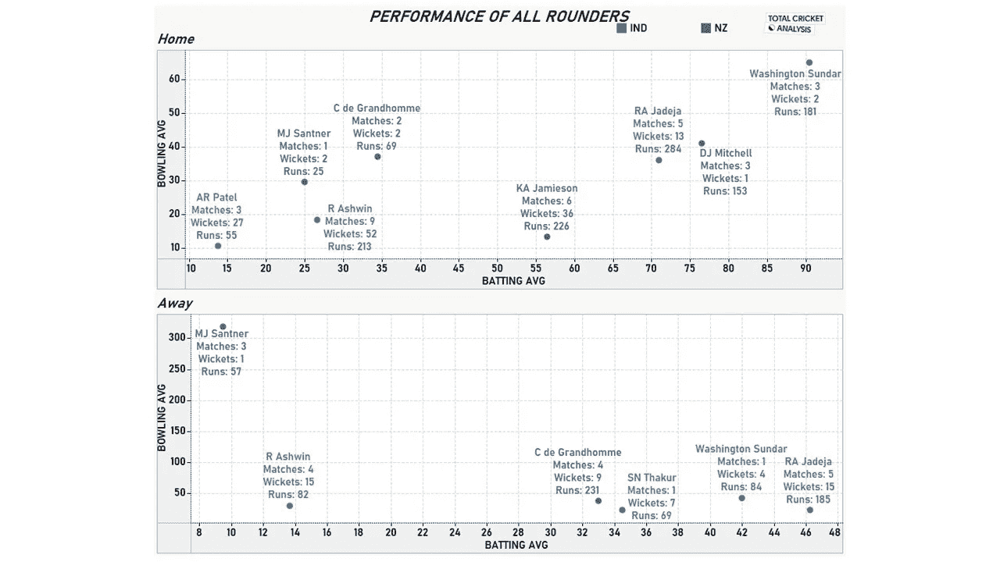

# 2021 年 ICC 世界测试锦标赛决赛:印度 vs 新西兰——数据分析

> 原文：<https://medium.com/analytics-vidhya/2021-icc-world-test-championship-final-india-vs-new-zealand-data-analysis-2d2e026c277f?source=collection_archive---------10----------------------->

2021 年国际刑事法院世界测试锦标赛决赛将于 2021 年 4 月 18 日在南安普顿汉普郡板球场举行。经过两年在 **27** 系列的 **71** 测试赛之后，世界前九测试队中，印度高居榜首，纽西兰紧随其后。

虽然前者在赢得三场比赛并锁定对英国的系列赛后轻松预定了自己的席位，但后者有点幸运，因为出于安全考虑，澳大利亚推迟了在新冠肺炎疫情的南非之旅。话虽如此，黑帽队是唯一一个粉饰并在本届锦标赛中战胜印度队的球队。总的来说，两个队之间一场激动人心的比赛已经准备就绪。

在这一分析中，我们将着眼于本次锦标赛中双方球员的表现，并使用与这一形式相关的关键指标对他们进行比较。通过这一点，我们将推断出即将到来的游戏的关键球员。

球员已经根据他们在球队中的角色进行了分类，因此将从击球手开始进行分类分析，然后是投球手，最后是全能选手。为了获得更好的见解，我们还分析了球员在主场和客场的表现。

***击球表现***

以上是击球手击球率和平均击球率的散点图。圆圈的大小显示了局数，以便更好地理解这些指标。

***首页***

凯恩·威廉姆森队长也是目前的头号击球手，是正面领导的完美典范。威廉姆森在主场的表现非常出色。他在这个赛季总共得了 736 分，其中包括两个双百分、一个百分和半个世纪的两个双百分，而这仅仅是七个局的事情。名单上的下一位是亨利·尼科尔斯，他也有很好的表现，获得了 441 分，包括两个世纪和五十个世纪。尤其是他对阵印度的战绩并不出色，但黑帽队肯定会期待他的表现，让他们在中游保持稳定。开场搭档汤姆·布伦德尔和汤姆·莱瑟姆以及罗斯·泰勒是关键球员，他们没有发挥出自己的潜力，这是黑帽队的一个轻微问题。

另一方面，印度顶级秩序的每一个击球手都为球队的击球表现做出了贡献。印度选手 Rohit Sharma 和 Mayank Agarwal 共同完成了近 1500 次比赛。Rohit 在跑步得分排行榜上名列前茅，得分 **901** 次，其中包括一个双百、**三个**百和一个五十。他是一个与众不同的球员，在这种形式下也证明了他的水平。队长( **625** 跑)和副队长( **465** 跑)以及 Cheteswar Purjara ( **387** 跑)凭借永无止境的合作和漂亮的击球统治了中产阶级。一个突出的球员是 Rishabh Pant，他在澳大利亚延续了他的状态，并在从职业生涯的艰难时期回来后确定了他在球队的位置。他有一个世纪和两个半世纪的比赛，在这种形式下，他只打了 6 局 84.11 的好球。

***消***

威廉姆森和尼科尔斯的客场战绩都很差。他们在**七局**中分别得了 **81** 和 **144** 分。在对斯里兰卡和澳大利亚的比赛中，威廉姆森两次没有扰乱记分牌，这是一个严重的问题。尽管他们的击球手平均得分都不超过 45 分，但顶级球手 BJ·沃特琳的表现相当不错。

除了 Shubman Gill、Ajinkya Rahane、Hanuma Vihari 和 Pant 之外，印度选手的表现都不好。吉尔以平均 51.80 分的成绩保持了两个世纪的记录，是所有击球手中最高的。Rahane 和 Vihari 在外国环境中表现出色，分别拥有两个世纪和三个世纪。潘特已经坚持了两个世纪，他的命中率也令人印象深刻。说到底，没有一个印度击球手在与黑帽队的比赛中表现出色，这是一个令人担忧的原因。

总的来说，印度击球的深度帮助他们在国内外的比赛中比对手表现得更好。即使不然，除了队长本人，新西兰的击球手看起来也不怎么有威胁。随着贾斯普里特·布姆拉和拉温德拉·贾德加的加入，他们必须投入更多的工作来记住印度拥有的保龄球攻击。

***保龄球表演***

以上是投球手的击球率和平均值之间的散点图。圆圈的大小显示了投球的次数，以更好地解释这些指标。

***首页***

蒂姆·索西(Tim Southee)在主场一直是黑帽队的最佳球员，因为他有能力向两个方向击球。他已经捡起了 **32 个**三柱门，其中 **14 个**以五分之差对印度。他在一场比赛中 9 次击球的最好成绩是在对印度的第一次测试中。接下来，我们有特伦特·博尔特，他总共获得了 25 次机会，其中 9 次是对阵印度，但在对阵其他球队和外国比赛中，他的表现令人惊讶。

在印度人当中，乌梅什·亚达夫在主场表现出色，仅在八局中就拿下了三分。他是快速投球手中最贵的，经济价值为 3.54 英镑，但比名单上的任何其他投球手都更频繁地捡球。默罕默德·米沙和伊桑·夏尔马是印度步伐进攻的中坚力量，他们每人都超过了 20 个三柱门。Mohammed Siraj 和 Bumrah 本赛季都没有在家里打太多的板球比赛，这解释了他们对该地块的立场。

***离去***

Southee 和 Neil Wagner 分别以 19 分和 17 分高居榜首。这对组合尤其在对阵澳大利亚的比赛中表现致命。事实上，瓦格纳的所有三柱门都碰到了澳大利亚人。谁不记得史蒂文·史密斯和瓦格纳之间的战争？后者设法辞退史密斯**四**次**五**局！与其他人相比，博尔特一直低于标准杆，然而，他在六场比赛中设法捡了九个三柱门。在纺纱工中，Ajaz Patel 很有前途，他有九个三柱门和五个五柱门。

布姆拉的客场战绩实在是太出色了。他的名下有 **30** 个三柱门(比后面的玩家多 **11** )，其中还包括**两个**五个对西印度群岛的五柱门，经济效益为 **2.77** ，是印度投球手中最好的。正当我们认为 Bumrah 有最好的数据时，Sharma 证明我们错了。尽管他的 T42 少了 14 张头皮，但他仅在 6 局中就完成了这一壮举。他在外国条件下的击球能力是首屈一指的，这在情节中显而易见。米沙和西拉杰都有超过 10 个小门以他们的名字命名，西拉杰是本赛季的发现。

当然，如果我们把 Bumrah 排除在外的话，印度的速度攻击比他们的对手略高。但是随着他的回归，攻击看起来更加致命。就纺纱而言，印度有两个高质量的纺纱工人，而新西兰却没有，这是一个巨大的差异。

***全才的表现***

以上是球员击球和保龄球平均成绩的散点图。

***首页***

凯莉·贾迈森是运动员名单中最完美的“多面手”。他在对阵印度的两局比赛中已经拿下了九个三柱门，并得了大约 100 分。他还有四张五票，一张对印度&西印度群岛，两张对巴基斯坦。我们也可以看到，印度全才中有一些认真的人才。Axar Patel 和 Washington Sundar 在各自的专业领域都表现出色。这位前选手在钦奈的首次亮相中仅投了六局就获得了五分。后者运气不佳，两次在 T21 都没能完成 100 米，但他拯救了自己的团队，使其脱离了困境。Jadeja 和 Ravichandran Ashwin 得分最多，得分最高。阿什温在仅仅 17 局中就拿下了 52 个三柱门，而且有四个五分，这简直令人难以置信。他还因为今年早些时候在对阵英格兰的比赛中的表现而获得了该系列赛的最佳球员。

**远离*远离*远离**

在国外比赛中，Colin De Grandhomme 是 blackcaps 中表现最好的球员，他有**九个**三柱门， **231** 只打了**四局**局，这使他成为这份球员名单中的最佳得分手。印度全能选手在国外的表现也令人印象深刻。Sundar 在他的首次亮相中设法捡起了四个小门并获得了 84 分。杰迪亚和阿什温都有自己的名字。除此之外，前者也是印度全能选手中得分最高的。

与黑帽相比，印度全能选手的深度和质量远超标准。然而，他们在与新西兰的比赛中表现不佳。另一方面，贾梅森在主场对阵印度的比赛中，无论是球还是球棒都给人留下了深刻的印象。达瑞·米切尔和米切尔·桑特都必须努力工作，让他们的球队有最好的机会获胜。随着贾德加伤愈复出，随后又成功参加了 IPL，印度队看起来很难过关。

***关键人物***

**罗希特·夏尔马**

Rohit 是印度在本次锦标赛中得分第二高的选手，在 17 局比赛中得了 1030 分。他在印度击球手中拥有最高的平均 64.37 分，拥有四个世纪(本赛季印度人的最高分)和两个半世纪。然而，在这种形式下，他面对右臂步速投球手的平均得分只有 **27.54** 。除此之外，他还在本赛季六次成为左臂旋转手的猎物，这可能有利于帕特尔和桑特-他们将试图在这种形式的第三次中击败他。拥有像 Southee 和 Boult 这样优秀的摇摆投手，blackcaps 应该尽快得到他。除此之外，Rohit 在欧洲打板球测试赛方面相当缺乏经验，在这场比赛之前只打了一场比赛。

阿金克亚·拉汉

Rahane 是印度得分最高的选手，平均 1095 分，43.80 分。他名下有六个五十年代和三个世纪。他的数百名击球手中有两名离开了家——这是本赛季印度击球手离开家最多的一次。在科利缺席的情况下，他的队长袖标非常出色，这也是在对阵澳大利亚的系列赛中获胜的主要原因之一。继续前进，他在英格兰对阵右胳膊步行者的场均只有 **25.38** ，总体来说，是 **31.52** 。他在这个球季也努力对抗右手打者，场均仅超过 20 分。随着索西在本赛季两次击败 T42，布莱克普希望他们能再次击败他。

贾斯普里特·布姆拉

本赛季客场作战的 Bumrah 表现出色，拥有 30 个检票口，场均 21.1 个检票口(T2)。他拥有第二好的保龄球数据，在对西印度群岛的比赛中，**六个**三柱门仅送出 **27** 分 **12.1** 分。他的 9.6 的击球率是这一局中最低的，也是在对印度群岛的比赛中，他在八场比赛中得了五个三柱门，仅得了七分。在这种形式下，他与左手击球手的平均得分为 **16.11** ，而在本次锦标赛中仅为 **10.75** 。鉴于此，新西兰的主要演员-Latham 和 Nicholls 将很难面对他。此外，他还击败了新西兰最好的击球手威廉森，印度人肯定会利用他的弱点来对付邦拉。

凯恩·威廉姆森

凯恩队长是他的球队本赛季得分最多的球员，得了 817 分。就场均而言，他仅次于达里尔·米切尔，场均 58.35 分，尽管后者只打了三局。他所有的世纪都是在家里度过的，其中两个世纪是对西印度群岛和巴基斯坦的世纪。他在客场对阵右投手的平均成绩是 **27.96** 加上**五只**鸭子，本赛季低至 **9.66** 。他在与场均略高于 **4** 的 Bumrah 的比赛中表现不佳，后者在**的两场**比赛中两次将他**罚下。然而，在去年得分接近 500 分后，他继续保持他的状态，在今年早些时候对阵巴基斯坦时获得了双百分，目前是世界上最好的击球手。**

凯尔·贾米森

贾米森是新西兰本赛季表现最好的全能选手，仅在 T4 的六局 T5 中就有 36 个检票口和 226 个 T3 分。在去年对阵印度的首次亮相中，他在第**局和第**局中拿下了 Pujara、Kohli 和 Vihari 三个关键的三柱门。在接下来的比赛中，他得到了一个五分，并再次设法解雇了普哈拉。他的 49 分的关键贡献帮助新西兰缩小了与印度的差距，从那以后他的状态就越来越好。今年早些时候，他在对阵巴基斯坦的比赛中打出了他最好的 11/117 的数据，在每场比赛中，他都至少获得了四个三柱门。他还拥有队友中最好的场均 13.27 和 33.3 的**四**五分。他的击球率 **56.50** 是队里第三好的。此外，他还没有在客场比赛过，然而，他可以在即将到来的对英格兰的系列赛中在国外测试他的技术。

蒂姆·索西

Southee 在本赛季带领新西兰的步伐进攻，拥有 51 个小门，平均 20.66 个小门，有三个五分。他在一场比赛中的最佳表现是对阵印度，当时他在 **41.1** 回合中为 **110** 捡了**九个**球。在这种形式下，他拥有超过 300 个三柱门，并且在对抗平均超过 25 个的右手和左手击球手时表现同样出色。本赛季他的 31 个三柱门遇到了平均 16.09**的右撇子击球手。他的经验和在欧洲条件下向两个方向挥球的能力将是很难对抗的。Southee 在对抗关键的印度击球手方面有很好的记录——Pujara、Kohli 和 Rahane 在四场比赛中十次击败他们。**

***结论***

印度测试团队看起来像一个强大得多的一方，像自旋二人组 Ashwin & Jadeja 以及所有部门的质量和深度。然而，新西兰是本赛季唯一一支凭借高质量的保龄球表现赢得系列赛的球队。这给了他们心理上的优势，但这不足以击败世界上人数最多的测试团队。板球是一项有趣的游戏，这一切都归结于谁打得更好，谁有勇气在不断要求的游戏中生存下来。

这个时代的两个最好的击球手带领他们的球队进入了第一届 ICC 世界测试锦标赛决赛，以队长的身份赢得了他们的第一座 ICC 奖杯。在 ICC 奖杯的决赛中，新西兰第二次**面对印度。他们最后一次相遇是在 2000 年，当时由斯蒂芬·弗莱明率领的新西兰队在还剩两个球的情况下击败了印度队，赢得了他们的第一座也是唯一一座 ICC 奖杯——这要感谢克里斯·凯恩斯的辉煌世纪。历史会重演吗？让我们拭目以待。**

我喜欢这项运动，我会做大量的分析。如果你是一个有相似兴趣的人，请随时与我联系:

[https://www.linkedin.com/in/dhivyadarsangm/](https://www.linkedin.com/in/dhivyadarsangm/)