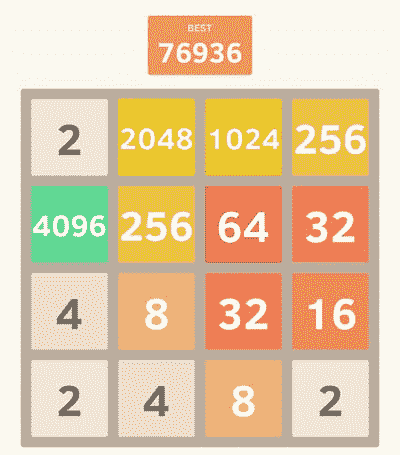

# 2048 年，蟒蛇 V1

> 原文：<https://medium.com/analytics-vidhya/2048-python-v1-2d35925c1e4d?source=collection_archive---------12----------------------->

这是 2048 年

这将是创造一个人工智能来运行游戏 2048 的过程中的一系列帖子。第一个帖子是在终端上运行 2048，下一个帖子将是可视化的，最后一个帖子将是完全实现的 AI，它将使用 minimax 来选择最佳可能性。这个项目是我和一个叫 Edwin 的学校朋友共同努力完成的，我认可他在让代码变得像…一样高效方面给了我很多帮助