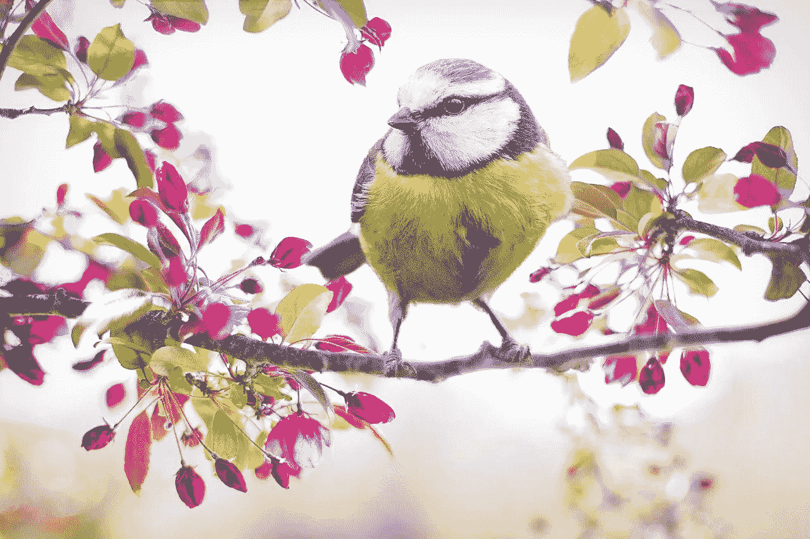

# 使用深度学习对 225 种鸟类进行分类

> 原文：<https://medium.com/analytics-vidhya/225-kinds-of-birds-classification-using-deep-learning-2b339c20ef79?source=collection_archive---------10----------------------->

## 在这篇文章中，我将谈论我今年做的一个小项目，这是一个关于如何使用深度学习模型对 225 种鸟类进行分类的 Kaggle 竞赛。

> 原文在我的博客网站 [**这里**](https://pycad.co/birds-classification-using-deep-learning/) 。

