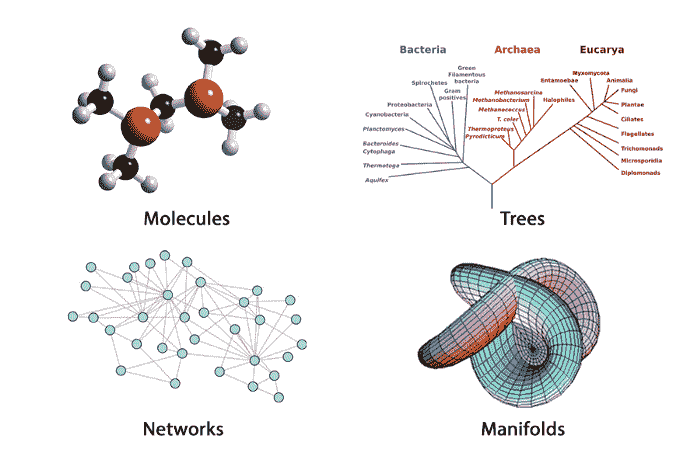
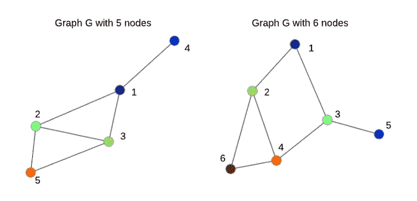

# #3 几何深度学习

> 原文：<https://medium.com/analytics-vidhya/3-geometric-deep-learning-1d4833315b9b?source=collection_archive---------15----------------------->

这是我的几何深度学习之旅(GDL)的第三篇帖子。请阅读[往期帖子](/analytics-vidhya/machine-learning-and-deep-learning-b70a85f0742b)全面了解 GDL。另外，请注意，由于我还处于初级阶段，犯错误是很自然的。如果你发现一个，请告诉我。建设性的批评总是受欢迎的。我们开始吧！

布朗斯坦等人在他们 2017 年的文章——“[几何深度学习:超越欧几里德数据](https://scholar.google.com/scholar_url?url=https://ieeexplore.ieee.org/abstract/document/7974879/&hl=en&sa=T&oi=gsb&ct=res&cd=0&d=16083123238264716705&ei=GXlqXrGmLYWtmwHg-qrIDw&scisig=AAGBfm1gRjBDiV1FG-cQyo_FQAsLM-BWNQ)”中首次引入了几何深度学习(GDL)这个术语。文章将 GDL 定义为——“试图将(结构化)深度神经模型推广到非欧几里德域(如图形和流形)的新兴技术的总称”。让我们将定义分解成更小的部分来理解单个术语——非欧几里德域、图形和流形。

## **什么是欧几里德域和非欧几里德域？它们之间有什么不同？**

绝大多数深度学习都是在*欧几里德数据*上进行的。例如，在图像处理中，我们分析在*平面*上定义的函数——使用平面向量来表示位置域有一个清晰的概念。图像可以被认为是二维平面上的函数，即 **I(x，y)** 是点 **(x，y)** 处的图像强度。如果我们需要图像在 x 方向上一个像素 **d** 单位的值，我们将计算 **I(x+d，y)** ，它是一个向量 **(d，0)** 加上 **(x，y)** 。这被称为*平移不变性*属性，对于定义图像上的卷积非常有用。

然而，情况并不总是如此，在最近几年里，人们越来越有兴趣将深度学习模型应用于*非欧几里德*数据。这种数据的一个例子是社交网络，其中分析(回归、分类等。)必须在复杂的曲面上进行，而不是像图像那样的平面。显然，很难想象一个表面模型社交网络。但是当我们把它想成一个图的时候，那么一个离散的图就可以解释成一个曲面的样本集(甚至对于#dimensions > 3)。

## **什么是图和流形？**

图是由一组节点和一组连接相关节点的边组成的数据结构。每个节点或边都可以附加属性(特征)。一些信息是固有的图形结构。而另一些则被建模为图表，以捕捉数据元素(节点)之间的关系——社会网络、家庭关系、分子结构、大脑神经元网络。

固有的图形结构化数据

图有节点、顶点和边

流形是指一条— *曲线* (1-D)，*曲面* (2-D)，或 *n-D 对象* (n > = 3)。一维流形只是一条曲线(直线或圆)。二维流形是一个曲面(平面或球面)。三维流形是一个物体(我们周围的三维空间)。一个流形处处都有相同的维数。例如，如果我们在一个球体(2-D)上附加一条线(1-D ),那么得到的几何结构是**而不是**一个流形。

## **为什么要为图和流形而烦恼？**

将输入数据重新组织为一个更好的学习参数和特征的集合，可以更容易地正式理解您的模型正在做什么，并可以获得更好的结果。有人可能会说，我们正在为我们的任务寻找最佳的信息几何——最能捕获理想的数据分布属性的几何。

## **为什么是 GDL？**

图形结构化数据的问题是传统的深度神经网络无法正确解释它。原因是这些网络大多基于卷积，卷积在*欧几里德*数据上工作得很好。由于图形被认为是*非欧几里德*数据集，它们不具有——公共坐标系统、向量空间结构和平移不变性。为了克服这些问题，并将深度神经网络推广到非欧几里德域，GDL 已经成为一个独立的研究领域，起源于深度学习和机器学习。

在下一篇文章中，我们将更深入地研究图形，以及 GDL 如何试图将卷积推广到图形结构数据。