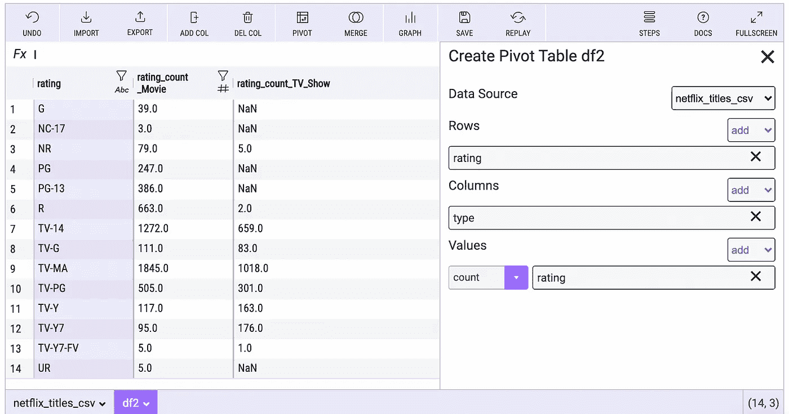
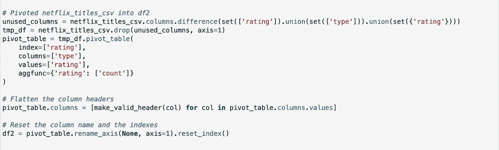
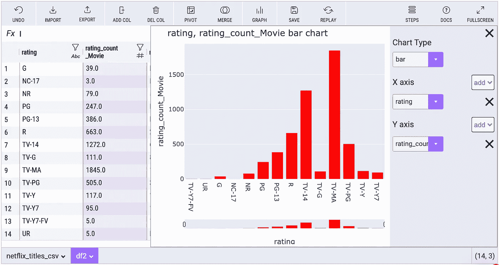
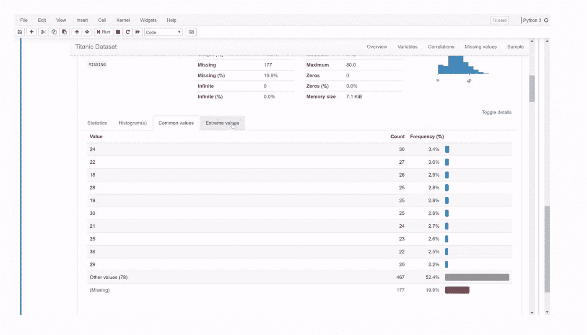
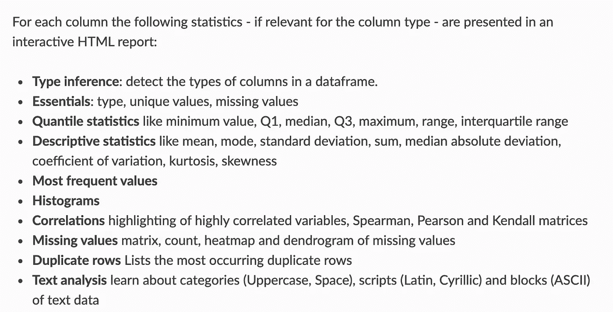
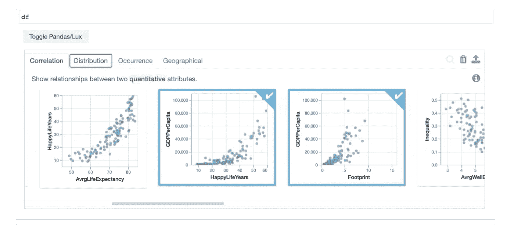
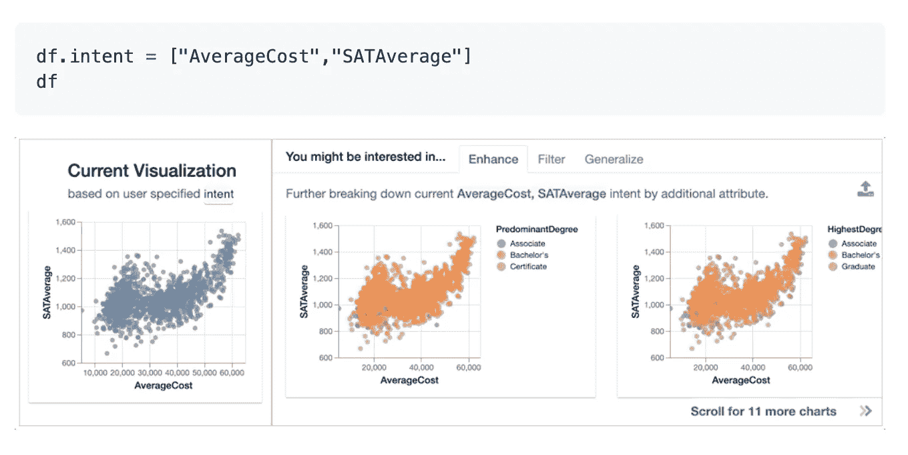

# 让数据科学变得简单的 3 个 Python 包

> 原文：<https://medium.com/analytics-vidhya/3-python-packages-that-make-data-science-simple-40744de22592?source=collection_archive---------5----------------------->

[1。米托](https://trymito.io/)

米托是 Python 的电子表格前端。你可以把米托调入你的 Jupyter 笔记本，你在前端做的每一个编辑都会生成相应的 Python。

这是一个视频演示:

要安装米托，请使用以下三个命令:

```
python -m pip install mitoinstaller
python -m mitoinstaller install
python -m jupyter lab
```

这里是完整的[安装说明](https://docs.trymito.io/getting-started/installing-mito)的链接。

米托是一个伟大的软件包切片和切块你的数据。米托允许用户只需点击几下鼠标就能创建交互式数据透视表和图表。

米托数据透视表是查看不同变量之间的关系以及以一种使洞察力更加明显的方式对数据进行分组的好方法。

通过从工具栏中选择“透视”按钮，然后选择行、列、值和汇总类型，可以配置米托数据透视表。



米托中的每次编辑都会在下面的代码单元格中生成等效的 Python。这是一种比不断前往堆栈溢出来寻找正确语法更快的代码生成方式。

上面的数据透视表生成了这段代码，并且自动注释了它！



米托不仅为数据透视表生成代码。**在** **米托中，你可以合并数据集、过滤、排序、使用函数、查看汇总统计数据等等——米托将为每一次编辑生成等效的 Python。**

米托还允许用户生成动态的 [Plotly](https://plotly.com/) 图表，无需任何编码。Plotly 是一个神奇的 Python 绘图包。

要创建 Plotly 图表，用户只需单击 graph 按钮并选择他们的轴。



这是米托的完整文档。

[2。熊猫简介](https://pandas-profiling.github.io/pandas-profiling/docs/master/rtd/)

Pandas Profiling 采用了 Pandas 的 df.describe()函数，并对该功能进行了详细说明，从而快速有效地为数据帧提供了惊人的摘要信息。

熊猫概况是一个伟大的探索性数据分析工具。

您可以使用以下命令在本地安装软件包:

```
import sys
!{sys.executable} -m pip install -U pandas-profiling[notebook]
!jupyter nbextension enable --py widgetsnbextension
```

Pandas Profiling 提供了数据集的高级汇总统计数据和信息，而根本不需要编写太多代码。



这里是熊猫档案功能的完整描述，如在[文档网站](https://pandas-profiling.github.io/pandas-profiling/docs/master/rtd/pages/introduction.html)上所述:



两个真正强大的特性是关于**缺失值**和**描述性统计的报告。**分析新数据集时，处理缺失值可能会很痛苦。熊猫概况使这一过程变得容易得多。描述性统计有助于在继续分析之前更深入地了解数据集。

[3。勒克斯](https://github.com/lux-org/lux)

Lux 是一个很棒的数据可视化软件包。获取完全正确的代码以制作您想要的图表的单调工作可能会耗费大量时间。Lux 为您推荐图表，您只需点击一个按钮即可选择。

Lux 可以应用于任何数据帧，并会自动建议用户从中选择图形。



用户还可以使用 intent 函数来传递他们感兴趣的列，Lux 将自动建议图表。



Lux 可以用一行简单的 Python 代码安装:

```
**pip install lux-api**
```

希望这些包有帮助。如果你有任何意见或问题，请留下回复——或者联系我:[jake@sagacollab.com](mailto:jake@sagacollab.com):)