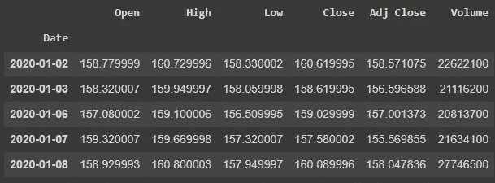
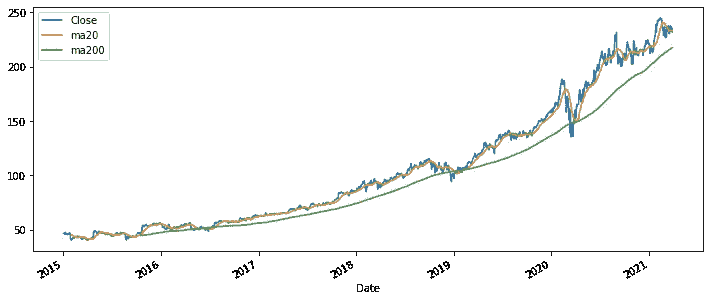
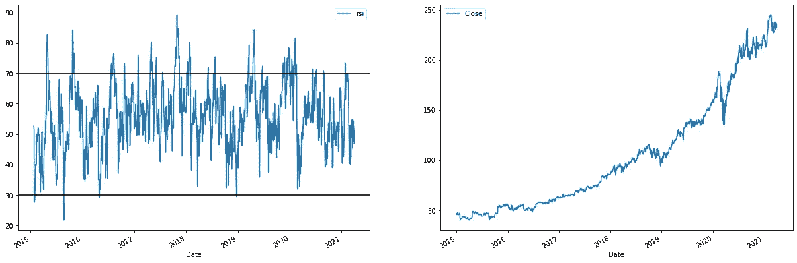
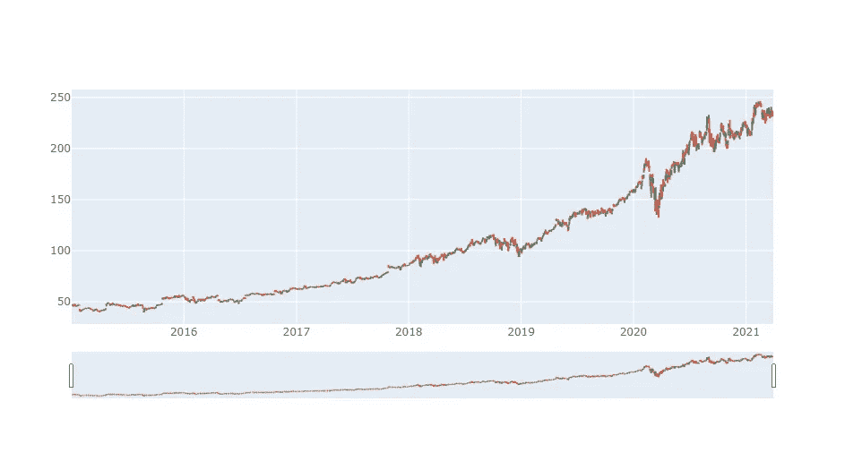

# 用 Python 进行股票市场分析的 3 个步骤

> 原文：<https://medium.com/analytics-vidhya/3-steps-to-get-you-started-in-stock-market-analysis-in-python-49a4a0b090ed?source=collection_archive---------8----------------------->

我们将使用 Python 分析 MSFT 股票，计算一些基本的交易指标，并绘制 OHLC 图表。

要进行更复杂的分析，查看这篇文章我们的 [Python for Stock Market](/analytics-vidhya/python-for-stock-analysis-fcff252ca559)

# 介绍

这是 Python 股票市场分析系列的第六篇文章，我将试图涵盖你开始股票市场分析所需的基础知识。

让我们从基础开始。在本文中，您将了解到:

*   用 Python 获取股票数据的最简单方法
*   什么是交易指标，如何计算
*   如何用 OHLC 图表绘制股票数据

## 我们将分析过去 5 年的数据

```
pip install yfinanceimport yfinance as yfdf = yf.download("MSFT", start="2015-01-01", end="2021-03-31", interval="1d")df.head()
```



yfinance 下载函数有很多参数:

*   您可以使用 1m、2m、5m、15m、30m、60m、90m、1h、1d、5d、1wk、1mo、3mo，而不是将间隔设置为 1d。
*   您可以在一个列表或字符串中定义多个 tickers:“间谍 AAPL MSFT”。
*   您可以使用“ytd”来下载从今天起一年内的数据，而不是开始和结束日期。其他有效期间包括 1d、5d、1mo、3mo、6mo、1y、2y、5y、10y、ytd、max。
*   详见 [yfinance](https://github.com/ranaroussi/yfinance) 。

你也可以从[雅虎财经](https://in.finance.yahoo.com/)下载 CSV 文件。

# 2.计算交易指标

交易指标是数学计算，在价格图表上绘制成线条，可以帮助交易者识别市场中的某些信号和趋势。

# TA-LIB

就技术分析而言，TA-LIB 是 Python 中使用最多的库之一。

要使用它，你首先需要安装 TA-LIB 依赖项，我知道安装 TA-LIB 很难，因此我写了一篇文章，请阅读。

 [## 如何在 Python 中安装 TA-LIB

### 在这里，我将帮助您在 PC/笔记本电脑上安装 TA-LIB。对你们来说应该很容易！

rohan09.medium.com](https://rohan09.medium.com/how-to-install-ta-lib-in-python-86e4edb80934) 

# 移动平均数

移动平均线(MA)用于确定当前价格趋势的方向，不受短期价格上涨的影响。

MA 指标结合了特定时间范围内的股价点，并除以数据点的数量，得出一条趋势线。

让我们计算 MSFT 收盘价的 20 天(短期)和 200 天(长期)MA(我们可以用熊猫直接计算 MA):

```
df.loc[:, ‘ma20’] = df.Close.rolling(20).mean()
df.loc[:, ‘ma200’] = df.Close.rolling(200).mean()
```



# 为什么均线很重要？

移动平均线用于识别重要的[支撑位](https://www.investopedia.com/trading/support-and-resistance-basics/)和[阻力位](https://www.investopedia.com/trading/support-and-resistance-basics/)。

交易者观察短期均线与长期均线的交叉，作为趋势变化的可能指标，以进入多头和空头头寸。

# RSI——相对强度指数

相对强弱指数(RSI)是技术分析中使用的一种动量指标，用于衡量最近价格变化的幅度，以评估股票或其他资产价格的超买或超卖情况。

RSI 显示为一个振荡器(在两个极端之间移动的线形图),读数可以从 0 到 100。它通常用于 14 天的时间段。

# 相对强弱和相对强弱指数一样吗？

相对强弱表明一只股票相对于另一只股票、指数或基准的价值，而相对强弱表明一只股票相对于同一只股票近期表现的表现。

让我们计算 MSFT 的相对强度

```
import talibdf.loc[:, “rsi”] = talib.RSI(df.Close, 14)
```

现在，让我们绘制 RSI 图，30 表示超卖，70 表示超买:



RSI ≥70 的资产通常被认为超买，而 RSI ≤ 30 的资产通常被认为超卖:

*   超买信号表明资产价格可能会回调。
*   超卖信号可能意味着短期下跌即将成熟，资产可能会反弹。

在上图中，我们可以观察到 MSFT 价格随着 RSI 的变化而变化的模式。当超买(RSI ≥70)时，价格处于修正阶段，反之亦然。

# 3.绘制股票数据

在这一节中，我们将看到如何绘制 OHLC 图，这是一种我们在交易平台上常见的开盘价、最高价、最低价和收盘价的图表。

我们将使用 Plotly 库来制作 OHLC 海图。

为了用 Plotly 绘制 OHLC，我们只需要在正确的投入上设定价格。



MSFT 图

现在你可以进入更复杂的分析，我有一篇完美的文章可以指导你:-

[用于股票分析的 Python](/analytics-vidhya/python-for-stock-analysis-fcff252ca559)

**免责声明**已经有人尝试使用时间序列分析算法来预测股票价格，尽管它们仍然不能用于在真实市场中下注。这只是一篇教程文章，并不打算以任何方式“指导”人们购买股票。

现在轮到你鼓掌了，跟我来。感谢您的阅读！

给我一个[关注](https://rohan09.medium.com/)如果你喜欢这个，更多的科技博客！

再见了。