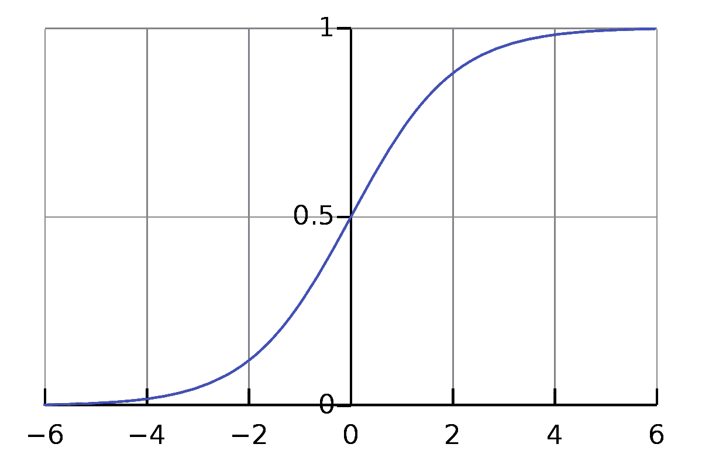
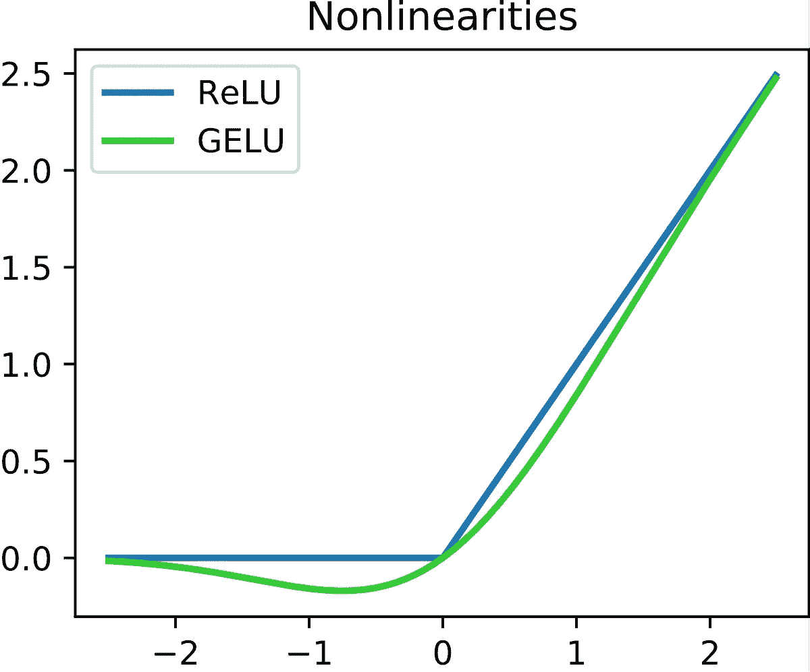
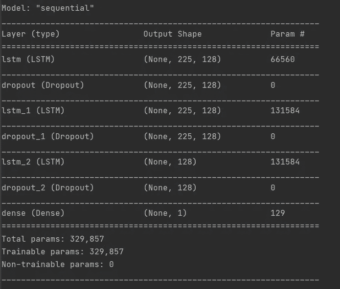
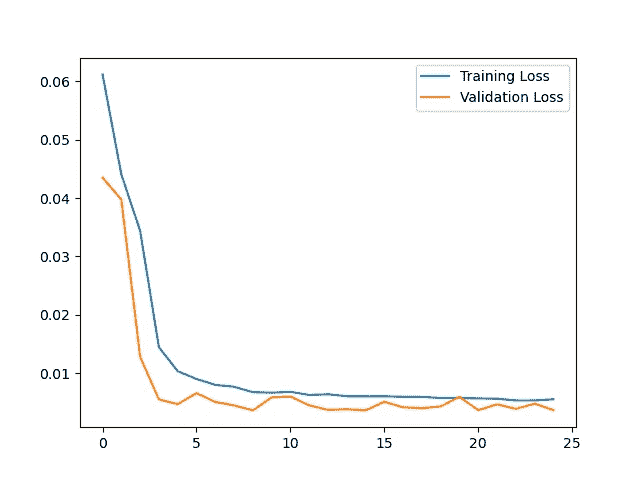
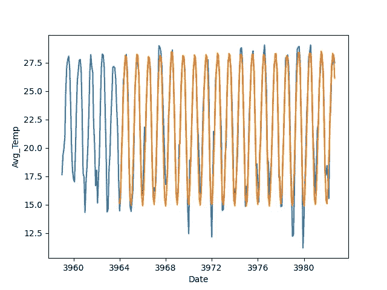

# 基于 LSTM 的 3-时间序列预测

> 原文：<https://medium.com/analytics-vidhya/3-time-series-forecasting-using-lstm-e14b93f4ec7c?source=collection_archive---------1----------------------->


克里斯·利维拉尼在 [Unsplash](https://unsplash.com?utm_source=medium&utm_medium=referral) 上的照片

> ***更新*** *:本文是我探索时间序列的系列文章的一部分。查看完整系列:* [*第一部分*](/analytics-vidhya/1-introduction-to-time-series-5ae663c468f4) *，* [*第二部分*](/analytics-vidhya/2-econometric-statistical-models-in-time-series-7b69ae3ab1d8) *第三部分*

## 介绍

这是自 1743 年以来佛罗里达的月平均气温，我在上一篇文章中讨论过。在本文中，我将首先演示在这个数据集上使用 LSTM 的基本操作。

# 别跟我解释，出示代码

你可以在这里访问 GitHub repo。

## 什么是 LSTM，为什么它对时间序列很重要？

**长短期记忆(LSTM)** 是一种用于深度学习领域的人工重复神经网络(RNN)架构。虽然它在工作逻辑方面与 RNN 没有什么不同，但它允许更长的序列工作。据 RNN 说，它可以在很大程度上解决梯度问题。


简而言之， **LSTM 模型可以在一定时间内存储信息**。由于 LSTM 的这一特性，在处理时间序列或序列数据时，使用 LSTM 非常有用。当然，由于本文是时间序列文章系列的一部分，对 LSTM 的深入解释超出了本文的范围。但是它的使用可以给你一些思路。

## 首选和可能的激活功能

当我们知道预测的是什么时，我们偏好的激活函数其实是可以自发出现的。如果我们在这个阶段想在没有知识的情况下继续，它会以一种增加训练时间的方式返回给我们。例如，一个 sigmoid 很适合作为分类器，我们可以通过查看 sigmoid 的图形来最简单地理解它。



来自[https://en.wikipedia.org/wiki/Sigmoid_function](https://en.wikipedia.org/wiki/Sigmoid_function)的 Sigmoid 函数图

另一方面，如果我们想变得简单，ReLU 在计算上比 tanh 和 sigmoid 更容易，因为它包括更简单的数学运算，并且需要更少的功率。



ReLU 函数图来自[https://en . Wikipedia . org/wiki/Rectifier _(neural _ networks)](https://en.wikipedia.org/wiki/Rectifier_(neural_networks))

# 所以让我们开始吧

## 0.加载和准备数据

```
import numpy as np
import matplotlib.pyplot as plt
import pandas as pd
import datetime as dt

from sklearn.preprocessing import MinMaxScaler
from tensorflow.keras.models import Sequential
from tensorflow.keras.layers import Dense, Dropout, LSTM

# Load Data
florida = pd.read_csv('github/florida_file_.csv')
florida.head()
florida.tail(5)
florida["Date"] = pd.to_datetime(florida["Date"])

florida = florida[["Date", "Avg_Temp"]]
# florida = florida["Avg_Temp"].resample('MS').mean()
florida = florida.fillna(florida.bfill())
florida.columns = ['Date', 'Avg_Temp']

train = florida[:-225]
len(train)
test = florida[-225:]
len(test)
train_dates = pd.to_datetime(train['Date'])
test_dates  = pd.to_datetime(test['Date'])
```

在安装了所需的库并加载了数据之后，我执行了分离。在这里，测试数据集将是我保留在最后使用的数据，以使用我将通过模型预测的值。我以后会把训练数据集分成 x_train 和 y_train，但在这之前，我会对数据进行缩放。(在处理神经网络时，缩放数据非常重要，这种模型大大缩短了训练时间。)

## 1.准备数据

```
scaler = MinMaxScaler(feature_range=(0,1))
scaled_data = scaler.fit_transform(train['Avg_Temp'].values.reshape(-1,1))

prediction_days = 225

x_train = []
y_train = []

for x in range(prediction_days, len(scaled_data)):
    x_train.append(scaled_data[x-prediction_days:x, 0])
    y_train.append(scaled_data[x, 0])

x_train, y_train = np.array(x_train), np.array(y_train)
x_train = np.reshape(x_train, (x_train.shape[0], x_train.shape[1], 1))
```

在将数据集中的所有值调整到 0 到 1 之间之后，我指定了要预测的天数。在这个值之后，我将数据分离为 x_train 和 y_train。对于我们给定的值 225，该模型将以这样的方式工作，即它检查 225 个数据并预测下一个数据，然后再次检查 225 个数据并尝试预测下一个数据。

填充列表后，我们将它们转换成 NumPy 数组。然后我们重塑 x_train，让 x_train 可以和神经网络一起工作。

## 3.建立模型

```
model = Sequential()

model.add(LSTM(units =128, activation='relu', return_sequences=True, input_shape = (x_train.shape[1],1)))
model.add(Dropout(0.2))
model.add(LSTM(units =128, activation='relu', return_sequences=True))
model.add(Dropout(0.2))
model.add(LSTM(units =128, activation='relu', return_sequences=False))
model.add(Dropout(0.2))
model.add(Dense(units=1)) # Prediction of the next value
```

在这一步，我们建立我们的模型，因为它是一个基本的神经网络，我们直接建立一个序列模型。在这里，在选择 LSTM 层后，我应用了 Dropout 来提高效率并消除无用的节点，这样在每个 LSTM 层后，我不会将性能最差的节点移到下一步。在这里，我已经消除了 20%的节点总数。

这里注意！！！我们必须将 input_shape 值赋予我们的第一个 LSTM 层，因为我们的模型不知道它将处理的数据的大小，我们不需要在接下来的步骤中输入该值。在最后一步中，我返回了具有密集层的单个值，因此这个估计值将是我们的模型预测的平均温度。

```
model.compile(optimizer='adam', loss='mean_squared_error')
model.summary()

history = model.fit(x_train, y_train, epochs = 25, batch_size=32, validation_split=0.1)
```



然后，我们编译我们的模型，我们准备测试数据集，我们的模型将看到完整的模型。最后，我们重塑 x_test，并将其转换为适合我们模型的格式。



## 4.预言；预测；预告

```
actual_temp = test['Avg_Temp'].values
total_temp = pd.concat((train['Avg_Temp'], test['Avg_Temp']),axis=0)

model_inputs = total_temp[len(total_temp)-len(test)-prediction_days:].values
model_inputs = model_inputs.reshape(-1,1)
model_inputs = scaler.transform(model_inputs)

# Make Predictions on Test Data
x_test = []

for x in range(prediction_days, len(model_inputs)):
    x_test.append(model_inputs[x-prediction_days:x, 0])

x_test = np.array(x_test)
x_test = np.reshape(x_test, (x_test.shape[0], x_test.shape[1], 1))

pred = model.predict(x_test)
pred = scaler.inverse_transform(pred)
```

然后，我们对模型执行预测操作。然后，我们用 inverse_transform 操作对这些估计值进行归一化，以便将这些预测值与我们拥有的实际值进行比较。


考虑到我们的纪元值是一个低值，可以说我们的模型成功处于可接受的水平。



# 参考

[1]https://www.veribilimiokulu.com

[2][https://www . analyticsvidhya . com/blog/2020/10/how-to-create-an-ARIMA-model-for-time-series-forecasting-in-python/](https://www.analyticsvidhya.com/blog/2020/10/how-to-create-an-arima-model-for-time-series-forecasting-in-python/)

[3][https://www.statisticssolutions.com/time-series-analysis/](https://www.statisticssolutions.com/time-series-analysis/)

[4][https://www . tensor flow . org/API _ docs/python/TF/keras/layers/LSTM](https://www.tensorflow.org/api_docs/python/tf/keras/layers/LSTM)