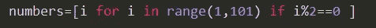

# 以 Pythonic 方式编写代码的 3 个技巧

> 原文：<https://medium.com/analytics-vidhya/3-tricks-to-write-code-in-a-pythonic-way-b8dbf23d977e?source=collection_archive---------13----------------------->


戴维·赫斯洛在 [Unsplash](https://unsplash.com?utm_source=medium&utm_medium=referral) 上拍摄的照片

随着数据分析、数据可视化、机器学习、Web 开发和游戏开发等领域对边缘技术需求的不断增长，Python 已经成为当今最深刻的编码语言之一。

虽然每天都有功能强大的 python 包发布的消息让我们兴奋不已，但我们常常忽略了 Python 必须提供的基本功能。在本文中，我将讨论三个这样的 python 主题，它们可以帮助您更好、更高效地编写代码。

# **列表理解**

我们总是可以使用循环以约定的方式创建一个列表。然而，更好也更简单的方法是使用理解。这里有一些列表理解的便利功能。

*   **一行**:创建一个从 1 到 100 的整数列表，没问题！


numbers=[i for i in range(1，101)]

*   **条件**:创建一个只有偶数的列表，范围从 1 到 100



*   **Iterable** :用第二个列表中的项目创建一个数字列表


**字典和集合理解(*加成)*** :这些数据结构提供与列表理解相同的功能。

*   集合理解:


**哎呀！这是我的名字，没有欺骗**

*   字典理解:


# **拉姆达的力量**

Lambda 函数是匿名或一次性函数，因为它们主要用于一次性功能。然而，当你把 Lambda 和其他函数结合起来时，你就能看到它的真正潜力。

*   **Lambda with Filter()**:Filter 函数以函数和列表作为参数。


**打印所有事件**

*   **Lambda with map()** : Map 函数也是以函数和列表为自变量。


**将所有元素乘以 2**

*   **Lambda with Reduce()**:Reduce 函数将列表的大小缩减为一个返回值。


**返回所有数字的总和**

Zip()它！

我举个例子解释一下这个很酷的功能。让我们创建如下两个数据帧。

```
df = pd.DataFrame({ 'Id': [1,2,3,4,5,6,7,8,9,10],'Employee': ["A","B","C","D","E","F","G","H","I","J"],
                   'Location': ["Ind","Ind","US","Eur","Eur","Eur","Ind","US","Ind","US"]})look_up_df=pd.DataFrame({'location_code':["Ind","US","Eur"], 'description':["India","United States","Europe"]})
```


我们的数据集


位置查询

现在假设您想用相应的描述替换每个位置代码，我们可以简单地使用 zip，如下所示:

```
df.replace(dict(zip(look_up_df['location_code'],look_up_df['description'])),inplace=True)
```

让我们来分析一下。zip()函数将接受两个可迭代的对象并返回一个元组迭代器，然后我们将它转换成一个字典并用作 replace 函数的参数。


在我们的例子中，Zip()返回这个

*   解压缩将会恢复我们的原始系列。

```
z=zip(look_up_df['location_code'],look_up_df['description'])
codes, desc =  zip(*z)
print('location_code =', codes)
print('description =', desc)
```

*编码快乐！*