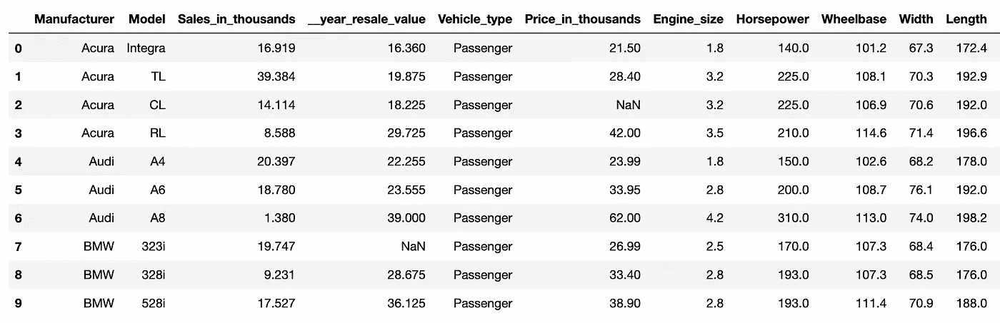
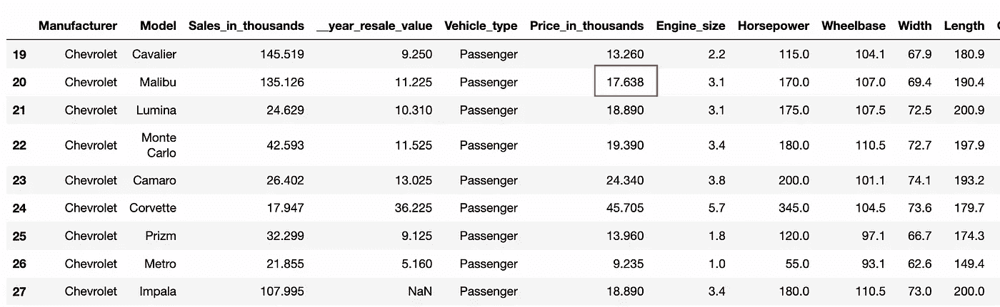

# 三种方法来处理熊猫的版权警告

> 原文：<https://medium.com/analytics-vidhya/3-ways-to-deal-with-settingwithcopywarning-in-pandas-f06bfbd0a86b?source=collection_archive---------3----------------------->


图片:[来源](https://storyset.com/illustration/warning)

> 忽视警告是没有好处的。即使它们毫无意义。—黛布拉·多伊尔

我在学习编码时学到的一件事就是不要被代码中的“警告”所困扰。“专注于修复主要的 bug 和错误，警告不是什么大事”。当我开始处理真实世界的情况时，我意识到这是一个多么糟糕的建议。有时候警告会让你付出超乎想象的代价。一个这样的警告是对熊猫的警告。

不管你和熊猫一起工作了多长时间，你迟早都会遇到`Settingwithcopywarning`。如果你想弄清楚它是什么，为什么它会一直出现，即使你“*确实得到了你期望的结果”，*那么这篇文章就是为你准备的。

为了解释警告背后的逻辑，我使用了来自 Kaggle 的[汽车销售数据集](https://www.kaggle.com/gagandeep16/car-sales)。该数据集包含不同类型汽车的信息。

这里是数据集的数据和结构的一瞥。



```
# car_sales is the dataframe containing the dataset
car_sales.info()
```


汽车销售数据集信息

让我们假设一个场景，我们已经收到一个更新，所有保时捷汽车的`fuel_capacity` 已经从 17.0 增加到 18.0，我们被要求进行更改。让我们继续改变它们。

```
car_sales[car_sales['Manufacturer'] == 'Porsche']['Fuel_capacity'] = 18.0
```


啊哦！我们触发了著名的`SettingWithCopy`警告。

如果我们现在看一下数据帧，我们可以看到值没有更新。

```
car_sales[car_sales['Manufacturer'] == 'Porsche']
```


我们必须明白`*SettingWithCopy*`是一个警告而不是一个错误。错误会破坏您的代码，并阻止您在没有修复它的情况下继续前进。但是，一个警告表明您的代码在产生输出时有问题。

在这种情况下，有时我们可能会得到我们想要的输出，但也会忽略警告。但是我们永远不应该忽略这个警告，因为它意味着我们试图执行的操作可能没有像我们预期的那样工作，并且将来可能会出现一些意想不到的问题。

这些是熊猫的核心开发者之一 Jeff Reback 关于为什么你永远不应该忽视这个警告的话。


为了理解如何修复这个警告以及当我们面对它时该做什么，必须知道 Pandas 中视图和副本之间的区别以及它们是如何工作的。

# 视图与副本

在上面的代码中，我们试图从数据中返回所有 Porsche 汽车，我们得到的结果可能是一个视图或数据帧的副本。

视图(或浅层副本)是原始对象的子集，它没有自己的内存和地址空间。它只是我们试图访问的对象的投影。


数据帧的视图

副本(或深层副本)是原始对象的副本，它有自己的内存和地址空间。这是一个独立的实体，一旦我们给熊猫做了手术，它就会被扔掉。


数据帧的副本

视图和副本之间的主要区别之一是，修改视图会修改原始数据帧，反之亦然，而修改副本不会影响原始数据帧。

假设我们把`Model` Boxter 的车`sales_in_thousands` 改成 9.35。


修改视图

从上面可以看出，修改视图也会修改原始数据帧。


修改副本

相反，修改副本不一定会修改原始数据帧。

Pandas 从底层 Numpy 数组获得了视图和副本的这种行为。Numpy 数组仅限于一种数据类型，因此可以预测是返回视图还是副本。当 Pandas 使用其 Numpy 内核时，它遵循一套复杂的规则来优化空间并确定是返回视图还是副本。因此，每当我们索引一个数据帧时，没有固定的方法来预测是否返回一个视图或副本。引用熊猫文献，

> 除了简单的情况之外，很难预测它将返回一个视图还是一个副本(这取决于数组的内存布局，对此 pandas 不做任何保证)……这就是 SettingWithCopy 警告你的！

要检查是否返回了视图或副本，您可以使用内部属性`_is_view`或`_is_copy`。_is_view 返回布尔值，而 _is_copy 返回对原始数据帧的引用或无。

让我们看看遇到此警告的三个最常见的问题以及如何处理它们。

# 1.链式分配

Pandas 生成此警告的最常见原因之一是当它检测到链式分配或链式索引时。

我们对熊猫数据框架做了两件事，或者

*   设定 —给某物赋值
*   或者， **Get** —从某物中获取值

链式分配是指我们试图通过使用多个索引操作来分配( **set** )某物。

回想一下我们之前使用的例子。

```
car_sales[car_sales['Manufacturer'] == 'Porsche']['Fuel_capacity'] = 18.0
```

这里，两个索引操作被组合来设置一个值。首先，我们尝试从数据帧中访问( **get** )所有“保时捷”汽车，然后我们尝试为“燃油容量”分配( **set** )一个新值。

我们希望修改原始数据帧，但此操作可能会尝试创建副本并修改它。这就是警告告诉我们的。*‘试图在数据帧的一个片段的副本上设置一个值’。*


我们在上面讨论过，当我们试图访问( **get** )一个操作的子集时，Pandas 可以创建一个视图或者一个副本。

让我们看看我们试图执行的操作是在视图上还是在副本上。

```
car_sales[car_sales['Manufacturer'] == 'Porsche']['Fuel_capacity']._is_view

# output
Truecar_sales[car_sales['Manufacturer'] == 'Porsche']['Fuel_capacity']._is_copy

#output
<weakref at 0x7fe118b59b80; to 'DataFrame' at 0x7fe1187a14f0>
```

`_is_view`返回了`True`,表示这是一个视图，而`_is_copy`返回了`weakref`,表示这是一个副本。因此，' **get** '操作的输出不明确。最后可以是任何东西。这就是为什么无视`SettingWithCopy`的警告是一个坏主意。它最终会导致在您最意想不到的时候破坏代码中的某些东西。

通过使用`.loc`将背靠背的索引操作合并成一个操作，可以很容易地解决链式分配的问题。

```
car_sales.loc[car_sales.Manufacturer == 'Porsche', 'Fuel_capacity'] = 18.0
car_sales[car_sales.Manufacturer == 'Porsche']['Fuel_capacity']

#output
124    18.0
125    18.0
126    18.0
Name: Fuel_capacity, dtype: float64
```

# 2.隐藏链接

触发此警告的第二个最常见的原因是隐藏链接。追踪这个问题的根源可能很棘手，也很困难，因为它可能会跨越您的整个代码库。

让我们看一个隐藏链接的场景。我们将继续创建一个包含所有'*Chevrolet*'汽车的新数据框架，同时记住要使用上一课中的`.loc`。

```
chevrolet_cars = car_sales.loc[car_sales.Manufacturer == 'Chevrolet']
chevrolet_cars
```


我们花一些时间做一些其他的操作，然后摆弄我们的代码。

```
chevrolet_cars['Model'].value_counts()
....
# few lines of code
chevrolet_cars['Sales_in_thousands'].std()
....
chevrolet_cars['__year_resale_value'].max()
....
# few lines of code
chevrolet_cars.loc[20,'Price_in_thousands'] = 17.638
```


嘣！又是这个警告！！

在最后一行代码中没有链式赋值，但它仍然触发了警告。让我们看看数据框架中的值。



它更新了我们的价值。那么，这次我们应该继续前进，忽略警告吗？大概不会。

这段代码中没有明显的链式赋值。实际上，它可能出现在一行代码中，甚至跨多行代码。当我们创建`chevrolet_cars`数据帧时，我们使用了一个 **get** 操作。所以不能保证这是返回了一个*视图*还是一个*副本*。因此，我们也可能试图修改原始数据帧。

在跨越数千行代码的实际代码库中，识别这个问题可能非常繁琐，但解决这个问题非常简单。当您想要创建一个新的数据帧时，使用`.copy()`方法显式地创建一个**副本**。这将向熊猫清楚地表明，我们正在一个新的数据框架上操作。

```
chevrolet_cars = car_sales.loc[car_sales.Manufacturer == 'Chevrolet'].copy()
chevrolet_cars.loc[20,'Price_in_thousands'] = 17.638
chevrolet_cars.loc[20, 'Price_in_thousands']

#output
17.638
```

# 3.假阳性

误报是指警告在不该触发的时候被触发。在这种情况下，忽略警告是非常安全的。多年来，许多导致“假阳性”警告的情况已经在熊猫身上得到解决。如果你想看的话，在熊猫文档中有讨论。


假设我们只想要将`Vehicle_type`作为*乘客*的汽车，我们希望创建一个新列，该列将是一个布尔值，指示汽车是否可用。

```
car_sales = car_sales[car_sales['Vehicle_type'] == 'Passenger']
car_sales['In Stock'] = 'True'

#output
:1: SettingWithCopyWarning: 
A value is trying to be set on a copy of a slice from a DataFrame.
Try using .loc[row_indexer,col_indexer] = value instead
```

如果您查看 dataframe，它会更新新列。在这种情况下，如果它覆盖了原始的数据帧，我们也不会担心。

我们可以通过如下更改默认行为来取消警告，

*   `pd.set_option(‘mode.chained_assignment’, None)` —抑制并关闭警告
*   `pd.set_option(‘mode.chained_assignment’, ‘Warn’)` —发出警告
*   `pd.set_option(‘mode.chained_assignment’, ‘Raise’)` —引发异常

除非你知道自己在做什么，否则不建议改变行为。

## 结束注释

通过与熊猫清楚地沟通，大多数`SettingWithCopy`警告的情况都可以避免。当你想要修改原始数据帧时，使用`.loc`或当你想要一个副本时，直接指定。这不仅可以防止将来出现警告和错误，还可以使您的代码库在维护时更加健壮。

你可以在 GitHub [#5390](https://github.com/pandas-dev/pandas/pull/5390) 和 [#5597](https://github.com/pandas-dev/pandas/issues/5597) 上看看这些问题的背景讨论。

感谢您一路阅读到这里！如果你有任何反馈、批评或担忧，请在评论中告诉我。祝你今天开心！玩的开心！