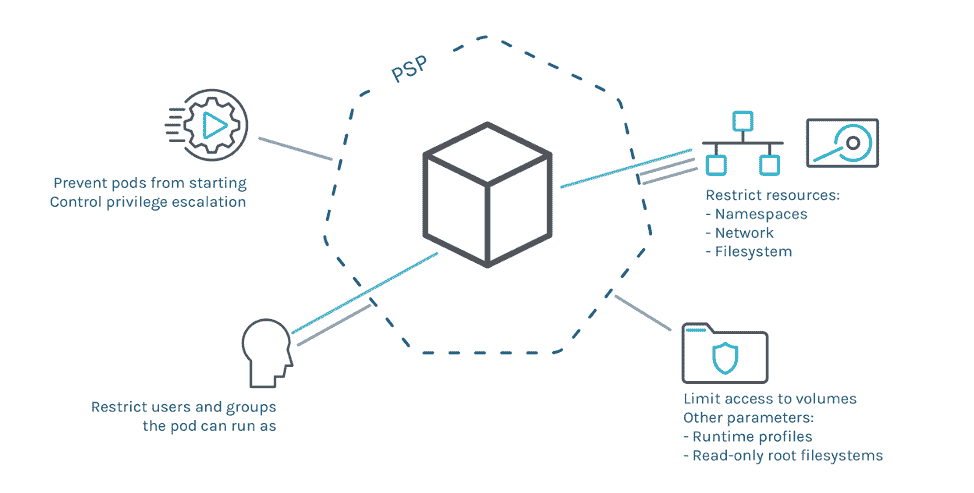

# 确保 Kubernetes Pod 安全性的 3 种方法

> 原文：<https://medium.com/analytics-vidhya/3-ways-to-ensure-kubernetes-pod-security-be34f21a23a7?source=collection_archive---------20----------------------->

穆罕默德·拉赫马尼在 [Unsplash](https://unsplash.com/s/photos/docker?utm_source=unsplash&utm_medium=referral&utm_content=creditCopyText) 上的照片

最近，Kubernetes 已经成为软件开发生命周期的重要组成部分，特别是对于持续集成和持续部署。一旦应用程序开始获得牵引力，更多的用户注册，就需要一个负载平衡器来管理和优化流量。如果您想要一个高度可伸缩的应用程序，能够自动伸缩、加速和保护构建和部署生命周期的每个级别，那么 Kubernetes 就是您的答案。

[Kubernetes](https://kubernetes.io/) 用于管理容器化的应用和松散耦合的系统。通过支持有状态、无服务器和软件加速器，您可以创建各种各样的应用。Kubernetes pod 代表集群中正在运行的进程的一个实例。本文讨论了 Kubernetes pod 的最佳安全措施，使您的应用程序免受网络威胁。

pod 是 Kubernetes 中最简单和最基本的可部署对象。一个或多个容器包含在容器中。当一个 pod 运行许多容器时，它们被视为共享 pod 资源的单个实体。对于他们的容器，pod 还具有集成的网络和存储基础设施。

# 为什么需要 Kubernetes Pod 安全？

Pod security 的总体目标是允许您分离工作负载。您可以运行具有不同工作负载的集群，并建立限制，要求每个工作负载的 pod 将自己的权限限制到特定的边界集，而无需使用第三方软件。通过拒绝违反规则的资源，pod 安全性符合声明式对象管理的最佳实践。

在部署到 Kubernetes 之前，这需要更新源存储库和工具中的资源。集群管理员可以配置预定义的 pod 安全级别，以适应适当的安全状态。

# 确保 Kubernetes Pod 安全性的方法

[来源](https://www.suse.com/c/rancher_blog/enhancing-kubernetes-security-with-pod-security-policies-part-2/)

Pod security 是一个内置的准入控制器，尽管它也可以用作一个单独的 webhook。准入控制器的工作原理是在将请求保存到磁盘之前，在 Kubernetes API 服务器中拦截请求。他们可以选择接受或拒绝请求。在 Pod 安全的情况下，pod 规格将以 pod 安全标准的形式根据指定的策略进行审查。这意味着在一个 pod 定义中，安全敏感字段将只允许具有某些值。以下是配置 Kubernetes pod 安全性的方法:

## 1.Pod 安全标准:

pod 安全标准指定了三个策略，涵盖了广泛的安全问题。这些法规是累积性的，从极度宽松到极度严格。每项政策的要求概述如下。

**特权政策**是有意宽泛且不受控制的。这种类型的监管通常适用于由受信任的特权用户在系统和基础架构级别管理的工作负载。没有约束是特权政策的特点。

特权策略可能是没有应用限制，而不是默认允许实施方法的实例化配置文件(例如[网守](https://open-policy-agent.github.io/gatekeeper/website/docs/))。另一方面，特权策略应该启用默认拒绝方法的所有控制(如 pod 安全策略)。

**基准策略**旨在针对常见的容器化工作负载实现简单，同时避免已知的权限提升。非关键应用操作员和开发人员是这一战略的目标。

**受限策略**旨在实施当前的 pod 保护最佳实践，同时牺牲一些兼容性。它的目标是安全关键的应用程序操作人员和开发人员，以及信任度较低的用户。

这些策略级别中的每一个都指定了 pod 规范中的哪些字段是受限制的，以及可以使用的值。以下是受这些策略限制的一些字段:

*spec . security context . sysctls*

*spec.hostNetwork*

*规格卷[*]。主机路径*

*spec . containers[*]. security context . privileged*

策略级别通过标签应用于命名空间资源，允许对每个命名空间进行粒度策略选择。API 服务器的 AdmissionConfiguration 还可以用于指定集群范围的默认级别和豁免。

## 2.Pod 安全许可:

Kubernetes 有一个内置的 pod 安全准入控制器，作为测试版功能，它取代了 PodSecurityPolicies。准入控制器是一段代码，它在对象持久化之前拦截到 Kubernetes API 服务器的连接，但是在请求被认证和允许之后。建立、删除、更改或连接到代理的请求受到准入控制器的限制。它们不会对读取对象的请求施加任何限制。

录取程序分为两个阶段。在初始阶段使用变异准入控制。验证入口控制器用于第二步。

## 3.配置 Pod 安全上下文:

对于 pod 或容器，安全上下文定义了权限和访问控制设置。自由访问控制(DAC)根据用户 ID 和组 ID 授予对项目(如文件)的访问权限。SELinux(安全性增强的 Linux)为对象分配安全标签，如特权用户和非特权用户。此外，您可以使用 [Seccomp](https://kubernetes.io/docs/tutorials/security/seccomp/) 过滤进程发出的系统调用，或者将容器的根文件系统挂载为只读。最后，您可以使用*allowprivilegescalation*来决定一个进程是否可以获得比它的父进程更高的特权。这个布尔值决定了容器进程的 no *new privs* 标志是否被置位。当容器以特权或 CAP SYS ADMIN 身份执行时，*allowprivilegescalation*始终为真。

# 结论

Pod security 是一项出色的新功能，可让您立即增强工作负载的防御能力。强烈建议您在 Kubernetes pod 中使用此功能。有关解决集群和名称空间配置需求的专门教程，请参考这个 Kubernetes [文档](https://kubernetes.io/docs/tutorials/security/)。

感谢您的阅读。