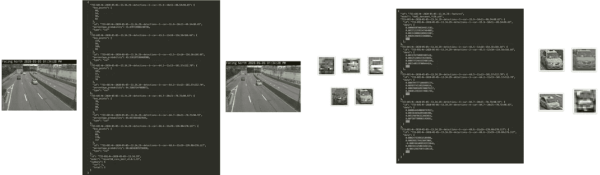
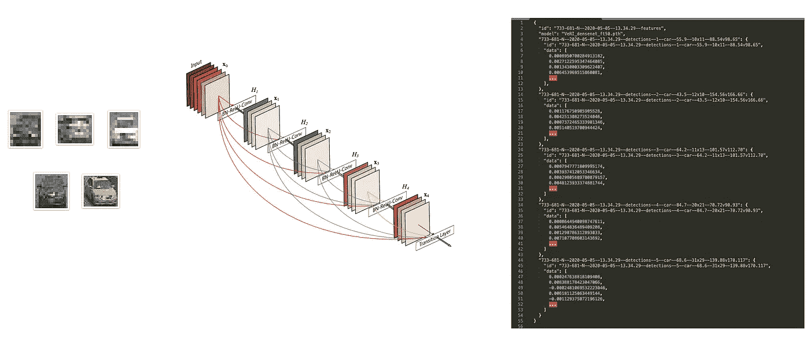

# 揭秘 Clearview AI:下载代码和数据

> 原文：<https://medium.com/analytics-vidhya/3c1f1c6cde9d?source=collection_archive---------22----------------------->

## 揭秘 Clearview AI 博客系列(代码和数据)

安装了 Conda 和 Git 后，您可以直接从您的计算机上轻松下载并运行 [CCTView](/@samdbrice/1423aabb4b40) 中使用的 ResNet 和 DenseNet 深度学习模型，用于真实的 CCTV 镜头。


[code/example.py](https://github.com/samdbrice/cctview/blob/master/code/example.py)

您还可以快速使用 [Jupyter 笔记本](https://github.com/samdbrice/cctview/blob/master/notebooks/Working%20With%20Sample%20Data.ipynb)来试验不同的模型、车辆匹配算法，或者执行您自己的图像处理。

资源库[github.com/samdbrice/cctview](https://github.com/samdbrice/cctview)包含了模型、代码和系列中引用的其他数据的全功能演示。


[github.com/samdbrice/cctview](https://github.com/samdbrice/cctview)

# 从 GitHub 克隆和安装

为了运行示例模型，代码和笔记本从 GitHub 克隆存储库，然后基于包含的`environment.yml`创建一个新的 Conda 环境。

**要求:**

*   `[git](https://git-scm.com/book/en/v2/Getting-Started-Installing-Git)`
*   [吉特 LFS](https://git-lfs.github.com/)
*   `[conda](https://docs.conda.io/projects/conda/en/latest/user-guide/install/)`

```
# (1) Clone the repository and data...
git lfs install && git clone https://github.com/samdbrice/cctview.git 
# (2) Install and activate environment
cd cctview
conda env create -n cctview -f environment.yml
conda activate cctview
```

**注意:**下载`models`状态文件和内联`data`文件需要 Git 大文件存储(LFS)。

# 运行示例脚本

安装并激活包含的环境后，您可以使用`pythonw`从您的机器上运行`[code/example.py](https://github.com/samdbrice/cctview/blob/master/code/example.py)`脚本。

**注意:** `pythonw`会自动在你的路径上。这是一个`python`命令的包装器，旨在让`[matplotlib](https://matplotlib.org/faq/osx_framework.html)` [跨平台](https://matplotlib.org/faq/osx_framework.html)正常工作。

```
pythonw code/example.py
```

示例脚本使用来自`examples`目录的图像来演示`cctview`代码包中的三个核心模块:

*   `[cctview.detect](https://github.com/samdbrice/cctview/blob/master/code/#detect)`
*   `[cctview.extract](https://github.com/samdbrice/cctview/blob/master/code/#extract)`
*   `[cctview.match](https://github.com/samdbrice/cctview/blob/master/code/#match)`



# 玩 Jupyter 笔记本

安装并激活附带的环境后，您可以通过运行以下命令来启动 Jupyter 笔记本服务器:

```
jupyter notebook
```

在 Jupyter 中导航到`notebooks`目录，然后打开`[Working With Sample Data.ipynb](https://github.com/samdbrice/cctview/blob/master/notebooks/Working%20With%20Sample%20Data.ipynb)`文件。


# 检测模块—剩余网络

使用 ImageAI `[RetinaNet](https://imageai.readthedocs.io/en/latest/detection/index.html)`类型模型实现对象检测。

基于在 [COCO 数据集](http://cocodataset.org/#home)上训练的 50 层 ResNet，底层模型加载来自`models/resnet50_coco_best_v2.0.1.h5`的权重。


# 提取模块—密集卷积网络

使用 RetinaNet 模型检测到的对象的特征是使用 [DenseNet](https://arxiv.org/abs/1608.06993) CNN 的倒数第二层提取的。

PyTorch 用于基于`Densenet201`架构从`models/VeRI_densenet_ft50.pth`加载权重，使用 [VeRI 数据集](https://github.com/VehicleReId/VeRidataset)进行调整。



# 匹配模块—欧几里德距离度量

正如本系列前面所讨论的，理想的匹配和 ReID 算法应该基于[航迹间排序](/@samdbrice/de5842a75045)。Match 模块演示了一个基于两点间最小[欧几里德距离](https://en.wikipedia.org/wiki/Euclidean_distance#Higher_dimensions)的基本匹配实现。

提取到`features.json`中的特征表示基于 *n* 维欧几里得空间中笛卡尔坐标的点，距离公式为:


匹配器计算从基础帧内的所有对象到目标帧列表内的所有对象的距离。它还将每个基础对象及其候选对象的图像分组到一个名为`matches`的新目录中。


# 原始镜头、检测和特征数据

代码库包含在`data`目录中压缩的预处理数据的一个小子集。

```
data
├── [8.6M]  253-134-S.zip
├── [ 20M]  689-640-S.zip
├── [ 43M]  731-679-N.zip
├── [ 51M]  732-680-N.zip
├── [8.1M]  733-681-N.zip
└── [ 22M]  735-683-N.zip
```

每个 FDR 摄像机的完整数据集，包括检测和特征提取(大约 10 GB)存储在以下外部存储库中:

*   https://github.com/samdbrice/cctview-data-frames-735-683-N
*   [https://github.com/samdbrice/cctview-data-frames-733-681-N](https://github.com/samdbrice/cctview-data-frames--733-681-N)
*   https://github.com/samdbrice/cctview-data-frames-732-680-N
*   https://github.com/samdbrice/cctview-data-frames-731-679-N
*   https://github.com/samdbrice/cctview-data-frames-689-640-S
*   https://github.com/samdbrice/cctview-data-frames-253-134S

# 原始闭路电视录像

储存库【github.com/samdbrice/cctview-data-videos —每小时分别包含从 2020 年 5 月 5 日星期二下午 1 点到午夜的原始每小时闭路电视镜头。

## [目录](https://samdbrice.medium.com/fri-nov-6-2020-ae15374138b1)

## 上一篇:[总结](/@samdbrice/95a9cdc0ce90)