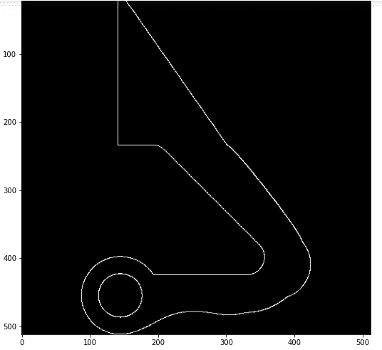

# 二元体素 Numpy 阵列的三维 Cad

> 原文：<https://medium.com/analytics-vidhya/3d-cad-to-binary-voxel-numpy-array-b538d00d97da?source=collection_archive---------4----------------------->


[Alexander Sinn](https://unsplash.com/@swimstaralex?utm_source=medium&utm_medium=referral) 在 [Unsplash](https://unsplash.com?utm_source=medium&utm_medium=referral) 上的照片

你有没有在谷歌上搜索过如何将一个 Cad 模型转换成一个 python ready *numpy* 数组，但是没有得到任何明确的答案？我也是。经过长时间的研究和尝试大量的软件和 python 库，我终于能够将 3D STEP 文件转换成三维的 *numpy* 数组。如果你想做同样的事情或者只是想知道它是如何完成的，那么继续阅读:)

# 导言:

与二维图像数据相比，对三维模型的机器学习研究还不多。大多数机器学习和深度学习模型使用*numby*数组作为数据类型。虽然点云数据可以作为*numby*数组导入，但是当三维模型转换为点云时，空间信息会丢失。点云只是空间中的一组数据点，其中每个点都有一组 X、Y 和 Z 坐标。当点云被转换成三维 *numpy* 阵列时，空间信息被恢复。三维 *numpy* 阵列就像一堆 2D 图像，其中每幅图像都是整个 3D 的横截面视图，无论您如何对阵列进行切片。我最近正在做一个这样的项目，没有找到任何资源来帮助我将 cad 模型转换成 *numpy* 数组。

# 需要的软件和 Python 库:

加载一个。stp '文件，我们将使用 FreeCAD 软件。FreeCAD 是一个免费的、开源的参数化三维建模器。您可以在[这里](https://www.freecadweb.org/downloads.php)下载软件。我们将使用 FreeCAD 加载一个。stp '文件并将其转换为点云。

对于 Python，我将使用 Jupyter Notebook，但是该代码在任何其他 IDE 上都可以正常工作。我们将需要下面的 Python 库来可视化点云并将点云转换为 *numpy* 数组。

```
import pptk #not essential, but its good for visualizing
import numpy as np
import pandas as pd
from pyntcloud import PyntCloud
```

# 转换。使用 FreeCAD 的 stp 文件到点云

FreeCAD 的用户界面非常直观和容易理解。当你打开一个。stp '文件导入 FreeCAD，它看起来像这样:


FreeCAD 用户界面

我使用的 cad 模型是我几年前在 GrabCad 网站上的一次竞赛中创建的。您可以通过点击这里的来检查我的其他 Cad 模型并在 GrabCad 上渲染。

在 FreeCAD 中我们要做的第一件事是激活点工作台。进入视图>工作台>点，如下图所示。您可以看到点工作台工具栏出现在工具栏的第二行(位置可能因您而异)。


在 FreeCAD 中激活点工作台

要将 3D 模型转换为点云，请选择左侧面板上的零件。一旦选择了零件本体，工具栏中的*转换成点*选项将可用。选择*转换成点*选项并输入最大距离。最大距离是两点之间的距离。创建点云所需的时间与最大距离成反比。因此，请根据所需的详细程度和您的计算机规格来选择。当您单击“确定”时，将生成点云，并在左侧面板上显示为一个单独的零件实体。你可以在下面的视频中看到整个过程


三维模型到点云

要导出点云，选择左侧面板上的点云零件几何体，点击选项*导出点云*。确保在保存点云时，文件的扩展名应该是。asc。


导出点云

# 点云到三维数字阵列

来加载。asc '点云文件转换成 python 我们将使用 *numpy* 库。使用下面显示的代码行将点云导入 python。点云将是一个形状为(N，3)的 *numpy* 数组。其中 N 是数据点的数量，3 是每个数据点的 X、Y 和 Z 坐标。有关单个数据点的示例，请参见下面代码中的最后两行。

```
import numpy as np
point_cloud = np.loadtxt("path/bracketpointcloud.asc")
point_cloud.shape
#output: (1840605, 3)
point_cloud[1]
#output: array([94.5374 , -2.27163, -3.81])
```

我们可以使用 *pptk* 库或 *PyntCloud* 库来查看点云。我会解释这两者，但是 *pptk* 更好，更容易可视化。要使用 *pptk* 可视化点云，只需使用以下代码。这将打开一个新窗口，您可以在其中缩放和旋转点云。 *pptk* 库提供了许多其他参数，这些参数可以在[文档](https://heremaps.github.io/pptk/viewer.html)中看到。

```
v = pptk.viewer(point_cloud)
```


使用 pptk 库可视化点云

为了使用 *PyntCloud* 可视化点云，我们必须将 *numpy* 数组转换成 *pandas* dataframe。其中每行代表一个数据点，列代表相应数据点的 X、Y 和 Z 坐标。然后这个数据帧被用来创建一个 *PyntCloud* 对象，如下面的代码所示。要绘制点云，使用下面代码的最后一行。 *PyntCloud* 将显示 *jupyter 内部的输出。*我们可以在显示点云之前设置点的大小和不透明度。

```
from pyntcloud import PyntCloud
df = pd.DataFrame(data=point_cloud, columns=['x','y','z'])
cloud = PyntCloud(new_df)
cloud
#output: PyntCloud
         1840603 points with 0 scalar fields
         0 faces in mesh
         0 kdtrees
         0 voxelgrids
         Centroid: 57.98352803, 18.506313633, -6.561006902397e-05
         Other attributes:
cloud.plot(point_size=0.1, opacity=0.6)
```

现在，我们将把点云数据帧转换成体素网格，也称为点云的体素化。为此，我们将使用下面的前两行代码。我们还可以设置三维模型将被表示的体素空间的大小。这在深度学习和机器学习中特别方便，在这些学习中，所有的输入都应该是相同的大小。可以使用下面显示的最后一行代码来查看体素网格。

```
voxelgrid_id = cloud.add_structure(“voxelgrid”, n_x=512, n_y=512, n_z=512)
voxelgrid = cloud.structures[voxelgrid_id]voxelgrid.plot(d=3, mode="density", cmap="hsv")
```

最后，我们只需将体素网格转换成二进制数组。使用下面一行代码。

```
Binary_voxel_array = voxelgrid.get_feature_vector(mode=”binary”)
Binary_voxel_array.shape
#output: (512, 512, 512)
```

我们有了它，一个三维 cad 模型的三维二进制数组。

# 让我们看看我们做了什么

我们创建的 *numpy* 数组非常类似于 3D 模型。当我们在 2 维中对阵列进行切片时，我们将立即得到截面视图。这样，机器保存了 3D 模型的空间信息，该空间信息可以由机器使用各种深度学习或机器学习技术来学习。下面是我们在(512，512，512)数组中的不同索引处对数组进行切片时得到的几个例子。

```
plt.imshow(Binary_voxel_array[ 200, : , : ], cmap=’gray’)
```


从前面看第 200 个索引处的部分

```
plt.imshow(Binary_voxel_array[ :, 300, : ], cmap=’gray’)
```


从顶部看第 300 个索引处的部分

```
plt.imshow(Binary_voxel_array[ :, :, 250 ], cmap=’gray’)
```



从侧面看第 250 个索引处的部分

感谢阅读:)