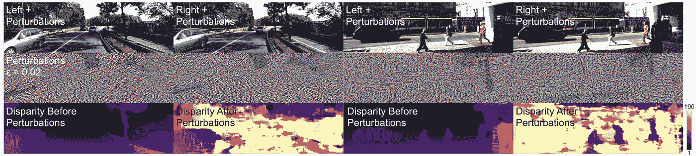
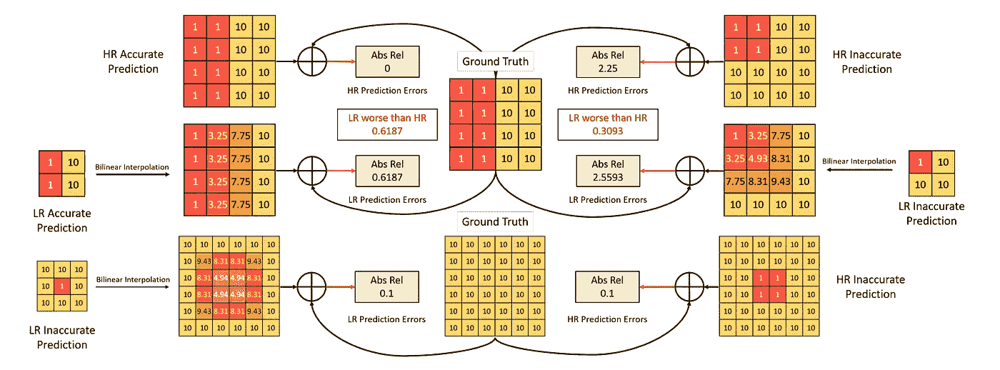
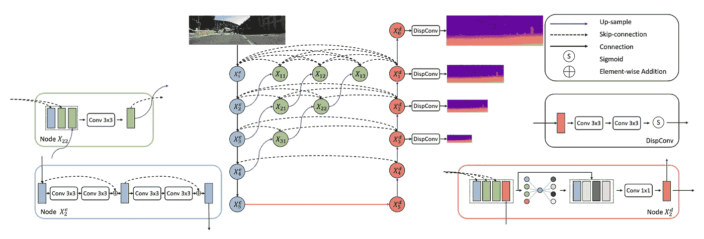
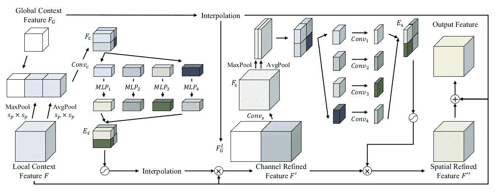
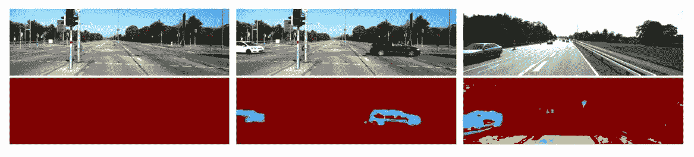
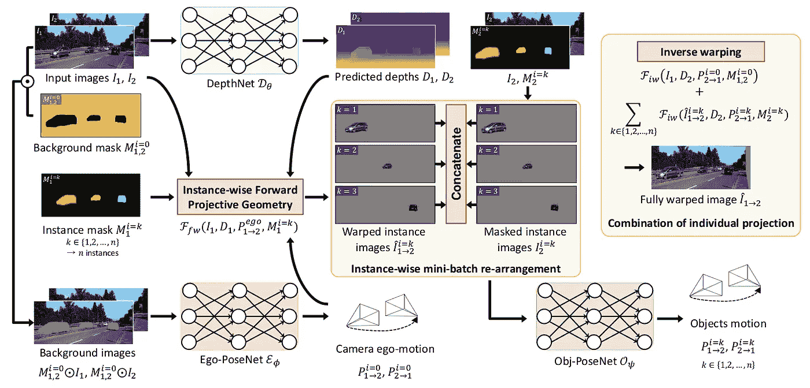

# 三维重建新闻— AAAI 2021

> 原文：<https://medium.com/analytics-vidhya/3d-reconstruction-news-aaai-2021-5f435cba6718?source=collection_archive---------8----------------------->

*【免责声明:3D 重建新闻是一系列博客文章，我在其中回顾了在某次会议上对深度估计、MVS、SfM、VO、VSLAM 和其他与从图像进行大规模户外 3D 重建相关的领域的最佳贡献】*

这里是今年的另一个主要会议，即 [AAAI 2021](https://aaai.org/Conferences/AAAI-21/) (你可以在这里找到我之前在 WACV 2021 [上的帖子)。3D 重建领域有什么新进展？以下是我通常的三个要点:](/analytics-vidhya/3d-reconstruction-news-wacv-2021-4a8e504aea19)

*   无人监管的多视图立体(MVS)终于成为相关的东西。
*   立体匹配网络非常愚蠢，对对抗性攻击不够稳健。
*   随着网络能够处理遮挡、动态场景、高分辨率输入等等，单目深度估计正在经历它的黄金时代。

## 通过有效的共同分割和数据增强的自我监督的多视图立体

虽然无监督学习已经充斥了单目深度估计领域，但是大多数多视图立体(MVS)方法仍然需要地面真实深度图进行训练，从而严重限制了它们在现实世界中的应用。继最近关于自我监督的 MVS 的其他很酷的工作之后，本文[1]展示了如何从现有的 MVS 基线中移除监督，例如 MVSNet [2]。他们基于以下观察:当前无监督的 MVS 网络依赖于来自不同视图的点之间的颜色恒常性，这导致了模糊的监督。

现有无监督 MVS 网络中模糊监督的例子。图片来自[1]。

为了缓解这个问题，他们提出用两个先验来指导自我监督:

*   多视图中的对应点应该语义一致。他们使用基于非负矩阵分解的无监督共同分割方法来实现这一想法，但在更具体的场景中(如自动驾驶)，来自预训练网络的语义地图将做得很好。语义损失项仅仅是给定分割图和扭曲分割图之间的每像素交叉熵损失。
*   该网络应该足够健壮，以便从具有不同颜色、照明和模糊的数据中学习。为此，对输入图像应用随机变换并将其投影到源视图，然后计算原始深度图和受损深度图之间的差异。这是一个正则项。

这两项有助于最终的损失函数，以及来自单目深度估计文献的常见光度损失和平滑损失。这个框架的有趣的方面是，原则上任何 MVS 网络都可以用作主干，并且结果变得可以与监督方法竞争，同时显著优于现有的非监督方法。

## 立体认知:用对抗性扰动愚弄立体网络

深度网络的鲁棒性是一个关键问题，因为它们将被部署在现实世界的场景中，例如自动驾驶汽车的立体深度估计。加州大学洛杉矶分校的这项新工作[3]表明，当前的立体声网络对随机噪声足够鲁棒，但对精心制作的敌对扰动不够鲁棒，这可能导致彻底失败。这是令人惊讶的，因为实际上不需要学习立体，因为立体对和底层 3D 场景之间的关系完全以闭合形式确定，至少对于具有足够好的视觉条件的点(即，共同可见的点位于具有恒定照明的光滑朗伯表面上)是如此。在立体匹配中使用深度学习的原因本质上是为了在不满足这些条件的区域中正则化解决方案，因此网络对这些攻击的脆弱性表明它们实际上被迫忽略证据。

敌对攻击的灾难性后果的例子。图片来自[3]。

另一个有趣的见解是，不同的架构显示出不同程度的鲁棒性，基于特征的方法(如 PSMNet [4])最不鲁棒，基于匹配的方法(如 AANet [5])最鲁棒。最后，他们表明，这些对抗性扰动可以在训练中用作数据增强技术，在不损害整体准确性的情况下增加鲁棒性。这与图像分类网络形成对比，在图像分类网络中，对攻击的鲁棒性和准确性成反比。

注意:这些攻击可以通过完全访问网络来实现，并且需要大量时间来构建。还有，你的新自动驾驶特斯拉配备了很多冗余的传感器，你可以放心让它开。

## HR-DEPTH:高分辨率自我监督单目深度估计

从单目视频进行无监督深度估计的最新研究方向是建立能够处理和利用高分辨率输入的模型。HRDepth [6]的作者对这一目标做出了新的贡献，他们表明现有高分辨率网络(如 PackNet [7]或 SuperDepth [8])的准确性并不比低分辨率网络好多少。但是为什么呢？他们的主要观察结果是，大多数误差都集中在对象边界，用于上采样的双线性插值模块不可避免地会引起这种误差。下图显示了当地面实况为大的图像梯度时，上采样的低分辨率估计比高分辨率估计产生更高的预测误差。

上采样在对象边界引入误差的原因。图片来自[6]。

为了解决这个问题，提出了两种架构改进:

*   首先，U-Net 通常的跳过连接不足以正确融合特征。想法是添加几个中间结点来聚合要素，并通过包含这些中间结点来增加跳过连接的密度。这些新模块的设计只是一个卷积，后面跟着一个激活函数。然而，它们之间的相互联系才是最重要的。
*   其次，编码器由简单的残差块构成，解码器由特征压缩和激励模块构成，减少了网络参数，提高了融合质量。这些块首先使用全局平均池来挤压特征图，然后使用完全连接的层来衡量每个特征的重要性，最后使用 1x1 卷积来融合它们。

HRDepth 架构。图片来自[6]。

这种方法实现了最先进的性能，同时具有更少的参数和处理更高的输入图像。这项工作的另一个有趣的贡献是提出了同一网络的精简版本，通过将更大网络的输出视为地面事实，以“受监督”的方式对其进行训练:向将这些模型部署到便携式设备迈出了一步。

## 用于单目深度估计的逐块注意网络

注意力无疑是现在机器学习中最热门的话题。在本系列的上一集中，我们看到它被应用于 MVS 网络，而在这里，一个新的注意力模块已经被设计用于监督单目深度估计[9]。他们旨在解决的具体问题是，以前的研究没有足够关注场景局部区域中相邻像素之间的关系。为此，基本思想是设计逐块注意模块，该模块将来自解码器的最后上采样层的局部上下文特征和具有预定义块尺寸的全局上下文特征有效地组合。由此产生的繁琐架构如下所示，它代表解码器的最后一步，紧接着是深度预测之前的卷积层。

[9]中提出的注意模块的整体架构。

整个模块可以分为两部分:

*   通道注意部分首先将全局上下文特征与局部特征的平均池和最大池版本连接起来。该体积然后通过卷积和全连接层，然后再次与本地上下文输入融合以形成信道细化特征。
*   空间注意部分将先前的输出与内插的全局输入连接起来，然后处理该体积以产生空间细化特征。最后，这个中间输出被添加到局部和全局上下文特征，以给出输出特征。

局部和全局特征之间的这种紧密互连允许通过显式地对相邻像素之间的局部关系进行建模来胜过现有技术的方法。

## 一种全局遮挡感知的自监督单目视觉里程计方法

[10]提出了另一种基于注意力的方法，在这种情况下，用于学习更好的全局上下文，并使用它来产生更精确的遮挡图。处理深度估计中的遮挡的经典方法是计算二进制逐像素掩模，并在优化损失函数时忽略被掩模的像素。然而，这种方法不能在遮挡遮罩中编码全局信息，注意力应该解决这个问题。具体而言，本文还提出了两个关注级别:

*   级内注意模块被放置在每个解码器级之后，以便适当地融合来自解码器和编码器的特征映射(具有跳跃连接，如通常在 U-Net 类架构中那样)。
*   级联跨级注意用于合并来自不同级内注意模块的信息。该块在每个比例下的输出通过卷积层产生多比例遮挡图，如下所示。

上面输入图片，下面对应遮挡图。相机在左图像和中间图像之间是静态的，因此只有动态对象被标记为遮挡。图片来自[10]。

本文的第二个主要贡献是一个对抗性学习方案，其中训练一个鉴别器来发现真实图像和通过视图合成获得的重建图像之间的差异。对于最终的自监督物镜，来自鉴别器的损失函数与更经典的光度和平滑度损失相结合。

## 通过实例感知投影一致性学习动态场景中的单目深度

AAAI 2021 对 3D 重建世界的最后一个有趣贡献是处理自动驾驶中高度动态场景的问题[11]。这个特殊的问题通常由联合估计光流、实例分割或其他任务的复杂框架来解决。这种方法当然也不例外，因为它通过对每个实例进行估计来明确处理对象运动。该框架需要两个图像作为输入，每个图像与一个背景遮罩和一个实例遮罩相关联。

[11]中提出的总体框架。

从上面的方案可以看出，三个网络被联合训练:

*   传统的深度预测器简单地输出两幅图像的深度。
*   姿态网络只接收背景图像(即输入图像乘以背景遮罩)并产生相对姿态。
*   设计了一种新颖的对象网络来预测输入图像中每个对象的运动。该网络的输入由一个模块给出，该模块根据估计的姿态、深度和分割掩模向前和向后投射每个对象，以确保每个对象之间的实例几何一致性。

我个人想知道是否会有更简单的方法来完成这项任务，因为这种框架的参数数量和整体复杂性使得它们很难与实时要求兼容。此外，为什么不首先使用惊人的 [EmptyCities](https://bertabescos.github.io/EmptyCities/) 项目来移除动态对象呢？

## 参考

[1]徐等.*基于有效共分割和数据增强的自监督多视点立体视觉*，2021

[2]姚等， *MVSNet:面向非结构化多视点立体的深度推理*，2018

[3] Wong 等，*立体认知:用对抗性扰动愚弄立体网络*，AAAI 2021

[4]常等，金字塔立体匹配网络，2018

[5]徐等， *AANet:自适应聚合网络高效立体匹配*，2020

[6] Lyu 等人， *HR-Depth:高分辨率自监督单目深度估计*，AAAI 2021

[7] Vasilijevic 等人，*用于自监督单目深度估计的 3D 打包*，CVPR 2020

[8] Pillai 等人，*超深度:自监督超分辨单目深度估计*，ICRA 2019

[9] Lee 等，*用于单目深度估计的逐片注意网络*，AAAI 2021

[10]陆等，*一种全局遮挡感知的自监督单目视觉里程计方法*，2021

[11] Lee 等，*通过实例感知投影一致性学习动态场景中的单目深度*，AAAI 2021