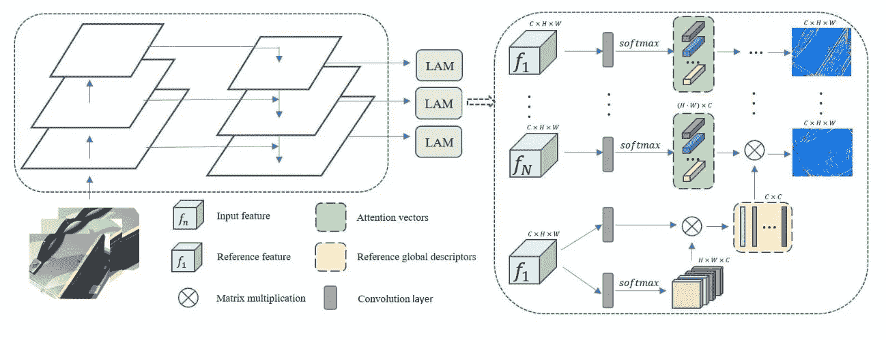

# 3D 重建新闻— WACV 2021

> 原文：<https://medium.com/analytics-vidhya/3d-reconstruction-news-wacv-2021-4a8e504aea19?source=collection_archive---------11----------------------->

*【免责声明:3D 重建新闻是一系列博客文章，我在其中回顾了在某次会议上对深度估计、MVS、SfM、VO、VSLAM 和其他与从图像进行大规模户外 3D 重建相关的领域的最佳贡献】*

就这样，今年的首届计算机视觉大会( [WACV 2021](http://wacv2021.thecvf.com/home) )结束了。我们是否更擅长仅从图像中找出世界的三维结构？算是吧。以下是我的三点建议:

*   美国宇航局利用 3D 重建寻找火星上的安全着陆点。
*   注意机制满足多视角立体(再次)。
*   单目深度可以通过全景分割图或连续适应来改善。

## 计算约束 UAS 的单目图像序列稠密三维重建

美国宇航局的新型[火星直升机](https://mars.nasa.gov/technology/helicopter/)需要在未知地形中探测安全着陆点，仅使用一个向下的摄像头和机载处理能力【1】。单目选择的动机是飞行中的直升机和地形之间的距离比任何潜在的立体基线都要高得多，从而导致深度误差。另一方面，单目设置不能预先校准，需要精确的相机姿态估计。同时，3D 重建应该足够密集以允许着陆点检测，并且足够高效以满足计算约束。

所有这些需求之间的权衡通过以下轻量级管道来实现:

*   视觉惯性里程计前端通过跟踪快速特征来计算姿态先验(是的，[快速](https://en.wikipedia.org/wiki/Features_from_accelerated_segment_test)是算法的名称)。
*   关键帧从输入流中选择，并与附加的相机姿态一起收集在滑动窗口缓冲区中，这些相机姿态通过窗口束调整进行局部优化。
*   选择并校正一对关键帧，然后使用传统的立体算法来计算深度。

有趣的奖励:在 [Ceres](http://ceres-solver.org/) 、 [g2o](https://github.com/RainerKuemmerle/g2o) 和 [GTSAM](https://gtsam.org/) 之间有一个很好的比较，显示 Ceres 对于这种小问题明显更快！

## 多视角立体视觉的远程注意网络

注意机制在计算机视觉中变得无处不在，多视图立体视觉(MVS)也不例外(例如参见[2])。在这项名为 LANet 的新工作中，作者利用注意力来捕捉像素之间的每视图和多视图空间相关性，这与之前计算像素成本量的 MVS 网络形成对比[3]。第一个贡献是远程注意力模块(LAM)的设计，该模块产生一组注意力特征图来馈送给网络。参考特征图中像素之间的相互依赖性被编码在全局描述符中，然后该全局描述符与来自每个源图像的注意力向量相结合，以计算多视图依赖性。然后，类似于其他基线方法，对这些特征进行扭曲、融合和处理。

远程注意模块(LAM)。图片来自[3]。

第二个贡献是一个新的中间损失，明确监督概率体积，将其约束为高斯分布。MVS 网络将深度估计为概率体积上的期望，但是先前的工作忽略了不同分布可能共享相同期望的事实。理想情况下，分布应该近似为高斯分布，并以真实深度为中心。为此，他们生成地面真实概率体，并用预测的概率体计算交叉熵损失，以惩罚非高斯分布。下图显示了基线方法[4]和 LANet 之间的比较。

左:CasMVSNet 预测一个分散的深度分布，右:LANet 预测近似高斯。图片来自[3]。

一个个人的，非请求的意见:尽管有有趣的贡献，我认为多视图立体应该远离像这样的监督方法，拥抱自我监督。

## 使用全景分割图提升单目深度

最近，已经做了很多工作来将语义信息包括到单目深度估计框架中。这篇新论文[5]表明全景分割[6]是一条正确的道路，因为深度不连续性往往出现在每个特定对象的边界，而不是像传统的语义分割图那样出现在通用类的边界。下图为不熟悉的人展示了语义分割、实例分割和全景分割的区别。

语义分割、实例分割和全景分割的区别。图片来自[6]。

这个想法是通过引入一个新的全景增强损失而发展起来的，它包括三个方面:

*   全景左右一致性项惩罚左全景地图和通过将左全景地图扭曲到右视图，然后再回到左视图而获得的地图之间的差异。这应该可以捕捉到当前预测深度的累积误差。
*   全景引导对准术语在全景不连续的地方加强深度不连续(见下图)。
*   全景引导平滑项旨在移除通常出现在 RGB 图像中而不是深度图中的冗余边缘。

左:输入图像，中心:全景分割图的边缘，右:深度图的边缘。图片来自[5]。

这种新的损失，需要地面真实全景图或预先计算的全景图的监督，与标准的几何无监督损失相结合，用于训练非常类似于具有混合监督的 Monodepth 2 [7]的架构。

一个很酷的实用技巧:如果对语义图进行缩减采样，会出现奇怪的伪像。因此，低分辨率比例的损失是通过对深度进行上采样来计算的，而不是对全景图进行下采样。

## CoMoDA:使用过去经验的连续单目深度适应

你有没有想过训练完一个模特之后会发生什么？常见的假设是，网络参数将保持固定，因此浪费了许多从新数据中学习的潜在信息。Kuznietzov 和他的同事[8]通过应用持续学习策略，在新的测试视频上即时调整预训练模型(即 Monodepth 2，再次[7])，结合了最近和遥远过去的经验，解决了这个问题。

提议的框架建立在一个基线上，其工作方式如下。给定一个预训练的模型和一个新的视频，估计没有自适应的前两帧的深度，然后从第三帧开始估计每一帧的深度:

*   估计前一帧与其两个相邻帧之间的摄像机运动。
*   如果不满足最小运动约束，请转到下一步。否则，使用姿态估计和先前推断的深度从其邻居重建先前的帧，然后计算损失并更新网络参数。
*   估计当前帧的深度图并继续。

然而，这种原始基线太不稳定，无法实现任何性能改进，因此本文的主要贡献是引入了存储一批样本(即三个连续图像)的重放缓冲区:一个来自测试视频，几个随机取自过去的经验，无论是最近的还是遥远的。这允许避免过度拟合并稳定适应，产生令人印象深刻的结果。

**参考文献**

[1]多姆尼克等人，*计算约束 UAS 单目图像序列的密集三维重建，* WACV 2021

[2]罗等，【注意感知多视点立体视觉】，2020

[3]张等，*多视点立体视觉远程注意网络*，WACV 2021

[4]晓东等，*高分辨率多视点立体与立体匹配的级联代价体积*，CVPR 2020

[5] Saeedan 等人，*使用全景分割图增强单目深度*，WACV 2021

[6]基里洛夫等，*全景分割*，CVPR 2019

[7] Godard 等人，*挖掘自监督单目深度预测*，ICCV 2019

[8] Kuznietzov 等人， *CoMoDA:使用过去经验的连续单目深度适应*，WACV 2021