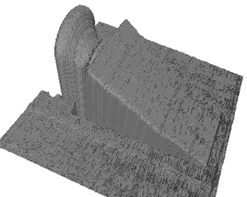

# 使用 OpenCV 和 numpy 从视频生成三维表面。

> 原文：<https://medium.com/analytics-vidhya/3d-surface-generation-from-video-using-opencv-and-numpy-b4e068e054b5?source=collection_archive---------4----------------------->

# 介绍

我最近开始探索计算机视觉领域，它吸引了我。可能性只受到我们想象力(和技能)的限制。随着深度学习和神经网络的进步，计算机视觉应用飞速发展。这是我在计算机视觉领域写一个新故事的尝试。由于我是这个领域的新手，请原谅我的错误，但我鼓励你在这个帖子上评论它们。我没有详细解释代码，因为我认为这个概念更重要。

# 灵感

立体视觉和深度感知一直是计算机视觉领域的研究热点之一。作为一名机械工程师，从物理零件创建 3D 模型是一项挑战。在这篇文章中解释的技术是一种比现有的其他先进系统更便宜的替代方案。虽然，我不确定这种技术是否已经可用或者已经被研究过了。所以让我们深入了解这个概念。

# 概念

假设一个光源在一个表面上投射一条直线，光源垂直于该表面。从某个角度观察时，它看起来会像下面这样:


没有对象的概念设置

如果将一个物体放在平面上，光线会从物体上反射，看起来会像这样:


带有对象的概念设置

当从一个角度看时，从光源投射的直线会看起来是断开的。两条虚线之差与物体的深度(或高度)成正比。如果我们有连续的图像帧，我们可以在每一帧创建一个贴图，并将其堆叠在一起，以创建对象的 3D 贴图。

为了沿着物体长度的不同距离创建连续的图像帧，光源沿着长度向前(或向后)移动。为了保持图像的比例不变，观察者(在我们的例子中是照相机)必须在相同的方向上移动相同的距离。下面的视频将使它变得容易理解:


概念设置

# 设置和排列

为了进行这个实验的设置，我使用了我的 GoPro 工具包和自行车上使用的激光发射器的部件。我尽我所能利用现有的资源，发现了一些有趣的结果。我建造的复杂(双关语)设备如下所示:


灯光和摄像机布置

这种设置是手动推送的，因此视频记录是不稳定的，但它们仍然可以证明这个概念。我将尝试通过使用更好的光源，专用相机和电动动作来改善这一点。

# 最终视频记录

该视频是在手机上录制的，然后被剪切到以下分辨率。视频中的物体是一个门楔。你可以看到物体的高度逐渐增加，虚线之间的间隙也是如此。


裁剪视频记录

将需要的 Python 库:

```
import cv2
import numpy as np
import matplotlib.pyplot as plt
import math
import os
import itertools
from stl import mesh
```

# 计算深度(高度)

虚线之间的间隙与深度(或高度)成正比。我们需要根据差距计算出准确的深度。为了计算实际距离，我们将使用简单的三角学。下图中， *A* 为*实际距离*， *P* 为*在相机平面上的投影距离*。摄像机与水平线成一个角度 *θ* 。


相机平面上的投影

如下图所示，实际距离(A)可以通过将投影距离(P)除以角度(90- *θ* )的*余弦*来计算。


实际距离公式

让我们做一个函数，当给定投影距离和摄像机角度时，它会给出实际距离。

```
def inc_str(x, angle_a):
    #x is the distance or number of row
    #angle_a is the angle of camera
    cos_val = math.cos(math.radians(90-angle_a))
    x_depth = x / cos_val
    return(x_depth)
```

# 图像预处理和创建数组

我们将从图像帧中去除噪声。噪声将包括除光的直线以外的一切。我使用了一些阈值，掩蔽和一些基本的形态变换。每一帧一个接一个地堆叠起来，形成一个三维阵列，如下所示。其中 Z 是帧数。数字 Z 起着重要的作用，因为它定义了将要生成的 3D 模型的长度。可以通过调节光源和摄像机移动的速度来控制帧数。但是因为我是手动操作的，所以我尽了最大努力来得到一个看起来不错的模型。


堆叠图像的 Numpy 数组

此步骤的代码:

```
cap = cv2.VideoCapture('sample5_cropped.mp4')
image_3D =[]
counter=0 #counter will help us keep the size if the final output
lower_red = np.array([168,120,70])
upper_red = np.array([210,255,255])
kernel = np.ones((3, 3), np.uint8)
length = int(cap.get(cv2.CAP_PROP_FRAME_COUNT))for i in range(length):
    ret, img = cap.read()
    if counter%1==0:
        #dilate and erode to make the light continous
        #img = cv2.flip(img, 0)
        img = cv2.dilate(img, kernel = kernel, iterations = 8)
        img = cv2.erode(img, kernel = kernel, iterations = 8)
        #convert to HSV for masking
        img_hsv = cv2.cvtColor(img, cv2.COLOR_BGR2HSV)
        #create mask 1
        mask1 = cv2.inRange(img_hsv, lower_red, upper_red)
        res = cv2.bitwise_and(img,img, mask= mask1)
        #dilate and erode to remove sharp edges
        res = cv2.erode(res, kernel, iterations = 4)
        res = cv2.dilate(res, kernel, iterations=5)
        #convert res to gray and thresholding
        res = cv2.cvtColor(res, cv2.COLOR_BGR2GRAY)
        ret, res = cv2.threshold(res, 0, 255, cv2.THRESH_BINARY)
        #create mask 2
        mask2 = cv2.bitwise_not(res)
        #apply mask 2 on original image
        result = cv2.bitwise_and(img, img, mask = mask2)
        result = cv2.cvtColor(result, cv2.COLOR_BGR2GRAY)
        ret, thresh = cv2.threshold(result, 100, 255, cv2.THRESH_BINARY)
        thresh = cv2.bitwise_not(thresh)
        new_row_lenght = round(inc_str(thresh.shape[0], 40))
        new_array = np.full((new_row_lenght, thresh.shape[1]), 254, dtype='uint8')
        for i in range(thresh.shape[1]):
            for j in range(thresh.shape[0]):
                new_j = round(inc_str(j, 39.940))
                new_array[new_j, i] = thresh[j, i]
        ret, new_array = cv2.threshold(new_array, 254, 255, cv2.THRESH_BINARY)
        new_array = cv2.dilate(new_array, kernel)
        new_array[721,:] = 0 # this will create a black line at the end of every image. this will act like a base line for the 3D model
        #print('new image shape: ',new_array.shape)
        image_3D.append(new_array)
    else:
        pass
    counter+=1image_3D = np.array(image_3D)
```

# 提取曲面的顶点

一旦我们有了堆叠的框架数组，我们必须提取将用于创建表面的顶点。对创建表面有用的顶点是位于直线上的顶点。我们将找到 3D 数组中的顶点，并将它们添加到一个单独的列表中。


提取表面所需的顶点

此步骤的代码:

```
vertices_list = []for i, k in itertools.product(range(image_3D.shape[0]), range(image_3D.shape[2])):
    for j in range(image_3D.shape[1]):
        if image_3D[i][j][k]==0:
            vertix = [i,j,k]
            vertices_list.append(vertix)
            break
vertices_list = np.array(vertices_list)
```

# 使用顶点创建面:第一部分

现在我们有了所有帧的所有顶点。但是这些顶点是列表的形式，我们必须将它们排列成一个 2X2 的表格，这样我们就可以从它们创建面。为此，我们将创建一个 shape (Y，Z)的空数组。其中 Z 是帧的数量(参见图*图像堆叠的 Numpy 数组*), Y 是帧的宽度。我们将用之前提取的顶点填充这个空数组，这样形状(Z，X，Y)的 3D 数组现在被压缩成形状(Y，Z)的 2D 数组。下图可能有助于理解这一点。


从顶点创建数组

此步骤的代码:

```
ncol = image_3D.shape[0]
nrow = image_3D.shape[2]
ndepth = image_3D.shape[0]new_array = np.zeros((ndepth, nrow, 3))for x in range(vertices_list.shape[0]):
    i = vertices_list[x][0]
    j = vertices_list[x][1]
    k = vertices_list[x][2]

    new_array[i][k] = vertices_list[x]
```

# 使用顶点创建面:第二部分

要定义一个面(表面),我们至少需要 3 个点。我们将使用 3 个顶点创建三角形面，然后使用 numpy stl 将它们网格化。如下图所示，将使用 2X2 顶点块创建 2 组面。这个过程将在整个 2D 阵列(Y，Z)上循环。


将用于创建面的 3 个点

此步骤的代码:

```
faces = []for x in range(0,ncol-1):
    for y in range(0, nrow-1):
        #for traingular face 1
        if np.all(new_array[x][y]!=0):
            v1 = new_array[x][y]
            v2 = new_array[x+1][y]
            v3 = new_array[x+1][y+1]
            face1 = np.array([v1, v2, v3]) #for traingular face 2
            v1 = new_array[x][y]
            v2 = new_array[x][y+1]
            v3 = new_array[x+1][y+1] face2 = np.array([v1, v2, v3]) faces.append(face1)
            faces.append(face2)
        else:
            pass
face_array = np.array(faces)
```

# 使用 numpy stl 网格化面

最后一步是将我们之前创建的面和顶点传递给 numpy stl 网格，等待它发挥它的魔力。

```
surface = mesh.Mesh(np.zeros(face_array.shape[0], dtype = mesh.Mesh.dtype))for i, f in enumerate(faces):
    for j in range(3):
        surface.vectors[i][j] = face_array[i][j]#to save the stl file of the surface
surface.save('surface5_1.stl')
```

# 结果

我在上面显示的视频上尝试了代码(*剪辑视频记录*)。视频中的物体是一个简单的门楔，看起来像这样。


用于试验的门楔

下面是使用本文中解释的代码和概念创建的 stl 文件的图像。



结果


结果


结果


结果

感谢你阅读这篇文章。请做评论，我真的很感谢你的投入和建议。