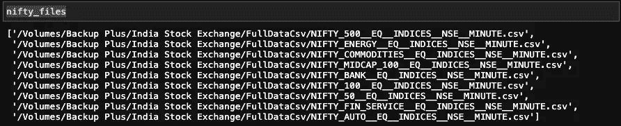
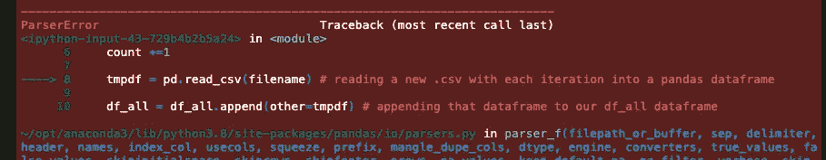

# 使用 Python 处理多 CSV 数据集的 4 个简单技巧

> 原文：<https://medium.com/analytics-vidhya/4-easy-tips-for-working-with-multi-csv-datasets-in-python-dc362d390a01?source=collection_archive---------5----------------------->


有人给过你一个被分割成几十个(甚至几百个)的数据集吗？csv 文件？或者你可能想在你的第一次 Kaggle 比赛中一试身手，但是这个很酷的数据集来自一个无穷无尽的更小的数据集列表。更糟糕的是，当你设法一个接一个地阅读所有这些文件时，你的数据科学朋友已经转移到下一个热门竞争中，而你却被留在后面，沮丧而孤独，抓着你在 Youtube 上了解到的一个未使用的机器学习模型。

是的，在你开始你的项目之前，第一次打开一个 zip 文件夹，你会发现很多。csv 文件会让您有这样的感觉:

不要害怕！拥有一个包含更多。csv 文件比 Dwight Schrute 农场上的甜菜数量多(对于不喜欢《T2》和《办公室》的人来说，这是一个很大的数字)不一定会成为永久的障碍。只需几个对任何初学数据科学家来说都很容易实现的技巧，您就可以克服这些挑战，并学习将在您的整个数据科学职业生涯中为您服务的方法。

## 为什么多 CSV 数据集具有挑战性(尤其是对于初学者)

当在 Python 中使用这种形式的数据集时，会带来一些实际挑战:

1.  **它们通常很大，所以内存限制可能是个问题。**
2.  **阅读在 100+。没有一些自动化的 csv 文件是耗时和低效的。**
3.  **构建数千万行的数据框时出现不可预见的错误会浪费大量宝贵的时间。**
4.  当一切正常工作时，每次重启程序都要重新构建庞大的数据帧，这需要耗费时间和内存。

在我的数据科学职业生涯之初，这些挑战是我开始前几个项目的真正障碍。**使用 Python 处理大型多 csv 数据集的这 4 个简单技巧将帮助您应对这些挑战，因此您可以轻松构建和存储数据框，然后开始工作。**

对于这个解释者，我将使用股票市场数据集[，可以在 Kaggle.com](https://www.kaggle.com/hk7797/stock-market-india)下载。它由 159 个组成。csv 文件，每个文件是从 2017 年 1 月 1 日开始的 NSE 上不同股票的一分钟一分钟的时间序列。数据集是干净的，并且有大量的文件要处理，这正是我们想要的。[点击此处查看 Jupyter 笔记本的完整步骤。](https://github.com/JamieWinger/Stock-Market-India/blob/main/Stock%20Market%20India.ipynb)

## **提示 1:将外置硬盘连接到 Jupyter Lab(适用于 Mac OS)**


让我们假设，作为新的数据科学家，我们已经做出了明智的决定，购买一个外部硬盘驱动器，以避免不必要地将我们在整个传奇数据生涯中会遇到的所有有趣的大型数据集填满我们的本地硬盘驱动器。

对于这个项目，我们已经将整个[印度证券交易所 Kaggle 文件](https://www.kaggle.com/hk7797/stock-market-india) (6.2 GB)下载到我们新的 1 TB 外置硬盘上，并准备在上面创造奇迹。在 Jupyter 实验室的笔记本里有 csv 文件。这是我们 Juptyer 实验室文件目录的截图:


嗯…我们的外置硬盘在哪里？如果我们不能将外部硬盘连接到 Jupyter 实验室的文件目录，我们如何处理数据集？回车:终端外壳！

在 Mac OS 上，您可以通过单击 Mac dock 的 launchpad 图标并在搜索栏中键入 terminal 来访问您的终端:


单击终端图标，您将看到如下所示的终端外壳:


如果您以前从未使用过终端 shell，那么在本文范围之外这样做有很多好处。快速的谷歌搜索会产生大量的 youtube 选项，让你熟悉终端的技术和优势。[这只是我发现的一个例子。](https://www.youtube.com/watch?v=oxuRxtrO2Ag&t=17s)

既然我们已经打开了终端外壳，我们就可以创建一个从外部硬盘到 Jupyter 实验室的直接连接。为了帮助形象化我们正在做的事情，请查看下面我的文件导航器的截图。实际上，我将告诉我的终端从“Backup Plus”位置打开 Jupyter Lab(这是我的特定外部硬盘驱动器的名称，您的可能会不同)，而不是从默认位置打开，默认位置包含“Favorites”部分下可见的那些文件夹。


好吧，是这样的:

1.  首先，在终端中键入`cd /Volumes`,这将把您的操作目录移出默认卷。

2.接下来，键入`ls`,这将显示所有已挂载卷的名称。

在下面的截图中，你可以看到 Macintosh HD，这是我们刚刚退出的默认卷。还可以看到 Backup Plus，我的外置硬盘，这是我们要切换到的卷。快到了！


要切换到 Backup Plus，让我们再次使用更改目录命令，只需键入:`cd Backup\ Plus/`

***注意:*** 确保正确键入目录路径的一个有用的快捷方式是使用终端 shell 中的“tab complete”功能。我实际上做的不是键入“Backup\ Plus/”并摸索斜线的正确方向，而是只键入我想要的驱动器的第一个字母“B ”,然后按“tab”按钮，它会自动以正确的格式填充目录路径的其余部分。

**当然，您的目录名和路径将与我的不同，但相同的快捷方式将在任何终端外壳上工作，并大大加快速度，尤其是在浏览目录中的几个文件夹时。**然而，为了让事情变得简单，我将我的路径保持得非常短，这就是我们最终得到的结果:


好了，现在我们在目标目录下操作。我们只需要打开朱庇特实验室。为此，只需在终端中键入`jupyter lab`。终端显示文本，Jupyter Lab 自动在浏览器选项卡中打开。


我们走吧！我们外部硬盘上的所有文件(包括包含我们数据集的印度证券交易所文件夹)现在都可以在 Jupyter 实验室的文件目录中看到。成功！


## 技巧 2:使用 Glob 包创建要从数据集中读入的自定义文件列表。

既然 Jupyter 实验室可以与我们的外部硬盘和数据集对话，我们需要找出一种有效的方法将所有这些文件读入 pandas 数据框。让我们使用一些基本的目录导航命令来仔细看看我们的印度股票交易所文件。

`pwd`显示您当前的目录，`cd`允许您切换到指定的新目录，就像在终端中一样。使用我们前面讨论过“制表符结束”特性来产生正确的目录名。它在 Jupyter 细胞中的工作方式与在终壳中完全相同。使用导航到该文件夹后。csv 文件，键入`ls`列出所有。文件夹中的 csv 文件。

这里有一个我的目录导航命令的截图作为例子。当然，根据文件组织和目录名的不同，确切的导航路径会有所不同:


输出显示了一个很长的。csv 文件，准确的说是 159 个。查看整个列表，这样我们就可以注意到文件命名约定中的模式，这对我们接下来的工作会很有用。


在我们继续下去之前，我们应该试着读一个。csv 只是为了看一眼我们的数据并确认一切正常。让我们使用 pandas 快速读入我们数据集中的一个随机文件(同样，您的确切文件路径会有所不同)。

```
import pandas as pddf = pd.read_csv('/Volumes/Backup Plus/India Stock Exchange/FullDataCsv/NIFTY_100__EQ__INDICES__NSE__MINUTE.csv')
df
```

这是我们的输出:


一切看起来都很好，但是如果我们想要将我们的*整个*数据集加载到 pandas 数据框中，我们将需要一个更有效的方法来读取所有这些文件。幸运的是，我们可以使用来自`glob`库的`glob`模块来创建一个定制的文件路径列表，以匹配我们指定的模式。

为了测试这一点，让我们尝试从我们的数据中创建一个文件子集的 glob。如果我们回过头来查看 FullDataCsv 文件夹中所有文件的列表，我们会注意到有一些。代表不同漂亮索引的 csv 文件。


让我们抓住那些。为此，我们可以使用星号(*)指定后跟通配符的路径名

本质上，我们告诉 Python 获取指定路径中文件名中包含字符串“NIFTY”的所有文件。

它是这样工作的:

我们的输出是 glob 中 9 个漂亮文件的列表:



将文件路径列表方便地存储在一个变量中，我们可以将该变量传递给一个简单的算法，该算法使用 for 循环读入每个文件，并在遍历路径名列表时将每个文件添加到 pandas 数据帧中。

注意，在这个循环中，我还在每次迭代中取“文件名”，去掉路径名和“.”。csv”扩展名，这样我只剩下一个字符串，它代表每个单独文件所代表的股票或指数的名称。然后，我创建一个新列，由每个文件的去除名称填充。这样，当股票和指数在更大的数据框中被追加到一起时，它们的名称就会附加到相应的分钟时间序列上，从而保留数据集的分析值。如果所有的。例如，csv 文件表示一只股票几年来的时间序列，您不需要执行这一步，因为您知道所有数据都来自一只股票。

下面是我们的输出(带有新的“股票或指数名称”列):


太好了！使用 glob，我们已经设法在 9。csv 文件，在几秒钟内创建了一个拥有近 300 万行的 pandas 数据框。我们可以使用相同的 glob 方法，使用与上面完全相同的算法来读取整个数据集。*我们应该使用那个精确的算法吗？跳转后的答案…*

## 技巧 3:当使用所有。csv 文件，编写先采样、快速失败的算法，并在缩放之前使用打印语句和时间戳进行调试。

比方说，在我不知情的情况下，有人在我的文件夹里放了一个垃圾文件。csv 文件。


实际上，这可能是数据集附带的不同格式的文件，可能是数据字典或一些其他补充信息。在一个 150 多个文件的列表中，这样一个东西很容易被忽略。虽然这只是一个玩具示例，但是我们上面使用的算法可能会遇到 glob 中某个文件的问题，原因有一百万种。很有必要快速演示一下。

(如果你和我一起编码，请随意将你自己的 EVIL_FILE 放在印度证券交易所的 FullDataCSV 文件夹中。否则，请坐在一旁，见证这个问题文件导致的恐怖表演。)

假设我们不知道我们的 EVIL_FILE 存在，我们尝试使用我们用来构建漂亮的数据框架的相同算法，只是现在我们使用一个 glob 来抓取数据集文件夹中的所有文件。再次查看完整的文件列表，看起来所有的文件名都有一个双下划线。让我们用它来创造我们的星球。它的工作方式和以前完全一样，我们只是在通配符中使用了双下划线而不是 NIFTY。

酷，现在我们又有了全局变量。这一次，该变量存储所有 160 个文件的列表。让我们向前冲，读入所有文件，不要对算法做任何修改。

呀！这是我们的输出:



在这种情况下，我们知道错误的来源是 EVIL_FILE。然而，如果我们真的有一个我们*不知道的问题文件，从这个错误输出中可能不会立即清楚哪里出错了。从这个小弯路中最重要的收获是，我的代码在输出这个错误之前运行了一个多小时。对于我们这些忙碌的数据科学家来说，这是一个代价高昂的失败。*

所以我们不会重复同样的错误，让我们对代码做一些简单的修改来强化这个算法。

首先，让我们创建一个基本的定时器函数，这样我们就可以跟踪 for 循环的每次迭代需要多长时间。我们将使用来自`datetime`库中的`datetime`模块。这是监控我们算法的一个很好的工具，因此我们可以更好地理解代码运行时发生了什么。

```
# Importing the module
from datetime import datetime# Defining our timer function which we will use below
def time_elapsed(start_time):
    return datetime.now() - start_time
```

我们还将使用前面使用的带有双下划线通配符的 glob，只是这次我们将把这个 glob 变量传递给一个新的、更健壮的算法。

请注意，这段代码与我们第一次尝试读取全部 160 时使用的算法几乎完全相同。csv 文件，除了 3 个强大的补充:

1.  **在我们代码的开始，我们定义了一个“start”时间变量，它与一个 print 语句和一个“file_count”变量成对出现在“all_files”全局变量中。**这些变量对于跟踪我们的代码进度都很有用。
2.  我们在 for 循环中添加了与关键行相对应的 print 语句，这样我们就可以在每次 for 循环迭代时跟踪相同的 4 个操作。注意，我们已经用我们在 for 循环上面定义的“time_elapsed()”函数填充了打印语句。另外，请注意，在第二个 print 语句(第 16 行)中，我们插入了“filename”变量，这样我们就可以准确地知道每次迭代中我们正在读取什么文件。这将准确地告诉我们什么时候我们的代码碰到了我们的问题 EVIL_FILE。
3.  **最后，我们在代码的“pd.read_csv()”部分激活了一个非常强大的参数:“nrows”参数(第 17 行)。**我们已经将 nrows 参数设置为 10，000，这意味着我们的算法只能从每个参数中读取 10，000 行。csv 文件。回想一下第一次。我们读入的 csv 文件有超过 370，000 行。通过将行数限制为 10，000，我们将大大加快算法读取 160 个文件的速度，这将有助于我们更快地发现我们的问题 EVIL_FILE 文件。

好的，让我们试一试，看看我们的输出。


看到那些漂亮的打印报表和时间戳了吗？它们允许我们看到错误发生的确切位置(我们看到你，EVIL_FILE)。此外，因为我们只从每个文件中采样了 10，000 行，所以我们的算法只花了 34 秒就失败了，而不是一个小时。**通过对我们的代码进行一些简单的添加，我们已经将发现和诊断问题的时间减少了几个数量级。**采样、打印报表和时间戳 FTW！

在现实生活中，根据问题文件的内容，我们可以简单地将文件移到目标文件夹之外，或者改变 glob 的格式以跳过该文件。让我们采取第二种方法。原来我们想要的所有数据集文件都有字符串 MINUTE，所以让我们将它用于我们的 glob 通配符…

```
all_correct_files = glob(pathname='/Volumes/Backup Plus/India Stock Exchange/FullDataCsv/*MINUTE*')
```

…并将我们的新 glob 变量传递给我们修改后的算法。这一次，我们所做的唯一更改是停用 nrows 参数，因为我们确信我们已经解决了这个问题。(如果我们想要更勤奋，我们可以再次运行 10，000 行采样的代码，以确认一切正常。这将产生一个 1，590，000 行的样本数据框，这是我们对 159 个文件的预期，但我们现在将跳过这一步。)

既然我们已经解决了问题，我们就可以运行我们的算法，在代码运行一个小时的时候自信地走开(也许是狂看几集我们最喜欢的以斯克兰顿为背景的职场喜剧)。如果我们感到好奇，我们可以随时停下来，看一眼我们的屏幕，检查我们的打印语句和代码的进展。

这是我们输出的结尾，看看我们完整的数据框:


哇！我们的代码执行无误，现在我们有了一个包含整个数据集的数据框，差不多有 6000 万行。我们现在可以随心所欲地操纵和分析我们的数据。

## 第 4 部分:将大数据帧保存在 parquet 文件中，以便快速方便地访问。

多好的旅程啊！毕竟，以某种方式保存我们的数据框不是很好吗？这样我们就可以快速轻松地访问它，而不必再花一个小时将它读入 Python。将数据框保存到拼花文件中是一个很好的解决方案。它是这样工作的:

当我们将拼花读回 Python 时，我们有完全相同的数据框架:


将大数据帧保存到拼花文件也是管理内存限制的好方法。让我们用完全相同的数据框制作一个. csv 文件，并比较文件大小。


注意，拼花文件是 ***的四分之一不到*** 的大小。csv 文件。当我们谈论大于 10 或 20 GB 的大型数据集时，使用 parquets 存储我们的数据帧可以节省大量成本！

## 结论

迈克尔又开心起来，准备好接受这些挑战。csv 文件！让我们快速回顾一下我们所讲的内容，以便高效地构建和存储我们的印度股市数据集，该数据集以 159 的形式提供给我们。csv 文件:

1.  **首先，我们使用终端 shell 直接从外部硬盘运行 Jupyter 实验室。**这消除了在本地硬盘上存储数据集的内存限制。
2.  **接下来，我们使用 glob 包来定义一个变量，该变量存储了我们使用 glob 的通配符特性指定的文件列表。这允许自动读取我们的。csv 文件转换成熊猫数据框。**
3.  **然后，我们讨论了用“nrows”参数增强读入算法的好处，以允许采样和添加打印语句和计时函数，帮助我们查看代码的进度、快速失败、诊断和在缩放之前调试。然后我们走开，让我们的代码构建一个包含所有 159 个印度股市文件的数据框架。**
4.  **最后，我们使用 parquets 来保存和存储我们的数据框(比传统的使用更少的空间。现在，只要我们需要，我们可以在几分钟内读取整个印度股市数据集。**

有了这些提示，您现在就可以探索和征服越来越大的新数据集了。冒险快乐！

点击[查看完整的 Jupyter 笔记本](https://github.com/JamieWinger/Stock-Market-India/blob/main/Stock%20Market%20India.ipynb)及所有代码。

在 LinkedIn 上打招呼[。](https://www.linkedin.com/in/tjamiewinger/)