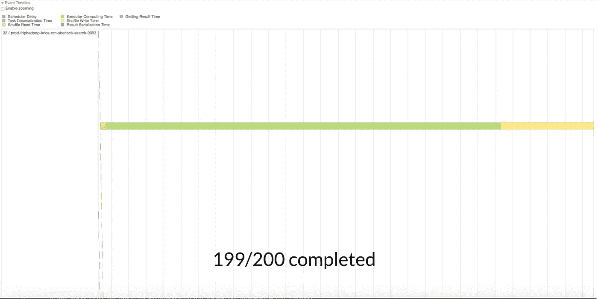

# 4 项性能提升技术，使 Spark Joins 速度提高 10 倍

> 原文：<https://medium.com/analytics-vidhya/4-performance-improving-techniques-to-make-spark-joins-10x-faster-2ec8859138b4?source=collection_archive---------0----------------------->

Spark 是一个针对大数据的闪电般快速的计算框架，支持跨机器集群的内存处理。在这篇博客中，我们将讨论 spark 中与 JOIN 操作相关的优化。


连接两个数据集是一项繁重的操作，需要通过网络进行大量的数据移动(洗牌)，以确保具有匹配连接键的行在物理上位于同一位置(在同一节点上)。

为 spark 中的数据集连接编写代码非常容易，但要使它具有高性能却很棘手，因为需要理解 Spark 中数据集是如何内部连接的。最近我研究了多个 Spark join 作业，并对它们进行了优化，使完成速度提高了 10 倍以上，现在我将分享我在优化 Spark join 方面的心得。我们首先理解 join 的内部结构来设置上下文。

# 流行的联接类型

## 广播加入

当连接中数据集的一端相当小时，这种类型的连接策略是合适的。(可以使用“火花”来配置阈值。sql。autoBroadcastJoinThreshold”，默认为 10MB)。

考虑下面的例子，其中表 A 和小表 B(小于 10 MB)必须连接。在这种情况下，Spark 驱动程序将表 B 广播给集群上存在表 A 的分区的所有节点。


现在，由于表 B 出现在我们拥有表 A 的数据的所有节点上，所以不再需要数据重排，表 A 的每个分区都可以与表 B 的所需条目相结合。

这是最快的连接类型(因为较大的表不需要数据重排)，但有一个限制，即连接中的一个表必须很小。

## 排序合并联接

这是标准连接类型，适用于连接两侧的数据集都是中型/大型的情况。

这种连接分三个阶段进行。

1.  **混洗分区**:该阶段输出的分区数默认值为 200(可使用 spark.sql.shuffle.partitions 更改)。这一步的目标是以这样一种方式重组表 A 和表 B 的数据，即应该连接的行进入相同的分区标识符(要连接的数据行在物理上/在相同的节点上协同定位)。一行的分区标识符被确定为 ***散列(连接键)% 200***(spark . SQL . shuffle . partitions 的值)。这是使用相同的散列函数对表 A 和 B 完成的。这会导致 join 列中具有相同值的所有行(在表 A 和表 B 中)在重新排列后被重新排列到同一节点(因为它们的哈希值是相同的)。这种类型的重新分区被称为[哈希分区](https://jaceklaskowski.gitbooks.io/mastering-spark-sql/content/spark-sql-HashPartitioning.html)。默认情况下，使用*计算散列值。java 中的 hashcode()* 方法。
2.  **每个分区内的排序:**这种排序也是基于连接键完成的。
3.  **连接排序后的分区**:根据连接类型(INNER、LEFT 等)，我们生成最终输出。这种方法类似于使用两个指针的“[合并两个排序数组](https://www.baeldung.com/java-merge-sorted-arrays)”的标准解决方案。


排序合并联接

我们可以使用 spark UI 中的 SQL 选项卡，找出作业中发生的连接类型。当连接两侧的数据集都很大时(或者选择了 sortmerge 连接)，大多数作业都会失败。我们将了解导致 sortmerge join 失败/缓慢的原因以及如何克服它。

# 最佳化

当我们检查作业日志和失败时，会出现如下错误消息

```
**ExecutorLostFailure** (executor 235 exited unrelated to the running tasks) Reason: Container container_e327_1624530648585_229354_01_000378 on host:**FetchFailed**(BlockManagerId(76, prod-***-nm-0001, 7337, None), shuffleId=5, mapId=6477, reduceId=2,
```

错误信息并不意味着他们所说的，我们必须做多种优化来解决这个问题。以下是关键要点。

## 数据偏斜度

即使连接步骤的输入数据是统一分区的，在 sortmerge 连接中洗牌后产生的中间数据在新创建的分区中也可能不具有统一的数据大小。

如果我们回忆一下上面的讨论，在 sortmerge join 的第一阶段，基于连接键对数据进行散列，并为其决定一个新的分区。如果我们在连接列中有一个非均匀分布的值，那么我们将在数据洗牌后产生一个倾斜的分区。

示例:

假设我们必须将下表与基于 searchSessionId 列的任何其他表连接起来。(我们看到大部分数据都有空值，这意味着所有空的 searchSessionId 行将散列到相同的值，导致它们在洗牌步骤后都进入相同的分区)


在这种情况下，我们会看到大多数任务完成得非常快，而一项任务需要很长时间才能完成。对于与另一个数据集连接的上述数据，下图显示了每个混洗分区的处理时间。我们看到大多数分区的处理速度非常快，单个分区花费了很长时间，这表明为连接而产生的混洗分区存在偏斜(由于连接键的值分布存在偏斜)。



数据偏斜导致连接缓慢

通常，连接列中的不均匀分布会导致这种偏斜。(例如，值 x 在下面的第一个表中非常频繁，所有这些行在洗牌后都进入一个分区)。数据偏斜是连接失败/缓慢的最常见原因。


**处理数据偏斜度**

a) **将 A 和 B 的 join**替换为:***(****)(A 其中联接列为非空)join with(B))UNION with(A 其中联接列为空* ***)*** 。这适用于除空值之外，联接列中的其他值均匀分布的情况。b)中讨论了一种更通用的方法。

b) **向连接列添加随机数:**这里我们向连接键添加一些随机值，使其分布。

在表 A 中(有偏斜度):用一些字符连接，并在范围(1，3)中附加一些随机数。key -> key+"_"+random(1，3)

在表 B 中(具有均匀分布):将一行分解成三行，其中的连接键是 x_1、x_2 和 x_3。


发布此消息后，我们看到所有分区的大小都是一致的，因为现在新的连接列中没有偏斜，并且连接完成得更快。

下面是帮助我们实现这一点的代码片段。

## 保持输入数据精简

如果联接变得太慢，请从数据中删除联接后不需要的列。将这些中间数据写到某个地方，并在 join 步骤中将其作为输入读取。这将减少数据洗牌过程中通过网络传输的数据量。

此外，过滤掉联接后可能不需要的任何行。

## 将大连接拆分成多个较小的连接

如果有办法在不影响功能的情况下将输入数据分割成较小的批，那么可以尝试以较小的批进行连接。在我们的例子中，我们连接了 UUID 场的两个数据集。两个数据集都有一个时间戳列。因此，我们没有连接全天数据，而是将一天分成多个时间段，只连接每个数据的相应时间段。我们有了这个想法，因为当我们连接全天数据时，需要 2-3 天才能完成，但对 25%的数据进行采样，可以在 1-2 小时内完成连接，这表明较小的连接速度更快。

下面是将一个大连接分解成多个小连接(基于时间戳)的示例代码片段。

## 作业参数调整

以下是我们可以增加的重要参数。(如果您有上述任何基本问题，这可能没有多大帮助)。

```
executor-memory, spark.executor.memoryOverhead, spark.sql.shuffle.partitions, executor-cores, num-executors
```

# **结论**

通过上述优化，我们能够将工作性能提高 10 倍以上。

总结我们在博客中讨论的关键问题。

1.  内部加入是如何发生的。广播联接与排序合并联接。
2.  为什么会发生数据偏斜(在输入数据中，而在输入数据分区中没有偏斜，但由于连接前的哈希分区而导致)
3.  处理数据偏斜
4.  保持输入数据尽可能精简
5.  将大连接拆分成多个小连接
6.  为 join 调整 spark 作业参数

数据偏斜是连接失败/缓慢的主要原因。对于任何其他[范围的转换](https://learning.oreilly.com/library/view/apache-spark-quick/9781789349108/0ee1a5e2-09d0-49f0-99f5-9dee8336258d.xhtml)也是如此(如 distinct()、reduceBykey()等)，类似的数据重排在开始时发生，将具有相同哈希值的键带到相同的分区。

感谢阅读！欢迎任何意见或建议！

联系方式: [LinkedIn](https://www.linkedin.com/in/suryakant-pandey/) ， [Instagram](https://www.instagram.com/pd.skant/)