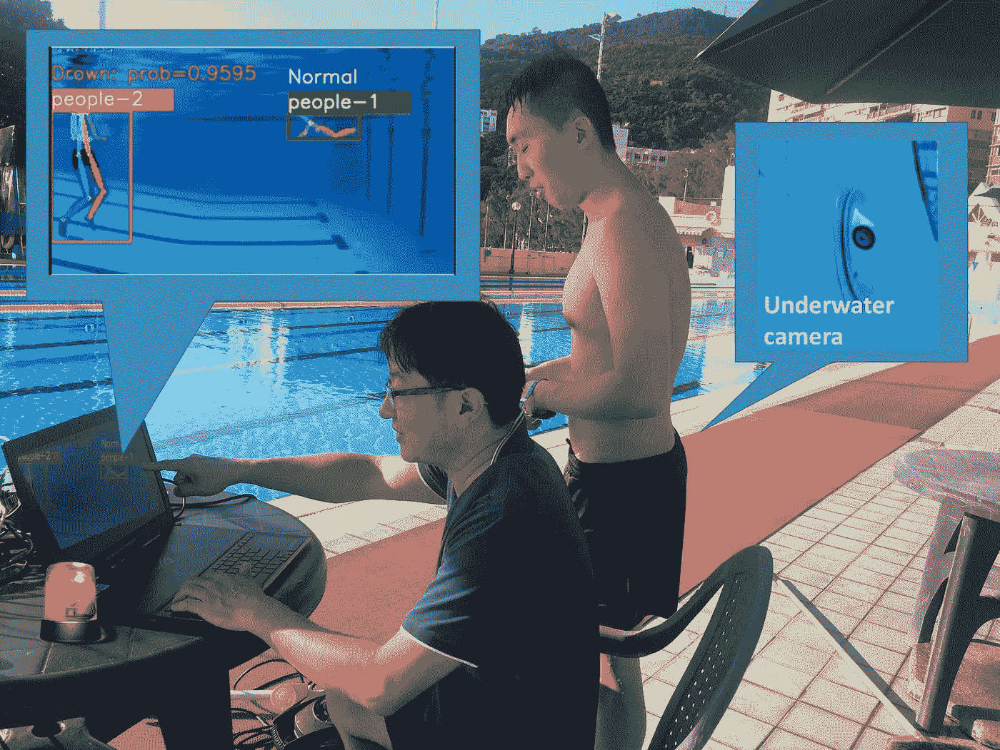
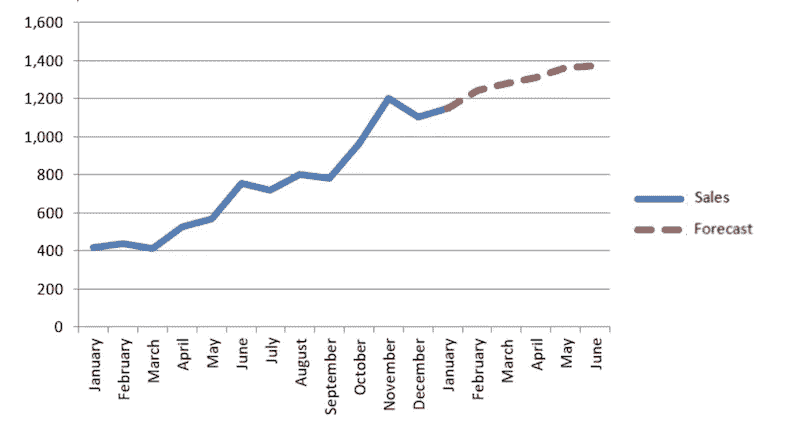

# 人工智能可以神奇地增加你的商业利润的 4 种方法

> 原文：<https://medium.com/analytics-vidhya/4-ways-ai-can-increase-your-business-profits-instantly-7ebc53c1dbf?source=collection_archive---------5----------------------->

图片来源:Analytics Insight

一项业务不仅仅是盈利。要建立一个负担得起的管道，需要大量的努力、研究和实施。你需要计划、策略和知识来让事情变得更快乐。那完全是另一个讨论的话题，但是今天我要讨论几个能让你立即从生意中赚更多钱的方法。所以没有进一步的行动，让我们开始吧！

## 1.减少人力

如果可以用 AI 代替人眼会怎么样？有许多任务只需要视觉检测，如安全监督、监控生产单位、废物分离等。需要大量人力来监控它们，并在出现问题时采取行动。相反，基于计算机视觉的智能闭路电视摄像机可以检测异常情况、安全威胁，将废物分为塑料-非塑料(例如)等，并减少人为干扰。

一些制造工厂配备人力检查产品质量，如包装缺陷、尺寸、结构、产品颜色等。这也可以由基于人工智能的计算机视觉系统取代，这些系统经过训练，可以测试质量检查中的预定义参数，从而减少人力。

基于 NLP 的人工智能解决方案还可以执行管理任务，如文档分类、自动计费流程、数据输入等。

这种系统很昂贵，但它们是一次性投资，可以比人类工作得更好，因为计算机不会累，也不需要吸烟休息或在午餐休息后变得懒惰:)

[Think In Bytes](http://www.thinkinbytes.in) 开发了一种基于计算机视觉的泳池监控溺水检测系统，该系统消除了私人泳池和水上公园对泳池警卫的需求。

溺水检测系统摘要图像

## 2.销售预测

销售预测预测销售人员、团队或公司每周、每月、每季度或每年的销售量。预测资金流量可以让你根据预期成本预测你的资金收入。这些预测让您了解何时您将拥有资金来明智地投资增长，而不会牺牲日常业务支出所需的大量资本。销售预测并不容易。它包括基于您的业务的多种情况，如季节性、市场状况、政府政策、消费者需求、技术创新等。企业通常会花费数千美元为未来规划寻求财务建议。用 AI 代替同样的呢？

基于人工智能的预测算法理解你过去的数据，形成不同参数之间的相关性和模式，并准确预测销售额和整体利润。只需点击一个按钮，您就可以查看您的业务相对于年度或季度目标的当前表现。您是否想要扩展位置、投资新的应用程序或雇佣更多员工？如果你有资金投资，这些都是发展你业务的好投资。准确的销售预测可以让你根据预期成本预测你的收入。

一致而准确的销售预测使您能够识别潜在问题，同时仍有时间解决它们。通过持续审查团队的渠道，你可能会注意到不正常的趋势。例如，如果你的团队在这个月的某个时间点的销售额比他们应该达到的水平低 40%,你就可以开始调查是什么导致了这种下降。

基于人工智能的预测系统不仅有助于更好的财务规划，还可以减少你支付给你的财务顾问的成千上万的费用。

## 3.预测性维护

企业节省的主要经常性成本之一是保持大型机器正常运行的维护成本。但是大多数维护是硬性安排的，没有分析是否需要维护。使用人工智能可以减少这种不必要的维护成本。

基于人工智能的预测性维护系统可以全天候监控机器，并准确预测机器何时需要维护或保养。这种系统还有助于避免重大事故，从而防止生产线中断。一些复杂的机械如果被破坏，需要几天甚至几周的时间来修复，这可能导致巨大的商业损失。基于 IOT 的传感器数据可用于分析机器状况，预测未来状态和维护需求。

[Think In Bytes](http://www.thinkinbytes.in) 最近开发了实施 AIOT 的风能预测系统，AIOT 是人工智能和 IOT 的结合点，精确的风能预测将电网管理成本和政府罚款降低了 60%

## 4.存货管理

让我先举一个著名汽车制造商丰田的例子。自 20 世纪 70 年代首次采用以来，丰田已经简化了他们的 JIT 商业模式，15 年后，它在各个方面都得到了真正的优化。然而，在 1997 年 2 月，他们用于生产制动阀的一家制造商遭遇了一场毁灭性的火灾，导致所有库存被烧毁，无法向丰田公司供货。这家制造业巨头不得不在两天后匆忙寻找替代供应商，然而，停止供应两天让他们损失了 150 亿美元和 70，000 辆汽车。尽管这听起来很可怕，但情况可能会更糟。

希望这能让你明白保持库存的重要性。许多有经验的商人预测消费者的需求，以低成本囤积原材料，当需求上升时以市场价格出售，这有助于他们赚取巨额利润。那么，如果 AI 可以帮助你在消费需求和制造供给之间架起一座桥梁呢？

基于人工智能的预测模型可以准确地告诉你需要储备多少。您还可以利用基于计算机视觉的库存管理，其中摄像头可以检测货架上的商品，并在货架即将变空时通知您。人工智能模型可以考虑不同的市场参数，并识别客户需求模式，从而帮助您有效地管理您的库存，节省额外的成本，使您获得更多的利润！

图片来源:数据故事——思考机器

## 简单地

乍一看，这种技术和方法可能显得幼稚和可疑，但已经有无数案例证明人工智能可以提高业务便利性和利润。根据 Gartner 2019 年的调查，37%的组织已经开始使用人工智能，这意味着每 3 家企业中就有 1 家使用人工智能。最新数据显示，2019 年人工智能的市场规模估值为 272.3 亿美元(《财富商业洞察》，2020)。到 2027 年，这一数字预计将达到 2669.2 亿美元，仅在 8 年内就增长了近 10 倍！

与 [Think In Bytes](http://www.thinkinbytes.in) 联系，讨论如何使用人工智能为您的业务带来便利和利润。