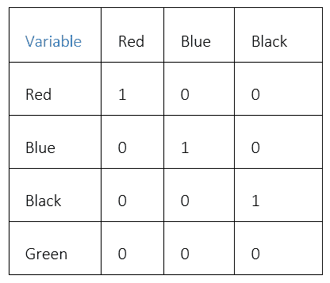
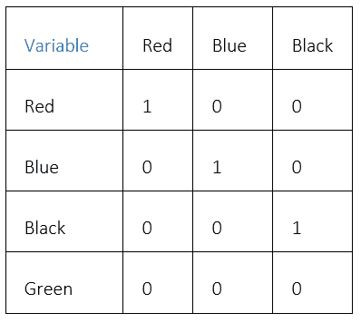
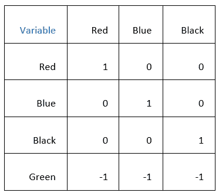

# SAS(经典编码器)中的 5 种分类特征编码技术 Suraj Saini

> 原文：<https://medium.com/analytics-vidhya/5-categorical-feature-encoding-techniques-in-sas-by-suraj-saini-bdccb067abd9?source=collection_archive---------9----------------------->


## 什么是分类特征编码？

分类变量通常表示为有限数量的字符串，而分类特征编码是将数据转换为机器学习模型可以理解的格式的过程。

机器模型的性能取决于几个因素。决定模型性能的一个因素是用于处理数据并将其提供给模型的方法。因此，编码数据是一个至关重要的过程，因为它将数据转换为机器学习模型可以理解的分类变量。编码数据提高了模型质量，有助于特征工程。

在这篇博客中，我们将探索不同的经典编码方法，并简要介绍每种编码方法在 SAS 宏中的工作原理。

1.标签编码

标签编码将 1-N 的值分配给一类分类特征。例如，如果有一个值为黑色、棕色和红色的可变“头发颜色”,标签编码将用 1、2 和 3 替换这些值。然而，标签编码的一个问题是，它不考虑类级别之间的顺序或任何关系。这不会阻止机器学习算法以这种不正确的顺序对待它们，这可能导致不准确的读数。

*用于标签编码的 SAS 宏*

以下是在 SAS 中执行标签编码的宏示例:

```
%macro label_encode(dataset,var); 
proc sql noprint; select distinct(&var) 
into:val1- 
from &dataset; select count(distinct(&var)) 
into:mx 
from &dataset; 
quit; data new; 
set &dataset; 
%do i=1 %to &mx; 
if &var="&&&val&i" then new=&i; 
%end; 
run; 
%mend;
```

2.二进制编码

二进制编码像标签编码一样将类值转换为数值。然而，二进制编码更进一步，将数值转换为二进制数，其中每个数字都有自己单独的列。

如果有 n 个唯一类别，则二进制编码将产生唯一的对数(以 2 为底)ⁿ特征。

欲了解更多信息，请访问[这里](https://towardsdatascience.com/all-about-categorical-variable-encoding-305f3361fd02)。

*用于二进制编码的 SAS 宏*

```
%macro binary_encoding(dataset,var);
 proc sql noprint; 
select distinct(&var) 
into:val1- 
from &dataset; select count(distinct(&var)) 
into:mx 
from &dataset; 
quit; data new; 
set &dataset; 
%do i=1 %to &mx; 
if &var="&&&val&i" then new=&i; %end; format new binary.; 
run; 
%mend;
```

该宏创建一个带有二进制格式值的变量。要将这些值拆分成多列，可以创建拆分列宏。

*用于拆分列的 SAS 宏*

以下是在 SAS 中拆分列的宏示例:

```
%macro split_column(data,var); 
data try; 
set &data; 
cha=put(&var, binary.); 
run; proc sql noprint; 
select max(length(cha)) 
into :ln from try ;
quit; data &data; 
set try; 
%do i=1 %to &ln; 
c_&i=substr(cha,&i,1); 
%end; 
run;
%mend;
```

3.一键编码

一键编码是将分类变量转换为 1 和 0 的过程。二进制数字被输入到机器学习、深度学习和统计算法中，以进行更好的预测或提高 ML/DL/统计模型的效率。

*用于一键编码的 SAS 宏*

```
%macro hot_encoding(data,var); 
proc sql noprint; 
select distinct &var 
into:val1- 
from &data; select count(distinct(&var)) 
into:len from &data; quit; 
data encoded_data; 
set &data; 
%do i=1 %to &len; 
if &var="&&&val&i" then %sysfunc(compress(&&&val&i,'$ - /'))=1 ; else %sysfunc(compress(&&&val&i,'$ - /'))=0; 
%end; 
run; 
%mend;
```

4.计数/频率编码

顾名思义，频率编码计算唯一的类值，然后除以值的总数。这种编码技术有助于模型理解并反向或直接分配权重。

*用于计数/频率编码的 SAS 宏*

```
%macro frequency_encoding(dataset, var); 
proc sql noprint; 
create table freq as select distinct(&var) as values, count(&var) as number 
from &dataset 
group by Values ; create table new as select *, round(freq.number/count(&var),00.01) As freq_encode 
from &dataset left join freq on &var=freq.values;
quit; data new(drop=values number); 
set new; 
run; 
%mend;
```

5.效果/总和/偏差编码

偏差编码技术有不同的名称，像效果编码，一些分析家称之为偏差编码，一些人说是和编码，但意义和定义是相同的。偏差编码与热编码相同，但唯一的区别是，如果所有列中都有 0 值，则这些值将变为-1。例如



一个热编码



效果/总和/偏差



*效果/总和/偏差编码的 SAS 宏*

```
%macro sum_encoding(data,var); 
proc sql noprint; 
select distinct &var 
into:val1- 
from &data; select count(distinct(&var)) 
into:len 
from &data; 
quit; data encoded_data; 
set &data; 
%do i=1 %to &len; 
if &var="&&&val&i" then %sysfunc(compress(&&&val&i,'$ - /'))=1 ; else %sysfunc(compress(&&&val&i,'$ - /'))=0; 
%end; 
run; data sum_encode;
set encoded_data; 
if %sysfunc(compress(&&&val&Len,'$ - /'))=1 then do; 
%do x=1 %to %eval(&len-1); 
%sysfunc(compress(&&&val&x,'$ - /'))=-1; 
%end; 
end; 
drop %sysfunc(compress(&&&val&Len,'$ - /')); 
run; 
%mend;
```

## 包扎

数据科学家花费超过 70–80%的时间清理和准备数据，这意味着编码或转换分类数据是他们工作的重要部分。然而，选择正确的编码技术以确保数据质量是很重要的，这就是为什么理解不同的编码方法是很重要的。

如果你正在寻找更多的信息，更具体地说，关于 SAS 宏定义代码，你可以在我的 Github 页面上查看[这里](https://github.com/Selerity/blog-categorical-feature-encoding-classical)。

*原载于 2021 年 2 月 18 日 https://seleritysas.com*[](https://seleritysas.com/blog/2021/02/18/5-categorical-feature-encoding-techniques-in-sas/)**。**