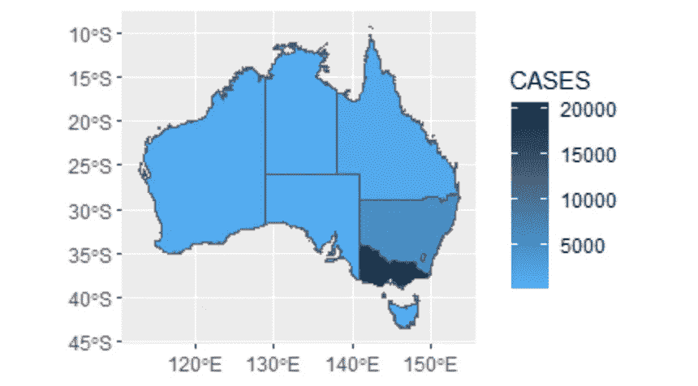
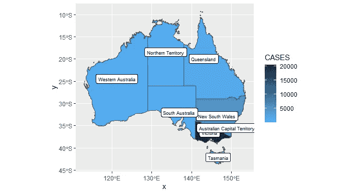

# R 中 GGPLOT 地图的 5 个检查点

> 原文：<https://medium.com/analytics-vidhya/5-checkpoints-for-ggplot-maps-in-r-a5a6ae805512?source=collection_archive---------12----------------------->

## 澳大利亚的 Covid 案例

嗨！我对 R 和 Data 是外行。这是我尝试分享我在斯里兰卡 R 女士聚会上教的很酷的东西时发现的，由数据分析师 Stephanie Kobakian 主持的“30 分钟环游世界”(用 R 创建地图)。参考:[https://srkcolombo.netlify.app/#1](https://srkcolombo.netlify.app/#1)

> 本文提供了 ggplot 操作，
> 
> 01 |反转调色板
> 
> 02 |标签
> 
> 03 |渐变
> 
> 04 |彩虹或无彩虹调色板
> 
> 05 |颜色缺陷

# **背景:**澳大利亚地区的 Covid 病例

## **代码是这样的，完整的代码可以在** [**链接**](https://srkcolombo.netlify.app/#1)**中找到**

**需要重点关注的重要代码部分只有下面的**粗体**中的代码。**

> **世界澳大利亚< -世界% > %过滤器(区域== "澳大利亚")
> 澳大利亚**
> 
> **ggplot(澳大利亚)+
> geom_polygon(aes(x = long，y = lat，group = group))**
> 
> **SF _ ozSF _ oz %>% kable()
> gg plot(SF _ oz)+geom _ SF()**
> 
> **SF _ StatesSF _ States %>% kable()
> gg plot(SF _ States)+geom _ SF()**
> 
> **covid _ URL【https://covidlive.com.au/report/cases】T21"
> covid _ data<-bow(covid _ URL)%>%
> scrape()%>%
> html _ table()%>%
> purrr::putch(2)%>%
> as _ TiB ble()**
> 
> **covid _ data%
> mutate(STATE = case _ when(
> STATE = = " NSW " ~ " New South Wales "，
> STATE = = " WA " ~ " west Australia "，
> STATE = = " SA " ~ " South Australia "，
> STATE = = " NT " ~ " Northern Territory "，
> STATE = = " ACT " ~ " Australia n Capital Territory "，
> TRUE ~ STATE))%>%
> mutate**
> 
> **covid _ Statesby = c(" NAME " = " STATE "))**
> 
> **covid_states %
> 过滤器(！(NAME == "其他地区"))**
> 
> ****gg plot(covid _ States)+
> geom _ SF(AES(fill = CASES))****

## ****生成的地图看起来像这样，****

****

**显示 covid 病例的澳大利亚地区地图，以蓝色图例表示**

**由于使用了 ggplot2 包，我得到了一个如上的默认颜色范围的地图(Dark2 调色板)。**

# **01 |调色板反转？改变？**

**嗯，我觉得值越高，蓝色应该越暗(改变亮度/色调)，所以我做了这样的小改动(**粗体代码**显示改动)。**

> ***ggplot(covid_states，AES(order = CASES))+
> geom _ SF(AES(fill = CASES))+* ***scale _ fill _ gradient(high = " # 132 b43 "，
> low = "#56B1F7")*****

**然后我得到了一个如下图，现在我真的可以注意到 Covid 案例应该注意的地方了！(PS:有其他方法可以逆转，但我不够聪明，没有足够的专家来应用它:P)**

****

**显示 covid 病例的澳大利亚地区地图，由基于蓝色的图例表示，但这次相反，由浅到深表示低值到高值。**

**哼！但是我要解释什么呢？？我不能说哪个看起来高或者低，除非我是澳大利亚人或者明确知道哪个是什么对(:P)！**

**PS:我来自斯里兰卡，以防你没看标题！**

# **02 |莫妮卡的标签制造商**

**所以在这里我尝试了标记(**粗体代码**显示变化)，**

> ***gg plot(covid _ States)+
> geom _ SF(AES(fill = CASES))+
> scale _ fill _ gradient(high = " # 132 b43 "，low = " # 56b1f 7 ")+* ***geom _ SF _ label(AES(label = NAME)，colour = "black "，size = 2.5)*****

**参考:[https://yutani . rbind . io/post/geom-SF-text-and-geom-SF-label-are-coming/](https://yutani.rbind.io/post/geom-sf-text-and-geom-sf-label-are-coming/)**

**PS:`geom_sf_label()`和`geom_sf_text()`都是不错的选择。**

****

**显示 covid 病例的澳大利亚区域地图，以蓝色为基础的图例表示，这次在区域上有标签。**

**好的，我看到维多利亚州有大约 20，000 例 Covid 病例，而新南威尔士州有 5，000- 10，000 例病例，但其他人呢？**

**只有我一个人对其他地区好奇吗？我的意思是那些不到 5000，但它是 0 还是 4999？所以我试着用下面的方法，**

# **03 |渐变，获得更清晰的图像**

> ***gg plot(covid _ States)+* **geom _ SF(AES(fill = CASES))+* ***scale _ fill _ gradient(low = " white "，high = " black ")+*** *geom _ SF _ label(AES(label = NAME)，colour = "black "，size = 2.5)****

******

***显示 covid 病例的澳大利亚区域地图，由基于灰度的图例指示，并在区域上带有标签。***

***或者可以是这样的，***

> ****gg plot(covid _ States)+* ***geom _ SF(AES(fill = CASES))+
> scale _ fill _ gradient n(
> colours = rainbow(5)，
> values = NULL，
> space = "Lab "，
> na.value = "grey50 "，
> guide = "colourbar "，
> 审美= "fill")+******

******

***显示 covid 病例的澳大利亚区域地图，由基于彩虹色标的图例指示，并在区域上带有标签。***

***颜色渐变参考:[https://www . data novia . com/en/blog/gg plot-colors-best-tricks-you-will-love/](https://www.datanovia.com/en/blog/ggplot-colors-best-tricks-you-will-love/)***

***可以理解的是，昆士兰、西澳大利亚和南澳大利亚明显不是零橙色阴影，而是红色区域呢？嗯，我是 noob，你告诉我！我的意思是，我们应该试着指出那里的值，还是仅仅用一个调色板就知道所有区域中 Covid 事例的确切数量真的很重要？***

# ***04 |我恨罗斯，我爱罗斯(罗斯=彩虹)***

***哦，顺便说一下，对连续数据使用彩虹调色板是不明智的，因为它可能会由于光谱的不均匀性(加上许多其他感性原因)而误导，从而导致混乱，所以不要因为我在这里使用它而生气，我只是做了实验；)***

***但是，如果你仔细阅读参考文献，就会发现，***

> ***虽然 RGB rainbow()非常不平衡，但 HCL rainbow_hcl()(或 qualitative_hcl())在亮度方面是(通过设计)平衡的。***

***也就是说，如果你真的想使用 rainbow，现在你有了一个更好的版本，rainbow_hcl()。它看起来像这样，***

******

***显示 covid 病例的澳大利亚区域地图，由基于彩虹色标的图例指示，并在区域上带有标签，但这次彩虹是基于 HCL 而不是 RGB。***

***参考:关于“色彩空间:操纵和评估颜色和调色板的工具箱”的论文[https://arxiv.org/pdf/1903.06490.pdf](https://arxiv.org/pdf/1903.06490.pdf)***

# ***05 |红绿灯并不适合所有人***

***最后也是最重要的一点(因为我对包容性设计充满热情)，我尝试了类似这样的东西，一种不同的调色板来帮助盲人的缺陷。***

***r 提供 simulate_cvd()包，***

> ***其可以采用有效 R 色的任何矢量，并根据特定的 CVD 变换矩阵和变换方程对它们进行变换。便利接口 **deutan()、protan()和 tritan()** 是用于模拟具有给定严重性的相应种类的色盲的高级函数(内部调用 simulate_cvd())***

******

***参考:【project.org/articles/color_vision_deficiency.html http://color space . r-forge . r***

***因此，如果有人使用通常的 RGB 彩虹调色板，那么对于缺乏色彩的人来说，***

> ****库(cowplot)
> 库(colorspace)
> 库(colorblindr)****
> 
> ****g covid<-gg plot(covid _ States)+****
> 
> ******【CVD _ grid(g covid)******

******

***显示 covid 病例的澳大利亚区域地图，由基于 RGB 彩虹色标的图例指示，并在区域上带有标签。***

******

***一套 4 张澳大利亚地区地图，显示 covid 案例，显示使用 RGB 彩虹调色板时不同盲症的情况。***

***同样，HCL 彩虹调色板是 FTW(为了胜利)！！它为许多色彩缺陷提供了更好的含义。HCL 调色板间歇泉给出了以下内容:***

> ****scale _ fill _ gradient n(* ***colors = divergingx _ HCl(11，"间歇泉"，rev = TRUE)，*** *values = NULL，
> space = "Lab "，
> na.value = "grey50 "，
> guide = "colourbar "，
> 审美= "fill")+****

******

***显示 covid 病例的澳大利亚区域地图，由基于 HCL 彩虹色标的图例指示，并在区域上带有标签。***

***所以，如果我们再一次演示它在色彩不足时的样子，***

******

***一套 4 张澳大利亚地区地图，显示 covid 案例，显示使用 HCL 彩虹调色板时不同盲症的情况。***

***你觉得怎么样？我知道你还有更多要补充的！让我知道:)***

***关于包的参考:[https://www . rdocumentation . org/packages/color blindr/versions/0 . 1 . 0](https://www.rdocumentation.org/packages/colorblindr/versions/0.1.0)***

***r 女士聚会活动举办:[https://www.meetup.com/rladies-colombo/events/276103634/](https://www.meetup.com/rladies-colombo/events/276103634/)***

***斯蒂芬妮关于代码的更多信息:[https://github.com/srkobakian/R-ladies-colombo](https://github.com/srkobakian/R-ladies-colombo)***