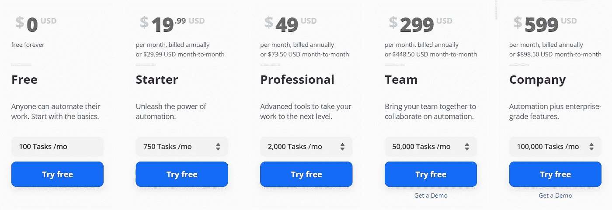
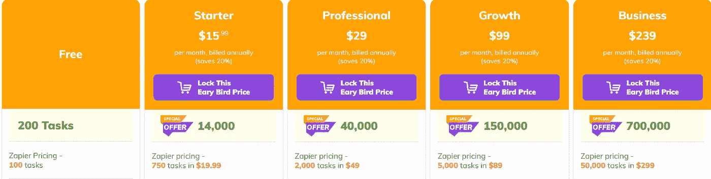
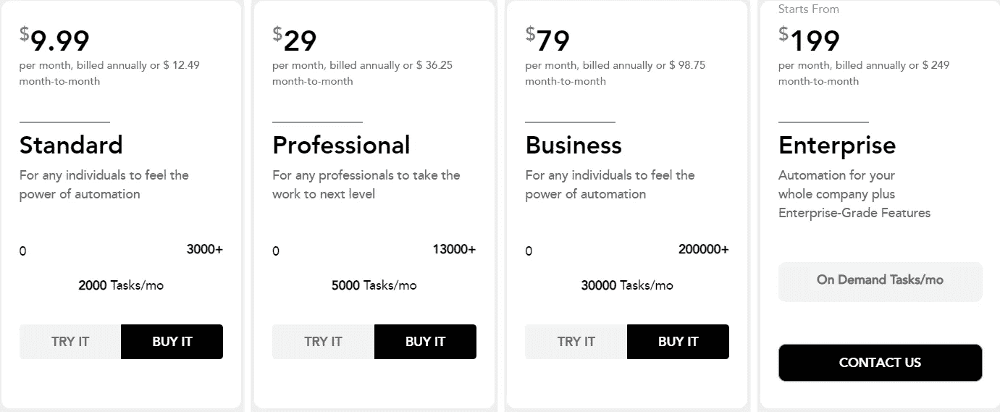
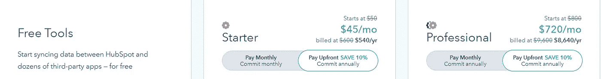

# 你应该尝试的 5 款云数据集成软件

> 原文：<https://medium.com/analytics-vidhya/5-cloud-data-integration-softwares-you-should-try-ee37ecc4414a?source=collection_archive---------23----------------------->

## 只需点击一下，即可节省时间、精力和金钱

照片由[像素](https://www.pexels.com/photo/time-lapse-photography-of-blue-lights-373543/?utm_content=attributionCopyText&utm_medium=referral&utm_source=pexels)的[皮克斯拜](https://www.pexels.com/@pixabay?utm_content=attributionCopyText&utm_medium=referral&utm_source=pexels)拍摄

信息系统中最大的挑战之一是管理数据的集成，以提供对业务中不同部门的访问。将业务推向数据的公司必须将所有系统互联。通过将数据整合到一个系统中，你可以对公司有一个全面的了解。公司中的一个常见问题是客户数据记录在多个地方——通过在同一个系统中完成所有工作，工作效率更高，并避免了不必要的工作。为了实现这一点，必须遵循特定的战略来提高数据的价值。

# 数据集成软件

当公司使用数据集成软件时，他们得到了所有处理信息的有组织的视图。因此，它是一种工具，能够将不同来源的信息结合起来，向最终用户显示所有数据的统一视图，并且公司可以转换来自不同来源的数据，以向用户提供作为挑战或竞争优势的行动计划。使用数据集成软件的公司可以确保数据字段中的所有错误都得到正确处理。

数据集成软件从外部来源收集数据，转换数据，然后上传到目标系统，因为原始数据通常使用不同的模式或格式进行组织。分析师可以使用 ETL 工具进行规范化并做出有用的分析。ETL 工具可以连接到多个数据源，如 CSV、JSON、Hadoop 和 SQL。

## 云数据集成软件

有了云数据集成软件，无需下载，你可以通过进入他们的网站来访问该软件——有一些基于网络的应用程序，不需要任何硬件或软件下载即可访问。云数据集成软件简单、实用且易于维护。这种基于网络的软件提供了企业级功能的优势，而不依赖于过于复杂的安装或只为提供您想要的功能的新版本付费。此外，通过安装更新和检查系统要求来减少离线时间。但是哪些是最好的数据整合软件呢？根据 [G2](https://www.g2.com/categories/data-integration) 的评论，排名前五的云数据整合软件。

# 五大云数据集成软件

## 1.扎皮尔

Zapier 允许集成超过 3000 个应用程序，并专注于数据自动化。您只需在 Zapier 基于 web 的应用程序中选择输入和输出数据，即可实现工作流程自动化。

*例如:将 Google 表单数据发送到 PostgreSQL。*

使用 Zapier 既实用又简单。只需一次点击，您就可以创建应用程序之间的关系，并且可以将其配置为在指定时间段内或无限期连接。Zapier 已经开发了一个简单直观的界面，不需要高深的知识，以至于那些请求他们服务的人即使不是专家也能使用它们。Zapier 还提供出色的数据安全性，让用户感到安全。

在 Zapier 术语中——zap 是一个自动化的任务，而触发器是一个激活器，即触发任务的动作。

图片作者来自【zapier.com 

Zapier 定价计划包括免费版、初级版、专业版、团队版和公司版。Zapier 提供为期 14 天的付费计划免费试用，之后你可以决定雇佣其中一个或保留免费的。高级计划提供了更多的功能——每月更高的任务量、无限制的切换和更大的定制化。

*欲了解更多有关其定价的详情，请访问其网站***。**

## *2.整体上*

*集成允许集成 500 多个应用程序。与 Zapier 类似，Integrately 侧重于数据的自动化，但它们提供完全现成的自动化—不需要创建和修改它们。这种完全就绪的自动化功能提供了更好的用户体验，因为它易于使用。Integrately 也是基于网络的软件。*

**全就绪自动化示例:当事件被添加到 Google 日历中时，在 Google 工作表中创建一行**

*综合市场策略是成为 Zapier 的最佳替代者——他们在自己的网站上展示这一竞争。他们的主要目标是与 Zapier 竞争，通过使其基于网络的软件更易于使用和提供低成本的定价策略来提供更好的用户体验。*

**

*图片作者来自[integrately.com](https://integrately.com/pricing)*

*综合定价计划包括免费试用版、入门版、专业成长版和商业版。注意 Zapier 的价格差异很重要——高级版本比 Zapier 更便宜。此外，综合计划包括更多的任务和类似的功能。*

*如需了解更多定价详情，请访问他们的 [*网站*](https://integrately.com/pricing) *。**

## *3.苹果馅饼*

*Appy Pie 是一个基于网络的平台，用于设计和开发在线移动应用程序。它是为没有编程经验的用户设计的。Appy Pie 开发了一个名为 Appy Pie Connect 的数据集成软件，它允许超过 300 个应用程序的数据集成。*

*与 Appy Pie Connect 中的 rest 集成类似，Connect 是无代码的——用户可以简单地选择他们想要集成的软件，并可视化地连接它们。良好的客户支持和快速解决用户问题是 Appy Pie Connect 与众不同的主要特征。*

**

*图片作者来自[www.appypie.com/connect/pricing-plan](http://www.appypie.com/connect/pricing-plan)*

*Appy Pie Connect 定价计划包括免费试用版、标准版、专业版、商业版和企业版。每月的价格和任务与 integrately 相似。Appy Pie Connect 是一个最新的数据集成平台，因此仍在测试新功能，以便在市场上更具竞争力。*

## *4.MuleSoft 任意点平台*

*MuleSoft 是一家被 Salesforce 收购的公司，他们的主要产品是提供数据集成服务的 Anypoint 平台。该软件允许集成任何 CRM 系统，如 [Salesforce](https://www.salesforce.com/eu/?ir=1) 、[ERP 与 SAP](https://www.sap.com/products/enterprise-management-erp.html) 等，包括通过 HTTP 协议使用 [API 主导的连接](https://www.mulesoft.com/lp/whitepaper/api/api-led-connectivity)原理从 CSV 文件或任何可访问的服务器。*

*与市场上的其他软件相比，MuleSoft Anypoint 平台是更复杂的软件，它是没有编程经验的用户和开发人员的混合体。这个平台的主要特点是它们为数据集成定制提供了多种功能。*

*Anypoint 平台的定价方案取决于您提取和加载的数据量。高数据量会增加每月成本。MuleSoft Anypoint 平台的月成本可能无法预测，也很难预算。*

**在他们的* [*网站*](https://www.mulesoft.com/platform/enterprise-integration) *了解更多关于 MuleSoft Anypoint 平台的信息。**

## *5.HubSpot 运营中心*

*HubSpot 是营销、销售和客户服务软件。该公司扩展了其软件并提供数据集成服务。HubSpot Operations Hub 的目标是使企业能够将他们的 CRM 收集的所有信息连接起来，并从中获得更多信息，以提供更好的客户体验。与市场上的其他 HubSpot 一样，您可以自动处理数据。*

**例如:自动将脸书广告表单中生成的联系人转移到联系人库**

*HubSpot Operations Hub 允许同步过去的信息——区别于市场上其他只传输集成后生成的信息的平台。*

**

*图片作者来自【hubspot.com *

*HubSpot Operations Hub 定价计划包括免费试用版、入门版和专业版。与市场上的其他产品相比，它们的价格很贵。*

**欲了解更多有关其定价的详情，请访问他们的* [*网站*](https://www.hubspot.com/pricing/operations?products=operations-hub-starter_1&term=annual)*

*有了数据集成软件，您可以节省时间、精力和金钱，您可以从同一个地方永远访问您的所有数据；你解决问题并改进你的商业策略。不整合意味着客户不满意，公司声誉受损。上面介绍的所有软件都为这些问题提供了解决方案。*

*在它们之间做出选择取决于你的目的和你作为一个企业的立场。基于网络的软件的优势在于，你不需要购买更好的硬件来运行软件。*

*充分的数据集成策略必须追求公司数据的整合，以实现所有这些目标。走向整合带来了竞争优势的回报。*

*[**关注我了解更多**](https://duranerick2011.medium.com/)*