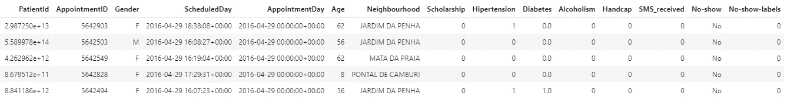

# 面向数据科学初学者的 5 种数据处理技术| Python 和 Pandas

> 原文：<https://medium.com/analytics-vidhya/5-data-processing-techniques-for-data-science-beginners-cf087af955f?source=collection_archive---------4----------------------->


如果你是 Python 的初学者，你可能也想看看下面的文章；

[](https://writersbyte.com/4-key-python-data-structures-e-very-beginner-must-know/) [## 每个初学者都必须知道的 4 个关键 Python 数据结构。

### 最近几年，Python 已经成为最受编程新手欢迎的语言，因为它易于使用，而且…

writersbyte.com](https://writersbyte.com/4-key-python-data-structures-e-very-beginner-must-know/) 

对于所有寻找数据科学工作或数据科学实习的年轻科学家来说，数据处理是一项必备技能。你可以随时学习这些技巧，但是如果你事先知道这些基本技巧，它们不仅会提升你的形象，还会节省你大量的工作时间。

经过深思熟虑，我已经缩小了 5 个技巧的范围，这 5 个技巧是我在经历了很多麻烦之后学到的，所以你不必去经历。

[](https://writersbyte.com/5-data-processing-techniques-for-data-science-beginners-python-and-pandas/) [## 面向数据科学初学者的 5 种数据处理技术

### 对于所有寻找数据科学工作或数据科学实习的年轻科学家来说，数据处理是一项技能…

writersbyte.com](https://writersbyte.com/5-data-processing-techniques-for-data-science-beginners-python-and-pandas/) 

## 寻找 NaN/空值

在 21 世纪，处理数据不再意味着几百条记录。作为一名数据科学专业人员，您将会看到从几千条记录到几百万条记录的数据！

处理如此庞大的数据最令人沮丧的地方在于，无法直观地验证数据。数据集中有 NaN/NULL/inf 值就是这样一个会让你抓狂的问题，因为这些值很难识别。我记得当我第一次编写线性回归预测器时，我的损失会在没有任何解释的情况下不断上升到无穷大。我花了两天时间搜索，才意识到我的数据集有无穷大的值。

因此，无论何时获取数据集，第一步都应该是识别 NaN/NULL/inf 值。下面的例子说明了如何做到这一点。

我们掌握的数据:


来自 Kaggle 的数据集

该数据共有 **110527 行。浏览一下数据并没有发现任何问题。但我们必须确定。让我们寻找 NaN 值。**

```
data[data.isna().any(axis=1)]
```

[](https://writersbyte.com/ai-for-beginners/) [## 人工智能初学者:人工智能基础

### 你正在浏览你的脸书页面。你看到一则广告“我们的人工智能解决方案将改变你的…

writersbyte.com](https://writersbyte.com/ai-for-beginners/) 

' ***isna()*** '是 pandas 中的内置函数，它返回布尔值的数据帧，如果有 NaN 值，则为 True，否则为 False。' ***any()*** '函数返回有**真**布尔值的行。这些函数一起返回包含 NaN 值的 us 行。


糖尿病列中的 NaN 值

如我们所见，在糖尿病列中有多行 NaN 值。现在，我们必须从原始数据中删除这些损坏的行。

```
#drop NA values from dataframe
data.dropna(inplace = True)#check for NA values again
len(data[data.isna().any(axis=1)])
```

*dropna()也是一个内置的 pandas 函数，它删除所有具有 NaN 值的行， *inplace = True* 标志只是确保对原始数据而不是其副本进行更改。*

*第二条语句返回长度 0。*

*类似地，您可以通过将 Inf 值转换为第一个 NaN，然后删除 NaN 来删除 Inf 值。*

```
*data.replace([np.inf, -np.inf], np.nan, inplace=True).dropna(inplace = True)*
```

*上面的单行代码将处理无用数据的转换和丢弃。*

*请注意我是如何将多个函数合并到一条语句中的。这是 python 中首选的编码方式。像这样的代码被称为'**python 式的**'。*

**

*照片由[卢克·切瑟](https://unsplash.com/@lukechesser?utm_source=unsplash&utm_medium=referral&utm_content=creditCopyText)在 [Unsplash](https://unsplash.com/s/photos/data-date?utm_source=unsplash&utm_medium=referral&utm_content=creditCopyText) 上拍摄*

## *转换为数据时间*

*很多时候你将不得不处理日期。问题是日期属于哪一类变量？它们是整数吗？它们是字符串还是字母数字？如果你使用过 SQL，你就会知道，日期时间本身就是一种*类型。**

*将这样的数据转换成*日期-时间*格式使得处理日期变得非常容易。*

*我们上面使用的数据中有日期。所以让我们开始吧。*

*[](https://writersbyte.com/ai-for-beginners-3/) [## 面向初学者的人工智能:计算机视觉和自然语言处理

### 我们已经谈了很多关于人工智能的一般意义以及它对我们世界的影响。在以前的文章中，我们…

writersbyte.com](https://writersbyte.com/ai-for-beginners-3/) 

```
#convert to datetime format
data["ScheduledDay"] = pd.to_datetime(data["ScheduledDay"])
```

我们已经使用 pandas *to_datetime* 函数将 **ScheduledDay** 列转换为 *DateTime* 类型。现在 python 知道这个列包含日期。现在我们在处理过程中使用这些日期会容易得多。

```
#extracting the day month and year from the date
print("Day:", data["ScheduledDay"][0].day)
print("Month:", data["ScheduledDay"][0].month)
print("Year:", data["ScheduledDay"][0].year)
```


从日期中提取的单个元素

日期时间对象具有从日期中提取单个元素的功能。上面的例子演示了如何做到这一点。

*DateTime* 类型也封装了时间，因此您也可以提取更小级别的特征，如秒、分和小时。* 

## *跨列的一致数据类型*

*数据有时会令人困惑，例如*

```
*#defining variables
a = "2"
b = 2#printing variables
print("a =",a)
print("b =",b)*
```

*运行上面的代码会打印出相同的结果。*

**

*上面代码的结果*

*任何查看输出的人都会认为‘a’和‘b’持有相同的数据，然而这与事实相差甚远。如果我们打印出这些变量的类型，我们就能得到全貌。*

```
*print(type(a))
print(type(b))*
```

**

*“a”属于类 **str** 或 **string** ，而“b”是一个**整数**，这两者在 python 中会有不同的解释。*

*为什么这很重要？这是因为原始数据有时会出现这样的问题。查看上面最初加载的数据集，我们可以看到 ***多个字段看起来像整数*** 。仅仅通过查看 ***数据，我们无法确定这些是整数还是字符串*** 。*

*我们可以检查列元素的数据类型，但是对于较大的数据集，对每个元素运行这样的处理似乎不合理。*

*我们是这样做的:*

```
*data["Hipertension"] = data["Hipertension"].astype("int")
data["Alcoholism"] = data["Alcoholism"].astype("int")*
```

*上述语句将确保整个列(“Hipertension”和“Alcoholism”)只包含整数。这一步不是非常关键的一步，但是执行这一步将为我们提供一个我们确信是*干净的*数据集。*

**

*[来源](https://telecoms.com/wp-content/blogs.dir/1/files/2016/11/Data-e1478601589392-770x285.jpg)*

## *过滤数据框行(布尔掩膜)*

*一个数据集可能分布在数百万行上，但这并不意味着所有的数据都对你有用。有时，我们希望根据某种条件只查看某些特定的行。这就是布尔掩码派上用场的地方。*

*假设对于给定的数据集，我只想查看酗酒患者的数据。我将用下面的方式创建遮罩。*

```
*data["Alcoholism"] == 1*
```

**

*布尔掩码*

*然而，这些都是布尔值，我们仍然需要将此掩膜应用于数据框。*

```
*#applying a boolean mask to the data
data[data["Alcoholism"] == 1]*
```

*在上面的一行中，我们已经创建了蒙版并同时应用了它。*

**

*现在假设我想要 30 岁以上的酗酒患者。这个遮罩将按以下方式创建。*

```
*#applying more than one masks to the data
data[(data["Alcoholism"] == 1) & (data["Age"] > 40)]*
```

***上面一行代码还演示了为什么维护数据类型很重要。如果*年龄*列没有整数值，掩码就不会起作用。***

**

*多重布尔掩码*

## *编码数据*

*如果你正在使用机器学习模型，这样的分类(文本)数据对你没有任何好处。这些数据需要转换成计算机可读的格式，即数字。用专业术语来说，这叫做*编码。**

*Pandas 提供了一种非常简单的方法来编码这种分类变量。*

```
*#encoding categorical variables
data["No-show-labels"] = pd.factorize(data["No-show"])[0]*
```

**

*编码标签*

**pd.factorise(* )函数只是将“不显示”列中的所有唯一值映射为整数表示。现在计算机明白 0 表示**否**，1 表示**是。***

*这是一个非常有用的功能，因为现在我们有了可以直接输入算法的数据。*

*更多机器学习数据科学相关文章，[点击这里](https://writersbyte.com)。*

*[](https://writersbyte.com) [## ▤作家字节

### 思想、故事和想法。

writersbyte.com](https://writersbyte.com)*