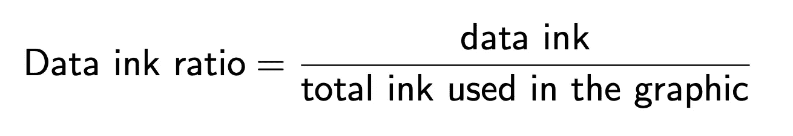

# 每个数据科学家都应该知道的 5 个数据可视化概念！

> 原文：<https://medium.com/analytics-vidhya/5-data-visualization-concepts-every-data-scientist-should-know-bbd48c1336f1?source=collection_archive---------7----------------------->

# 1.安斯康贝四重奏

安斯科姆四重奏是由统计学家弗朗西斯·安斯科姆于 1973 年创作的。安斯科姆的四重奏由四个数据集组成，它们具有几乎相同的统计特性，但在绘制时却显得非常不同。

安斯科姆的四重奏数据集

当我们找到上述数据集中所有 X 的平均值时，它们大约是 9，所有 Y 的平均值大约是 7.5。此外，所有 X 的标准偏差约为 3.16，所有 Y 的标准偏差约为 1.94
汇总统计值相等，但当我们绘制每个 X 和 Y 对的散点图时，我们会看到数据实际上非常不同！

> **仅仅依靠汇总统计数据可能会产生误导，而且局限性很大，因此，我们必须将数据可视化，以便更好地理解数据。**

图片来源:[维基百科](http://en.wikipedia.org)

# 2.解释性和探索性分析

数据科学中的可视化有两个主要目的，探索和解释。探索性分析用于寻找数据中的关系，它们不需要完美，因为我们只是在数据中寻找模式，并试图更好地理解数据。另一方面，解释性分析用于突出数据中的洞察力，并用于向观众讲述故事。

> **探索性的视觉效果用于寻找关系和总结数据中的主要特征，而解释性的视觉效果用于突出数据中的洞察力，并向观众讲述一个故事**

信用: [PInterest](http://Pinterest.com) 探索性数据分析

# 3.视觉编码

视觉编码类似于数据与显示元素的映射，这些显示元素包括位置(在 X 和 Y 轴上)、形状、大小、角度、长度等。它们用于以最佳方式向受众传达我们的数据。最重要的显示元素是:位置和长度。

颜色是一个重要的显示元素，因为它有助于为我们的观众突出数据的差异，但重要的是，它们只在必要时使用。应该添加颜色来传达你的数据，而不仅仅是为了美化。由于色盲，数据科学家被鼓励使用包括色盲受众的颜色，因此避免使用**红绿**调色板。

> **视觉编码只应在绝对必要时使用，不应过度使用，否则会违背其目的**

# 4.图表垃圾和数据油墨比率

图表垃圾包括图表和图形中所有不必要的视觉元素，会分散浏览者对图表或图形中信息的注意力。它们包括阴影、三维图表、粗网格线等。

鸣谢:[维基百科](http://en.wikipedia.org)

信用:[中等](/@sherpa_jigme/all-about-data-visualization-3b49eb57b333)

爱德华·塔夫特的数据墨水比率是用来描述数据的墨水与用来描述其他一切的墨水的比率。数据油墨比例越高，数据越好，图表垃圾越少。

> 创建图表时，删除不必要的和分散注意力的视觉元素并最大化数据墨迹比率非常重要

# 5.数据完整性和谎言因素

数据完整性是指数据的准确性、完整性和有效性。创建维护数据完整性的图表非常重要。计算图中数据完整性的一种方法是使用“谎言因子”(爱德华·塔夫特),这是一种可视化错误解释所绘制数据值的程度。

[走向数据科学](http://towardsdatascience.com)

大多数可视化谎言使用:
a .额外维度
b .双轴
c .错误的宁滨方法

信用:[商业内幕](http://businessinsider.com)

图表显示了 2012 年总统竞选，它用三维饼图描绘了这一点，请注意，由于额外的维度，60%的绿色饼图看起来比 70%的红色饼图更大。

这是另一个图表，它可能会误导观众，让他们相信这两个条形之间有很大的差异，因为图表不是从原点开始的。

# 通常，一个好的可视化应该…..

保持数据完整性
最小化图表垃圾
最大化数据墨水比率
避免使用显示元素，除非绝对必要

# 谢谢大家！