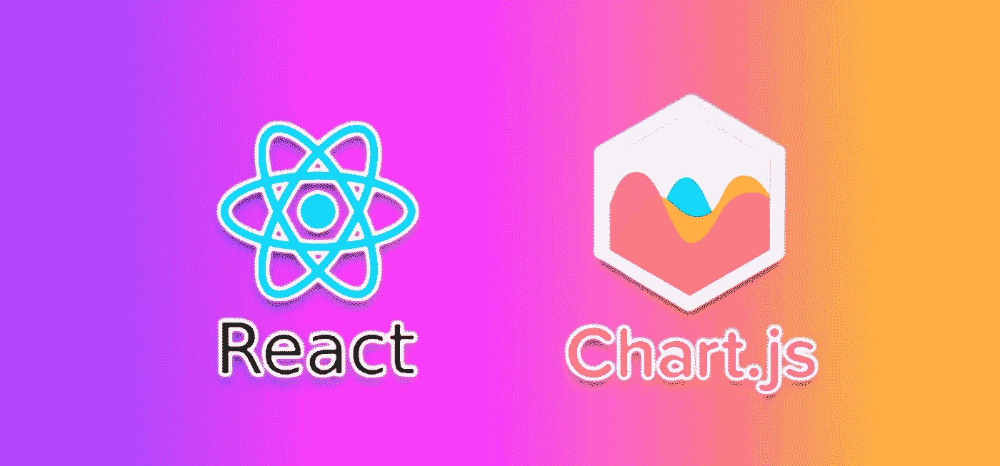
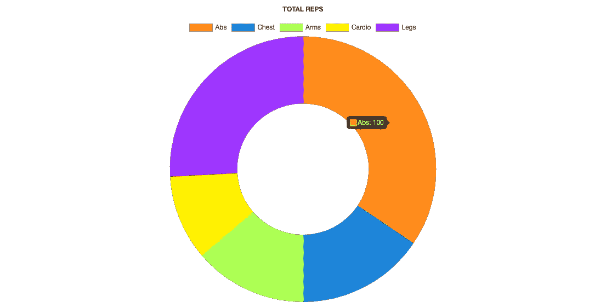
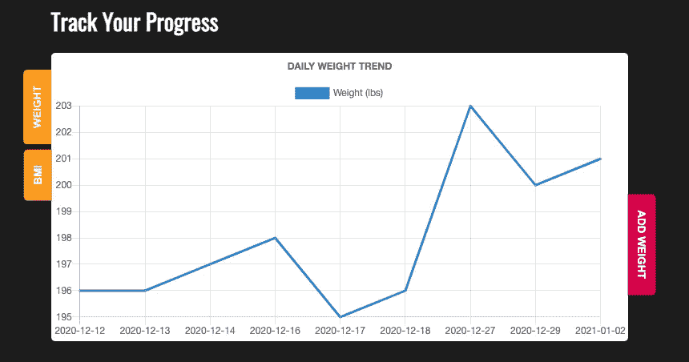

# 在 React 环境中实现 ChartJS 的 5 个简单步骤

> 原文：<https://medium.com/analytics-vidhya/5-easy-steps-to-implement-chartjs-in-a-react-environment-62a0a0ec23a9?source=collection_archive---------7----------------------->



在处理比较数据时，我最喜欢使用的 JavaScript 库之一无疑是 ChartJS。它是动态的、直观的，最重要的是易于实现。

ChartJS 是一个用于数据可视化的免费开源 JavaScvript 库。它支持八种图表类型，并在 HTML5 画布中呈现。

我最近在一个有趣的锻炼应用程序中使用了 ChartJS，用户可以记录和跟踪他们的体重、身体质量指数和每种体型的重复次数。如果没有图表，这些数据会显得枯燥和令人疲惫。但是有了 ChartJS，它给人一种很棒的视觉效果和梦幻般的色彩。



绘制每个身体部位类别完成的重复次数的圆环图

让我向您介绍我的设置过程，并演示 ChartJS 的一些基本用法。

请注意，我将使用 React 钩子在基于 ReactJS 的前端运行这个库。如果你正在寻找如何通过普通的 JavaScript 集成 ChartJS，那么 [ChartJS docs](https://www.chartjs.org/docs/latest/) 做得很好。

# 设置:

1.  与所有 JavaScript 库一样，您必须首先安装它。

在你的项目文件夹中运行`npm install react-chartjs-2 chart.js`。

如果你使用的是纱线，运行:`yarn add react-chartjs-2 chart.js`

2.将库导入到计划显示图表的组件中。

`import { Line } from 'react-chartjs-2`

请记住，`{ Line }`指的是您希望导入的图表类型。Line 将导入折线图，而导入`{ Pie, Doughnut, Bar }`将分别导入饼图、圆环图和条形图。如果您希望在同一个组件中使用不同类型的图表，您可以在一行中导入多种类型的图表，如上所述。我在下面提供了 ChartJS 支持的八种不同类型的图表列表。

*   [线](https://www.chartjs.org/docs/latest/charts/line.html)
*   [栏](https://www.chartjs.org/docs/latest/charts/bar.html)
*   [雷达](https://www.chartjs.org/docs/latest/charts/radar.html)
*   [甜甜圈和馅饼](https://www.chartjs.org/docs/latest/charts/doughnut.html)
*   [极地区域](https://www.chartjs.org/docs/latest/charts/polar.html)
*   [气泡](https://www.chartjs.org/docs/latest/charts/bubble.html)
*   [散布](https://www.chartjs.org/docs/latest/charts/scatter.html)

3.在组件中创建一个函数，该函数将概述您的图表设置及其将显示的数据。我使用钩子来保存我的图表数据的状态。

```
function chart(){
    setChartData(
        {
            labels: dates,
            datasets: [
                {
                    label: 'Weight (lbs)',
                    data: weights,
                    fill: false,
                    lineTension: 0,
                    backgroundColor: "#2085d8",
                    borderColor: "#2085d8",
                    borderCapStyle: "butt",
                    borderDash: [],
                    borderDashOffset: 0.0,
                    borderJoinStyle: "miter",
                    pointBorderColor: "#2085d8",
                    pointBackgroundColor: "#FFF",
                    pointBorderWidth: 1,
                    pointHoverRadius: 5,
                    pointHoverBackgroundColor: "#2f3640",
                    pointHoverBorderColor: "#2085d8",
                    pointHoverBorderWidth: 2,
                    pointRadius: 1,
                    pointHitRadius: 10,
               }    
          ]    
    })   
}
```

上面有很多东西。*我知道*。但是让我们把它分成两个简单的部分:`labels`，这是你的 x 轴，和`datasets`，你的 y 轴。

在上面的例子中，x 轴表示日期，y 轴表示重量。你想把所有你想在 y 轴上显示的*数据*放在`data`下。我的实际数据(日期和体重)是从我在应用程序的其他地方设置的变量中提取的。这使我的图表在数据变化和更新时保持动态。您可以参考下面的示例，以获得更清晰的硬编码示例:

```
function chart(){
    setChartData(
        {
            labels: [
                "2020-12-12", 
                "2020-12-13", 
                "2020-12-14", 
                "2020-12-16", 
                "2020-12-17",                    // dates
                "2020-12-18", 
                "2020-12-27", 
                "2020-12-29", 
                "2021-01-02"
            ],
            datasets: [
                {
                    label: 'Weight (lbs)',
                    data: [
                        196, 
                        196, 
                        197, 
                        198, 
                        195,                     // weights
                        196, 
                        203, 
                        200, 
                        201
                    ],
                    fill: false,
                    lineTension: 0,
                    backgroundColor: "#2085d8",
                    borderColor: "#2085d8",
                    borderCapStyle: "butt",
                    borderDash: [],
                    borderDashOffset: 0.0,
                    borderJoinStyle: "miter",
                    pointBorderColor: "#2085d8",
                    pointBackgroundColor: "#FFF",
                    pointBorderWidth: 1,
                    pointHoverRadius: 5,
                    pointHoverBackgroundColor: "#2f3640",
                    pointHoverBorderColor: "#2085d8",
                    pointHoverBorderWidth: 2,
                    pointRadius: 1,
                    pointHitRadius: 10,
               }    
          ]    
    })   
}
```

从这里开始，让我们剖析一下 `datasets`中*所发生的一切。`label`非常简单明了，因为它是你的钥匙/图例的标签——无论你的系列代表什么。如上所述，`data`是您的线将要绘制和跟踪的实际数据点。`fill`指是否要填充线下的空间。我选择了`false`，这意味着我只想要这条线。*

现在，超过这一点的一切，包括填充，真的归结为个人喜好。因此，我将在这里留下一个更详细术语表的链接: [ChartJS —折线图](https://www.chartjs.org/docs/latest/charts/line.html)。每种类型的图表都有自己的数据集配置，所以请务必参考正确的相应图表文档(在上面我的图表列表中已经提供了每个图表文档的直接链接)。

4.增加一些生活和色彩。在我的折线图示例中，我只处理一行。如果您正在处理比较数据，并希望为每个数据集分配不同的颜色，该怎么办？

加上`backgroundColor`就行了。在我上面的折线图示例中，我只分配了一个`backgroundColor: #2085d8`，但是为了创建我的圆环图示例，我插入了以下内容:

```
function chart(){
    setChartData({
        labels: ["Abs", "Chest", "Arms", "Cardio", "Legs"],
        datasets: [
            {
                label: [
                    "Orange", 
                    "Blue", 
                    "Green", 
                    "Yellow", 
                    "Purple"
                ],
                data: reps,
                lineTension: 0.1,
                backgroundColor: [
                    "#ff9936", 
                    "#2085d8", 
                    "#acff52",     
                    "#fff000", 
                    "#9e36ff"
                ],
                borderColor: [
                    "#ff9936", 
                    "#2085d8", 
                    "#acff52", 
                    "#fff000", 
                    "#9e36ff"
                ],
                borderCapStyle: "butt",
                borderDash: [],
                borderDashOffset: 0.0,
                borderJoinStyle: "miter",
                pointBorderColor: "#2085d8",
                pointBackgroundColor: "#FFF",
                 pointBorderWidth: 1,
                pointHoverRadius: 5,
                pointHoverBackgroundColor: "#2f3640",
                pointHoverBorderColor: "#2085d8",
                pointHoverBorderWidth: 2,
                pointRadius: 1,
                pointHitRadius: 10,
            }
        ]
    })
}
```

您选择包含的颜色数量不必与数据集的数量相匹配。如果没有足够的数据集，ChartJS 将按顺序使用颜色，并在最后省略颜色。

5.最后，在我的`return`语句中，我输入我的图表组件`<Line />`来呈现我刚刚在上面的函数中创建的图表(通过 chartData 保存在 state 中)。这个部件是 ChartJS 在引擎盖下为我做的。所以根据你制作的图表的类型来调用它(如果你在制作条形图，使用`<Bar />`，等等)。在这个图表组件中，我所要做的就是 1)调用我的 chartData，2)设置您可能想要修改的任何额外的`options`。y 轴和 y 轴的标签也将放在这里。

```
return (
    <div className="chart">
        <Line
            data = {chartData}
            options = {{
                responsive: true,
                title: { text: "DAILY WEIGHT TREND", display:true },
                scales: {
                    yAxes: [{
                        scaleLabel: {
                            display: true,
                            labelString: 'Weight(lbs)'
                        }
                    }],
                    xAxes: [{
                        scaleLabel: {
                            display: true,
                            labelString: 'Dates'
                        }
                    }]
                }        
            }}
        />
    </div>
);
```

给你。



您可以摆弄您的输入数据，并观察图形更新。每当我的体重或日期变量发生变化时，我就利用`useEffect`自动重新渲染我的图形，但这部分是完全可选的。

祝贺你的第一个漂亮的折线图！这都是通过五个基本步骤完成的。不算太坏，对吧？