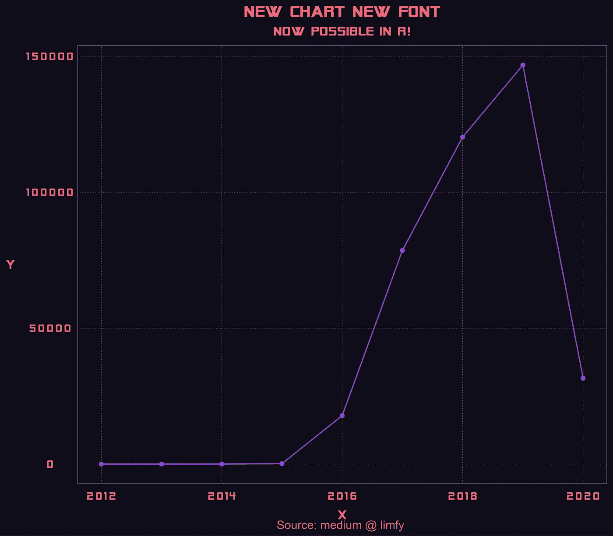
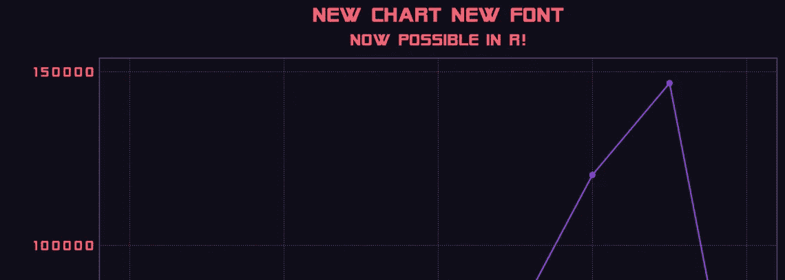

# 在 R 中导入新字体的 5 个步骤

> 原文：<https://medium.com/analytics-vidhya/5-easy-steps-to-import-new-fonts-into-r-6651bf263a07?source=collection_archive---------2----------------------->

## 看了很多 StackOverflow 帖子后的总结，现在有代码了！

作者图片:r 中生成的一个复古图表。

作者图片:科幻外星人遭遇 R 中的实心字体图

最近，我试图在我的 R 图中添加一些复古的味道，偶然看到了这篇[文章](https://github.com/moldach/vapoRwave/blob/master/Readme_files/figure-gfm/unnamed-chunk-3-1.png)。我玩得很开心，探索…