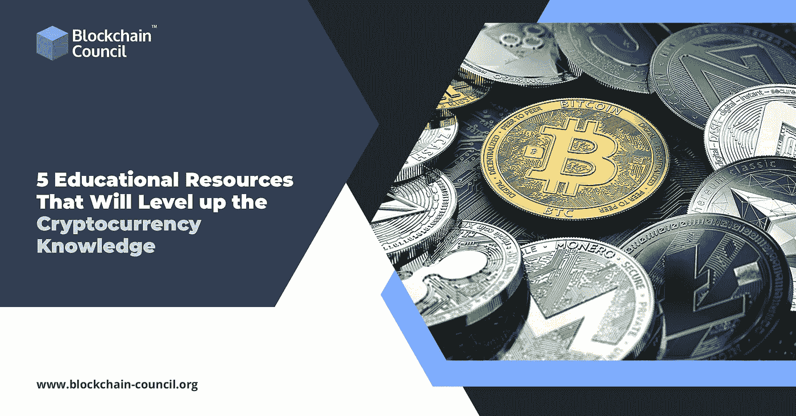

# 5 种提高加密货币知识的教育资源

> 原文：<https://medium.com/analytics-vidhya/5-educational-resources-that-will-level-up-the-cryptocurrency-knowledge-8d5edfabaf7f?source=collection_archive---------4----------------------->

加密货币是一个永无止境的思想流派。即使对于经验丰富的加密货币开发者来说，跟上比特币、区块链和不断变化的加密货币生态系统也像是一份全职工作。对于新来的人来说，想知道从哪里开始已经够困难的了。虽然加密知识随着时间的推移而发展，但现在有各种各样的工具可以帮助你开始使用比特币，有些甚至用代币来支付你，以增加交易的甜头。这里有一些最棒的资源，适合各个层次的自学者。

**技能孵化器**

技能孵化器提供多种课程可供选择。从比特币基础知识开始:如果你想了解更多关于加密货币的知识，如何在新的加密货币经济中获利。

这门课程是完全免费的，将为你提供一个坚实的基础。如果你是加密货币的新手，并且想学习如何购买和交易加密货币，那么本课程就是为你准备的。完成后，你可能想看看一些高级课程，进行更深入的培训。

**Udemy**

创建教育资源，如果你想了解比特币交易的基本面，可以查看 Udemy 的基础入门。Udemy 加密货币交易专注于 altcoin 交易，教你 ICOs 和加密货币交易的基本面。你还将学习如何通过保护比特币来防止黑客攻击。

Udemy 的用户设计和可访问性吸引了许多学生。这一点，加上课程的内容，使它成为一个优秀的基础课程。

**图表伙计**

交易加密货币如果你已经学习了一些基本原理，并想学习更高级的主题，图表家伙是为你准备的。首先，你需要了解加密货币交易的原理。然后你将学会发现模式和其他常见的指标，帮助你做出更好的交易选择。长期和日内交易方法都包括在课程中。

**密码策划者**

这个秘密策划者发布了许多关于这个主题的视频。其中一些是完全免费的。若要访问其他人，您需要购买高级订阅。

有针对 rank 初学者以及长期从事加密货币交易的人的视频。从免费内容开始，你可能会发现优质内容物有所值。

**比特币基地学**

他们以独特的视觉方式教授加密货币的基础知识。你可以在这里找到一系列互动的抽认卡，你可以用它们来学习一些重要的主题，比如采矿、采购和销售。

比特币基地学习，在很大程度上，避免在这一部分过度宣传。只有一个简短的商业广告，将 coinbase 描述为一个安全的交易平台。

**加州大学伯克利分校 EdX:比特币和加密货币**

EdX 课程走了一段弯路，但对那些有兴趣深入研究支撑密码学的一些理论的人非常有用。aetherium 虚拟机是讨论的主题之一。还包括一场有趣的博弈论辩论，讨论如何入侵比特币网络。

**收尾**

无论你是比特币新手还是加密货币爱好者，想要填补任何知识空白，都可以利用一些奇妙的材料。

加密货币教育对于开始接触不断增长的行业非常重要。加密货币开发人员在就业市场上需求量很大。接受[加密货币培训](https://www.blockchain-council.org/certifications/certified-cryptocurrency-expert/)绝对会让你如鱼得水。