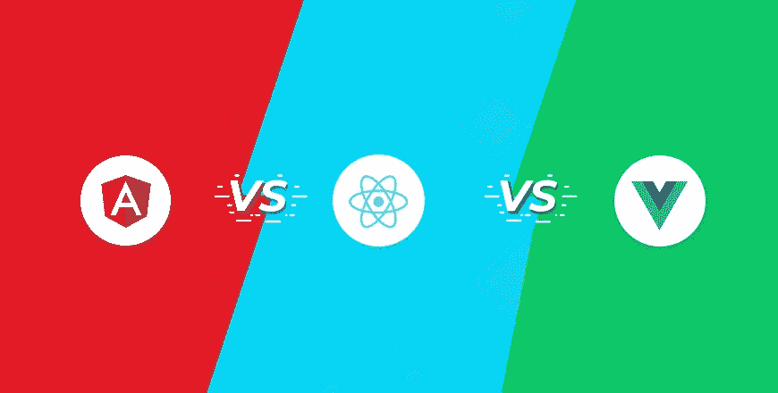
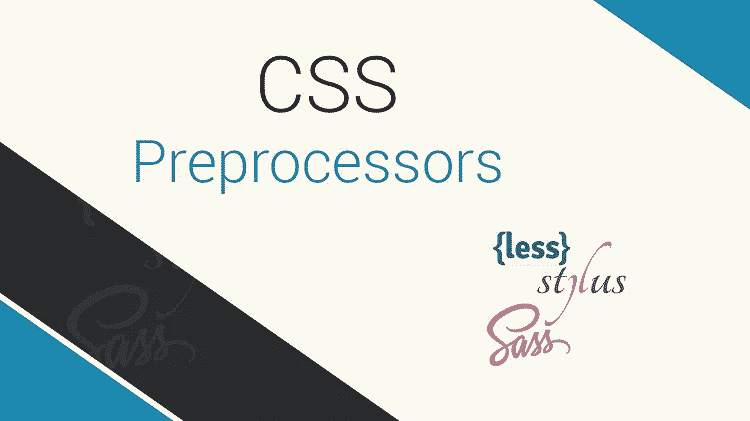
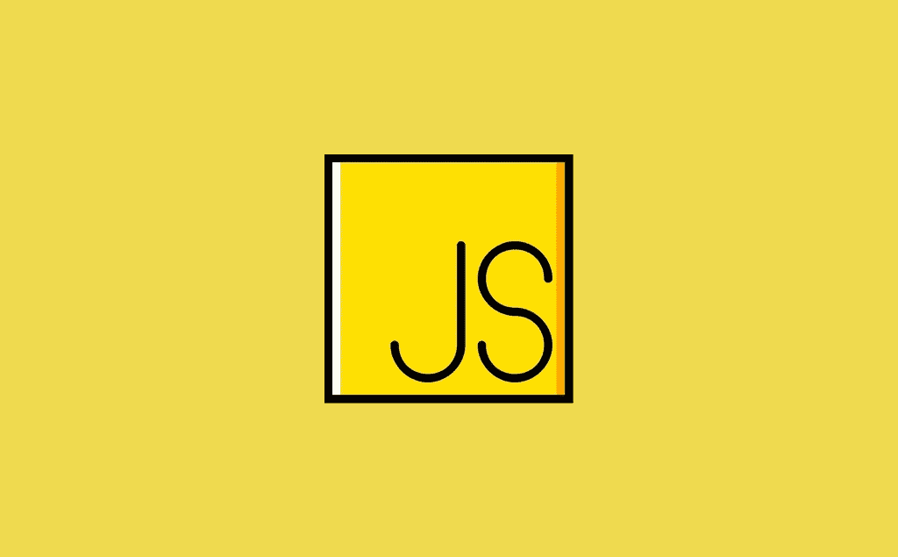
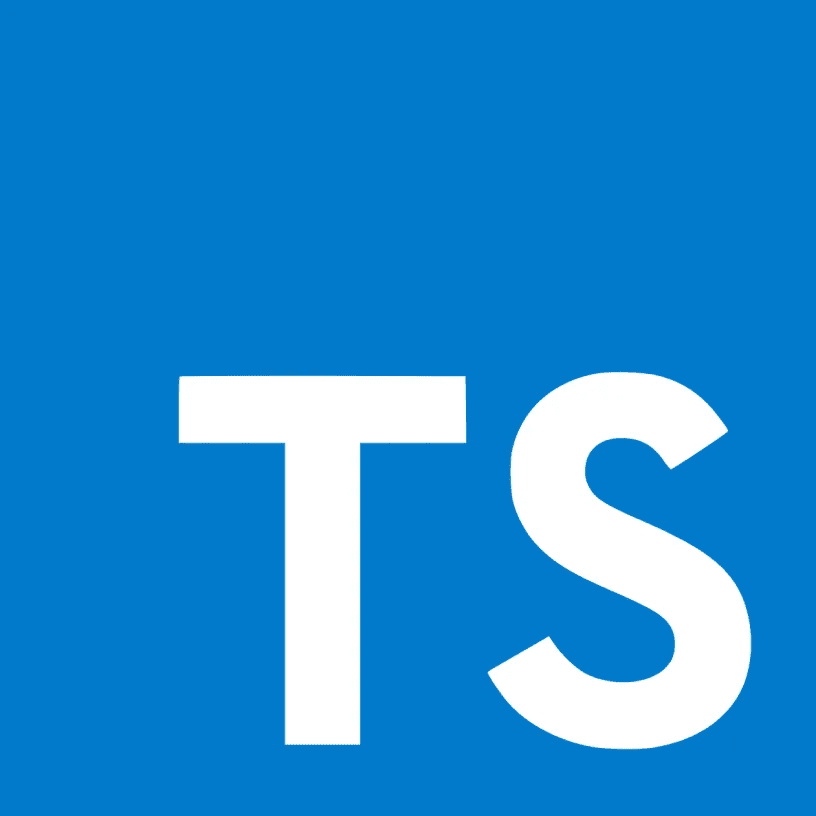

# 获得第一份前端开发工作所需的 5 项基本技能。

> 原文：<https://medium.com/analytics-vidhya/5-essential-skills-you-need-to-land-your-first-frontend-development-job-91d6773e19e7?source=collection_archive---------20----------------------->

照片由 Caleb Woods 在 Unsplash 上拍摄

外面有很多语言和工具。
**HTML
CSS
Java
c++
JavaScript
命名它们**

所以，如果你感到不知所措，我有你，我有你。

许多初学者浪费大量时间从一件事跳到另一件事，最终什么也学不会。

这篇文章将带你浏览**要点**，给你一个清晰而坚实的**学习路径**，这样你就可以用你的**时间**学习那些**最重要的**东西，这些东西是你获得第一份前端开发工作所需要的**和关于**需要多长时间**的**建议，以及将在最后讨论的**惊人的学习资源**。

我们走吧！

# 1.基本原则

作者图片

先说基础！

要成为一名**前端开发人员**，你需要学习前端开发的**基础语言**有:
**1。HTML -结构化网页。CSS -让他们美丽
3。JavaScript -给他们编程**

**想起一个自己。** 让我们说**你**(一个人类)在现实世界中，就像是互联网上的一个网站或网页。

它有一个**结构**，也就是你的**骨架(HTML)** 。

它有你的**漂亮的皮肤**装饰着**华丽的衣服、珠子**等等 **(CSS)**
你还可以做一些事情，比如**跳舞、按按钮、拿书、做特技**等等，这些都是由**大脑(JavaScript)** 编程并**控制**的

> 你明白了吗？
> 酷吧？

好吧，假设你想建立一个像脸书一样的网站。

在你的脸书订阅中挑选一个帖子吧！

来源:谷歌

因此，首先我们使用 **HTML** 来定义布局的所有构件，如**文本、图像**等。。那里的积木是什么。
**1。一个形象；用户的头像
2。一些表明拥有帖子的人的用户名的文本。
3。包含帖子消息的另一个文本或图像块
4。以及用于评论、点赞、分享帖子等的图标。**

HTML 是用来给我们的网站添加这种构件的。

CSS 用来给它视觉效果，比如使文本**加粗**，**改变图标和文本的颜色**，使你的图像**变圆**，等等。

**一言以蔽之，CSS 基本上是关于审美或者视觉效果的。**

类似于**的功能当用户点击图标时**应该发生什么是由 **JavaScript** 决定的。

**每个网站都是用这三种语言建立的**

> 这是训练。
> 你学习和理解基础知识及其特性越好，你的前端开发技能就越好。

# 2.前端框架

照片由 Marius George Oprea 在 Unsplash 上拍摄

> 现在我们已经完成了基础部分！
> 
> 我们下一步做什么？

当建立网站时，会涉及到许多重复的工作。
这就是对**前端框架和库**的需求。

一个库或者一个框架**拥有**并且**为**我们提供了大量的代码，我们可以在我们的网站中重用这些代码，从而使工作**更容易**和**更快**。

**原因**像这样的原因导致**现在很多公司**使用这些流行的和被很好利用的框架之一，比如 **React、Angular 或 Vue。**

作者图片

现在更精确地说， **React** 不是框架而是**库**。

事实上，框架迫使我们的应用成为一种结构，而库不会，这是它们之间的一个显著区别。

因此，所有用 Angular 或 Vue 这样的框架构建的应用程序，最终都有一个类似于**的结构。**

库只是**提供**一些代码给我们重用。

所以当你从一个项目转到另一个项目时，你会看到很多熟悉的东西。

但是如果我们抛开这些细微的区别，所有这些工具都为我们提供了相似的优势。它们帮助我们更快地构建应用程序。

> 酷吗？

现在让我说，你不需要学习所有这些来开始。
**React 是这些工具中最受欢迎的。**

> 为什么？

大概是因为它是由**脸书**开发的，用于构建 **Instagram app，脸书 app** 等等。

**在这里获得全部原因**

 [## Why React 简直令人难以置信[React JS]。

### “嘿但丁！我对 HTML、CSS 和 Vanilla Javascript 了如指掌，那么学 React 有什么用呢？”

favouragbejule.medium.com](https://favouragbejule.medium.com/why-react-is-incredibly-mind-blowing-react-js-969ed5d55c00) 

我建议学习**反应**。

所以当你找到新工作时，你可能需要学习其他工具。

# 3.版本控制系统

布鲁克·卡格尔在 Unsplash 上拍摄的照片

好的，下一步是学习**版本控制系统。**

版本控制系统帮助开发人员跟踪我们的**项目历史**，并与其他人**协作**。这也是它出现在几乎所有工作描述中的原因。

> 我选择什么？

**你选 Git！**

作者图片

它被 71%的软件开发团队使用，使它成为世界上最流行的版本控制系统，也是您的最佳选择。

我说你专注于它，忘记其他的！

> 好家伙，名单快结束了！那么我们下一步做什么？

所以，CSS 是一种古老的语言，有一些局限性。

当你将它应用于**中型或大型网站**项目时，你的代码迟早会变得**难以维护**，因为你的代码会变得**扭曲且极其复杂。**

> 因此，更改某些内容很可能会破坏代码中的其他内容。
> 
> 那么 CSS 为什么没有进化呢？
> 
> 你可能会想。

事实上，它已经是第三版了。

每当 CSS 上引入一个新特性，所有现有的浏览器都需要支持该特性。不幸的是，这个旅程相当缓慢。所以这就是 CSS 预处理程序来拯救世界的地方。

# 4.CSS 预处理程序

它是一个软件或工具，使你能够从另一种语言中创建 CSS 代码，这种语言比 CSS 更好。

我们没有用普通的 CSS 来编码，而是利用了另一种语言，这种语言看起来与 CSS 相似或几乎相同，但是它也拥有一些额外的特性。

**然后，CSS 预处理程序接收我们的代码，然后把它转换成普通的 CSS，这样所有的浏览器都能理解它。
这是 CSS 预处理程序的唯一目的。**

有很多预处理器，例如:
**1。萨斯
2。唱针
3。少等等。**

同样，没有必要学习所有这些来获得前端开发工作，因为它们都是用于解决相同问题的类似工具。

> 就像不同公司生产的灯泡一样，它们都是用来照亮房间或环境的。

当且仅当你理解了 CSS 预处理器的用途，并且知道如何操作和使用它时，你就非常适合了。

然而，我推荐学习其中最受欢迎的 **Sass** 。

**现在，我们在 JavaScript 上遇到了同样的瓶颈。
作为 CSS，JavaScript 是一门相当古老的语言，有一定的局限性。**

# 5.改进的 JavaScript

作者图片

如今，一些开发人员利用改进的语言如 **Typescript 和 Coffeescript** 来编码。

一个叫做**移植器**的工具或软件接受我们的现代代码**翻译**并**编译**它，这样所有的浏览器都能理解。

> 同样，你不需要学习所有这些语言。你只需要知道其中的一个就可以开始了。

我推荐使用 **Typescript** ，主要是因为它是最广泛使用和认可的。

打字稿标志

当你从事使用不同语言的项目时，学习另一种语言会快得多，因为它们彼此非常相似。

# 学习路径

林赛·亨伍德在 Unsplash 上拍摄的照片

因此，为了获得你的第一份前端开发工作，你需要学习；
**1。HTML
2。CSS
3。JavaScript。**

因此，如果你每天花大约 4-5 个小时学习和编写代码，你应该在 3 个月内获得深入合理的基础语言知识。

让我现在说，你不会成为一个**专家**，但是你会足够了解他们来构建项目。

然后，你需要学习一个像 **React** 这样的前端框架或者库。
**大约需要 1 到 2 个月的时间来学习 React。**

接下来你需要学习一个类似 Git 的**版本控制系统。**大约 2 周半你应该能**了解流程。**

> 这些是你在几乎每份工作描述中都能找到的绝对要素。

然而，如果你有**的额外时间**，我建议你学习 **Sass 和**打字来脱颖而出，同时**增加你的工作机会。**

SASS 很简单，你需要一两周的时间来学习。打字稿可能要花你两到五周的时间。

> 因此，如果你在 7 个月后每天学习和编码几个小时，你应该可以申请初级前端开发人员的工作。

# 惊人的学习资源

我在网上寻找一个学习这些技能的完美课程。

我已经找到了许多惊人的资源，但这一个真的击中了要害。

这个课程是由一组程序员完成的。他们是聪明的程序员。

下面是查看的链接！👇

**被** [Rafeh Qazi](https://medium.com/u/c1a517a199d2?source=post_page-----91d6773e19e7--------------------------------) 用 [Amaanath Mumtaz](https://medium.com/u/80ca3d8cd859?source=post_page-----91d6773e19e7--------------------------------) ， [Rishi Patel](https://medium.com/u/f311e68e99f3?source=post_page-----91d6773e19e7--------------------------------) 用 JavaScript 叫 [**利。**](https://www.cleverprogrammer.com/pwj)

这会改变你的生活。

# 最后的想法

事实上，我们都是不同的。到达那里可能会花更少的时间，也可能会花更长的时间。但是，不要气馁
我相信如果你下定决心、持之以恒并对它充满热情，你可以实现这一壮举和你想实现的任何事情。

像汤姆·库格勒和祖列·雷恩这样了不起的作家给了我写作的灵感

感谢你的时间，祝你好运！
Agbejule Kehinde 青睐。