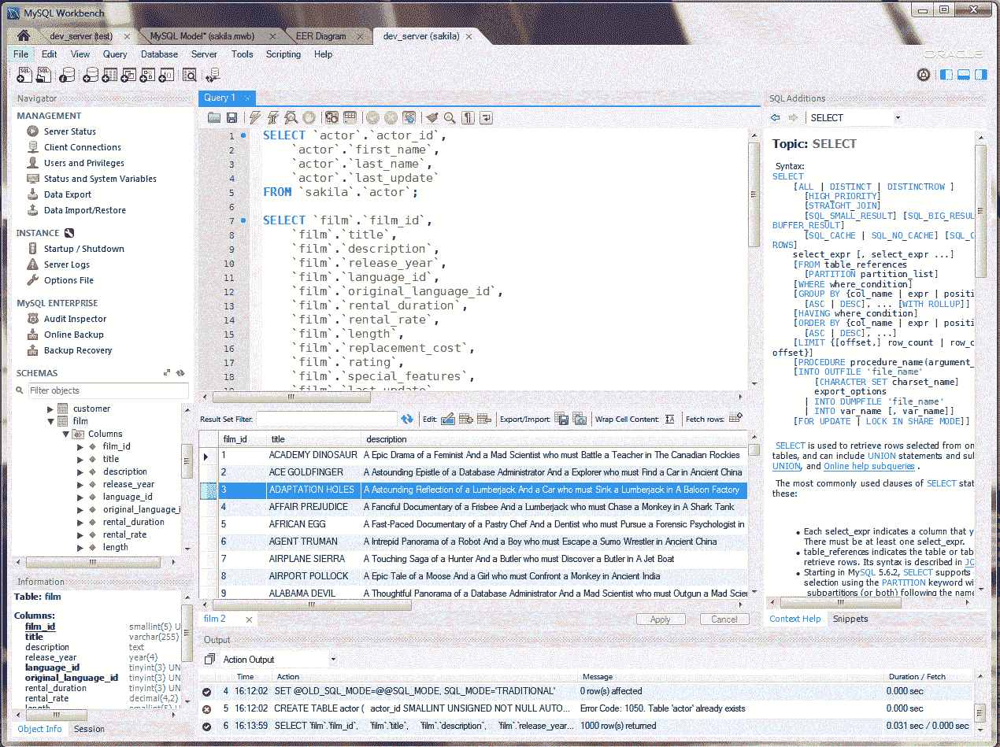
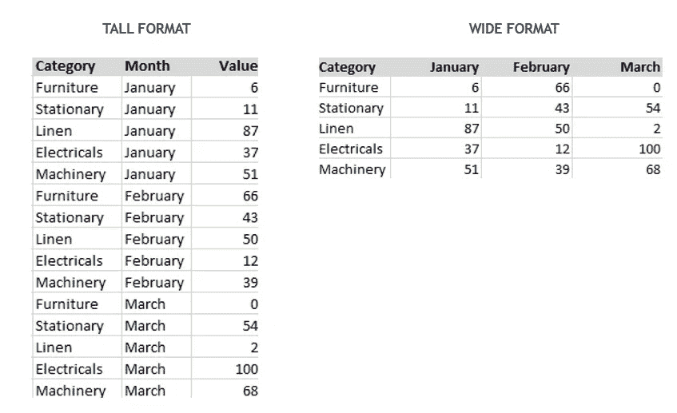
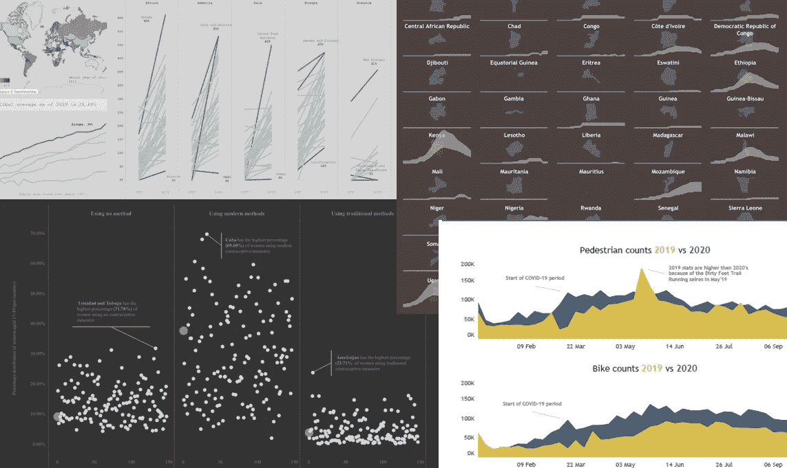
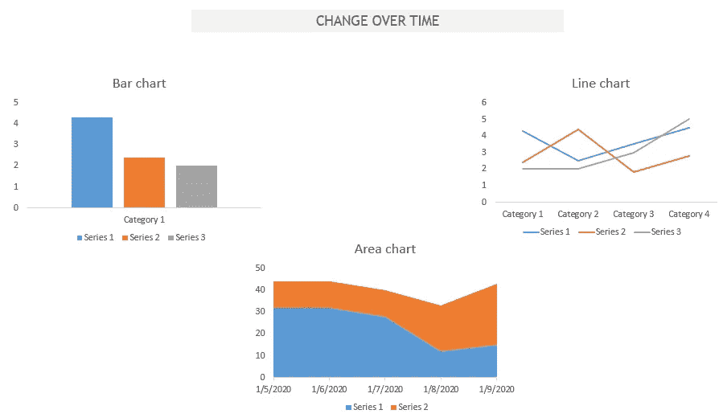
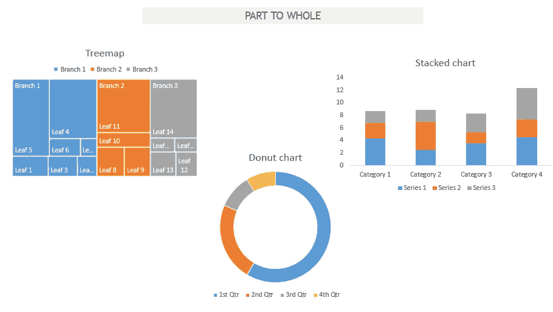
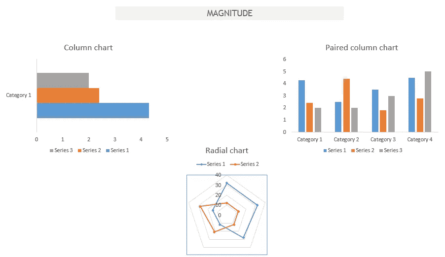
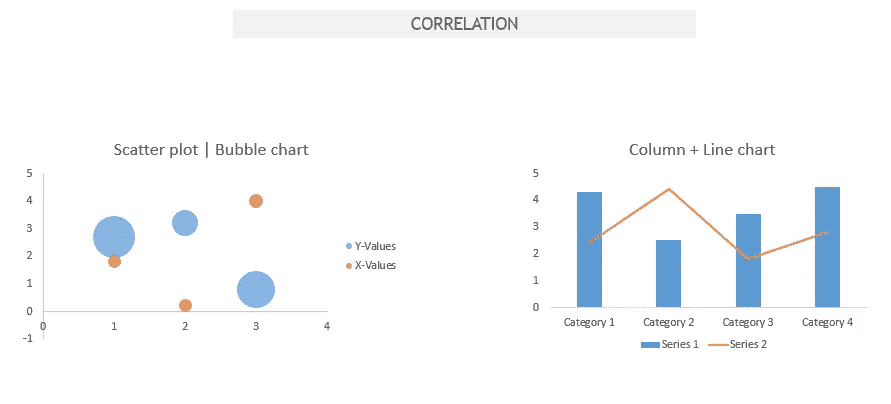

# 强烈推荐 2021 年成为数据分析师需要学习的 5 项技能/工具

> 原文：<https://medium.com/analytics-vidhya/5-highly-recommended-skills-tools-to-learn-in-2021-for-being-a-data-analyst-5fdc66d3374?source=collection_archive---------12----------------------->

*本文作为* [*数据科学博客*](https://datahack.analyticsvidhya.com/contest/data-science-blogathon-4/) *的一部分发表。*



图片由 MYSQL workbench 提供

# 介绍

这些工具和技能可能与机器学习和深度学习没有任何密切关系。目前，对建模前和建模后阶段使用的技能有更高的需求。我没有参考招聘启事中的信息，因为根据我的经验，职位描述中所写的和工作中实际做的之间似乎有非常明显的脱节。

不再拖延，这里是成为数据分析师的五个强烈推荐的技能。您可能会看到它们与数据科学家、数据工程师或商业智能(BI)开发人员的技能重叠。但就目前的需求而言，并非一切都是脱节的。

# 1)微软 Excel


称之为管理者的工具，MS Excel 很容易在一群可能属于也可能不属于核心数据世界的人中间成为分析的推动者。不管你最终学习和应用了多少编程语言或可视化工具。你将主要被要求提交 Excel 电子表格的结果。

MS Excel 的易用性和渗透力是无可争议的。从提供见解到为决策做出贡献，掌握正确的 Excel 功能无疑会提高您的工作效率，并使您能够与非技术人员交流。

## 益处和用途

MS Excel 可能是最广为人知的数据处理工具。几乎每个人都知道它，每个人都有自己对该工具的爱恨情仇。但是 MS 擅长数据科学，当我们被 Jupyter 笔记本和大数据包围的时候？让我从我的经历中写下我的看法

a) **轻松编辑数据**:如果你注意到 Excel 多年来一直采用相同的布局，我认为这使用户能够轻松编辑、格式化、清理和共享数据。Google sheets 是 Excel 布局和设计的复制，但可以很容易地为多个用户扩展，并与多个平台集成。

b) **制作可视化**:只需简单的按键，数据就能轻松变成图表。也许我相信我们大多数职业生涯中可视化的开始是由 Excel 促成的。

## 挑战

虽然 Excel 是一个非常强大的程序，但是电子表格却很脆弱。因为数据的准确性在很大程度上也取决于输入数据的人。除了使用不正确的公式之外，数据还容易出现简单的输入错误，例如单击错误的单元格或简单的复制粘贴错误。

此外，该工具从未被设计为处理我们现在正在处理的大量数据。但是对于将 16，384 列限制为 10，48，576 行的小型调查来说，这是最可接受的，也是最常用的。在从较大的数据库中提取一部分数据后，还可以方便地进行即席报告。

使用该工具的用户经常面临的另一个挑战是缺乏错误控制，特别是在格式方面。日期可能有不同的格式，您可能会看到相同的输入为 1–1–21，1–01–2021 10:00，1-Jan。然后需要使用 VALUE 或 DATEVALUE 等函数将其转换为统一的格式。

> 自动化、可扩展性和安全性是其他一些经常被谈论的工具挑战。但是不用说，同时加强我们现有的技能和学习新的方法总是一种选择。这可能在某些领域具有挑战性，但在实践团体和职业中，可接受性和理解性是无可争议的。

***资源—***[***【https://blog.hubspot.com/marketing/learn-excel-resources】***](https://blog.hubspot.com/marketing/learn-excel-resources)

# 2) SQL


图片由 mysql.com 拍摄

结构化查询语言，在数据世界中确实是老生常谈。简单来说，它用于从数据库中提取数据，创建管道，甚至在某种程度上操纵数据。

无论您是数据工程师、数据科学家、BI 开发人员还是数据分析师，您都需要亲自操作 SQL。对这门语言的熟练掌握将使你的分析，尤其是建模变得更加有力。数据不再是静态块，而是数字流，因此编写优化且高效的 SQL 查询是绝对必要的。

## 益处和用途

始于 70 年代的 SQL 已经成为数据科学工具包中不可或缺的工具。因为它有助于与数据库通信，所以它充当了访问、插入和操作数据的网关。根据我的经验，谈谈为什么需要 SQL 才能在数据科学职业生涯中取得成功

a) **理解数据集的基本要素:**作为数据领域的专业人士，首先想到的是能够理解数据集。数据集包含哪些指标、数据点等？SQL 允许充分调查数据集的灵活性。它使用户能够识别异常值，找到空值，甚至在一定程度上格式化数据集。

b) **允许用户管理大量的数据**:从电子表格的角度考虑数据，集成它们的能力，并使它们相互交流在 Excel 中是可行的。但是随着数据量的增加，复杂性也随之增加。这时 SQL 提供了一个解决方案，允许用户处理关系数据库中的数据池。

c) **它真的是通往数据世界的大门**:对于大多数数据科学来说，精通 SQL 是数据分析工作的先决条件。从某种意义上来说，如果一个人不知道与数据交流的语言，那么可持续性就会受到质疑。SQL 可以很容易地与许多数据库管理系统集成，如 Oracle 数据库、MySQL，并形成大型数据湖平台(如 AWS Redshift)的基础。因此，SQL 将为需要数据分析师或科学家的组织提供受欢迎和有用的能力。因为 SQL 已经存在了。

## SQL 中的基本命令

a) **选择**:决定在结果中显示哪一列数据，伴随**从**语句确定表格，

*例子*

```
*SELECT column1, column2, ... FROM table_name;*
```

b) **创建**:允许创建数据库或表格。通常后跟构成数据库或表格结构的列和格式，

*示例*

```
*CREATE table_name (column1 datatype, column2 datatype, ...) ;*
```

c) **其中**:限制查询返回的行数

```
*exampleSELECT column1FROM table_nameWHERE (column1 = x or column1 between x AND y);*
```

d) **GROUP BY** 它允许组合行并形成集合

*示例*

```
*SELECT column1, COUNT(*)FROM table_nameGROUP BY column1;*
```

e) **有**:允许按分组过滤汇总数据，限制记录集

*示例*

```
*SELECT column1, COUNT(*)FROM table_nameGROUP BY column1HAVING COUNT(*) < value;*
```

f) **JOINS** :允许两个表的数据合并，JOIN 运算符用于根据表中某些列之间的关系合并两个或多个表中的行。连接类型(内连接、左连接、右连接、外连接或全连接)

> 总之，SQL 构成了数据科学的基础。它很容易与许多脚本语言集成，建立与关系数据库的通信，并且确实是通向数据世界的门户。界面可能需要调整，但即使是一个简短的查询也可以从大量数据中获得洞察力。

***资源—***[***https://popsql.com/learn-sql***](https://popsql.com/learn-sql)

# 3) Python

转到编程语言，Python 现在已经成为数据分析师、数据科学家甚至 BI 开发人员的首选语言。库允许语言与可视化工具的集成，以执行各种数据操作，数字表达式。如果你身处数据世界，它现在正成为你投资组合中不可或缺的一部分。

大多数人现在都在使用 Python，而不是 R。没有强调 R 的重要性，而是强调了 Python 中的易用性、可用性以及各种可用的包和库。现在，甚至在谷歌、脸书和 YouTube 上，它也已经和 C++和 Java 一样成为一种重要的语言。

根据 2018 年 KDnuggets 软件民意调查，66%的参与者报告说他们使用 Python 进行日常报告和分析。

**第一步:掌握基本原则**。其中一个重要的工具是 Jupyter Notebook(https://www . data quest . io/blog/Jupyter-Notebook-tips-tricks-shortcut s/)，它预先打包了几个库。加入一个社区并与志同道合的人接触以增加学习机会也很重要。

**第二步:练习 Python 项目**。使用 Python 构建小项目，并应用步骤 1 中的内容，将会提高士气，并有助于建立投资组合的基础。下面是一些项目的列表(https://www . kdnugges . com/2016/11/top-20-python-machine-learning-open-source-updated . html)。

**第三步:转移到特定的数据科学库**。数据科学最重要的两个库是 Pandas 和 NumPy。这些专用于探索和处理数据。下面是一些库的列表(https://www . data quest . io/blog/15-python-libraries-for-data-science/)。

第四步:拥有一个投资组合。投资组合带来工作，在这个时代是必须的。人们可以将项目的类型细分为清理、可视化、高级分析等。但是在展示结果时保持清晰是关键。

Python 拥有多样化的应用组合，它被用于软件开发，创建 web 框架，用于图形设计，不要错过分析和数据科学等。它确实需要一个单独的博客来谈论 Python 的好处和用途，但是在尝试谈论这种语言的一些具体好处和用途时，这里有一些

a) **灵活性和可伸缩性** : python 是一种免费的开源语言，拥有庞大的在线社区。它可以在许多其他可用的语言中快速扩展。您会发现 Python 被应用于多个行业，加速和增强了开发和分析。

b) **库**:由于用途广泛，Python 有数百个库和框架，它们是开发过程的巨大补充。作为数据分析师或数据科学家，您会经常发现自己在使用以下库

Pandas-主要用于数据分析，用于操作，非常适合不同的数据结构，如表格、时间序列等 NumPy-代表数值 Python，对于数值计算至关重要。它是数据科学的核心库之一，允许用户执行各种数学运算*Matplotlib——它是语言中一个强大的可视化库。它提供了各种各样的图表，从直方图到折线图甚至热图**Scikit——本质上是为了机器学习，它包含了很多工具，比如分类、聚类、回归等**SciPy——代表科学 Python，建立在 NumPy 之上，用于各种高级工程模块*

c) **自动化和报告**:通常每月或每周生成的报告可以使用 Python 自动化。通过导入 Pandas 库并加载数据，可以轻松地定制数据透视表。然后可以很容易地导出到 Excel 文件中。Python 还允许通过自动化美化报告，为标题、副标题添加格式，制作彩色图表等。最后，整个工作流程可以实现自动化。

> 然而，像任何其他事物一样，Python 也有它的缺点。它可能缺乏速度，有时需要使用自定义运行时。与其他高级语言相比，还缺少一些内置特性，但是大量的库和框架弥补了这一缺陷。

***资源—***[***https://www.fullstackpython.com/best-python-resources.html***](https://www.fullstackpython.com/best-python-resources.html)

# 4)数据争论

称之为数据转换、数据管理或数据争论，它是数据分析过程的一部分，位于获取数据和进行探索性数据分析之间，是数据分析师或数据科学家需要掌握的核心技能之一。它可以定义为一组任务，您可以通过这些任务来了解您的数据，并为几乎任何分析准备您的数据。

众所周知，该过程会占用数据分析师或数据科学家在任何项目上花费的大量时间。谈到特性，知道如何整合来自多个数据源的信息、转换、清洗和处理质量问题是成为一名优秀牧马人的必备条件。

这个过程可能看起来不像数据科学过程中的其他步骤那样引人注目，但它对以有意义的方式取得进展至关重要。其重要性不容忽视，产出在很大程度上取决于这一步骤能否成功完成。

## 数据争论的过程和步骤

尽管没有操作和流程顺序的集合列表，但目标是使数据对我们的用例有用。但是要分解，这个概念分成三个简单的步骤

a) **提取或收集数据**:根据用例或项目，所需的数据可以从单一来源提取，或者甚至可能需要从各种来源(表格、文件、数据库)收集。现在数据可能是也可能不是这种格式，具体来说就是数据格式。

b) **清理数据**:第一步就是清理数据。换句话说，删除并修复不正确、损坏、重复、不一致和丢失的值。如果数据点没有意义，计算机就不能为我们做决定。

在我看来，这本质上是数据争论的起点。以下是一些数据清理技术的列表

*   正常化
*   数据插补
*   拼写检查
*   语法错误
*   过滤
*   直接删除缺失、重复和不相关的值

c) **对数据的转换**:通常下一步是转换数据的结构，使其与我们的用例以及随后的分析兼容。大多数数据要么是高格式，要么是宽格式，两者各有优缺点。



对于每个变量的每个观察值，高格式都有一行。这不是用于演示的理想数据格式，但很容易创建可视化效果并向其中插入数据。这可以通过将列转置到一列中来实现，其中每个值作为每个值前面的列的名称。

宽格式将每行作为一列表示变量的观察值。在比较不同观测值的变量时非常理想。这种格式便于获取汇总统计数据、执行各种操作并最终呈现结果。

> *总之，数据的质量和结构是需要注意的两个最重要的方面，因为它直接影响结果的质量。正如人们常说的垃圾进垃圾出(GIGO)。数据争论通常是一个迭代过程，评估、重新评估数据以确保质量和结构总是一个好主意。*

**从工具列表中选择并学习—**[**https://www . Gartner . com/reviews/market/data-preparation-tools**](https://www.gartner.com/reviews/market/data-preparation-tools)

# 5)数据可视化和讲故事



可视化分析创建了数据的交互式视图，揭示了其中的模式，使每个人都成为分析师。它不再局限于“一个”工作角色，而是已经扩散到数据世界中的大多数角色。

数据可视化结合了计算机科学、信息可视化、认知和感知科学，已经成为分析的一个重要部分。事实证明，它简化了从复杂和大量数据集做出决策的过程，并使消费者能够更快地理解数据。它使开发人员能够轻松地向不了解技术的受众销售产品。

无论你使用什么工具，Tableau，PowerBI，Google Data Studio，Python，R 等等，它的思想是将大量数据聚集到一个可扩展的优化模型中，最终让你将它转换成一个可视化的。

## 益处和用途

数据可视化现在被视为完成整个数据生命周期的一个重要步骤。指出该技能的许多好处和用途中的几个

*   它使得检测大量数据中的模式、趋势甚至异常值变得更加容易
*   过程监控，并帮助调整过程以确保性能
*   有助于将观众的注意力引导到最需要的地方
*   创建一种向非技术人员传达结果的简单方式，而不管数据量有多大
*   有助于从数据中讲述一个故事，视觉表现已被证明很容易理解

## 根据数据性质广泛使用的数据可视化示例

在这里，我按照常用来表示的数据，整理了一些最广泛使用的数据可视化。

**随时间变化**:用可能随时间变化的指标来表示时间序列数据。在我看来，下面是三种广泛使用的可视化方法来表示随时间的变化

*   条形图-一次只显示一个变量的数据
*   面积图-适用于表示总面积随时间的变化
*   折线图——非常标准且经常采用的显示时间序列数据的方式
*   其他类型-斜率图、日历图



**部分到整体**:表示单个实体或整体的元素。例子可以是预算、学术成果。以下是三种广泛的类型

*   树状图——通常用于显示层级关系，尽管如果段数超过 3-5，可能难以阅读
*   堆积图-方便同时显示变量的大小和比例
*   甜甜圈图——本质上属于饼图家族，中间留白可以给消费者一些喘息的空间
*   其他类型-饼图、瀑布图



**量级**:以大小来表示变量的比较，可以是相对的，也可以是绝对的。以下是按大小表示数据的三种广泛使用的类型

*   柱形图-标准方式
*   径向图/雷达图——本质上是一种显示可比尺寸的节省空间的方式
*   成对柱形图-允许表示多个系列
*   其他类型-棒棒糖图、分组条形图



**相关性**:表示两个或两个以上指标/变量之间的关系。例子包括需求-供给、通货膨胀-失业等。

*   散点图/气泡图-标准且最广泛使用的方法
*   柱形图+折线图-可用于显示比例和整体，或者成本和比率
*   其他类型-热图



数据可视化可以成为演示文稿的一个有价值的补充，也是理解数据的一个真正快速的方法。除了技术方面，这个过程是愉快的，也是精神刺激的。

***从工具列表中挑选并学习—***[***https://www . Gartner . com/reviews/market/analytics-business-intelligence-platforms***](https://www.gartner.com/reviews/market/analytics-business-intelligence-platforms)

> *总之，工具可以在短时间内学会，但是比技术更重要的是商业头脑。每一条数据、每一条信息都和领域知识一样有意义。总之，一切都归结于决策矩阵和选择正确指标的能力。*

*感谢阅读，如果你喜欢阅读这篇文章，或者相信其他人可能喜欢，请分享以示支持。感谢阅读，如果你喜欢阅读这篇文章，或者相信其他人可能喜欢，请分享并鼓掌以示支持。。您可以在*[*LinkedIn*](https://www.linkedin.com/in/palakhanna/)*上找到我，并可以查看我的*[*Tableau Public*](https://public.tableau.com/profile/palak.khanna#!/)*个人资料和我的* [*博客*](https://www.instagram.com/data.chatter/) *。也请随意发表评论。*

***本文中显示的媒体不归 Analytics Vidhya 所有，由作者自行决定使用。***

您也可以在我们的移动应用程序上阅读这篇文章

*原载于 2021 年 1 月 22 日 https://www.analyticsvidhya.com**[*。*](https://www.analyticsvidhya.com/blog/2021/01/5-highly-recommended-skills-tools-to-learn-in-2021-for-being-a-data-analyst/)*