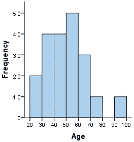
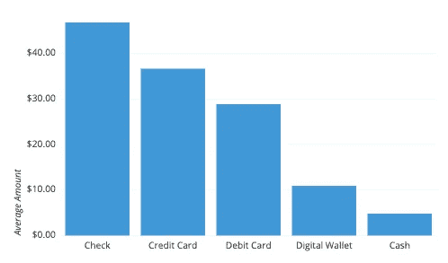
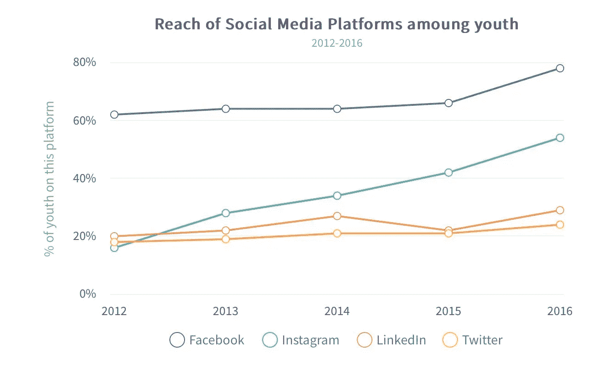
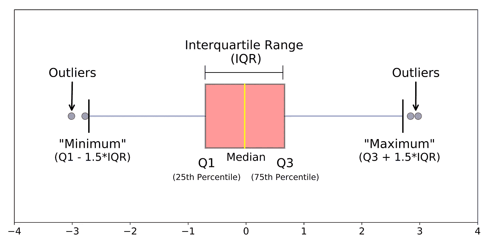
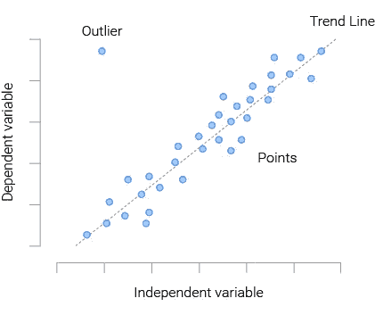

# 5 种有影响力的可视化方式来理解数据

> 原文：<https://medium.com/analytics-vidhya/5-impactful-visualizations-to-understand-the-data-5808c064d4f4?source=collection_archive---------15----------------------->

萨姆·穆卡达姆在 [Unsplash](https://unsplash.com?utm_source=medium&utm_medium=referral) 上拍摄的照片

数据可视化是数据科学中一项被低估的技能，通常不被重视。但这是数据科学中的重要过程之一，有助于理解数据，并找出值得注意或有趣的内容，以向他人突出显示。数据可视化通过将数据整理成更容易理解的形式来帮助讲述故事，突出趋势和异常值，随着“大数据时代”的到来，可视化越来越成为理解每天生成的数万亿行数据的重要工具。

所以，这里有一个图表列表，可以帮助你开始对数据的初步分析和理解。

1.**直方图**:直方图是显示一组连续数据的频率分布最常用的图形。它看起来非常像条形图，但它们之间有重要的区别。此图有助于理解数据分布、偏斜度和数据中的异常值。

2.**条形图**:条形图用于直观地总结分类数据，从而帮助我们获得不同类别之间的最小值、最大值和总值。在机器学习中，它可以用于发现不平衡的数据类，并相应地应用采样技术来优化模型的性能。

3.**折线图**:折线图通常用于绘制连续数据，以显示一个指标(或变量)随时间变化的趋势。这些还可以用来比较不同组的绩效，并确定关键的绩效问题。

4.**箱线图**:箱线图是直观执行异常值分析和收集数据可变性或分散性信息的最简单方法。这是一种基于五位数汇总(最小值、第一个四分位数(Q1/第 25 个百分位数)、中值(Q2/第 50 个百分位数)、第三个四分位数(第 3 个/第 75 个百分位数)和最大值)显示数据分布的标准化方法。

来源:谷歌图片

5.**散点图**:散点图用于观察两个数值型(连续型)变量之间的关系，了解变量之间的相关性。变量之间的关系可以用多种方式描述:正或负，强或弱，线性或非线性。

喜欢就鼓掌吧！❤