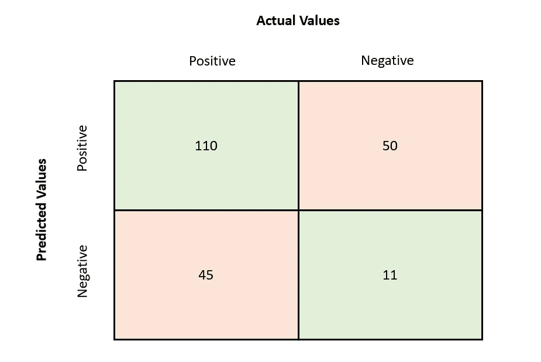
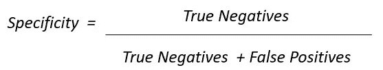

# [5 分钟阅读]衡量您的分类 ML 模型性能的指标

> 原文：<https://medium.com/analytics-vidhya/5-min-read-metrics-to-measure-the-performance-of-your-classification-ml-models-ca5eb33c266c?source=collection_archive---------25----------------------->

资料来源:ntaskmanager

‘如果你不能衡量它，你就不能管理它’。

虽然有许多指标可用于评估分类 ML 模型，但在本文中，我将重点关注我见过的使用最频繁的指标。

# **混乱矩阵**

混淆矩阵，也称为误差矩阵，通常用于描述分类模型相对于已知值的测试数据集的性能。

它可以形象地描述如下:

为了更清楚起见，让我们快速阐述几个术语:

**真正(TP)** :当数据点的*实际类*为*真*且*预测值*也为*真*时。

**真阴性(TN)** :当数据点的*实际类*为*假*且*预测值*也为*假*时。

**假阳性(FP)** :当数据点的*实际类*为*假*，而*预测值*为*真*时。所以模型错误地认为它是正的。

**假阴性(FN)** :当数据点的*实际类*为*真*，而*预测值*为*假*时。所以这个模型错误地认为它是负的。

混淆矩阵定义模型的准确性如下:

因此，如果我们有一个具有以下误差矩阵值的模型:

那么模型的精度将是 121/216 或 0.56。混淆矩阵构成了许多其他指标的基础。

# **F1 得分**

在我们讨论 F1 分数的公式之前，让我们先定义几个术语:

**a)精度:**它是模型得到的所有阳性与模型预测的所有阳性总数的比率。

**b)召回率或敏感度:**它是模型得到的所有阳性结果与数据集中实际阳性结果总数的比率。

**c)特异性或真阴性率:**它实际上是回忆的倒数，是模型得到的所有阴性与数据集中实际阴性总数的比率。

根据您的业务需求，可以根据指标调整关注点。例如，如果你正在进行一场营销活动，你可能更关注确保你接触到所有可能的候选人，而不是预测有多精确。因此，该模型将被调整为具有更高的*召回*值。或者，如果你专注于一个用例，在这个用例中，你使用模型来识别一个病人是否患有癌症，你希望对此非常确定，因此模型被调整为*精度*。

现在我们已经了解了每个术语的含义，让我们来定义总体 F1 得分指标:

简单地说，它是精确和回忆的调和平均值。你会问，为什么调和意味着什么？由于 F1 分数是一个复合指标，它被定义为调和平均值，因此即使 Precision 或 Recall 的底层值很小，它也会被标记出来(因为 F1 分数更接近于较小的值，而不是较大的值)。算术平均值就不是这样了。

# **曲线下面积**

这里我们需要定义另一个术语:

假阳性率对应于模型错误分类为阳性的阴性数据点相对于数据集中所有阴性数据点的比率。它构成了 AUC 图中的一个轴。

*模型的 AUC* (曲线下面积)是真阳性率对假阳性率的图，表示分类模型将随机选择的阳性数据点排列为高于随机选择的阴性数据点的概率。

AUC(曲线下面积)的范围在 0 和 1 之间，当然该值越高，模型的性能越好。

# 其他值得注意的指标

其他值得一提的指标是:

a) **对数损失:**这是一种结合了概率置信度思想的准确度测量，概率置信度由二进制类别的以下表达式给出:

b) **平均绝对误差:**实际值与预测值之差的平均值，表示为

c) **均方误差:**是实际值与预测值之差的平方的平均值。与平均绝对误差度量相比，它提供了更好的梯度可视性。其表示为:

虽然上面的列表并不详尽，但它有望让您对可能用于分类模型的一些指标有所了解。

为了完整起见，我还列出了一些用于其他类型的 ML 模型的指标:

a) **回归模型:** MSPE、MSAE、R 平方、调整 R 平方等。

b) **无监督模型:** Rand 指数，互信息等。

我的意图是把这篇文章的阅读时间控制在 5 分钟以内，所以现在就关闭它。但是请写下你的意见或疑问。希望你觉得这篇文章有用。愿你预测的积极总是成真:)。