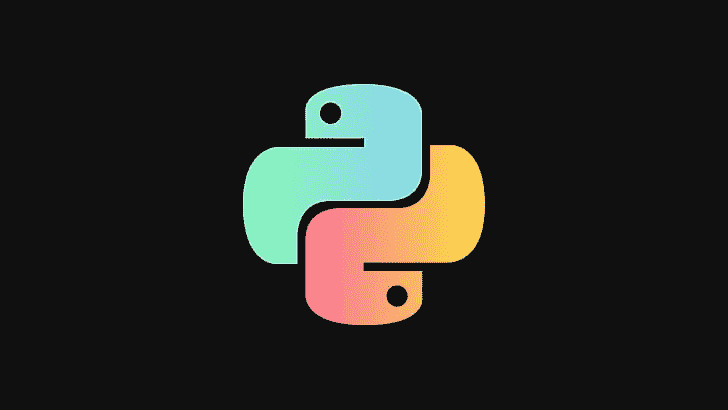

# 5 必须知道 Python 中“sys”模块的用法。

> 原文：<https://medium.com/analytics-vidhya/5-must-know-uses-of-the-sys-module-in-python-9931ab2e41e7?source=collection_archive---------19----------------------->

## 人们可以说，[‘sys’](https://docs.python.org/3/library/sys.html)是 Python 中解释器的模块，因为它提供了对解释器使用或维护的一些变量以及与解释器强烈交互的函数的访问。

> ***1。命令行参数***

传递给 Python 程序的命令行参数被 sys 模块存储在一个名为 argv 的列表中。默认情况下，argv 的长度为 1，由程序名组成。

> **2。从 Python 程序中退出**

在某些情况下，sys 模块的 exit 函数可用于终止程序并从中退出。传递给 exit 的参数是可选的。

> ***3。设置并获取 Python 解释器栈的深度***

我们可以通过' setrecursionlimit '函数设置解释器堆栈深度。这个限制防止无限递归导致 C 堆栈溢出和 Python 崩溃。sys 模块中的“getrecursionlimit”函数返回递归限制的当前值，即 Python 解释器堆栈的最大深度。

> ***4。查找解释器版本***

语言在不断发展，它们的版本在增长，功能也在变化。一种语言的一个版本支持的一些功能可能不被同一种语言的另一个版本支持。在 Python 中，高级版本的解释器具有一些高级特性，而早期版本的解释器可能不支持这些特性。在这种情况下，我们必须识别解释器的版本以使用一些更新的特性。sys.hexversion 可以用来查找解释器的版本。

> ***5。*识别平台(OS)**

程序中某些功能的实现可能因平台而异。在 Linux 上运行的代码可能不能在 Windows 上运行，反之亦然。在这种情况下，我们需要针对平台编写单独的代码。为此，我们可以使用 sys.platform 来标识主机操作系统。

> ***奖金***

`sys.**setswitchinterval**` ( *区间*)

设置解释器的线程切换间隔(秒)。这个浮点值决定了分配给并发运行的 Python 线程的“时间片”的理想持续时间。请注意，实际值可以更高，尤其是在使用长期运行的内部函数或方法的情况下。此外，哪个线程在间隔结束时被调度是由操作系统决定的。解释器没有自己的调度程序。