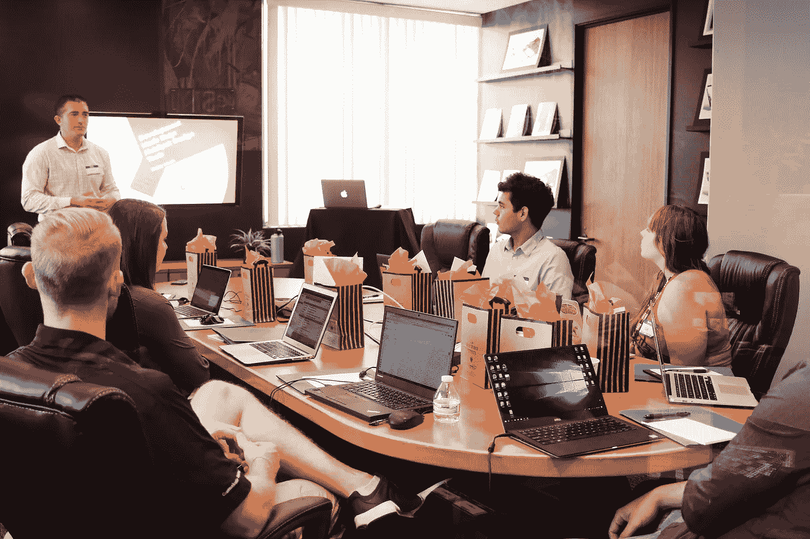
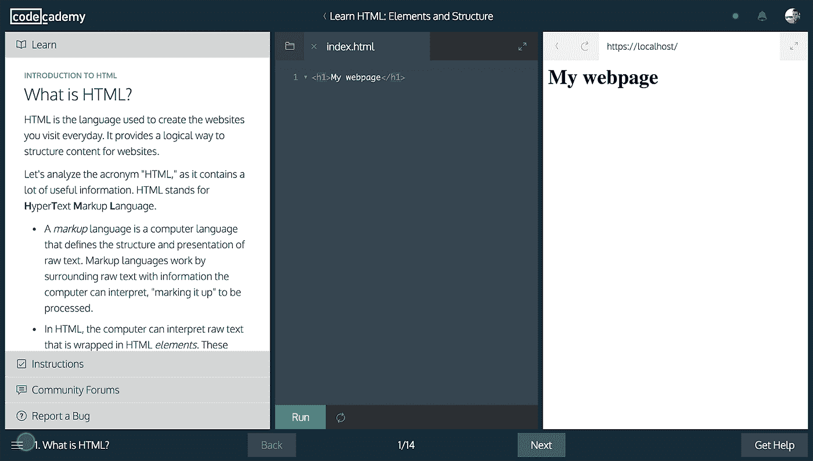
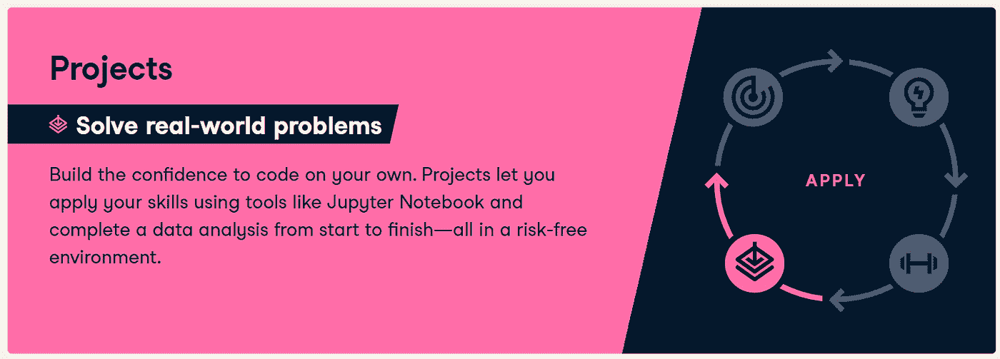
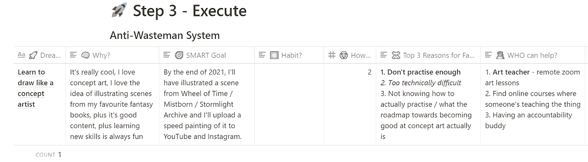
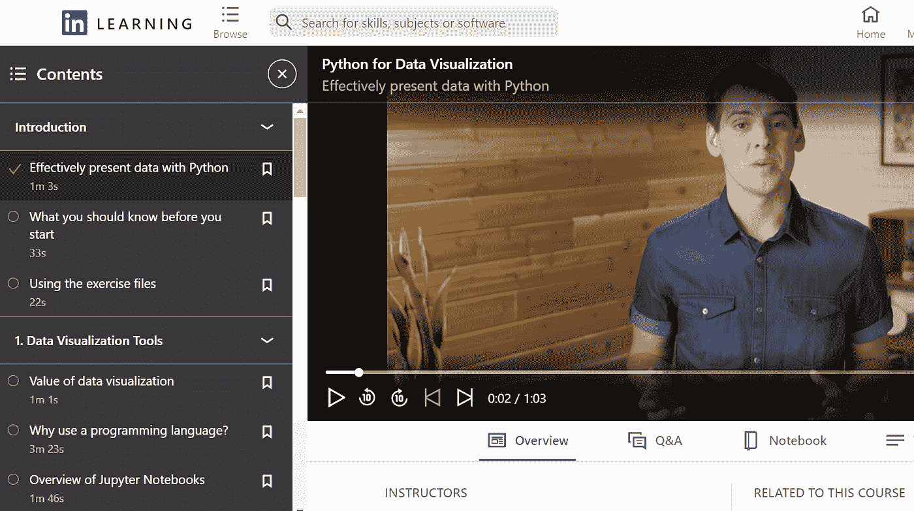

# 选择在线编程课程时被忽略的 5 个因素

> 原文：<https://medium.com/analytics-vidhya/5-overlooked-factors-when-choosing-an-online-programming-course-36144eecb93c?source=collection_archive---------19----------------------->

[活动发起人](https://unsplash.com/@campaign_creators?utm_source=unsplash&utm_medium=referral&utm_content=creditCopyText)在 [Unsplash](https://unsplash.com/?utm_source=unsplash&utm_medium=referral&utm_content=creditCopyText) 上的照片

由于各种各样的原因，选择在线课程可能是乏味的、令人不知所措的、完全令人沮丧的。万维网上有如此多的选择，如果你被提供的选项弄得不知所措，这并不奇怪。

在本文中，我将简要解释在寻找在线课程时经常被忽略的因素，无论您是想学习 Javascript 还是想在数据科学领域发展。我在过去已经完成了几门 [*课程*](https://365datascience.pxf.io/YrDOB) 以达到我目前的专业水平，但我希望我能在 2021 年底前将我的水平从中级提升到高级。

# 你喜欢你老师的声音吗？

在完成了各种科目的指南书、教程和完整课程后，我开始意识到，一个老师最微小的事情都会让我偏离学习进程。我们大多数人都遇到过这样一位学校老师，他能够把一个无聊的话题变成纯粹的魅力娱乐。在线课程也是如此。这就是为什么当务之急是在你可能不喜欢的课程中支付年费之前，先试用一下课程。

**关键要点:购买前先测试。**

# 内容是互动的吗？

Codeacademy 界面截图

学习不仅仅是读书。如果你想长期保留学习材料，你必须积极地参与其中。如果你只是简单地读一本书或看一段视频而没有实际练习[，你会很快忘记大部分内容](https://www.psychotactics.com/art-retain-learning/)。像 [Codeacademy](https://www.codecademy.com/pricing) 、 [Khan Academy](https://www.khanacademy.org/computing/computer-programming/) 和 [DataCamp](https://www.datacamp.com?tap_a=5644-dce66f&tap_s=1243242-e9a1cb&utm_medium=affiliate&utm_source=seyiagboola) 这样的平台之所以非常受欢迎，是因为它们拥有浏览器内的体验，需要在任务结束项目、日常挑战和活动的支持下进行动手操作，以巩固你的知识。

积分系统、实时编码外壳和迷你挑战不仅仅是噱头，它们[创造了多感官体验](https://www.verywellmind.com/great-ways-to-improve-your-memory-2795356)，使得[学习材料从长远来看更具粘性](https://amzn.to/35vpaiK)。此外，它们是网上体验，创造了习惯形成循环，抵消了拖延的冲动。

从另一个角度来看，在某些情况下，更少的技术可能会更有效。这不仅仅是用笔和纸做简单的笔记。手绘复杂的词干理论对巩固你头脑中的基本概念大有帮助。统计、计算机科学和数学等科目的教科书标准比十年前更容易理解。有太多的书籍出色地解释了一些概念，这些概念用外行人的术语来说就像火箭科学一样，使得沉重的学术课题不再像过去那样令人生畏。

**要点:选择一门课程，通过引人入胜的互动内容和活动让你记住材料。**

# 最终游戏:未来项目

[数据营项目部](https://www.datacamp.com?tap_a=5644-dce66f&tap_s=1243242-e9a1cb&utm_medium=affiliate&utm_source=seyiagboola)

[学习的最高级版本是基于项目的](https://amzn.to/3i2gju0)，所以当你完成课程并想要建立自己的作品集时，你心中有几个个人项目是有意义的。总是研究那些与你的兴趣相一致的类似的课程评估、项目和活动。这样你更有可能完成课程，不会中途失去兴趣。

Ali Abdaal 的[反浪费系统](https://www.notion.so/Ali-s-2020-Annual-Review-Template-3d47f8fdebba4e35a4208a68380d097d)是一个很棒的目标系统，让你写下一条通向最终目标的清晰道路，包括获得课程资格。

**关键要点:清楚地知道你想用你的知识做什么**

# 你将在何时何地学习？

由 [Slava Keyzman](https://unsplash.com/@slavakm?utm_source=unsplash&utm_medium=referral&utm_content=creditCopyText) 在 [Unsplash](https://unsplash.com/?utm_source=unsplash&utm_medium=referral&utm_content=creditCopyText) 上拍摄

希望你有一个合适的学习环境，可以让你集中注意力，每天不受干扰地练习。每个人的学习环境都会不一样。一些人每天早上 6 点在厨房用笔记本电脑学习，而另一些人则在晚上开始学习。你需要一门与你的工作环境相得益彰的课程。例如，你想在晚上最后一件事是看一小时的讲座，还是在早上第一件事是完成编码挑战？当选择一门课程来赞美它时，不要忽视你的工作环境。

关键要点:确保你的课程与你的工作环境一致。

# 你的学习循环有多长？

来自 LinkedIn 学习课程的截图

长达一小时的讲座和一周后完成的作业是一种古老的教育概念。真的没有证据表明[你甚至可以保持一个小时的注意力](https://www.theatlantic.com/business/archive/2014/09/science-tells-you-how-many-minutes-should-you-take-a-break-for-work-17/380369/)，所以我们在大学讲座中学到很多东西也就不足为奇了。

我个人拒绝做讲座很长的在线课程，因为我无意从头到尾观看。有些日子我可能只有 30 分钟来学习或练习，我希望在这段时间内完成一些事情。这就是为什么我喜欢现在有许多课程在几分钟内就设置了清晰的主题领域。这让我可以实时了解我正在学习什么，并跟踪我的进展。

**关键要点:为日常实践选择一门理想的学习循环课程。**

# 你将如何对自己负责？

安妮·斯普拉特在 [Unsplash](https://unsplash.com/?utm_source=unsplash&utm_medium=referral&utm_content=creditCopyText) 上的照片

责任是拖延症的终极解药。当你告诉别人你要做某事时，你会觉得有义务去完成它。有两种方法可以将责任感融入到你的学习过程中— [导师或社区](https://amzn.to/3i3pURg)。例如，任何人都可以在 YouTube 上跟踪一项锻炼，但花钱请私人教练指导你的行为需要一致性。看到现金每月从你的账户中流出，提醒你应该通过经常出现来让你的钱物有所值。有了像 [DataCamp](https://www.datacamp.com?tap_a=5644-dce66f&tap_s=1243242-e9a1cb&utm_medium=affiliate&utm_source=seyiagboola) 和 Codeacademy 这样的课程平台，你就可以进入社区，让自己负起责任，与社区一起成长。除了像健身房会员一样支付订阅费，你更有可能坚持完成你所学课程的目标。

**关键要点:想办法让自己负起责任**

# 你如何选择？

清楚地知道你想要什么，做你的研究，尝试自由选择和尝试，然后愿意投入你的时间和金钱去获得成功。我们都应该成为终身学习者，每天留出时间来提高自己。