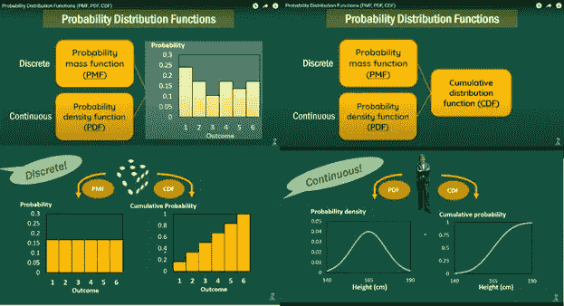
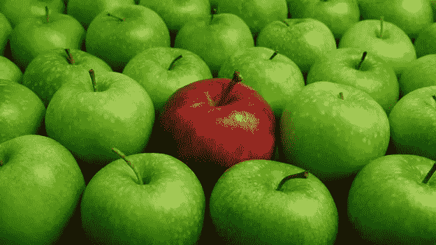
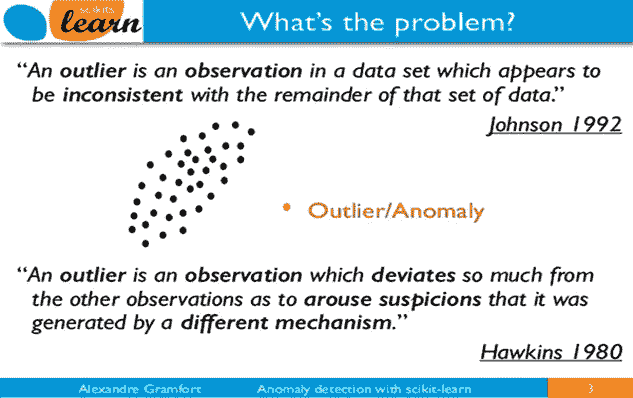
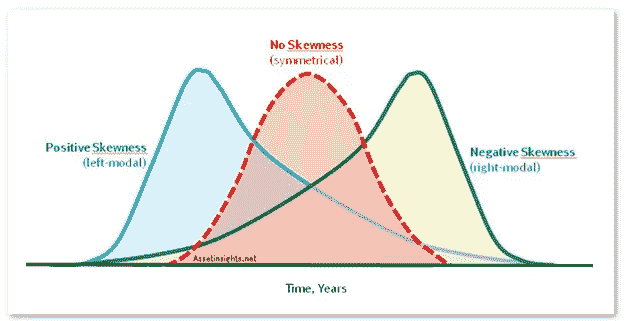
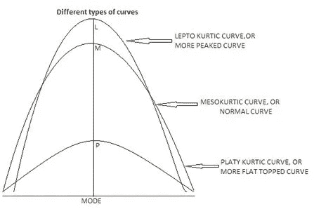
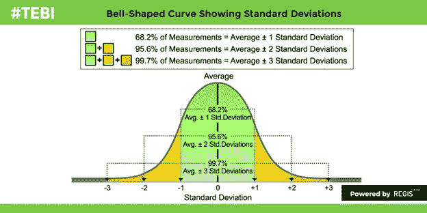

# 5 个问题系列—数据科学和人工智能— 1

> 原文：<https://medium.com/analytics-vidhya/5-question-series-data-science-ai-1-c7cef3307adc?source=collection_archive---------10----------------------->

5 *概率统计题。这些是面试官可能会问的基本问题，但很多像我们这样的学生都会略读。我已经开始了这个我认为对我很重要的 5 个问题系列。这是我在数据科学系列 5 个问题中的第一个概率和统计问题。希望你会喜欢它，如果这里有任何不正确的地方，请提出你的改正意见，以及需要修改或增加的地方。*

*Q1。什么是随机变量及其类型？*

随机意味着任何不确定的事情。随机性的价值或结果并不取决于或遵循其相邻数字或结果的存在。独立于情况要求的突然决定、想法或行动导致随机结果。例如，如果我们扮演一个骰子；不确定或固定的数字会以周期性的方式出现或遵循某种模式，它可以是 1 到 6 之间的任何数字；可能数字可以重复出现，但是哪个数字重复多少次是不确定的。如果我们扔硬币。它的头或尾来的结果是固定的，要么是头或尾，但它是头还是尾是不固定的；在第一次投掷中可能是正面，在第二次投掷中可能是正面或反面，或者可能是相同的结果可以连续重复。我们不知道结果，也不依赖于之前的结果。量子粒子的运动、股票价格的变化、特定小时或一天中街道上的人数、一个组织的年营业额、或度假旅行中的人或他们的行为、从一副牌中抽出一两张牌；所有这些以及更多的可以归类为随机性质。

随机变量的类型:

随机变量本质上可以是数字的，也可以是分类的。比方说，如果我们谈论数值 RV，那么它包含了可能结果的计数；例如，一个袋子中的水果数量或每个包含不同或相同数量水果的袋子数量、班级中的学生数量及其年龄。但是当我们谈到绝对 RV 时。它不告诉任何特定结果的计数，而是表示该结果意味着什么。例如，早些时候我说了一个班级的学生人数和他们的年龄，当我们把这些学生的性别分类时，这在本质上是绝对的。假设我们必须检查每堂课的学生人数，从他们名字的字母开始；那么它将是数值 RV。但是如果我们在每一个班级中按照相同的字母顺序检查所有学生的性别，那么它可以是绝对的。甚至数值型随机变量也可以有两种类型；谨慎而持续。在 discreet RV 中，结果将是一个整数，并且本质上必须是非负数。例如，学生的数量或你拥有的东西的数量，街上行走的人的数量。连续 RV 可以是百分比形式的结果(股票价格、利率、任何特定商品的价格)、人的年龄、人的工资。 [**随机变量—克里斯纳伊克**](https://www.youtube.com/watch?v=uaoj4cN2oYs)

Q2。随机变量有哪些用途？PDF 和 CDF？

当我们谈论随机变量的用途时，我们最有可能谈论的是 PDF 和 CDF，即概率分布函数和累积分布函数。要详细了解 PDF 和 CDF，以及不同类型的分布，可以关注我的文章[**概率和可能性**](/analytics-vidhya/probability-and-likelihood-b62f015b65ce) 。

 [## 概率和可能性

### 概率是某些事件的确切结果。你可能知道一件事情发生的结果是什么

medium.com](/analytics-vidhya/probability-and-likelihood-b62f015b65ce) 

任何随机行为都可能有多种结果。任何随机行为的所有可能结果出现的概率以及这些结果的分布列表称为概率分布。定义概率分布的函数称为概率分布函数。在一副随机洗牌的纸牌中，如果我们必须随机选择两张结果应该是两个 A 的牌，那么在第一次尝试中，可能只有随机选择的两张牌是 A，或者可能需要 100 次以上的尝试。这个实验所有结果的分布都是概率分布。类似地，这个随机试验的总结果的分布被定义为累积分布，并且定义累积分布的函数被称为累积分布函数。 [**数学导师**](https://www.youtube.com/watch?v=UnzbuqgU2LE) **。**

图片来源—**[**zed statistics**](https://www.youtube.com/watch?v=YXLVjCKVP7U)**

**我们经常混淆 PDF(概率分布函数)和 PDF(概率密度函数)。PMF(概率质量函数)，通常用于描述离散随机结果的分布 PDF(概率密度函数)，通常用于描述连续随机结果 CDF(累积分布函数)，通常用于描述随机结果的总体分布。例如，如果我们掷骰子，那么在 1 到 6 之间出现任何结果的概率是 1/6。对于 CDF，任何结果的出现都不是我们想要的确切结果，更确切地说，如果我们想要结果为 4，那么概率将是 1/6，但当我们取 CDF 时，结果将不是确切的 4，而是从 1 到 4，也就是说，概率将是从 1 到 4 的概率之和。CDF(4)= PMF(1+2+3+4)= 1/6+1/6+1/6+1/6 = 4/6。**

**PDF(概率密度函数)显示了连续 RV 的结果分布，即人的身高的结果分布，或时间分布，或利率等等。**

**Q3。定义离群值？**

****

**从名字上看，我们可以说离群值是群体之外的东西，与群体中的所有其他东西相比毫无意义。可以是任何东西；比如，当我们把一群身高在 5.5 英尺到 6 英尺之间的人放在一起时，其中一个身高为 6.5 英尺的人可能是个异数。如果行业中各种产品价格分布在 1000 到 1500 的范围内，那么价格超过 5000 或超过 10，000 的项目可能是异常值。基本上，一个离群值比一个组中的所有其他值都高或低得多。离群值不仅是可数事物的值，也可以是不可数事物的值；在一堆牛奶罐中，一罐水可能是一个离群值。在雌性群体中，雄性可能是个异类。有时离群值是自然定义的，有时可能是机器或记录数据的人的错误。井异常值不利于根据数据做出任何决定，因为它完全偏离了正常的结果。**

****

**检测异常值的不同方法:-**

**1.箱形图**

**2.z-得分或极值分析。**

**3.PCA 或 LDA**

**4.信息论模型**

**5.高维稀疏数据。**

**对于离群点和检测的详细概念，我们可以阅读 Sergio Santoyo 在****上写的这篇漂亮的文章。******

****Q4。定义对称概率分布？偏度和峰度？****

****正态分布数据，其中左侧分布是右侧分布的镜像。对称分布也称为均匀分布。从一副牌中随机选择一张牌的概率是 1/52，掷骰子时出现任意数字的概率是 1/6，这些都是均匀或对称分布的例子。呈对称分布；均值、中位数和众数都相等，且呈标准正态分布；平均值为零，偏差为 1。****

****当大部分数据处于分布的极端时，我们说数据是偏斜的。可以是左偏斜或负偏斜(右模态)，即大部分数据在最右端(长尾在左边)，也可以是右偏斜或正偏斜(左模态)，其中大部分数据在最左端(长尾在右边)。****

********

****然而，峰度意味着数据分布的高度相对于正态分布数据的变化。它被定义为三种类型:细粒型、中粒型和片状型。****

********

****Q5。什么是三偏离分布规律？****

********

****正态分布数据的三个偏差规则是所有数据都位于 1 个偏差、2 个偏差和 3 个偏差的范围内，即正态分布中 68%的数据位于距中心 1 个标准差的范围内，95%的数据位于距中心 2 个标准差的范围内，99.7%的数据位于距中心 3 个标准差的范围内。****

****关于正态分布的更多知识****

****查看 [**StatQuest**](https://www.youtube.com/watch?v=rzFX5NWojp0) 和我的文章 [**线性回归**](/analytics-vidhya/linear-regression-and-fitting-a-line-to-a-data-6dfd027a0fe2) **。******

**** [## 线性回归和对数据进行直线拟合

### 线性回归是预测连续值输出的监督机器学习算法。在线性…

medium.com](/analytics-vidhya/linear-regression-and-fitting-a-line-to-a-data-6dfd027a0fe2)**** 

****希望你喜欢。如果你想让我添加任何东西或纠正任何东西，请在评论中提及，并指导我更多类似的问题。我的大部分作品我都是从 [***克里希·纳伊克***](https://www.youtube.com/channel/UCNU_lfiiWBdtULKOw6X0Dig) 先生的录像和从[***stat quest***](https://www.youtube.com/channel/UCtYLUTtgS3k1Fg4y5tAhLbw)中借鉴而来。这是 YouTube 上最具生产力和最棒的两个数据科学频道。****