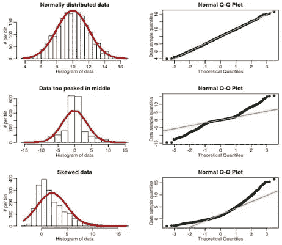
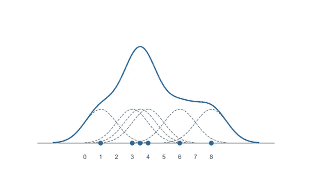

# 5 个问题系列—数据科学和人工智能— 2

> 原文：<https://medium.com/analytics-vidhya/5-question-series-data-science-ai-2-95f1a0b9765f?source=collection_archive---------12----------------------->

这是我下一个关于概率统计的 5 个问题；5 个问题系列的继续— 1。你可以在这里找到我之前关于 5 个问题的文章

 [## 5 个问题系列—数据科学和人工智能— 1

### 概率统计 5 题。这些都是面试官可以问的基本问题，但是要略读一下…

medium.com](/@asitdubey.001/5-question-series-data-science-ai-1-c7cef3307adc) 

*Q1。什么是标准正态变量，如何计算 Z 的值？*

通常，我们有正态分布或高斯分布(均值=中值=众数),它遵循我在 [***5 个问题系列— 1***](/@asitdubey.001/5-question-series-data-science-ai-1-c7cef3307adc) 中讨论的经验法则，其中 68%的数据分布将位于 1 个标准差内，95%的数据将位于 2 个标准差内，99.7%的数据将位于 3 个标准差内。但是，当我们必须计算超出这个范围或在特定点的区域的分布结果时，这就没有那么多帮助了；为此，我们必须将该正态分布转换为标准正态分布，其中均值= 0，标准差= 1。为了将所有数据放在同一个范围内，我们使用标准正态分布。

关于详细的解释，请跟随[克里斯纳伊克](https://www.youtube.com/watch?v=4Fta6KQ1QHQ)视频和我关于[正态分布](/analytics-vidhya/linear-regression-and-fitting-a-line-to-a-data-6dfd027a0fe2)的文章。

Q2。什么是中心极限定理？

对于任何实验或行动的结果估计，几乎不可能描绘出整个群体的估计或结果。例如，测量一个班级中学生的身高是可能的，但是不可能测量一个州或一个城市中所有孩子的身高，一个城市中的坑总数或交通灯的数量，一个地区中树木的数量或一个地区中一小时内通过街道的重型车辆的数量；这些都可以借助中心极限定理很容易地估计出来。群体是对一个群体中所有成员的测量或计数；人口总是大量的生物或事物。一个城市或一个地区的人或动物的数量、坑的数量、学校的数量、一个地区或城市中所有学校的学生数量、树的数量或树上果实的数量；所有这些都在一个任期内人口，这是几乎不可能的，需要花费大量的时间来保持计数或估计这些。然而，当我们将这些总体细分为一组更小的集合时，它们就被称为样本。一所学校的学生总数可以成为一所学校的学生群体或一个地区的学校群体，每个群体包含不同但变化不大的水果，一个城市的坑洞数是人口，但当我们根据地区对这些坑洞进行分组时，它们就形成了样本。(要了解详情，请关注克里斯·纳伊克或我的文章)。中心极限定理指出，当我们取所有样本的平均值(μ)和所有样本的标准偏差时，假设样本中的变化不应该太大，并且样本的数量应该足够大(大于 30)，那么所有样本平均值的分布将像正态分布(独立于总体分布是正态还是偏态)并且遵循归一化的经验规则。CLT 还指出，如果我们取出所有样本的平均值和标准差，那么它将大约等于总体的平均值和标准差。如果我们知道所有样本的均值和标准差，那么通过经验法则，我们就知道了总体的分布，也就知道了总体的均值和标准差，这将有助于总体数量的估计。又称为*均值*的抽样分布。要了解 CLT 的详细情况，请关注 CLT 的[克里斯·纳伊克](https://www.youtube.com/watch?v=PUBZC2MJ50Y)视频。

*Q3。什么是 Q-Q 图和分位数归一化？*

Q-Q 图或分位数-分位数图。在理解 Q-Q 图之前，让我们知道什么是分位数和百分位数。分位数是将一组数据分成相等部分的一个点、一个标记或一条线。分位数可以是将一组数据分成两个相等的部分，也可以是将数据分成多个相等的部分。当分位数组将数据分成 100 等份时，他们称之为百分位数。Q-Q 图有助于我们理解数据的分布。它告诉我们数据是否正态分布。我们绘制正态分布分位数(随机任何正态分布的正态图)，然后在相同的笛卡尔坐标系中绘制给定实际数据的分位数。并画出这两幅图的交点。并将其与最佳拟合线进行比较，以检查数据是否正态分布。按照 Q-Q 图的详细步骤和概念，下面是 [**StatQuest**](https://www.youtube.com/watch?v=okjYjClSjOg) **给出的最漂亮最直白的解释。**

*Q4。什么是核密度函数？为什么它如此有用？*

核密度估计或 KDE 用于估计结果的概率密度分布。它有助于为数据分布创建连续曲线，并通过在直方图的离散表示上添加连续曲线来改变我们查看数据的方式。

当我们取数据点时，我们添加均匀的核(对称的高斯曲线；我们也可以使用三角形或余弦曲线)以使曲线的最大高度与数据点一致。然后，我们将所有的核组合起来，形成一条更大的曲线，称为核密度估计图。对于 KDE 工作的详细数学解释以及它是如何被优化的；浏览一下 **Niranjan Pramanik** 写的这篇漂亮的深度文章 [**内核密度函数**](/analytics-vidhya/kernel-density-estimation-kernel-construction-and-bandwidth-optimization-using-maximum-b1dfce127073) 。

Q5。什么是离散连续均匀分布？

均匀分布是获得任何结果的机会或可能性相等的概率分布。在骰子的角色中得到任意随机数，从一副牌中得到任意一张牌都是均匀分布的。均匀分布有两种类型。有限结果集的离散分布和无限结果集的连续分布。获得掷骰子和掷硬币的单个角色的结果是谨慎的均匀分布的一个例子。生成随机数的结果是连续均匀分布的一个例子。

希望你喜欢。如果你想让我添加任何东西或纠正任何东西，请在评论中提及，并指导我更多类似的问题。我的大部分作品我都是从 [***克里希***](https://www.youtube.com/channel/UCNU_lfiiWBdtULKOw6X0Dig) 爵士、视频和从[***stat quest***](https://www.youtube.com/channel/UCtYLUTtgS3k1Fg4y5tAhLbw)中借鉴而来。这是 YouTube 上最具生产力和最棒的两个数据科学频道。