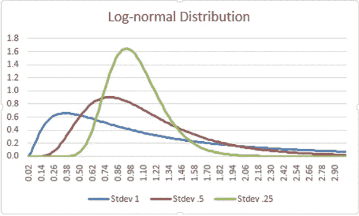
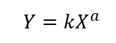
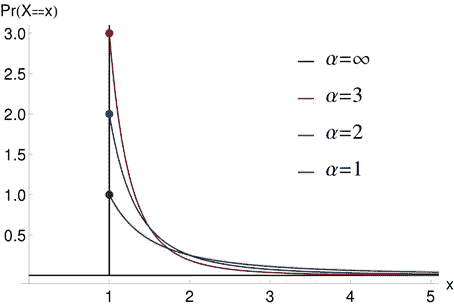
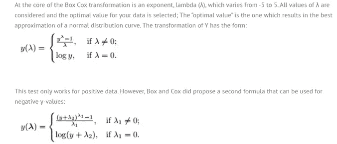
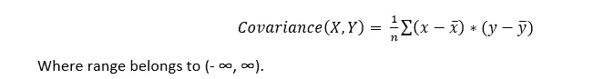
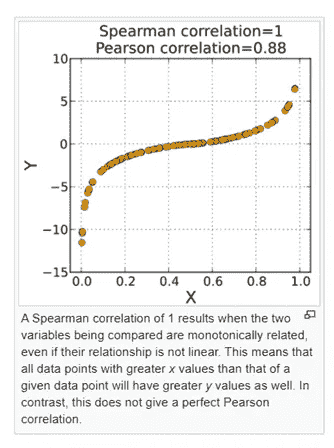
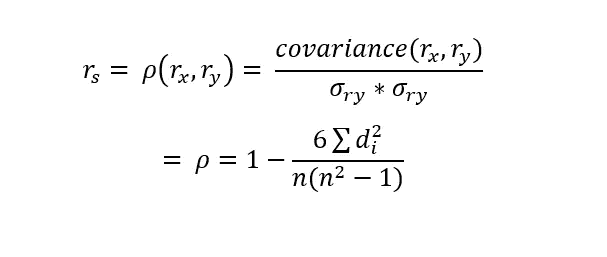

# 5 个问题系列—数据科学和人工智能— 3

> 原文：<https://medium.com/analytics-vidhya/5-question-series-data-science-ai-3-6a4e1faf0f56?source=collection_archive---------9----------------------->

这是我 5 个问题系列中的第 3 个系列。如果你还没有阅读前两个 5 问题系列，这里是它的附加文章。

 [## 5 个问题系列—数据科学和人工智能— 1

### 概率统计 5 题。这些都是面试官可以问的基本问题，但是要略读一下…

medium.com](/@asitdubey.001/5-question-series-data-science-ai-1-c7cef3307adc)  [## 5 个问题系列—数据科学和人工智能— 2

### 这是我下一个关于概率统计的 5 个问题；5 个问题系列的继续— 1。你可以找到我以前的…

medium.com](/@asitdubey.001/5-question-series-data-science-ai-2-95f1a0b9765f) 

在这一系列问题中，我谈到了不同类型的分布。但是当我们有高斯分布时，为什么我们需要这么多不同的分布。正如进一步讨论的，我们将知道仅仅高斯分布不足以得到最可能的结果分布。在某些情况下，由于随机变量会形成不同类型的分布，此时不可能获得模型的正确精度，因为不同特征的分布不同。然后，我们将这些分布转换为高斯分布，然后转换为标准正态分布，以使每个特征具有相同的尺度，这将有助于简单而准确的计算。

*Q1。什么是对数正态分布及其用途？*

通常，我们使用高斯分布来绘制随机变量或数据点的概率分布。对数正态是正态分布随机变量的对数变换的正态分布，使用对数计算。这样做是因为，在高斯(或正态)分布中，我们也对数据取负值，而对数正态总是取正实值；因为在许多情况下，变量或数据的负面结果将产生严重影响，并可能导致做出错误的决策。在时间序列分析或股票价格预测中，我们使用数据的对数变换和对数正态分布。还有，人的收入分布遵循对数正态分布。

我们使用正态分布数据的对数变换来减少数据的可变性。关于对数变换和对数正态分布的详细解释，请阅读我关于[时间序列分析](/analytics-vidhya/an-introduction-to-time-series-analysis-2a12d3702299)的文章，并务必查看由克里斯·纳伊克先生制作的关于[对数正态分布](https://www.youtube.com/watch?v=sPzPEeJ4OQ4)的深度视频。

 [## 时间序列分析导论

### 通过这篇文章，我们将了解:

medium.com](/analytics-vidhya/an-introduction-to-time-series-analysis-2a12d3702299) 

*Q2。幂律&帕累托分布及其在数据科学中有哪些应用？*

幂律显示了两个不同量之间的函数关系。它指出一个量的相对变化导致另一个量的成比例变化。如果我们改变正方形或三角形的大小，就会显著改变它们的面积。

其中 k 是常数，Y 和 X 是两个变量，a 是 X 变化时 Y 变化的比例。

幂律的几个应用

收入分配、地震震级、人口城市规模、股票市场交易和价格预测、词频等等。幂定律大多遵循 80–20%法则(也称为**帕累托定律**)；其中 80%的结果基于 20%的工作，或者我们可以说，80%的效果是由于 20%的原因。让我们举几个例子

在一个行业中，80%的销售收入是由 20%的产品产生的，而其余 20%的销售收入是由其余 80%的产品产生的。

比方说类型 1 错误或假阳性——在材料或产品的质量检测中，如果包装中的少量产品或甚至一两件产品受损，整个包装可能会被剔除。这是仅 20%或甚至不到 20%的影响，导致所有包装的产品被拒绝。

80%的跑垒得分是由 20%的板球运动员完成的。

关于幂律分布和帕累托分布的详细解释，请查看由**克里斯·纳伊克**先生制作的[幂律分布](https://www.youtube.com/watch?v=JC71ZazlMR0&t=16s)视频..他真的用非常好的例子解释得很好。

*Q3。解释 Box-Cox 变换及其应用？*

这是我们将非正态分布数据转换成正态分布数据的另一种转换。

*图片来源:—如何统计*

阅读这篇由安德鲁·普卢默**撰写的关于[盒子——考克斯变换](https://towardsdatascience.com/box-cox-transformation-explained-51d745e34203)的文章**

*****对于更重要的分布，如二项式和伯努利分布、泊松分布和几何分布；你可以按照这个期刊** [***【实证分布】***](https://www.unf.edu/~cwinton/html/cop4300/s09/class.notes/DiscreteDist.pdf) **。*****

*Q4。相关和协方差的区别是什么？*

协变告诉我们两个特征或变量之间的关系。Y 如何依赖于特征 X；可能是积极的或消极的或不变的。

但是协方差有一个问题。因为它告诉我们两个变量之间的关系，但它无法解释关系的强度，即变量 Y 与 x 的相关程度。

相关性来了:——***皮尔逊的 r 或者皮尔逊相关性*** 和 ***斯皮尔曼的秩系数*** 。

皮尔逊相关系数衡量两个特征之间的相关性，其范围在(-1，1)之间，因此我们可以知道相关性的强度。

Spearman 等级系数——在这种情况下，皮尔逊相关系数在 X 和 y 的等级之间起作用。当两个变量是非线性的且单调相关时使用。

在[维基百科](https://en.wikipedia.org/wiki/Spearman%27s_rank_correlation_coefficient)中，给出了关于上述公式的详细解释及其很好的例子。

Q5。你说的相关和因果关系是什么意思？

他们两个都不一样。通常，我们中的许多人会混淆它们，并试图找到它们之间的联系。如前所述，相关性告诉我们两个变量之间的关系，一个变量相对于另一个变量的方向。但是因果关系是不同的。因果关系说，一个变量的变化引起另一个变量的变化，即一个变量是另一个变量的原因，并使它发生。让我们举一个例子，在一个城市里，人们游泳的比率比过去增加了；同时这个城市的事故率也在上升。这是否意味着游泳的人越多，发生的事故就越多？这两个事件是完全不同的，如果人们都在游泳，那么同一个人不可能在事故中伤亡，同样，人们游泳并不意味着事故会发生。是的，它们都是相关的，但是一个行为不会导致另一个行为。还有一个隐藏的因素可能导致这两起事件。温度的上升迫使更多的人去游泳，因为街上的人越多，可能会发生更多的伤亡。我们也可以拿冰淇淋和老年人的死亡来做类似的例子。吃冰淇淋绝不能成为老年人死亡率上升的原因。但是气温上升会导致这两种情况。所以相关性和因果性可能看起来是相关的，但实际上不是.. ***再想想……***

希望你喜欢。如果你想让我添加任何东西或纠正任何东西，请在评论中提及，并指导我更多类似的问题。我的大部分作品我都是从 [***克里斯·纳伊克***](https://www.youtube.com/channel/UCNU_lfiiWBdtULKOw6X0Dig) 先生的视频和从[***stat quest***](https://www.youtube.com/channel/UCtYLUTtgS3k1Fg4y5tAhLbw)中借鉴而来。这是 YouTube 上最具生产力和最棒的两个数据科学频道。