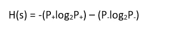
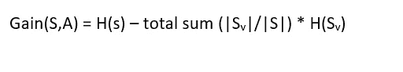

# 5 个问题系列—数据科学和人工智能— 4

> 原文：<https://medium.com/analytics-vidhya/5-question-series-data-science-ai-4-3070be5632a2?source=collection_archive---------7----------------------->

在这篇文章中，我将写关于降维..为什么它很重要，降低特征维数的方法有哪些？

Q1。我们所说的术语 ***【维数灾难】*** 是什么意思，什么是降维？

在我们需要解决问题的任何数据集中，我们都有独立和相关的特征。独立特征有助于根据以前的记录预测从属值。现在最重要的是选择哪些独立的特性，以及我们使用了多少。有时不必要的和不重要的特征会降低模型的准确性，因此选择对预测贡献更大的有价值的特征是非常重要的。增加特征的数量将增加模型的准确性，但它也有其局限性，在某个时间点之后，增加特征对模型准确性没有太大贡献，而是降低了准确性，因为如果我们增加不重要的特征，将导致较差的准确性，并且进一步增加会使准确性变差。这就是所谓的 ***维度之祸。为了摆脱这个魔咒，我们降低了特征的维数，也就是说，我们减少了在预测中不重要的特征的数量，因此降维的概念出现了…***

Q2。特征降维有哪些不同的方法？

有几种方法:-

> 单变量选择
> 
> 特征重要性
> 
> 相关热图矩阵
> 
> 包装方法

1.预选

2.反向选择

3.递归特征消除。

让我们首先讨论包装方法:

正向选择-这是一种迭代选择模型，倾向于在每次迭代中选择一个额外的要素，并检查模型的准确性。循环继续，直到模型精度的饱和点。

A — AB — ABC — ABCD — ABCDE

反向选择-它首先考虑所有的特征，并进行类似卡方检验的统计测试来确定准确度，并在每次迭代中继续减少一个特征，直到准确度继续增加。

ABCDE — ABCD — ABC — AB — A

递归特征消除——首先选择所有对目标变量影响最大的特征，然后添加另一个最重要的特征，并继续这样做，直到得到对目标变量影响较小的特征。

***注意:—包装方法仅用于较小的数据集。***

嵌入式选择-它使用单个特征或特征子集的随机选择，并检查准确性。它遵循排列组合法选择特征。选择具有最大精确度的特征子集作为模型。

**单变量选择—** 在这种情况下，我们在 python 库的帮助下，根据重要性排序随机选择最佳特征，如 ***SelectKBest(信息增益)*** 和 ***Chi2(卡方)*** ，我们根据需要多少顶级特征来设置 k 值。

**特征重要性—** 在这种情况下，我们为数据集中的每个特征获得分数，然后根据分数进行排名。我们根据可以预测大多数结果的分数来选择这些特征。我们对这些特征的预测得分越高。我们在此使用的各种算法，即额外的树分类器，主成分分析，线性判别分析，t-SNE，UMAP。大多数情况下，我们使用 PCA 或集成技术(额外的树分类器)来选择特征。

**关联热图—** 在该热图中，我们找出哪些独立特征彼此高度关联，然后移除这些关联特征中的一个关联特征。我们这样做是因为如果两个特征彼此高度相关，那么它们都将对因变量产生相同的影响或关系，从而降低模型的准确性或性能。我们使用皮尔逊相关和 Spearmann 等级法来找出相关性。在获得相关分数后，我们通过 VIF(变化膨胀因子)或通过手动设置阈值来移除特征。

***IMP:跟随克里希纳伊克视频对*** [***功能选择***](https://www.youtube.com/watch?v=k-EpAMjw6AE&list=PLZoTAELRMXVPgjwJ8VyRoqmfNs2CJwhVH&index=7) ***进行详细讲解。也可以按照*** [***这篇文章***](https://www.analyticsvidhya.com/blog/2018/08/dimensionality-reduction-techniques-python/) ***对各种方法进行数学解释。***

Q3。什么是信息增益和互信息？

信息增益用于计算数据的熵，熵(干扰或方差)是指在**决策树模型**中数据是如何分割的。它有助于测量分裂的纯度。信息增益降低了熵，有助于决策树的构建。分裂的熵介于 0 到 1 之间。o 表示纯分裂，熵更小，其中 1 表示不纯分裂，是精确度方面的最差情况。为了有效分类，我们计算特征分裂的熵和信息增益，并选择给出较小熵和较高信息增益的特征分裂模式。信息增益也用于特征选择，并且经常用于计算关于目标变量的增益；被称为相互信息。互信息计算一个自变量对另一个自变量的依赖性。它也用于寻找两个变量之间的相关性。互信息的范围从 0 到 1，意味着值越大，特征越相互依赖。

注:关于信息增益和互信息的数学细节，请阅读这篇关于机器学习的 [**信息增益和互信息**](https://machinelearningmastery.com/information-gain-and-mutual-information/) 的文章，并关注关于[信息增益](https://www.youtube.com/watch?v=FuTRucXB9rA)的**克里斯·纳伊克**视频。

熵的计算方法是:

其中 H(s)是熵，P-是负面事件的概率，P+是正面事件的概率。熵的范围在(0 到 1)之间。

信息增益:

其中，S 是主要或第一特征，Sv 是分割后的特征。

Q4。Kullback — Leibler 散度还是 KL 散度？

统计学中的 KL 散度用于比较两种不同的概率分布，实际的或观察到的概率分布。这也用于计算互信息和熵。这种比较可以通过计算两个分布之间的统计距离或者通过计算两个分布之间的散度来完成。KL 散度使用散度方法来比较两个分布。如果一个随机变量有两个分布 P 和 Q，那么 P 和 Q 之间的散度可以计算为:P 的每个事件的概率之和乘以事件 P 的概率的对数除以事件 Q 的概率。

*   KL(P | | Q)= sum X in X P(X)* log(P(X)/Q(X))

如果 P 中事件的概率比 Q 中事件的概率大，那么散度就更大，反之亦然。

***注:我们可以跟随 Jason Brownlee 写的这篇关于*** [***KL 发散***](https://machinelearningmastery.com/divergence-between-probability-distributions/) ***的漂亮而详细的文章。***

Q5。詹森-香农散度和它与 KL 散度有什么不同？？

JS 散度也用于比较概率分布之间的差异。JS 散度和 KL 散度的区别在于，在 KL 散度中，P 与 Q 的散度和 Q 与 P 的散度是不同的，或者我们可以说，KL 散度的散度比较是不对称的，这在 JS 散度中转化为对称的。即，在 KL 散度中，我们可以写成:

*   KL(P || Q)！= KL(Q || P)

这在 JS 发散上是对称的；我们可以把它写成:

*   JS(P || Q) == JS(Q || P)

其中 JS 散度计算如下:

*   JS(P | | Q)= 1/2 * KL(P | | M)+1/2 * KL(Q | | M)
*   M = 1/2 * (P + Q)

***注:方程取自杰森·布朗利(Jason Brownlee)写的****[***KL 发散***](https://machinelearningmastery.com/divergence-between-probability-distributions/) ***。****

*额外问题:*

*6.关于统计数据，p 值意味着什么？*

*7.什么是假设和假设检验？*

*8.什么是混淆矩阵和错误类型？*

*要了解以上问题，请阅读我在以下网站上的文章:*

* [## 混淆矩阵

### 我们在学校和大学的课堂上都学习过矩阵和向量。井矩阵是一种 N…

medium.com](/analytics-vidhya/confusion-matrix-a2db318ef1f5)  [## 概率和可能性

### 概率是某些事件的确切结果。你可能知道一件事情发生的结果是什么

medium.com](/analytics-vidhya/probability-and-likelihood-b62f015b65ce) 

对于假设检验:

 [## 线性回归和对数据进行直线拟合

### 线性回归是预测连续值输出的监督机器学习算法。在线性…

medium.com](/analytics-vidhya/linear-regression-and-fitting-a-line-to-a-data-6dfd027a0fe2) 

希望你喜欢。如果你想让我添加任何东西或纠正任何东西，请在评论中提及，并指导我更多类似的问题。我的大部分作品我都是从 [***克里希·纳伊克***](https://www.youtube.com/channel/UCNU_lfiiWBdtULKOw6X0Dig) 先生的视频和从[***stat quest***](https://www.youtube.com/channel/UCtYLUTtgS3k1Fg4y5tAhLbw)中借鉴而来。这是 YouTube 上最具生产力和最棒的两个数据科学频道。*